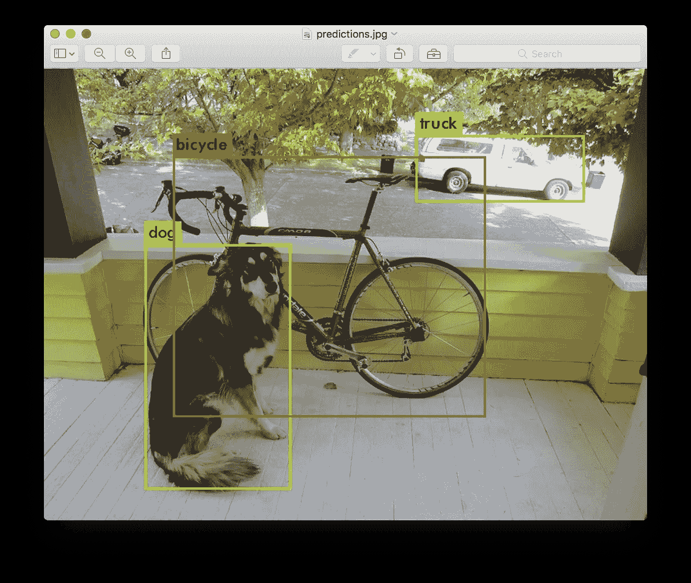
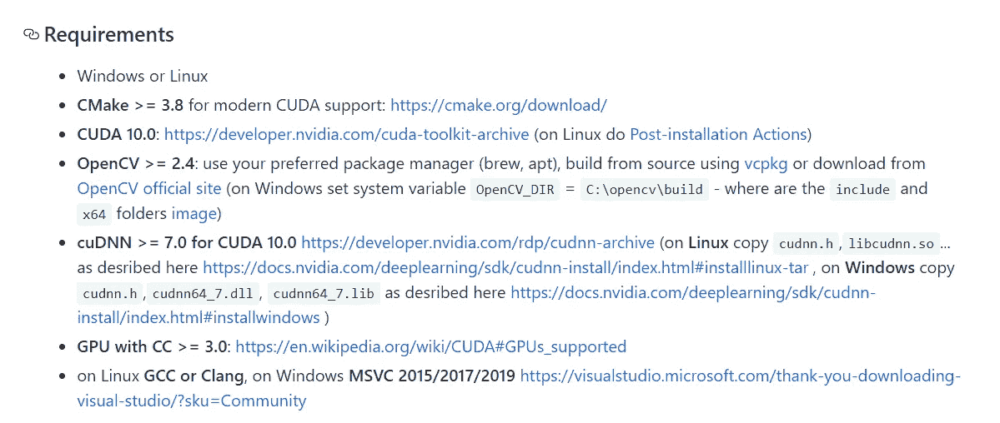
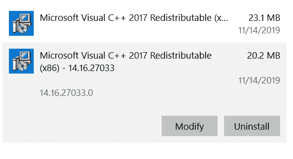
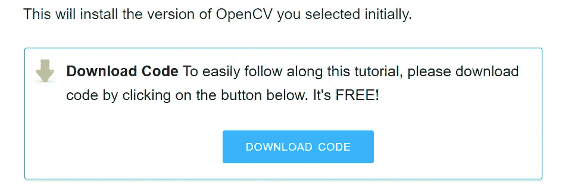
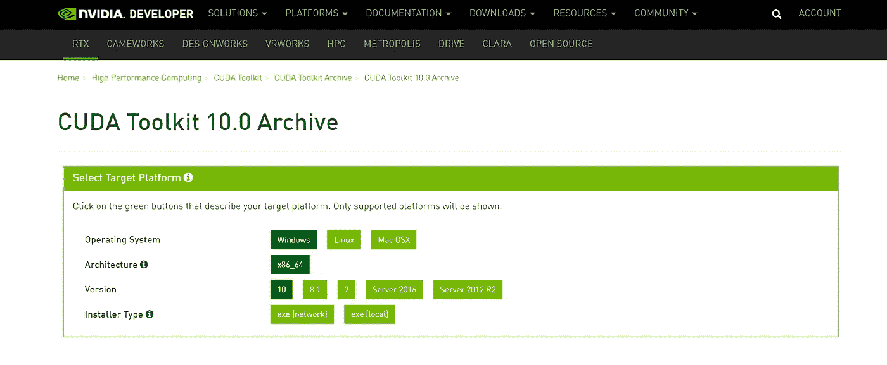
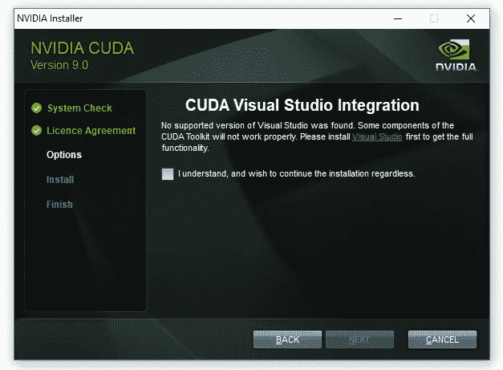
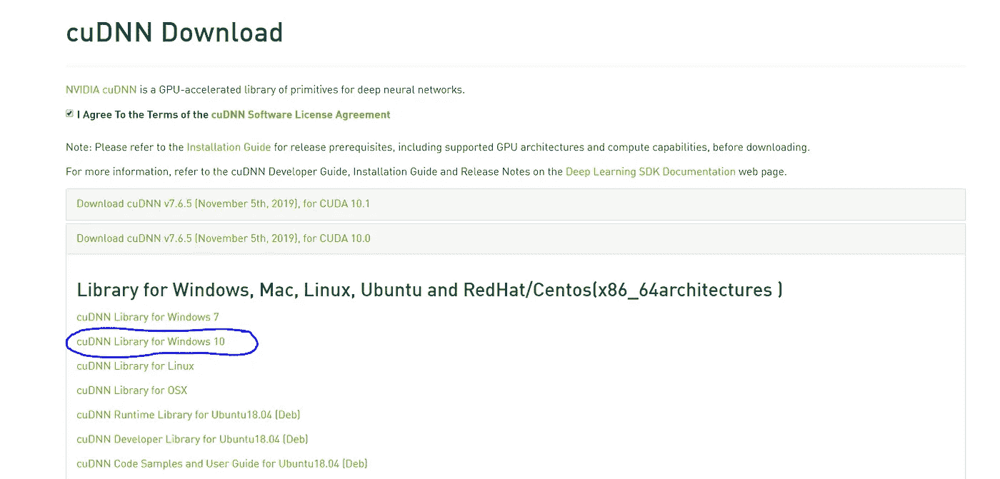
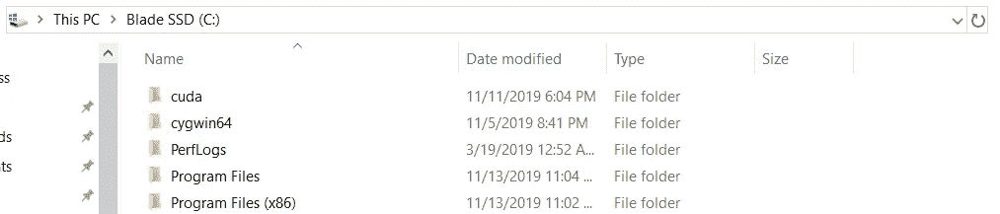
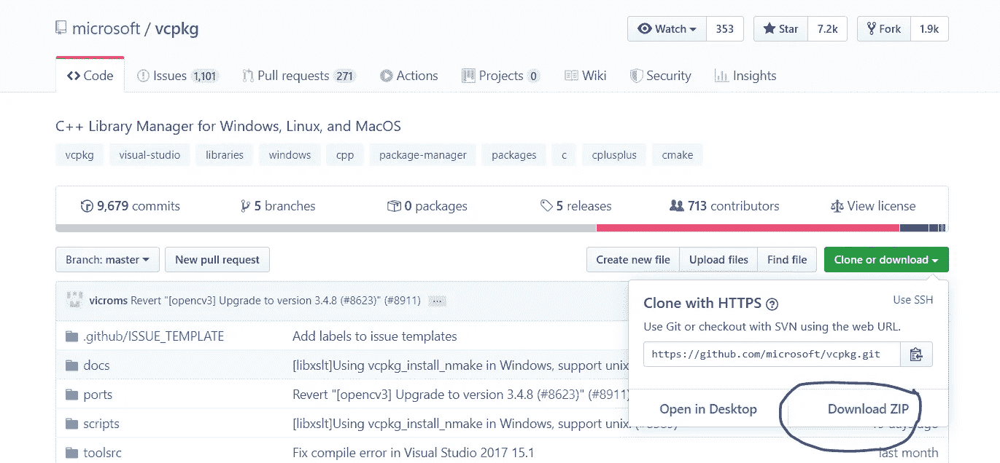
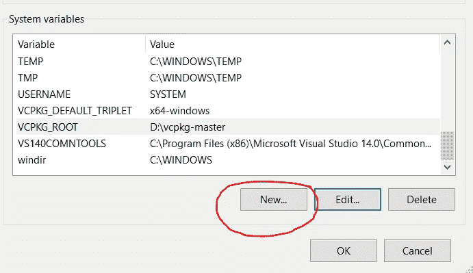

# 在 Windows 上安装 Darknet

> 原文：<https://medium.com/analytics-vidhya/installing-darknet-on-windows-462d84840e5a?source=collection_archive---------1----------------------->

# 语境

什么是暗网？对于那些不熟悉的人，Darknet 是一个开源框架，它以卷积神经网络的形式支持对象检测和图像分类任务。Darknet 主要以其 YOLO 算法(你只需看一次)的实现而闻名，该算法在实时对象检测方面展示了最先进的性能。



来自[https://pjreddie.com/darknet/yolo/](https://pjreddie.com/darknet/yolo/)的 YOLOv3 物体检测示例

如果您想在网络摄像头或视频记录上创建实时对象检测模型，您可能需要考虑使用这个框架中的 YOLOv3 算法。话虽如此，说到这篇文章的主要目的。

任何拥有 Windows PC 的人都知道，设置应用程序和开发环境是一件痛苦的事情。我想从我在 Windows 10 笔记本电脑上安装 Darknet 的个人经历中提供一些建议。

首先，**请按照正确的顺序安装应用**。当我说如果你不遵守这条黄金法则，那将会是一场噩梦，这是我的经验之谈。另外，这是我对安装 darknet 的建议，可能对你有用，也可能没用。完全免责声明。

Darknet 最初的 GitHub 库是 [**这里是**](https://github.com/pjreddie/darknet)；然而，我们将使用 AlexeyAB 的 [**版本**](https://github.com/AlexeyAB/darknet) ，它是 Darknet 的精确副本，具有额外的 Windows 支持。

# 要求



暗网要求取自[https://github.com/AlexeyAB/darknet](https://github.com/AlexeyAB/darknet)

我假设你有一个计算兼容版本高于 3.0 的 GPU。(检查你的 GPU 是否擅长这个 [**环节**](https://en.wikipedia.org/wiki/CUDA#GPUs_supported) 。)

# 第一步是 OpenCV

OpenCV 对我来说是一场噩梦，但希望它不会成为你的痛苦。我用这个 [**教程**](https://www.learnopencv.com/install-opencv-4-on-windows/) 得到了 OpenCV4。我将给出一个简单的介绍和一些建议。

在下载 Visual Studio 2017 之前，请检查您的电脑是否已经安装了 Visual Studio 2019。这将影响您 2017 年的安装，因为由于您的电脑上存在更新的可再发行软件，2017 年的 **Microsoft Visual C++可再发行软件**将不会下载。(2019 款)。所以我的建议是**卸载 Visual Studio 2019** 并验证 2019 可再发行软件是否仍然存在于你**电脑的程序和功能中。如果是，那么请卸载 2019 年的 x86 和 x64 版本将修复这个问题。**



在 VS Studio 2017 下载后验证您是否拥有这些

记住将 CMake 添加到您的系统路径中。如果您忘记这样做，您可以在环境变量中将**{ CMAKE 文件夹的位置}\bin** 添加到您的系统路径中。CMake 路径的一个例子是**C:\ Program Files \ CMake \ bin**。如果您不知道如何编辑系统路径，请参考此 [**链接**](https://www.architectryan.com/2018/03/17/add-to-the-path-on-windows-10/) 。

同样，如果您忘记将 Anaconda 添加到您的系统路径，只需将**{ Anaconda 文件夹的位置}\Scripts** 添加到您的系统路径。例如 **D:\Anaconda3\Scripts** 。

教程中提供的代码只能通过注册作者的时事通讯获得。所以当你看到下面的弹出窗口时，请点击“下载代码”并注册。你不需要支付任何费用，你可以在得到你需要的东西后诚实地退订。我不认识作者，也不想推销他的时事通讯，但是，这可以节省大量时间。



访问教程中的安装脚本

我用不同的安装指南试了两天，所以当我说它是救命稻草时，请相信我。一旦您测试出 OpenCV4 正在工作，恭喜您通过了安装过程中最困难的部分！

# 第二步是 CUDA

我会让你的生活变得非常简单。点击此 [**链接**](https://developer.nvidia.com/cuda-10.0-download-archive?target_os=Windows&target_arch=x86_64&target_version=10) 并选择**下载。当然，如果你用的是 Windows 7 或 8，那就换个版本。**



适用于 Windows 10 的 CUDA 10.0 下载

一旦您运行安装程序，只需继续点击下一步，并验证您不会遇到下面的屏幕，而安装。



您的 Visual Studio 2017 安装不正确

如果是，那么你需要卸载 Visual Studio 2017 并重新下载。如果您没有遇到上述消息，并且 CUDA 已成功安装，那么您可以继续下一部分！

# 第三步是得到 CuDNN

要下载 CuDNN 请点击此 [**链接**](https://developer.nvidia.com/rdp/cudnn-download) 。在获得 CuDNN 之前，您需要注册一个 Nvidia 开发者帐户。一旦您注册，同意条款和条件，并点击安装程序，如下截图所示。



文件下载完成后，将内容直接解压到 c 盘。完成解压缩后，验证 Cuda 文件夹是否存在于 c 盘中，如下所示。



检查 Cuda 文件夹是否存在

之后打开你的环境变量，添加 **C:\cuda\bin** 作为你的系统路径的新入口。恭喜你已经安装了主要要求！！

# 第四步是获取 vcpkg

获取 vcpkg 库管理器的链接是 [**这里**](https://github.com/Microsoft/vcpkg) 。

您可以下载 vcpkg 的 zip 文件，如下所示。



正在下载 vcpkg zip 文件

下载后，将内容解压缩到您选择的位置。之后，打开命令提示符并导航到 vcpkg 文件夹。进入后，运行命令:

```
bootstrap-vcpkg.bat
```

这个 bat 文件执行完毕后，运行下面的命令:

```
vcpkg integrate install
```

成功运行这些命令后，请打开您的环境变量，并在系统变量部分单击“新建”。



新系统变量

将新变量命名为 **VCPKG_ROOT** ，并使其指向 VCPKG 文件夹的位置。

另外，定义另一个名为 **VCPKG_DEFAULT_TRIPLET** 的系统变量，并将其值设置为 **x64-windows** 。

打开 Powershell 窗口，键入以下命令，为 darknet 安装准备 vcpkg。

```
PS \>                  cd $env:VCPKG_ROOT
PS Code\vcpkg>         .\vcpkg install pthreads opencv[ffmpeg]
```

# 最后一步是获取和安装 Darknet

我们期待已久的时刻终于到来了！导航到此 [**链接**](https://github.com/AlexeyAB/darknet) 获取暗网代码。下载并解压到您选择的位置后，在管理员模式下打开 Powershell 窗口。

导航到 darknet 文件夹的位置，在构建它之前，必须确保可以执行 Powershell 脚本。

运行下面的命令来验证您的执行权限级别。

```
Get-ExecutionPolicy
```

如果返回无限制，那么您可以运行最后一个命令，但是，如果不是，那么运行下面的命令。

```
Set-ExecutionPolicy -ExecutionPolicy Unrestricted
```

选择“A”或“Y ”,然后运行最后一个命令。

```
.\build.ps1
```

## 一旦执行完毕，你的暗网库就应该安装好了。恭喜你！

不要忘记运行下面的命令并键入“A”。

```
Set-ExecutionPolicy -ExecutionPolicy Restricted
```

要测试 darknet，只需运行下面的命令，就会产生一些没有任何错误的输出。

```
darknet.exe detector test cfg/coco.data cfg/yolov3.cfg yolov3.weights -thresh 0.25
```

你做到了！

再说一次，这不是一个万能的解决方案，但是，如果它对你有用，我很高兴我能帮上忙。如果没有，那么请参考这个 [**链接**](https://github.com/AlexeyAB/darknet#how-to-compile-on-windows-using-cmake-gui) 来尝试用 Cmake-GUI 安装 darknet。

要查看这个 darknet 框架可用的各种培训可能性，请参考这个 [**链接**](https://github.com/AlexeyAB/darknet#yolo-v3-and-yolo-v2-for-windows-and-linux) 。

感谢你一直阅读到现在，希望这个指南能帮助你在你的电脑上安装 darknet。现在保重！