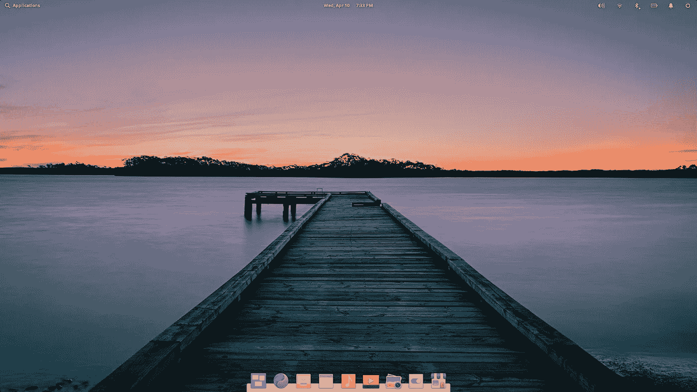

# 在 Oracle VirtualBox 上安装 elementaryOS 5.1

> 原文：<https://medium.com/analytics-vidhya/installing-elementaryos-5-1-on-oracle-virtualbox-6cd3b02e480d?source=collection_archive---------0----------------------->

美丽的 elementaryOS 5.1(图片摘自 elementary.io)

我们大多数人对自己选择的操作系统已经足够满意了。在今天这个时代，许多人会在三者之间进行选择:Windows、macOS 和 Linux。Windows 是迄今为止最受欢迎的操作系统，遥遥领先。macOS 和 Linux 紧随 Windows 之后，但这并不是说它们不如 Windows。事实上，这三个操作系统已经从笨重的用户界面和…