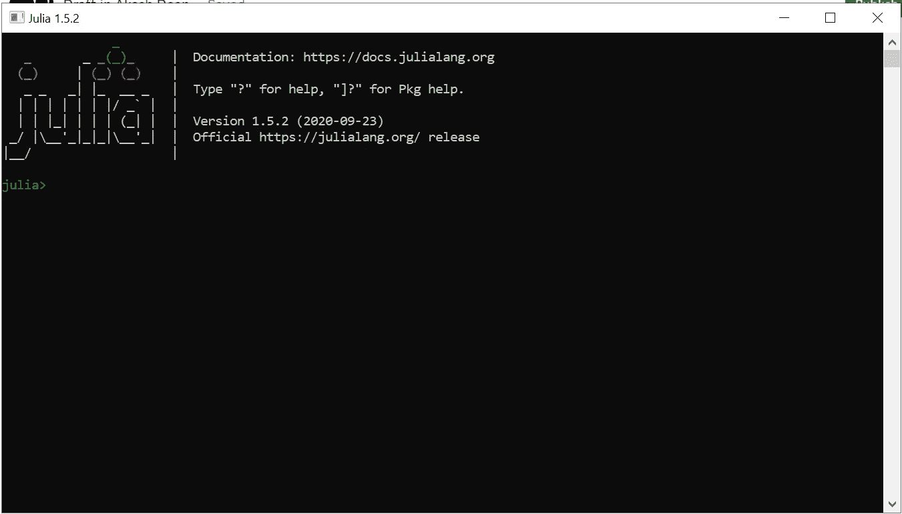
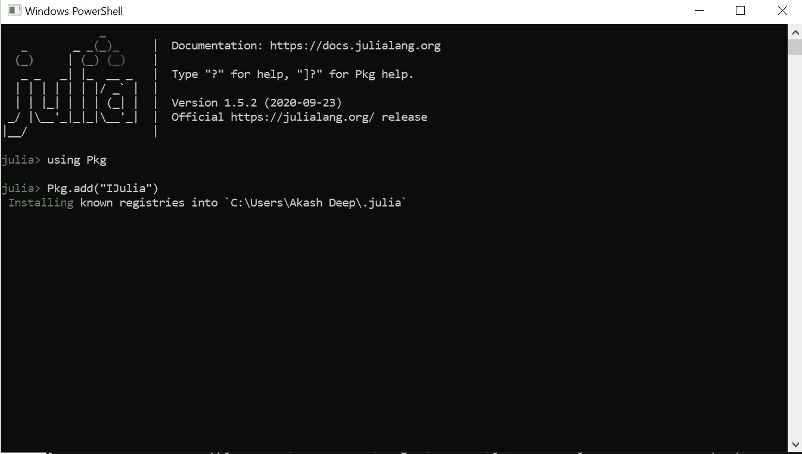
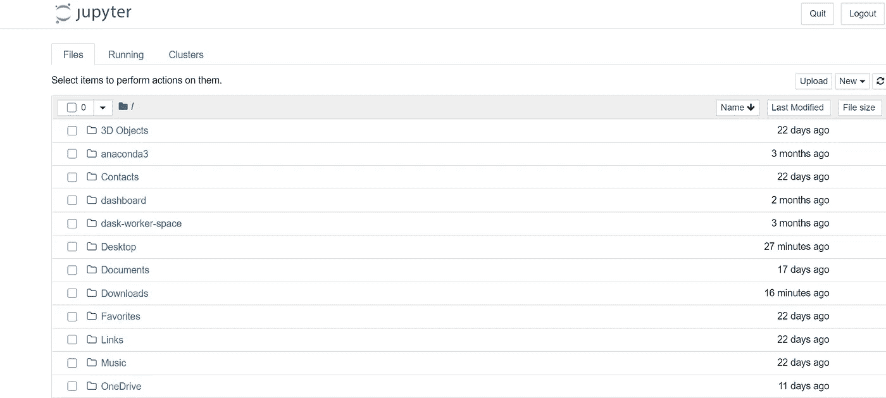

# 在 Jupyter 笔记本上安装 Julia 并使用

> 原文：<https://medium.com/analytics-vidhya/installing-julia-using-on-jupyter-notebook-7177742db1cf?source=collection_archive---------1----------------------->

在本文中，我们将尝试了解如何安装 Julia，我们将在 Jupyter 笔记本中添加 IDE，称为 IJulia IDE。在上一篇文章中，我已经讨论了朱莉娅，什么是朱莉娅？，使用 Julia 的优势是什么，以及 Julia 提供的框架。如果你想阅读这篇文章，你可以访问下面的文章链接

 [## Julia 和 ML 框架介绍(Julia)

### Julia 是一种高级动态编程语言，被机器学习研究者和实践者使用…

akash97715.medium.com](https://akash97715.medium.com/introduction-to-julia-and-ml-frameworks-julia-60a0d42be250) 

在接下来的时间里，我会写更多关于朱莉娅的文章。这将是一篇非常短但非常重要的文章，只涉及 Julia 编程语言的安装和在 jupyter 笔记本上的使用。

第一步是下载茱莉亚，我们可以点击[这里](https://julialang.org/)下载茱莉亚。打开链接后，下载选项会出现，根据你的操作系统选择合适的选项来下载 Julia。下载后，尝试运行可执行文件。运行可执行文件后，Julia 将被安装到系统中，我们可以访问 Julia 终端了。在你的搜索栏中输入 Julia 并打开终端。恭喜你！现在我们将开始探索朱莉娅。打开 Julia 后，会出现下面的屏幕。

朱莉娅终端

Julia 安装在系统上。现在，我们将尝试安装 IDE。为了安装 IDE，我们将使用 Anaconda 环境。我想我们都知道 Anaconda 环境，我们在以前的文章中讨论过 Anaconda。如果您的系统上没有安装 anaconda，我建议您安装 Anaconda。要安装 anaconda，点击[这里](https://www.anaconda.com/products/individual)，并按照文档上的说明操作。如果你有任何问题，让我知道在下面的评论框部分。我很乐意帮助你。现在进入主题，我们正在尝试将 Julia 安装为 IDE，以便可以使用 jupyter notebook 访问它，如果您已经安装了 anaconda，那么我们只需在 Anaconda 命令提示符下编写 Jupyter notebook，就可以非常容易地访问 Jupyter notebook。

在 Julia 终端上，只需写“使用 Pkg ”,这与 python 中的 import 语句相同。现在使用命令“Pkg.add("IJulia ")”。我们需要记住的一点是，这些都是区分大小写的。上面的代码将 IJulia 添加到 jupyter 笔记本 IDE 中，我们可以使用 anaconda navigator 访问它。请参考下面的截图来安装 IJulia 包。执行以下命令后，只需等待 3-4 分钟。它会自动将 IJulia 添加到您的 jupyter 笔记本中。添加了 Ijulia 之后，我们就可以通过 Jupyter 笔记本访问 julia 了。

添加 Julia IDE

要访问 jupyter 笔记本上的 Julia，请打开 Anaconda Navigator 并在 Navigator 上键入“Jupyter 笔记本”。它会将你重定向到默认的 we 浏览器，jupyter notebook 将在本地主机的某个端口上运行。以下屏幕将出现在您的浏览器上。

Jupyter 笔记本集成开发环境

现在要访问 julia 环境，请单击 jupyter 笔记本屏幕右上角的 New，然后选择 julia1.5.2，它会将您重定向到 Julia IDE，恭喜您，我们已经安装并配置了 Julia，现在我们已经完成了练习 Julia 编程语言的准备工作，我们还观察到了 Julia 是多么简单。我们可以多么简单地安装 Julia 并在 IDE 上使用它，这就是 Julia 的妙处。如果你在安装 Julia 和 anaconda 时遇到任何困难或意外错误，请在下面的评论区告诉我，我很乐意帮助你。

如果你想了解更多关于机器学习和深度学习概念或云计算概念的知识，你可以看看用同一个账号写的博客，将来我也会写关于上述所有主题的博客，为此我建议订阅我的博客。

在下一篇文章中，我们将尝试理解 Julia 编程语言的基本构建块，如数组、字符串、布尔、条件、语句以及许多更多的基本操作和 Julia 的语法，但在此之前，我们需要确保 Julia 已正确安装在我们的系统上。慢慢地，在学习了基本概念和语法之后，我们将直接进入机器学习或 Julia 在即将到来的教程中提供的深度学习框架。

# 敬请关注