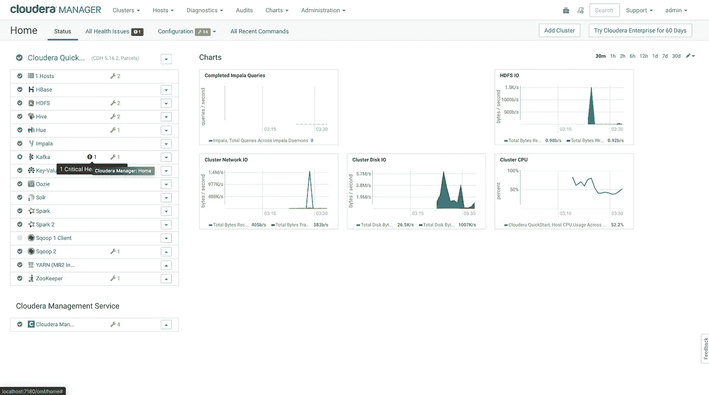

# 通过 Docker 在 Cloudera 集群中安装 Apache Kafka

> 原文：<https://medium.com/analytics-vidhya/installing-kafka-in-cloudera-cluster-through-docker-26ba92004c7e?source=collection_archive---------12----------------------->

## 在运行于 Docker 容器上的 Cloudera quickstart 中添加 Apache Kafka 服务的分步安装指南


阿帕奇卡夫卡的知名度与日俱增。它由 LinkedIn 于 2010 年开发，Teach industries 正在将 Hadoop 生态系统服务用于各种流媒体和消息传递用例，其数量正在与日俱增。Kafka 如此受欢迎的原因。

*请参考这些文章*[*Docker*](/@ajpatel.bigdata/cloduera-quickstart-vm-using-docker-on-mac-2308acd196f2)*[*JDK*](/@vishnusharath/upgrade-docker-cdh-image-to-jdk1-8-to-use-spark-2-a-complete-tutorial-61a1b67b2597)*[*CDH*](/@ajpatel.bigdata/upgrading-cdh-and-cloudera-manager-from-5-7-to-5-16-in-docker-to-use-spark2-6223691e3685)*如果不满足必备条件，***

## **安装由 Apache Kafka 驱动的 CD**

> **环境:
> 1。Java 版本 8
> 2。Cloudera Manager 5.16
> 3。Cloudera 发行版 Hadoop 5.16**

**注意:我为这个博客运行 Cloudera Docker 容器，这里是内存和存储分配。**

********

## **选择您想要安装的 Kafka 版本**

**导航到包含可用 Kafka 版本列表的 URL**

 **[## CDK 由阿帕奇卡夫卡版本和包装信息

### 下表列出了访问每个 Kafka 工件所需的项目名称、groupId、artifactId 和版本…

docs.cloudera.com](https://docs.cloudera.com/documentation/kafka/latest/topics/kafka_packaging.html?source=post_page-----8245d8d0ebe5----------------------#concept_fzg_phl_br)** 

**复制要安装的包存储库 URL。**

**现在，回到 [http://localhost:7180/](http://localhost:7180/) 。(注意:由于我们重新启动 CM 服务，这将需要几分钟……)**

**用户名:管理员
密码:管理员**

**登录 Cloudera Manager Web UI。**

********

**导航至主机→宗地。**

****

**将复制的 Parcel_URL 添加到宗地配置中。
注:我们选择安装 Kafka 4.1.0 版本。**

**保存更改。**

****

**等待几秒钟，添加的 Kafka 服务将出现在包裹列表中。**

**现在，下载→分发→激活它。**

************

**验证 Kafka 包已激活，并且可以将 Kafka 服务添加到 Cloudera 集群。**

****

**导航至 Cloudera Manager 主页。**

## **将选定的 Kafka 服务添加到集群中**

**现在让我们将它添加到 Cloudera 集群中。点击“添加服务”。**

****

**选择 Kafka 选项并继续。**

****

**为 Kafka Broker 和 Gateway 分配服务器实例并继续。**

************

**在此步骤中，保持这些配置不变并继续。**

****

**现在 Kafka 服务被添加到集群中。**

**如果您发现此错误，请不要担心。这是因为一些默认的配置。我们将在以下步骤中解决这些错误。**

****

**让我们回到 CM 主页。**

****

**错误:服务将处于“已停止”模式，并显示严重警告消息。**

****

**现在，让我们用所需的配置来修复这个错误。**

****

```
**Java Heap Size of Broker = 256 MiB**
```

****

```
**Advertised Host = quickstart.cloudera**
```

****

```
**Inter Broker Protocol = PLAINTEXT**
```

****

**保存这些更改并重新启动 Kafka 服务。**

************

**现在，验证 Kafka 服务是否处于“良好健康”状态。**

****

**恭喜你！现在，您可以使用 Kafka 服务了。**

****让我们创建一个 Kafka 应用程序:****

**首先，打开终端，创建一个卡夫卡主题。**

```
**kafka-topics — zookeeper quickstart.cloudera:2181 — create — topic first_topic — replication-factor 1 — partitions 3**
```

****

**查看可用的 Kafka 主题列表。**

```
**kafka-topics — zookeeper quickstart.cloudera:2181 — list**
```

****

**启动 Kafka 控制台生产者:(Kafka-生产者终端)**

```
**kafka-console-producer — broker-list quickstart.cloudera:9092 — topic first_topic**
```

****启动卡夫卡控制台【消费者:】**
(卡夫卡-消费者-终端 1)**

```
**kafka-console-consumer — bootstrap-server quickstart.cloudera:9092 — topic first_topic — from-beginning — partition 0**
```

**(卡夫卡-消费者-2 号航站楼)**

```
**kafka-console-consumer — bootstrap-server quickstart.cloudera:9092 — topic first_topic — from-beginning — partition 1** 
```

**(卡夫卡-消费者-3 号航站楼)**

```
**kafka-console-consumer — bootstrap-server quickstart.cloudera:9092 — topic first_topic — from-beginning — partition 2**
```

**在我的下一篇文章中再见。关注我以获得更多关于数据工程的更新。干杯！！！⚔️**