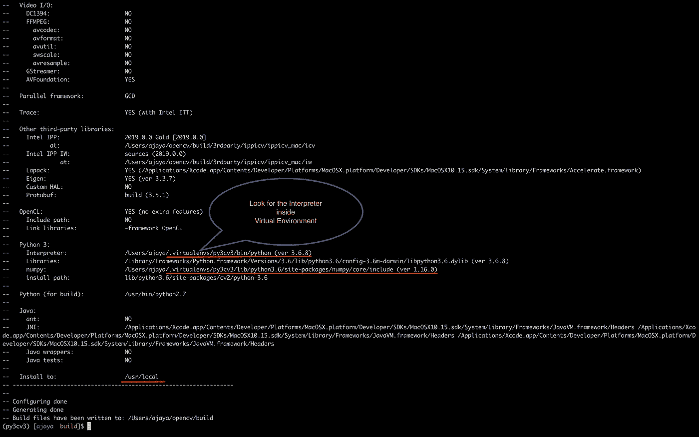

# 在 macOS Catalina 上从源代码安装 OpenCV 3

> 原文：<https://medium.com/analytics-vidhya/installing-opencv-3-from-source-on-macos-catalina-cefc71e2fda?source=collection_archive---------2----------------------->


托马斯·Q 在 [Unsplash](https://unsplash.com?utm_source=medium&utm_medium=referral) 上的照片

penCV 已经成为计算机视觉领域中使用最广泛的开源库之一。感谢为这个图书馆做出贡献的志愿者们。从柳树车库到 opencv.org 的旅程令人振奋。然而，设置从源代码构建 OpenCV 的环境总是具有挑战性。随着每个新版本以及新操作系统的发布，OpenCV 的配置将变得很麻烦。

在这篇博文中，我将记录下最近发布的 *macOS Catalina* 上的 OpenCV 构建过程。放弃对 32 位应用程序的支持在一些用户中造成了不愉快的局面。

## 开始构建过程之前的先决条件

你需要安装 python，因为我们不想弄乱系统 python。对于这篇博文，我将使用 *python 3.6* 。从其官方网站[下载并安装。下面给出了在 macOS Catalina 上构建 OpenCV 需要遵循的步骤。](https://www.python.org/downloads/)

## 1.安装和配置 Xcode

从 App Store 下载 Xcode。这将需要一段时间，因为这个文件的大小接近 7 到 8 GB。成功安装 Xcode 后，运行以下命令。

`$ sudo xcodebuild -license`

使用空格键移动到协议页面的底部，并键入[accept]以同意该许可证。接下来，我们需要安装*命令行工具*，它将安装基本编译器(gcc、g++等。).使用下面给出的命令。

`$ sudo xcode-select --install`

## 2.为 MacOS Catalina 安装自制软件

要安装家酿软件，请访问他们的官方网站[ [链接](https://brew.sh/) ]。从终端运行以下代码进行安装。

```
$ /usr/bin/ruby -e "$(curl -fsSL [https://raw.githubusercontent.com/Homebrew/install/master/install](https://raw.githubusercontent.com/Homebrew/install/master/install))"
```

安装 homebrew 后，更新包定义。

```
$ brew update
```

> **【注意】**在终端运行`*$ echo $PATH*`命令，检查/usr/local/bin 是否已经添加到系统路径中。如果还没有添加，更新 bash_profile 或 bashrc 或 zshrc(基于您的系统),并将下面几行添加到文件中。由于我使用 [iTerm2](https://www.iterm2.com/) 作为我的终端替代品，在下面的命令中，我将更新~/。zshrc 文件。你可以使用任何你选择的编辑器。

```
$ vim ~/.zshrc
```

将下面几行添加到文件中并保存。

```
# Homebrew
export PATH=/usr/local/bin:$PATH
```

使用源命令重新加载`~/.zshrc`文件。

```
$ source ~/.zshrc
```

## 3.从官方网站安装 Python 3.6

安装下载的 python 文件后，运行以下命令检查 python3 的路径。

```
$ which python3
/Library/Frameworks/Python.framework/Versions/3.6/bin/python3$ python3 --version
Python 3.6.8
```

使用 brew 包管理器，安装以下用于构建 OpenCV 的依赖项。

```
$ brew install cmake pkg-config wget
$ brew install jpeg libpng libtiff openexr
$ brew install eigen tbb hdf5
```

## 4.创建 python 虚拟环境

下一步是使用 *pip* 安装 [virtualenv](https://virtualenv.pypa.io/en/latest/) 和 [virtualenvwrapper](https://virtualenvwrapper.readthedocs.org/en/latest/) 。

```
$ pip3 install virtualenv virtualenvwrapper
```

再次配置`~/.zshrc`配置文件页面来设置环境变量。

```
# virtualenv and virtualenvwrapper
export VIRTUALENVWRAPPER_PYTHON=/Library/Frameworks/Python.framework/Versions/3.6/bin/python3source /Library/Frameworks/Python.framework/Versions/3.6/bin/virtualenvwrapper.sh
```

更新完`~/.zshrc`文件后，使用 source 命令重新加载它。

```
$ source ~/.zshrc
```

创建一个名为 *py3cv3* 的虚拟环境。你可以根据自己的需要选择一个合适的名字。

```
$ mkvirtualenv py3cv3 -p python3
```

## 5.从源代码安装 Opencv 3.4.7

OpenCV 唯一需要的 python 依赖项是 *NumPy* (我们将使用 1.14.0)，我们可以使用下面的命令安装它。

```
$ workon py3cv3
$ pip install numpy==1.14.0
```

让我们从源代码编译 OpenCV。首先我们要下载 *opencv* 和 *opencv_contrib* 的源代码(我们会用 3.4.7 版本)。可以根据自己的需求使用版本。下载源代码后，我们会将其解压缩并存储在主文件夹中。

```
$ cd ~
$ wget -O opencv.zip [https://github.com/opencv/opencv/archive/3.4.7.zip](https://github.com/opencv/opencv/archive/3.4.7.zip)
$ wget -O opencv_contrib.zip [https://github.com/opencv/opencv_contrib/archive/3.4.7.zip](https://github.com/opencv/opencv_contrib/archive/3.4.7.zip)
$ unzip opencv.zip
$ unzip opencv_contrib.zip
```

我们将重命名提取的文件夹，以便从提取的文件夹名称中删除版本信息。

```
$ mv opencv-3.4.7 opencv
$ mv opencv_contrib-3.4.7 opencv_contrib
```

我们将使用 [*CMake*](https://cmake.org/) 从源代码[1]运行构建过程。

```
$ cd ~/opencv
$ mkdir build
$ cd build
$ cmake -D CMAKE_BUILD_TYPE=RELEASE \
    -D CMAKE_INSTALL_PREFIX=/usr/local \
    -D OPENCV_EXTRA_MODULES_PATH=~/opencv_contrib/modules \
    -D PYTHON3_LIBRARY=`python -c 'import subprocess ; import sys ; s = subprocess.check_output("python-config --configdir", shell=True).decode("utf-8").strip() ; (M, m) = sys.version_info[:2] ; print("{}/libpython{}.{}.dylib".format(s, M, m))'` \
    -D PYTHON3_INCLUDE_DIR=`python -c 'import distutils.sysconfig as s; print(s.get_python_inc())'` \
    -D PYTHON3_EXECUTABLE=$VIRTUAL_ENV/bin/python \
    -D BUILD_opencv_python2=OFF \
    -D BUILD_opencv_python3=ON \
    -D INSTALL_PYTHON_EXAMPLES=ON \
    -D INSTALL_C_EXAMPLES=OFF \
    -D OPENCV_ENABLE_NONFREE=ON \
    -D BUILD_EXAMPLES=ON ..
```

检查 CMake 的输出。它应该如下所示:



运行下面的代码，从生成文件中生成。

```
$ make -j4
```

成功制作后，我们可以使用下面的命令安装它。

```
$ sudo make install
```

要检查系统内部安装是否成功，您可以搜索“*opencv . PC”*配置文件。通常，可以在以下路径中找到它。

```
/usr/local/lib/pkgconfig/opencv.pc
```

运行以下命令检查安装的版本。

```
$ pkg-config --modversion opencv
3.4.7$ pkg-config --libs --cflags opencv-I/usr/local/include/opencv -I/usr/local/include -L/usr/local/lib -lopencv_stitching -lopencv_superres -lopencv_videostab -lopencv_aruco -lopencv_bgsegm -lopencv_bioinspired -lopencv_ccalib -lopencv_dnn_objdetect -lopencv_dpm -lopencv_face -lopencv_fuzzy -lopencv_hdf -lopencv_hfs -lopencv_img_hash -lopencv_line_descriptor -lopencv_optflow -lopencv_reg -lopencv_rgbd -lopencv_saliency -lopencv_stereo -lopencv_structured_light -lopencv_phase_unwrapping -lopencv_surface_matching -lopencv_tracking -lopencv_datasets -lopencv_text -lopencv_highgui -lopencv_videoio -lopencv_dnn -lopencv_plot -lopencv_xfeatures2d -lopencv_shape -lopencv_video -lopencv_ml -lopencv_ximgproc -lopencv_xobjdetect -lopencv_objdetect -lopencv_calib3d -lopencv_imgcodecs -lopencv_features2d -lopencv_flann -lopencv_xphoto -lopencv_photo -lopencv_imgproc -lopencv_core
```

安装完成后，我们需要创建一个 *cv2.so* 文件到虚拟环境的符号链接。让我们首先检查。所以文件是否存在于安装路径中。

```
$ cd /usr/local/lib/python3.6/site-packages/cv2/python-3.6$ ls
cv2.cpython-36m-darwin.so
```

如果我们想安装多个版本的 OpenCV，最好将其重命名，以避免与后面的安装混淆。重命名后，我们可以创建。所以文件放入虚拟环境(如 py3cv3)。

```
$ sudo mv cv2.cpython-36m-darwin.so cv2.opencv3.4.7.so$ cd ~/.virtualenvs/py3cv3/lib/python3.6/site-packages$ ln -s /usr/local/lib/python3.6/site-packages/cv2/python-3.6/cv2.opencv3.4.7.so cv2.so
```

最后，我们可以通过运行以下命令来测试安装。

```
$ cd ~
$ workon py3cv3
$ python
>>> import cv2
>>> cv2.__version__
'3.4.7'
```

如果你能看到 OpenCV 的版本，说明你的系统已经安装成功，你可以开始了。恭喜你！！

**6。在 macOS Catalina 上安装 Tensorflow 和 Keras】**

我们将在虚拟环境 py3cv3 中安装 TensorFlow 和 Keras。要激活虚拟环境，只需运行以下代码。

```
$ workon py3cv3
```

使用 pip，我们将安装一些著名的计算机视觉、机器学习和图像处理软件包。

```
$ pip install scipy pillow
$ pip install imutils h5py requests progressbar2
$ pip install scikit-learn scikit-image
```

接下来，我们将安装 *matplotlib* 并更新渲染背景。

```
$ pip install matplotlib
$ mkdir ~/.matplotlib
$ vim ~/.matplotlib/matplotlibrc
$ echo "backend: TkAgg" >> ~/.matplotlib/matplotlibrc
```

如果你在 *matplotlib* 中获得最终输出时遇到任何困难，请按照官方文档页面为 *matplotlib* [ [链接](https://matplotlib.org/)设置虚拟环境。现在是时候安装 TensorFlow 和 Keras 了。按照[tensor flow API](https://www.tensorflow.org/versions)页面选择所需版本。我这里用的是 r1.15 版。

```
$ pip install tensorflow==1.15
$ pip install keras
$ python
>>> import tensorflow as tf
>>> tf.__version__
'1.15.0'
>>> import keras
Using TensorFlow backend.
```

Keras 配置文件位于主文件夹中，路径为 *~/。keras/keras.json* 。你可以打开文件看看内容。确保*“image _ data _ format”*字段设置为 *channels_last* 并且*“back end”*设置为 *tensorflow* 。

恭喜你！！您已经在 macOS Catalina 上成功安装了 OpenCV。

## 参考

1.[https://www . pyimagesearch . com/2019/01/30/MAC OS-mojave-install-tensor flow-and-keras-for-deep-learning/](https://www.pyimagesearch.com/2019/01/30/macos-mojave-install-tensorflow-and-keras-for-deep-learning/)