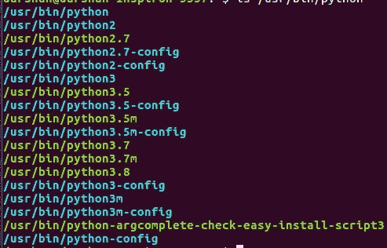
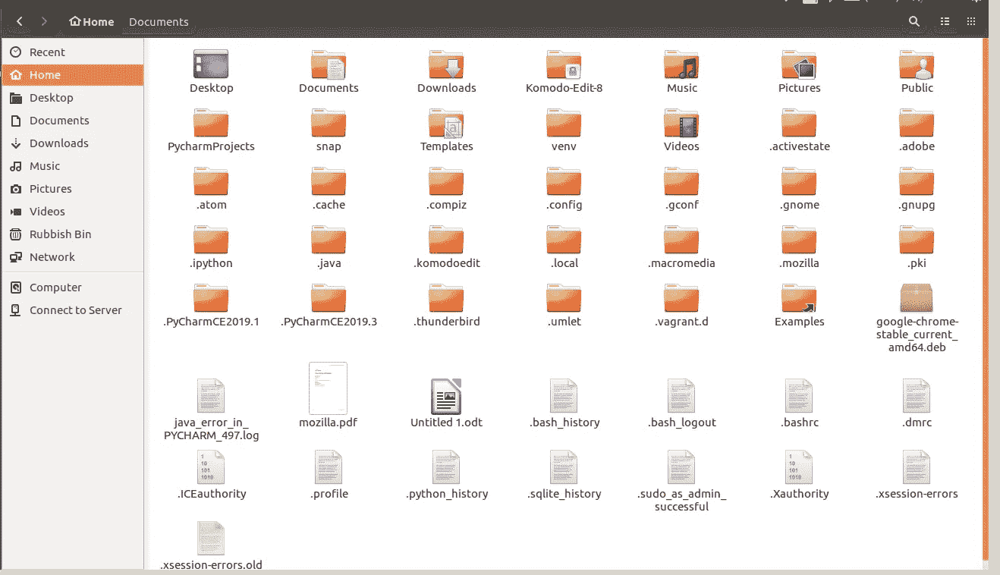
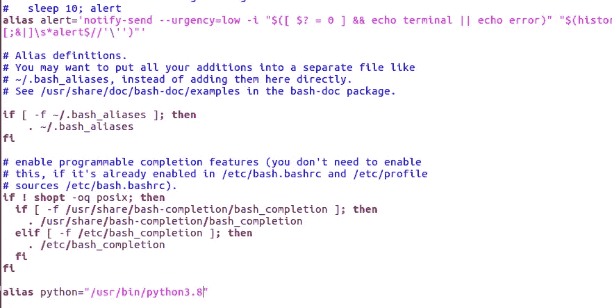
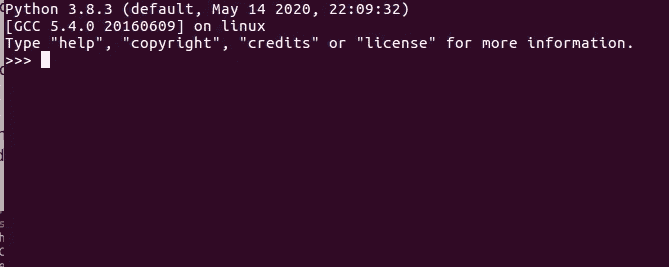

# 在 Ubuntu 16.04 上安装 Python 3.8.3，把 Python 默认版本换成新版本，为什么我的终端不工作？

> 原文：<https://medium.com/analytics-vidhya/installing-python-3-8-3-66701d3db134?source=collection_archive---------0----------------------->

当我试图在我的电脑上安装 python 3.8 时，对我这个新手来说是一个冗长的过程。我正在分享我在安装、更改默认版本和修复暂时停止工作的终端时的经验。

# ***如何在 Ubuntu 16.04 上安装 Python 3.8？***

**第一步:** APT 自动化软件包的检索、配置和安装。在终端中键入这两个命令，每次都要按 enter 键。

```
sudo apt updatesudo apt install software-properties-common
```

**第二步:** PPA ( [个人包存档](http://en.wikipedia.org/wiki/Personal_Package_Archive))用来给你的 Ubuntu 添加一个软件。他们减少了从原始来源安装软件所需的时间。PPA 是通过某人更新程序的一个简单的方法，在这种情况下，我使用的是死蛇 PPA。键入以下命令并按 enter 键。

```
sudo add-apt-repository ppa:deadsnakes/ppa
```

**步骤 3:** 一旦启用，通过键入以下命令安装 Python 3.8。

```
sudo apt install python3.8
```

**步骤 4:** 通过以下命令检查版本。您的计算机将显示新安装的 python 版本。

```
python3.8 --version
```

Python 已安装。但是等等！你还没有完成。

# **如何在 Ubuntu 上更新默认 Python 版本？**

安装新版本的 python 3.8 后，你会注意到，如果你在终端中键入 python，它仍然会向你显示旧版本的 python。这意味着您必须进行以下更改，以使计算机能够使用新安装的 python 版本。以下是我采取的步骤，它们对我有效:

**步骤 1:** 查看电脑上的不同版本:

```
ls /usr/bin/python*
```



命令显示我电脑上的所有 python 版本

**第二步:**复制你想要的版本。在我的例子中，我复制了/usr/bin/python3.8

第三步:回到主页，按 Shift+H 查看隐藏文件



显示隐藏文件的主屏幕。

**第四步:**打开**。barshrc 文件**并滚动到末尾。将复制的 python 版本粘贴到最后一行。看起来是这样的:alias python = "usr/bin/python3.8 "。



**第五步:**关闭终端，再次打开。关闭终端以查看应用的更改非常重要。键入以下命令

```
python
```

您将看到新版本的默认 python。



Python 的默认版本现在是 python3.8.3

**另一种在 Ubuntu 上更新 Python 版本的方法。**

这对我不起作用。但可能对你有用。

第一步:安装 Python3.8 .如上所述。

步骤 2:键入以下命令。在第一行使用您以前的版本(在我的例子中是 python3.5)并将优先级设置为 1。在第二行，使用新安装的 python 版本，并将优先级设置为 2。显示 Ubuntu <priority>是一个整数；在自动模式下，编号越大的选项优先级越高。</priority>

```
sudo update-alternatives --install /usr/bin/python3 python3 /usr/bin/python3.5 1sudo update-alternatives --install /usr/bin/python3 python3 /usr/bin/python3.8 2
```

第三步:

`sudo update-alternatives --config python3`

第四步:

```
python3 --vYou must get 
Python 3.8.3
```

# **终端坏了怎么修？**

因此，在更改 python 的默认版本时，我不小心在终端中键入了错误的 python 版本号，并继续进行了更改。不知何故，这停止了终端，我再也无法打开终端。我尝试了 CTRL+ALT+T 以及重新启动计算机，但终端窗口没有打开。

我在这里([https://askubuntu . com/questions/1086509/Ubuntu-18-terminal-not-opening](https://askubuntu.com/questions/1086509/ubuntu-18-terminal-not-opening))在线找到了这个解决方案:

1.  按 Ctrl+Alt+F1 打开 xterm。XTERM 是 X Window 系统的终端模拟器。Ubuntu 也有。
2.  输入用户名。
3.  输入密码。
4.  键入以下命令:

```
sudo update-alternatives --config python3
```

5.选择选项 1。

6.最后键入 Ctrl+Alt+F7 返回到 GUI

我的终端又开始运行了。

如果你觉得这些指南有用，请在下面的评论中告诉我。祝学习愉快！