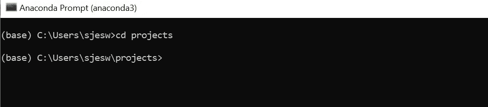

# 在 Windows 10 中安装 Rasa

> 原文：<https://medium.com/analytics-vidhya/installing-rasa-in-windows-10-bf5a34fa540c?source=collection_archive---------6----------------------->

这篇博客是你在装有 anaconda 的 windows 10 中安装 Rasa 的一步一步的指南。我写这篇博客的动机是，当我开始在 windows 10 中安装和运行 rasa 时，我遇到了许多与环境相关的问题。我花了几个小时寻找不同异常和警告的解决方案，直到最终完成。所以，我希望通过下面的步骤让你的道路变得简单。

对于那些不知道 Rasa 是什么的人来说，它是一个开源的自然语言理解工具，主要用于构建聊天机器人和语音应用程序。要使用 **Rasa** ，你得提供一些训练数据。也就是说，一组你已经标注了意图和实体的信息。意图只不过是一组与特定领域相关的输入或问题，或者有一些目标，而**实体**是**意图**的一部分，它指定了意图中的某些内容。

前任。

你好吗

你过得好吗？

你还好吗？

你开心吗？

你难过吗？

你生病了吗？

你今天感觉怎么样？

所有这些问题都可以归类为具有相同的目标。它们是意图。这种意向中的一些具体情况，如悲伤、快乐、生病、好，可以被标记为实际上提炼一个意向的实体。

让我们继续安装部分。

1.  首先将 anaconda 安装到您的系统中。你可以点击链接下载它。

 [## 个人版

### 🐍开源 Anaconda 个人版是世界上最受欢迎的 Python 分发平台，拥有超过 20…

www.anaconda.com](https://www.anaconda.com/products/individual#windows) 

2.现在将它安装到您的系统中。安装的步骤非常简单，唯一要小心的是当你得到下面的提示检查*添加 Anaconda3 到我的路径环境变量。*

3.安装后打开 anaconda 提示符

4.一旦进入，我们需要创建或进入您想要构建 bot 的目录。我已经为此创建了一个文件夹*项目*，所以我将把 **cd** 放入其中。

5.我们必须在这里创造一个新的康达环境，让我们能够很好地处理我们所有的依赖。 *installrasa，*是我给我的环境起的名字。可以用别的。

> conda install-name installrasa python = = 3 . 7 . 6

完成后，您需要激活新环境 *installingrasa*

> 康达激活安装

运行此程序后，您将看到从 *base* 到 *installingrasa* 环境的转换。

6.是时候安装 ujson 或 ultra json 了，它们将帮助我们安装更多我们需要的依赖项。

> 康达安装 ujson

7.让我们现在安装 tensorflow。

> 康达安装张量流

8.在使用 pip 安装 Rasa 之前，您必须安装 Microsoft VC++编译器，以便 python 可以编译任何依赖项。可以从 [Visual Studio](https://visualstudio.microsoft.com/visual-cpp-build-tools/) 获得编译器。下载安装程序并在列表中选择 VC++构建工具。

安装完成后，你可能需要重启你的系统，然后继续下面的步骤，但是记得在回到 anaconda 提示符后激活我们的新环境 *installingrasa* 。

> 康达激活安装

9.一旦完成，你可以继续安装 Rasa。

> pip 安装 rasa

10.是时候初始化一个新机器人了。添加标志- no-prompt 将帮助您跳过一些与路径相关的问题。

> rasa 初始化-无提示

11.你现在可以跑了

> *拉莎贝*

和默认助手机器人说话。

希望这对你的安装有所帮助。

在我成功安装它之前，我必须浏览大量的内容，并且写了这篇博客，这样你就不需要做同样的工作了。下面分享了一个 youtube 视频的链接，这也会有所帮助。

[https://youtu.be/4ewIABo0OkU](https://youtu.be/4ewIABo0OkU)