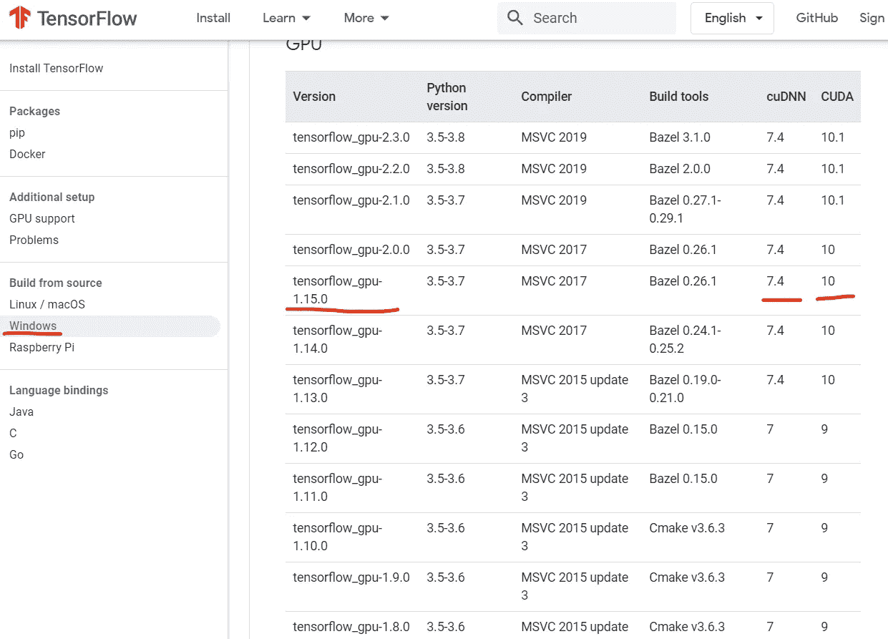
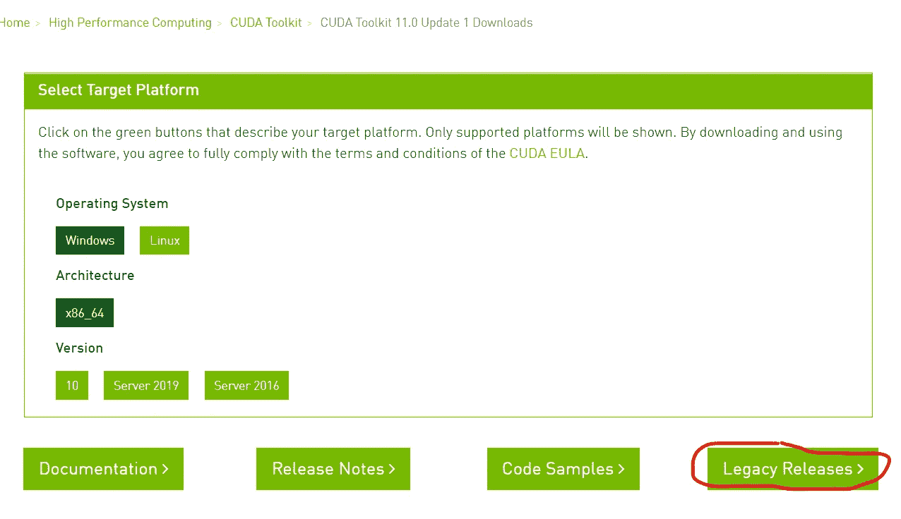
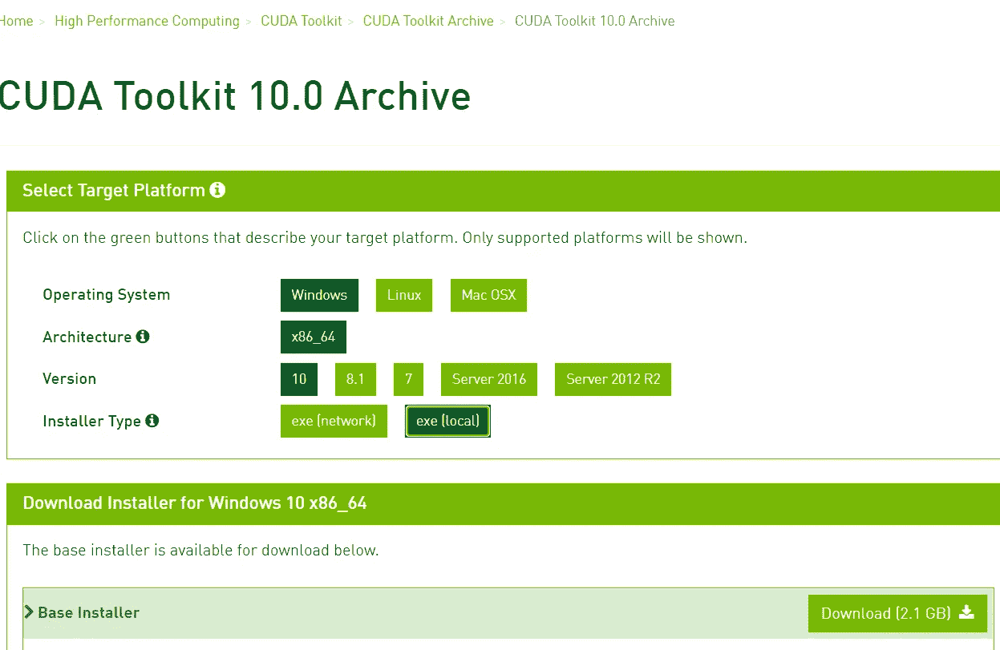
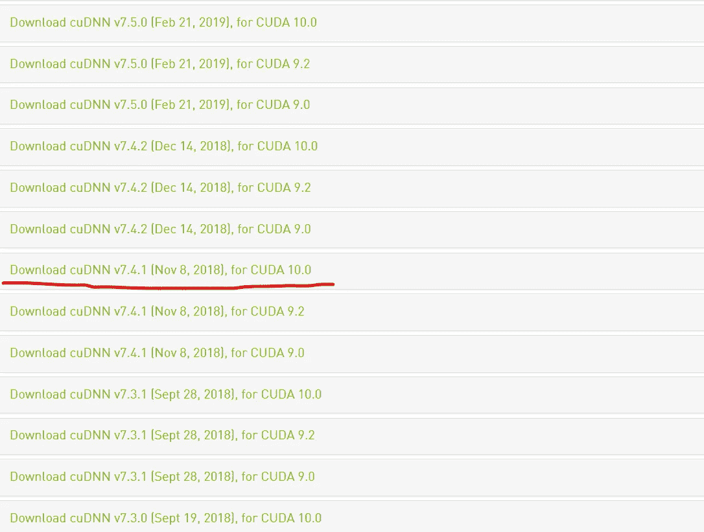
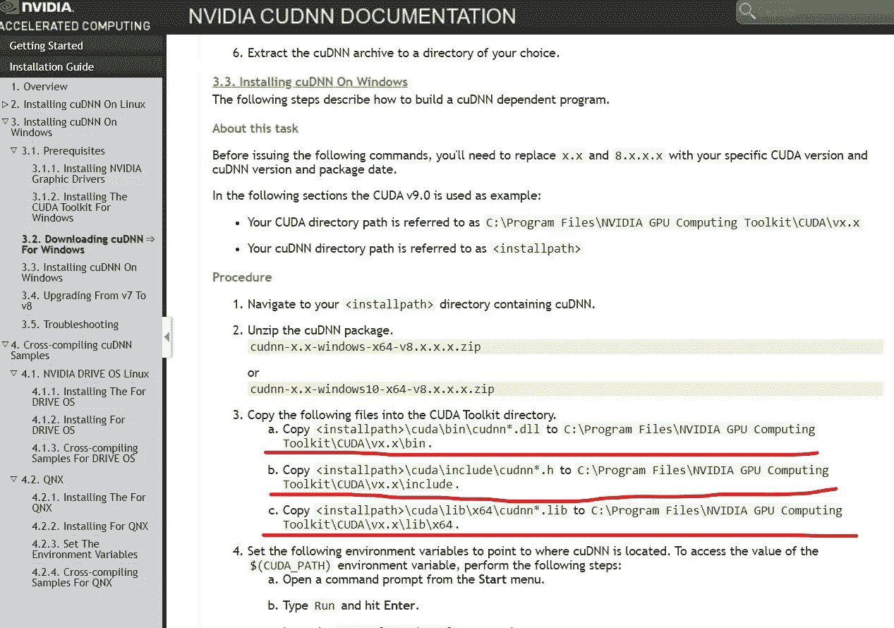
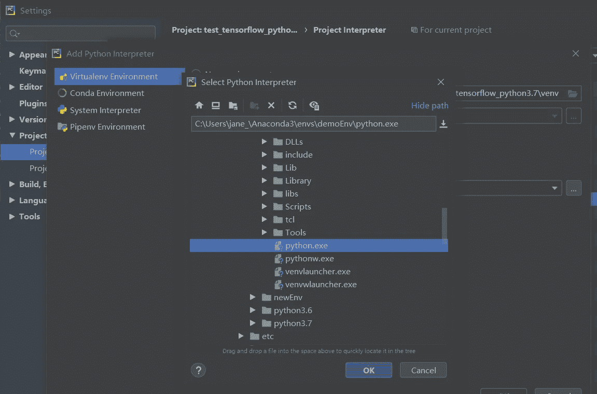

# 在 Window 10 上为 NVIDIA GeForce GTX 1650 Ti 安装 TensorFlow、CUDA、cuDNN

> 原文：<https://medium.com/analytics-vidhya/installing-tensorflow-cuda-cudnn-for-nvidia-geforce-gtx-1650-ti-onwindow-10-99ca25020d6c?source=collection_archive---------0----------------------->

## GPU vs CPU，训练 MNIST 数据集。

# 1 条蟒蛇

在我们开始之前，我想和你分享一下蟒蛇。如果你熟悉，请跳过这一部分。如果你需要在你的电脑上运行不同的演示，就需要设置不同的虚拟环境。因为每次运行不同的演示时都要更改 TensorFlow 或其他库的版本是不现实的。

最简单的方法之一是使用 [anaconda](https://www.anaconda.com/products/individual) 。你可以先下载你的电脑系统版本(Window、MacOS 或 Linux)并安装。接下来，使用 conda 创建一个虚拟环境。在这一步中，您还可以指定 python 版本。在这种情况下，我使用 python 3.7。您可以打开终端并键入:

```
conda create -n demoEnv python=3.7
```

# 2 张量流

创建虚拟环境后，您应该首先激活它。

```
activate demoEnv
```

现在，您处于名为 demoEnv 的虚拟环境中。您可以在此环境中安装软件包。我们现在可以安装[张量流](https://www.tensorflow.org/install/pip#windows_1)。

```
pip3 install --upgrade tensorflow==1.15
```

# 3 CUDA

你可以在 [TensorFlow 网站](https://www.tensorflow.org/install/source_windows)找到相应版本的 CUDA 和 cuDNN 来支持 TensorFlow 的版本。



在这个演示中，我的 TensorFlow 是 1.15。所以我应该下载 CUDA 10.0 和 cuDNN 7.4。

CUDA 10.0 可以在这个[网站](https://developer.nvidia.com/cuda-downloads?target_os=Windows&target_arch=x86_64)下载，点击旧版即可。



找到 CUDA Toolkit 10.0 并选择您的系统和版本 10.0。



下载 CUDA 10.0 后，通过运行 exe 一步一步安装。

# 4 cuDNN

最后一步是安装 cuDNN。我们需要 cuDNN 7.4。你可以在这个[网站](https://developer.nvidia.com/rdp/cudnn-archive)下载。NVIDIA 需要你先注册。



cuDNN 实际上是一个包含 bin、include、lib 文件的文件夹。找到您的 CUDA 计算工具包的路径。它可能在下面的路径中:

*C:\Program Files\NVIDIA GPU 计算工具包\CUDA\v10.0*

将 cuDNN 的 bin、include、lib 文件粘贴到 CUDA 10.0 的相应位置。这个[网站](https://docs.nvidia.com/deeplearning/cudnn/install-guide/index.html#installdriver-windows)也可以参考这个步骤。



# 5 环境路径

现在您已经完成了 TensorFlow、CUDA 和 cuDNN 的安装。为了保证 TensorFlow 能找到 CUDA，你要去*系统环境*添加 CUDA 路径。在我的系统中，我将这两个目录添加到 ***路径*** 中。

```
C:\Program Files\NVIDIA GPU Computing Toolkit\CUDA\v10.0\binC:\Program Files\NVIDIA GPU Computing Toolkit\CUDA\v10.0\libnvvp
```

# 6 用你的 GPU 训练一个 CNN 模型

现在我们可以使用 GPU 来训练模型。如果你使用 PyCharm，你可以进入*设置*，在 demoEnv 下用 python.exe 添加项目解释器。



我们可以通过用卷积神经网络训练一个 MNIST 教程来比较 GPU 和 CPU 的速度。众所周知，GPU 做卷积比 CPU 快很多。所以训练 CNN 应该会快很多。在我们刚刚创建的虚拟环境中运行如下脚本。它会用 GPU 训练。

```
import numpy as np
from tensorflow import keras
from tensorflow.keras import layers
num_classes = 10
input_shape = (28, 28, 1)

# the data, split between train and test sets
(x_train, y_train), (x_test, y_test) = keras.datasets.mnist.load_data()

# Scale images to the [0, 1] range
x_train = x_train.astype("float32") / 255
x_test = x_test.astype("float32") / 255
# Make sure images have shape (28, 28, 1)
x_train = np.expand_dims(x_train, -1)
x_test = np.expand_dims(x_test, -1)
print("x_train shape:", x_train.shape)
print(x_train.shape[0], "train samples")
print(x_test.shape[0], "test samples")

# convert class vectors to binary class matrices
y_train = keras.utils.to_categorical(y_train, num_classes)
y_test = keras.utils.to_categorical(y_test, num_classes)
model = keras.Sequential(
    [
        keras.Input(shape=input_shape),
        layers.Conv2D(32, kernel_size=(3, 3), activation="relu"),
        layers.MaxPooling2D(pool_size=(2, 2)),
        layers.Conv2D(64, kernel_size=(3, 3), activation="relu"),
        layers.MaxPooling2D(pool_size=(2, 2)),
        layers.Flatten(),
        layers.Dropout(0.5),
        layers.Dense(num_classes, activation="softmax"),
    ]
)

model.summary()
batch_size = 128
epochs = 5

model.compile(loss="categorical_crossentropy", optimizer="adam", metrics=["accuracy"])

model.fit(x_train, y_train, batch_size=batch_size, epochs=epochs, validation_split=0.1)
```

在 MNIST 数据集上完成 5 个历元的模型训练需要约 13 秒，验证准确率约为 98.97%。

我也用 CPU i7 运行相同的脚本。在如下 5 个时期中完成 MNIST 数据集的训练花费了大约 1 分 30 秒。验证准确率为 99.05%，非常接近 GPU 的结果。

# 7 结论

大家可以看到，训练 CNN 的时候 GPU 比 CPU 快很多，13s 比 90s。综上所述，我用 Python 3.7，CUDA 10.0，cuDNN 7.4 成功设置了 TensorFlow 1.15。

而且我还创建了另一个虚拟环境，在这个 GPU GeForce GTX 1650 Ti 中成功安装了 TensorFlow 2.3 与 Python 3.6/3.8、CUDA 10.1 和 cuDNN 7.6。它看起来像下面这样，

主要问题是当我试图安装 Tensorflow 2.3 时，我无法根据从源代码构建的[找到 cuDNN 7.4。所以我试着用 cuDNN 7.6，效果不错。如果你有任何问题，请在下面留言。谢了。](https://www.tensorflow.org/install/source_windows)

更多提示:

1.  我的另一款 GPU GeForce GTX 1060 6GB，我用的是 Tensorflow 1.15，Python 3.7，CUDA 10.0，但是 cuDNN 的版本是 7.6(针对 CUDA 10.0)，跟 [Tensorflow 网站](https://www.tensorflow.org/install/source_windows)不一样。并且我成功的用 GPU 训练了模型。
2.  我还在上面的 PC 上创建了一个新的虚拟环境，用的是 GeForce GTX 1060 6GB。我用的是 Tensorflow 2.2.0，Python 3.6，CUDA 10.1，cuDNN 7.6(针对 CUDA 10.1)，用 GPU 训练模型也可以。