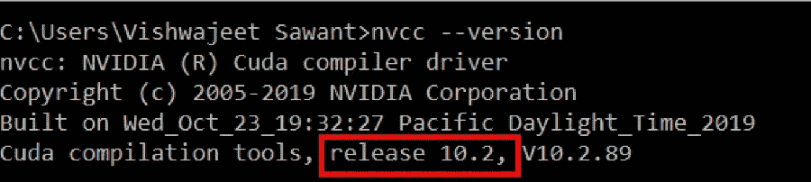

# 在 Anaconda 上安装 Tensorflow GPU

> 原文：<https://medium.com/analytics-vidhya/installing-tensorflow-gpu-on-anaconda-3f49c59c122b?source=collection_archive---------7----------------------->

所以，我试图用我的 GPU 来运行一个 tensorflow 代码，但每次它都会在 CPU 上运行。我更新了我的 Nvidia 驱动，CUDA 工具包和我的 tensorflow 没有任何运气。

经过大量的网络搜索和尝试，我终于能够让代码运行在 GPU 上，而不是 CPU 上。我不得不从各种来源尝试许多不同的代码和技巧。我花了一个多月才得到正确的代码和流程。所以我想把这些都放在一个页面上，这样新来的人就不用费劲了。

我有一个 Nvidia GeForce 940M 显卡，我有 Python 3.7 版本和 Anaconda 4.8.3。假设您已经拥有或知道如何安装 Anaconda 和 Python，让我们开始安装 Tensorflow-GPU。首先你需要检查你的显卡是否支持 CUDA。这个可以上英伟达网站链接查:[https://developer.nvidia.com/cuda-gpus](https://developer.nvidia.com/cuda-gpus)

如果你的显卡不支持 CUDA 并行处理，安装 tensorflow-GPU 是没有意义的。你可以在 Google Colab 或 Kaggle 上工作。如果你的显卡与 CUDA 工具包兼容，那就先升级 Nvidia 驱动吧。这可以从 Nvidia 官方网站:[https://www.nvidia.com/en-in/drivers/nvidia-update/](https://www.nvidia.com/en-in/drivers/nvidia-update/)

有了最新的驱动程序后，安装 Microsoft Visual Studio。MS Visual Studio 是先决条件。你可以在这里下载最新版本:[https://visualstudio.microsoft.com/downloads/](https://visualstudio.microsoft.com/downloads/)。一定要下载社区版，对学生和个人都是免费的。安装时，您不必给出任何首选项，使用安装建议的默认选项。

更新驱动程序后，从以下链接下载并安装 CUDA 工具包:[https://developer.nvidia.com/cuda-downloads?target _ OS = Windows&target _ arch = x86 _ 64&target _ version = 10](https://developer.nvidia.com/cuda-downloads?target_os=Windows&target_arch=x86_64&target_version=10)


图一。CUDA 工具包下载

安装完成后，重新启动计算机。这似乎是一个愚蠢的步骤，他们中的许多人都试图避免它(包括我)，但当文件被任何应用程序使用时，替换文件是不可能的。重启后，检查 CUDA 工具包是否安装正确。打开命令终端，输入以下命令:`nvcc --version`



图二。CUDA 版本

请注意 CUDA 的发布版本(在红框中)。我们必须下载这个版本的 cuDNN 文件。要下载 cuDNN，我们必须在 Nvidia 上注册并使用这些凭证登录。当你进入这个[链接](https://developer.nvidia.com/rdp/cudnn-download)，你会被要求登录或者注册。选择合适的。一旦完成，你会看到以下选项。


图 3。cuDNN 下载选项

选择适合您的 CUDA 工具包版本的 cuDNN 版本(见图 2)。请注意，CUDA 10.2 有两个可用选项，我选择了 v7.6.5，因为它比最近发布的 v8.0.0 更老，也更稳定。下载将是 zip 文件，其中包括 3 个文件夹，如图 4 所示。


图 4。cuDNN 下载的文件

将这些文件解压缩到计算机中的任何位置。将所有文件和文件夹复制到 CUDA 安装文件夹中。默认情况下，这将是“C:\ Program Files \ NVIDIA GPU Computing Toolkit \ CUDA \ v 10.2”，除非在安装 CUDA toolkit 时对其进行了更改。系统将请求允许替换文件夹，因为名称相同，我们将继续替换。


图 5。cuDNN 复制位置

现在在 Windows 搜索中搜索“环境变量”。打开“编辑系统环境变量”和“环境变量”。我们将得到如图 6 所示的窗口。现在选择“路径”在点击“编辑”按钮。


图 6。环境变量

添加 3 条新路径，如下面的图 7 所示，如果它们还不存在的话。点击“新建”并输入下面的路径。请注意，根据您安装 CUDA 和复制 cuDNN 文件夹的位置，这些路径可能会有所不同。为了确保安全，打开您复制 cuDNN 文件夹的文件夹，并确保下面的路径文件夹存在。

C:\Program Files\NVIDIA GPU 计算工具包\CUDA\v10.2\bin

C:\Program Files\NVIDIA GPU 计算工具包\CUDA\v10.2\libnvvp

C:\Program Files\NVIDIA GPU 计算工具包\CUDA\v10.2\extras\CUPTI\lib64


图 7。CUDA 环境路径

重新启动你的计算机最后一次获得所有的驱动文件和 cuDNN 文件的权利，他们是需要的。

现在 tensorflow 的所有先决条件都已完成，我们可以开始实际安装 tensorflow-gpu 库了。我们将在 Anaconda 中安装 tensorflow，从而打开“Anaconda 提示”。在我们安装 tensorflow-gpu 之前，请确保您没有在 Anaconda 中安装 tensorflow cpu。使用`pip list`或`conda list`获取已安装软件包的列表。为了确保安全，如果`pip uninstall tensorflow`已经在库中安装了 tensorflow，请将其卸载。现在使用`pip install tensorflow-gpu` 或`conda install -c anaconda tensorflow-gpu.`安装 tensorflow-gpu

安装完成后，打开 Jupyter 笔记本，导入 tensorflow。使用以下代码行检查 GPU 是否可用于 tensorflow。

```
import tensorflow as tf
from tensorflow.python.client import device_lib
print(device_lib.list_local_devices())
```

这一行将打印出可供 tensorflow 使用的处理器列表。它将打印计算机的 CPU 和 GPU，如图 8 所示。


图 8。张量流设备库

如果您的 GPU 显示在列表中，恭喜您已经完成安装，并准备在您的 GPU 上训练 tensorflow 模型。请注意，tensorflow 和 Keras 将始终使用 GPU 作为首选，如果您想在 CPU 上运行模型，可以使用下面的命令行切换到 CPU。

```
import os 
os.environ["CUDA_VISIBLE_DEVICES"]="-1"
```

现在 tensorflow 将使用 CPU 而不是 GPU。

希望这对你有帮助。如果我错过了什么，请告诉我。

快乐训练。