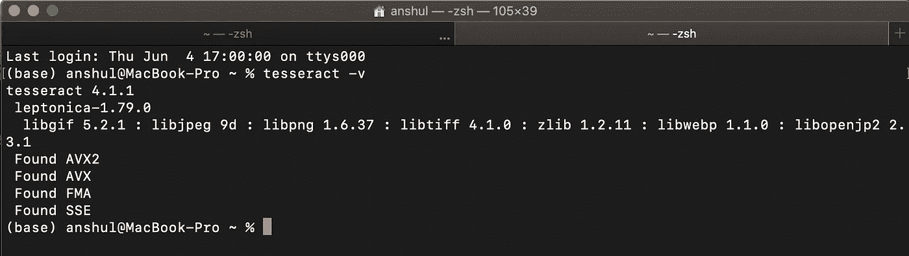

# 正在安装宇宙魔方 OCR

> 原文：<https://medium.com/analytics-vidhya/installing-tesseract-ocr-f241729b6035?source=collection_archive---------22----------------------->

1985 年，惠普公司的计算机科学家和研究人员开始研究光学字符识别(OCR)，以帮助计算机区分图像和文本。2005 年，该项目是开源的，2006 年，谷歌采用了该项目，并一直是其主要赞助商。


在目前的状态下，Tesseract 由数百名自由开发人员支持，在全球范围内使用 100 多种语言，从英语到普通话，再到意第绪语。在第一次迭代中，Tesseract 是用 C 编写的，然后在 1998 年移植到 C++上。虽然该软件几乎完全通过命令行运行，但一些开发人员已经为初学者创建了一个 GUI。

让我们谈谈如何在我们的机器上安装 Tesseract，确保它工作正常，并在一两个映像上进行测试。

因为我用的是 Mac，所以我的说明是针对 OS-X 的，但是有很多针对 Linux 和 Windows 的指南。

# **第一步，安装魔方:**

最简单的方法是使用自制软件:

```
$ brew install tesseract
```


# **第二步，确保安装成功:**

```
$ tesseract -v
```



如果安装了 Tesseract，您应该会看到版本号。

# **第三步，让我们带着宇宙魔方兜一圈！**

我建议你去找一张高分辨率、清晰处理过的图像。也要确保你的背景和图像是分开的(这意味着没有褪色的字符，没有渐变，没有混合)。


清晰的背景，清晰的文字，没有混合！

```
$ tesseract Documents/Test-01.png stdout
```


注意我的终端中的最后一行:“测试 Tesseract OCR”。成功！


```
$ tesseract Documents/Test-02.png stdout
```


再次成功！

宇宙魔方也适用于数字:


同样的限制也适用:清晰的文本和清晰的背景。


成功！

我们在上面看到的一切只是宇宙魔方所能做的一个小例子！在下一篇博客中，我将结合 Python 使用 Tesseract，向您展示我们可以做的其他一些很酷的事情！