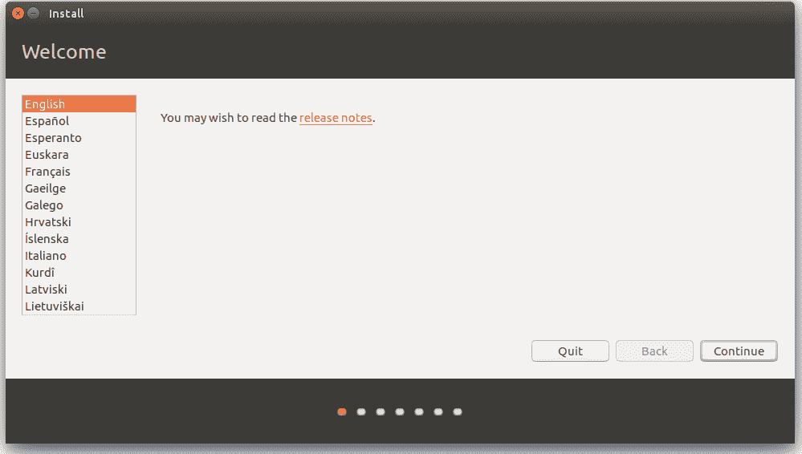

# 在 Windows 上安装 Ubuntu

> 原文：<https://medium.com/analytics-vidhya/installing-ubuntu-on-windows-931bfe1d9170?source=collection_archive---------13----------------------->

Ubuntu 的标志。[参考](https://design.ubuntu.com/brand/ubuntu-logo/)

# 第 1 部分:创建活动 USB 驱动器

1.  下载最新版本的 Ubuntu。[点击这里](https://www.ubuntu.com/download/desktop)下载 Ubuntu。
2.  现在下载通用 USB 安装程序(UUI)。这将创建一个活的 USB。直接从 ISO 文件启动(我们下载的是不可能的)。下载 UUI [的链接下载 UUI](https://www.pendrivelinux.com/downloads/Universal-USB-Installer/Universal-USB-Installer-1.9.7.0.exe)
3.  运行 UUI。

1.  选择 Linux 发行版，这里是 Ubuntu。
2.  在下载位置的链接中选择下载的 ubuntu 文件的位置(可能在你的下载目录中)。
3.  选择您插入的笔驱动器的驱动器号(E、F、G 等)。注意:尝试此步骤时要小心，并仔细验证驱动器号。

第 1 部分完成。恭喜你。

# 第 2 部分:引导进入 Ubuntu

1.  从开始屏幕搜索更新和恢复->高级启动选项->立即重新启动。
2.  一个蓝色的屏幕现在打开。
3.  选择“使用 USB 设备”
4.  然后选择你的设备(最好知道笔驱动的品牌)

第 2 部分完成:你现在启动到 Ubuntu

# 第 3 部分:安装 Ubuntu

1.  我们注意到出现了一个带有 4 个选项的黑屏。选择*不安装*尝试 Ubuntu。注意:最好不要直接“安装 Ubuntu ”,最好先检查一下我们的系统是否能够启动。
2.  一个紫色屏幕后，你启动到 Ubuntu 桌面。
3.  点击第二个图标“安装 Ubuntu 16.10”(版本可能不同)。
4.  现在可能是连接互联网的最佳时机。Ubuntu 依赖于几个第三方软件(软件来源于 Ubuntu ),所以相信它，连接到互联网是值得的。———如果使用互联网需要登录，则启动浏览器(从左侧垂直栏可以看到->转到大学/公司网址并登录) )

第 3 部分完成:安装窗口打开。

# 第 4 部分:安装时选择正确的选项

*在大部分情况下，您必须继续点击此处的下一页、下一页和下一页。*

单击第一页上的继续。

这里建议您检查*安装更新*以及*安装第三方软件*的选项。暂时禁用“关闭安全引导”选项。

不过要小心第二扇窗户。

你有两个选择 a)选择安装 Windows 启动管理器 b)擦除磁盘并安装 Ubuntu

**选择 a)** 注意:如果你选择 b)，你将会格式化你的硬盘并清空 Windows。

出现分区页面

双击有足够空间安装 Ubuntu 的分区(约 8GB)

现在忽略交换空间的提示(或者您可以返回或者在*“挂载选项”*中选择 swap 而不是 root)

确认新分区的设置

为您的笔记本电脑选择用户名和密码。(这是你的收入)

选择时间，而不是默认的加尔各答，搜索印度时间。印度时间是定期更新的互联网时间，所以你可以省去一次又一次重置 CPU 时钟的麻烦。

**注意** *在你安装*的时候这个零件可能不会出现。在分区窗口中，为 Ubuntu 分配一个 70-100 GB 的大小(这将持续你很长一段时间)。使用中间的滑块来调整分区。

出现最后一页。这是显示安装进度的页面。

# 第 5 部分:重启 Ubuntu

安装完成后，在出现的对话框中点击**立即重启**选项。

现在，当我们启动时，我们会注意到一些不同的东西。

一个紫色的窗口出现了 4 个选项。这个窗户与我们之前遇到的黑色窗户非常相似。这叫做*蛴螬*。

1.  这里的第一个选项加载 Ubuntu 操作系统。
2.  第二个选项是高级引导选项(目前不感兴趣)
3.  第三个选项“Windows 启动管理器”加载到 Windows 中。
4.  第四个选项“系统设置”加载到您的 BIOS 中。

**Ubuntu**

欢迎来到开源社区！

*最初发布于*[*https://maximum durance . github . io*](https://maximumendurance.github.io/Ubuntu-Blog/)*。*