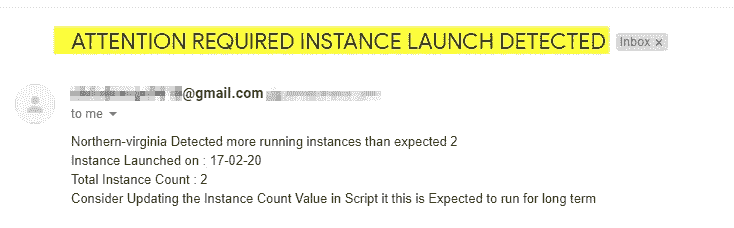

# 实例启动检测

> 原文：<https://medium.com/analytics-vidhya/instance-launch-detection-6027b441b5ab?source=collection_archive---------16----------------------->

从业务角度来看，我们使用云在附近区域启动实例，以避免延迟。

但是，由于无人值守，其他区域会发生什么情况呢？如果实例启动到这些区域会怎么样呢？这也将导致无噪声的计费。

在这个博客中，发布了一个脚本，它会在实例发生变化时通知我们，这是一个基本的脚本，实例计数硬编码在所有区域中(不是完全自动的)。

这个脚本如何工作

1.  每 5 分钟检查所有与硬编码实例计数匹配的区域。
2.  如果实例计数发生变化，将会触发一封电子邮件，声明“检测到实例启动”。

先决条件:

安装了以下组件的服务器。

```
Python3
boto3
crontab
```

脚本:

```
import boto3
import os
from time import gmtime, strftime
from datetime import date, timedelta
import datetime
from email.mime.multipart import MIMEMultipart
from email.mime.base import MIMEBase
from email.mime.text import MIMEText
from email.utils import COMMASPACE, formatdate
from email import encoders
import smtplib,ssltoday = datetime.datetime.now().strftime('%d-%m-%y')
ec =  boto3.client('ec2')[sfrom='example@gmail.com](mailto:sfrom='example@gmail.com)'                     //Update Your Mail ID 
[sto='example@gmail.com](mailto:sto='example@gmail.com)'                      // To address
sub='ATTENTION REQUIRED : INSTANCE LAUNCH DETECTED'
txt="INSTANCE LAUCH DETAILS"
ser='email-smtp.us-east-1.amazonaws.com'
port='587'
username='SMTP USername'        # Add SMTP Username
password='SMTP Password'       # ADD SMTP Passworddef sendMail(message):
    ses_user = username         #Update the SMTP USername
    ses_pwd = password          #Update the SMTP Password
    fromadd = sfrom
    to = stomsg = MIMEMultipart()
    msg['From'] =fromadd
    msg['To'] = to
    msg['Subject'] = "ATTENTION REQUIRED INSTANCE LAUNCH DETECTED"
    body = message
    msg.attach(MIMEText(body,'plain'))#part = MIMEBase('application', 'octet-stream')
    #part.set_payload(open(attach, 'rb').read())
    #Encoders.encode_base64(part)
    #part.add_header('Content-Disposition','attachment; filename="%s"' % os.path.basename(attach))
    #msg.attach(part)mailServer = smtplib.SMTP("email-smtp.us-east-1.amazonaws.com", 587)
    mailServer.ehlo()
    mailServer.starttls()
    mailServer.ehlo()
    mailServer.login(ses_user, ses_pwd)
    mailServer.sendmail(fromadd, to, msg.as_string())
    # Should be mailServer.quit(), but that crashes...
    mailServer.close()def instance_count_details(x,reg, short_hand_region):
    message = ""
    instance_count = 0
    orbit_value = x
    ec = boto3.client('ec2',short_hand_region)
    reservations = ec.describe_instances()
    for r in (reservations["Reservations"]):
        for i in r["Instances"]:
            instance_count +=1
    print(instance_count)
    if instance_count == 0:
        print(reg + " region has no server registered")
    elif instance_count == orbit_value:
        print(reg + " runs with the same Instance count",(instance_count))
    elif instance_count > orbit_value:
        inst = instance_count - orbit_value
        print(inst)
        temp = reg + " Detected more running instances than expected " +  str(x) + "\n" "Instance Launched on : " + today + "\n" "Total Instance Count : "+ str(inst) + "\n" "Consider Updating the Instance Count Value in Script it this is Expected to run for long term"
        message += temp
        sendMail(message)
    else:
        print("GoodBye")def main():
    instance_count_details(2,'Northern-virginia', 'us-east-1')
    instance_count_details(0,'Ohio', 'us-east-2')
    instance_count_details(0,'california', 'us-west-1')
    instance_count_details(0,'oregon', 'us-west-2')
    instance_count_details(0,'Mumbai', 'ap-south-1')
    instance_count_details(0,'seoul', 'ap-northeast-2')
    instance_count_details(0,'seoul', 'ap-southeast-1')
    instance_count_details(0,'sydney', 'ap-southeast-2')
    instance_count_details(0,'Tokyo', 'ap-northeast-1')   
    instance_count_details(0,'canada', 'ca-central-1')
    instance_count_details(0,'Frankfurt', 'eu-central-1')
    instance_count_details(0,'Ireland', 'eu-west-1')
    instance_count_details(0,'London', 'eu-west-2')
    instance_count_details(0,'paris', 'eu-west-3')
    instance_count_details(0,'stockholm', 'eu-north-1')
    instance_count_details(0,'Saopaulo', 'me-south-1')main()
```

上面的脚本中，N.virginia 地区有 2 个实例，其他地区为 0。

当这些值发生变化时，我们会收到一封电子邮件通知，指出检测到实例启动。

预期的实例计数为 2，总实例计数将是预期计数和当前计数之差。



在 Jumpbox 服务器上运行这个脚本，它需要一个 ec2 只读访问角色。

这是一个简单的脚本，它会在实例启动时提醒我们，在优化时，它可以与 AWS config 和 Lambda 连接，以便进行更多的数据检索。