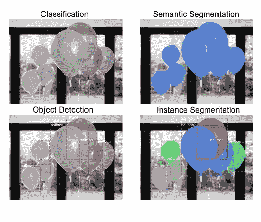
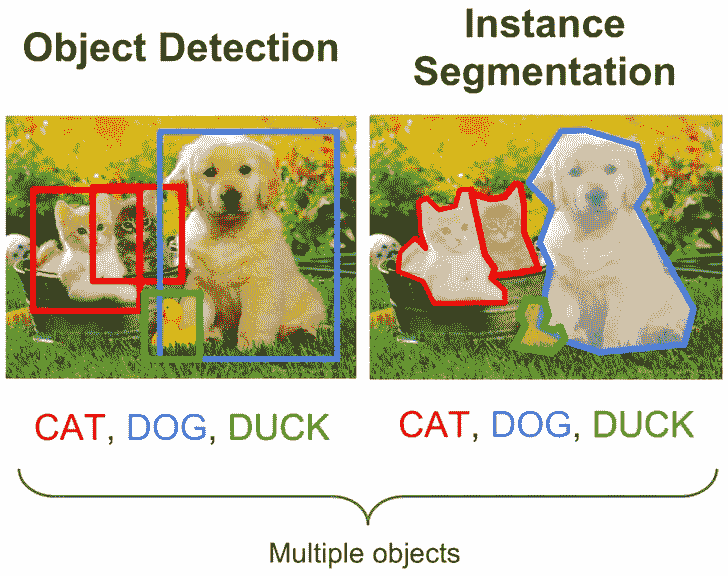
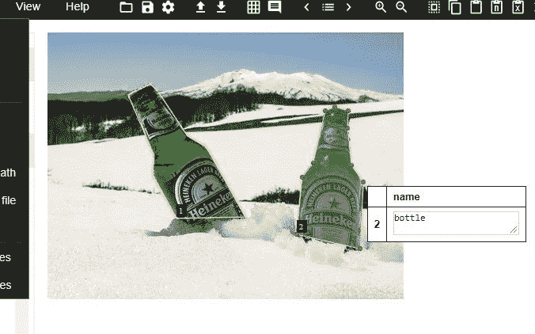
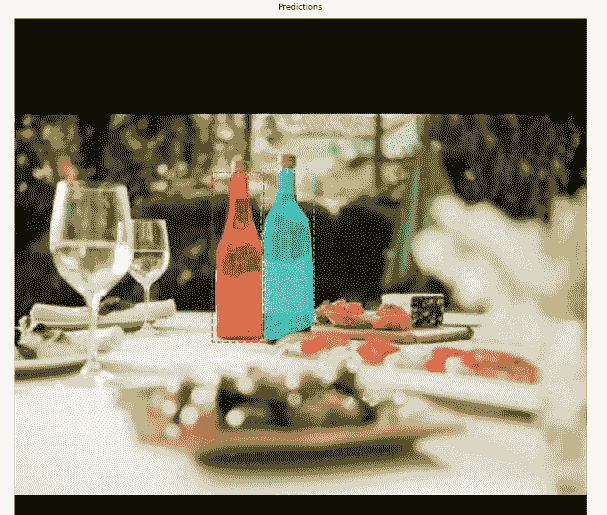

# 在定制数据集上使用掩模 R-CNN 的实例分割

> 原文：<https://medium.com/analytics-vidhya/instance-segmentation-using-mask-r-cnn-on-a-custom-dataset-78631845de2a?source=collection_archive---------0----------------------->

***在本文中，我们将使用 Mask R-CNN 对自定义数据集进行实例分割。***

在进入实现的细节之前，**分割到底是什么？细分的类型有哪些？**

这张图片很好地解释了不同的计算机视觉技术:



来源:[https://engineering . matter port . com/splash-of-color-instance-segmentation-with mask-r-CNN-and-tensor flow-7c 761 e 238 b 46](https://engineering.matterport.com/splash-of-color-instance-segmentation-with-mask-r-cnn-and-tensorflow-7c761e238b46)

*   **分类:**简单告知图像中是否存在气球。
*   **对象检测:**定位图像中的所有气球对象，并为每个对象生成边界框。
*   **语义分割:**用相同的颜色高亮显示所有的气球像素。
*   **实例分割:**用不同的颜色突出显示气球的不同实例。

因此，**语义分割**会将所有对象分类为单个实例。但是在**实例分割**中，同一类的不同对象被分配为不同的实例。

如果我们已经有了目标检测，为什么还需要分割？



来源:[https://medium . com/analytics-vid hya/image-class ification-vs-object-detection-vs-image-segmentation-f 36 db 85 Fe 81](/analytics-vidhya/image-classification-vs-object-detection-vs-image-segmentation-f36db85fe81)

对象检测创建对应于图像中每个类别的边界框。但是它没有给出关于物体形状的信息。我们只得到边界框坐标的集合。

图像分割为图像中的每个对象创建逐像素的遮罩。因此它让我们对图像中的物体有了更细致的了解。

[**这篇**](https://engineering.matterport.com/splash-of-color-instance-segmentation-with-mask-r-cnn-and-tensorflow-7c761e238b46) 文章很好地洞察了理论部分，解释了什么是 Mask R-CNN，它的架构以及如何在自定义数据集上训练它，但我仍然发现实现实际代码有点困难，所以我写这篇文章时提供了详细的步骤和一些实际的代码片段。

这里有一个预训练模型[](https://github.com/matterport/Mask_RCNN/releases)****，它是使用 Mask R-CNN 在 COCO 数据集上训练的，但它只包含 80 个类，因此我们现在将看到如何使用迁移学习在自定义类上训练。****

****我们将要训练的自定义对象是“瓶子”。 [**这里的**](https://github.com/AISangam/Mask-RCNN-bottle-training/tree/master/dataset) 是对同一数据集的链接。因此，让我们深入了解实现细节:****

# ****步骤 1:准备数据集****

****我上面提到的数据集由 100 幅图像组成，其中 76 幅用于训练，其余用于验证。我使用工具 [VGG 注释器](http://www.robots.ox.ac.uk/~vgg/software/via/)来标记图像。这是一个简单的工具，它标记所有的图像，并将其导出到一个单一的 JSON 文件。****

********

# ****步骤 2:克隆存储库****

****使用下面的命令克隆存储库****

```
***git clone* [https://github.com/matterport/Mask_RCNN.git](https://github.com/matterport/Mask_RCNN.git)**
```

****在这之后，我们需要安装 Mask R-CNN 所需的依赖项。****

# ****步骤 3:安装依赖项****

****该存储库包含一个名为 requirements.txt 的文件，该文件列出了所有依赖项，因此使用以下命令来安装所有依赖项:****

```
**pip install -r requirements.txt**
```

# ****步骤 4:下载预先训练的重量(在 COCO 上训练)****

****接下来，我们需要下载预先训练的重量。您可以使用 [**此链接**](https://github.com/matterport/Mask_RCNN/releases) 下载预先训练好的重量。这些权重是从在 MS COCO 数据集上训练的模型获得的。下载完权重后，将该文件粘贴到我们在步骤 2 中克隆的 Mask_RCNN 存储库的根文件夹中。****

# ****步骤 5:编辑自定义类的代码****

****在克隆的 repo 的 samples 目录中，创建一个您的类的新文件夹，在我的例子中，它是 bottle。在此文件夹中，创建一个数据集文件夹，并将训练和验证图像粘贴到其中。此外，复制文件 balloons.py 并将其重命名为 bottle.py，然后根据需要进行编辑。这是我的**b**[**ottle . py**](https://github.com/shashankchandak/Instance-Segmentation-MaskRCNN/blob/master/samples/bottle/bottle.py)文件的链接，现在让我们看看我们需要编辑什么。****

1.  ******数据集类******

****它包括 3 个需要改变的功能:****

```
**def **load_balloons**(self, dataset_dir, subset):
def **load_mask**(self, image_id):
def **image_reference**(self, image_id):**
```

****在所有 3 个函数中用你的自定义类名(这里是瓶子)替换“气球”。****

****2.**配置类******

```
**class BottleConfig(Config):NAME = "bottle"# Number of classes (including background)
    NUM_CLASSES = 1 + 1  # Background + bottle# Number of training steps per epoch   
    STEPS_PER_EPOCH = 100**
```

# ****第六步:培训****

****训练是一项计算繁重的任务，将需要一个 GPU，如果你没有一个不要担心，我会告诉你如何使用谷歌 colab 的训练目的。从 bottle 目录中运行这个命令来开始训练****

```
**python bottle.py train --dataset=/samples/bottle/dataset  
--weights=coco**
```

****对于那些没有 GPU 的人，这里是我的[**colab 笔记本的链接。**](https://colab.research.google.com/drive/1vpgz4SbR5NdIltyifEuVBAvfuLnVfc0B)****

****这些步骤如下****

1.  ****将包含所有文件的整个目录结构上传到 google drive。****
2.  ****创建新的 Colab 笔记本。****
3.  ****代码参考我的 [**colab 笔记本**](https://colab.research.google.com/drive/1vpgz4SbR5NdIltyifEuVBAvfuLnVfc0B) 开始训练。****
4.  ****所有的模型都将被保存到你的 google drive 中的文件夹 rootdir/logs/****

# ****步骤 7:评估模型****

****评估模型的代码可以在 [**这里**](https://github.com/shashankchandak/Instance-Segmentation-MaskRCNN/blob/master/samples/bottle/inspect_bottle_model.ipynb) 找到。下面是输出的一个示例。****

********

*****就是这样！我们已经成功地在一个定制的数据集上实现了实例分割。*****

****参考资料:****

1.  ****[https://engineering . matter port . com/splash-of-color-instance-segmentation-with-mask-r-CNN-and-tensor flow-7c 761 e 238 b 46](https://engineering.matterport.com/splash-of-color-instance-segmentation-with-mask-r-cnn-and-tensorflow-7c761e238b46)****
2.  ****[https://www . analyticsvidhya . com/blog/2019/07/computer-vision-implementing-mask-r-CNN-image-segmentation/？UTM _ source = blog&UTM _ medium =简介-图像-分割-技术-python](https://www.analyticsvidhya.com/blog/2019/07/computer-vision-implementing-mask-r-cnn-image-segmentation/?utm_source=blog&utm_medium=introduction-image-segmentation-techniques-python)****
3.  ****[https://github.com/AISangam/Mask-RCNN-bottle-training](https://github.com/AISangam/Mask-RCNN-bottle-training)****

****如有任何疑问，你可以打电话到 chandak.shashank16@gmail.com 找我****

****您可以通过我的其他个人资料联系我:****

****[领英](https://www.linkedin.com/in/shashankchandak16)****

****[Github](https://github.com/shashankchandak)****

****[推特](https://twitter.com/chandakshashank)****