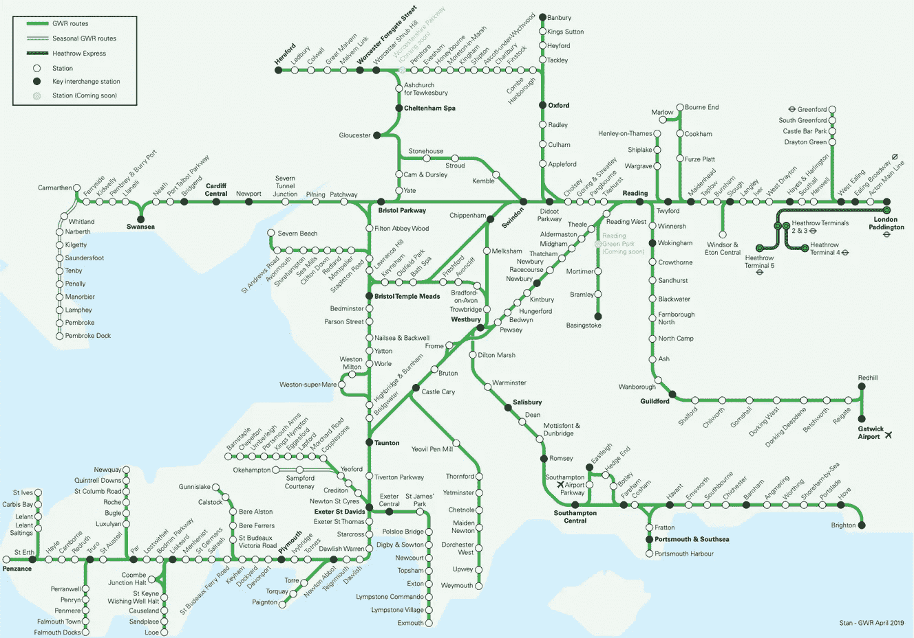
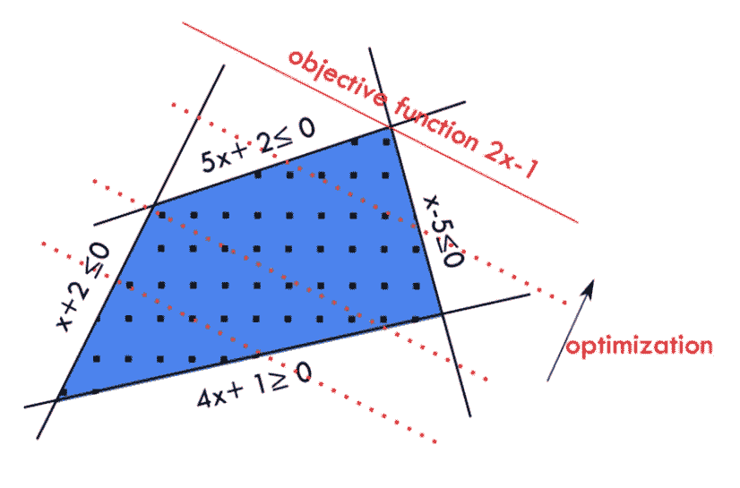
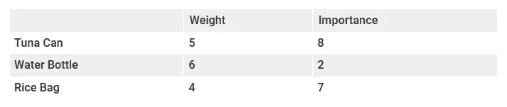

# 用 Python 实现图论及其他的整数规划:01 -简介/背包

> 原文：<https://medium.com/analytics-vidhya/integer-programming-for-graph-theory-and-others-with-python-01-introduction-knapsack-6d5f0052a2c2?source=collection_archive---------20----------------------->

自从我接触运筹学和人工智能以来，我一直对它着迷。回想我和若昂·佩德罗·佩德罗索教授的课，我被内容迷住了，而其他人则对写在黑板上的所有数字和多项式感到厌烦。


若昂·佩德罗·佩德罗索教授(波尔图大学)。我遇到过的最好的老师。

那些方程式改变了我的生活。事实上，你可以将一个问题建模为一组等式和不等式，然后让一个算法找到最佳可能的解决方案，这是令人兴奋的。在我获得理学学士学位并开始找工作后，我会在面试中告诉每个人我有关于线性规划和试探法的技能，大多数面试官会看着我，问我在说什么。幸运的是，在为一家位于葡萄牙的名为 Waterdog 的软件公司工作时，我有机会独自面对一个优化项目。他们说“你告诉我们你擅长算法之类的，做这个吧”，我面临着一个通量优化问题，没有公司其他任何人的帮助，没有论文要读，什么都没有。我解决了这个问题，这也是我如何在以移动为导向的公司找到下两份工作的原因。



大西部铁路(GWR)的铁路图，可以使用整数规划作为成本最小化问题来生成

## ***这一系列博文会由哪些内容组成？***

我将包括一些关于一般图论问题的教程，如最短路径、最小生成树、旅行推销员和流量问题，包括每个解决方案的 Python 代码，并在本系列的最后，展示如何编写一个完整的拼车优化解决方案。

## **T5 什么是整数编程？**

整数规划是使用整数变量的线性规划的子集。简单地说，线性规划是一种优化方法，在这种方法中，您编写一个优化函数和一组算法约束，以找到一个具有优化函数的最高(或最低，我们将达到该值)值的解决方案，或者告诉您该问题的解决方案不存在。所有函数必须是 1 次或零次多项式。



仅使用两个变量的线性规划模型和解决方案的可视化表示。

这里有一个线性规划的例子:

```
Optimization Function ( z ) = 7*x + 5*y , to maximizewhere:x + y ≤ 602x + 0.6y ≤ 65x ≤ 30 and y ≤55 and x ≥ 0 and y ≥ 0
```

如果我们通过线性规划求解器运行这个问题，我们会发现解 x=20.714286 和 y=39.285714 使优化函数最大化，达到 341.428572 的值。

下面是使用 PuLP 解决这个问题的 Python 代码:

LP 模型的 Python 代码，使用了 PuLP 包

为了明确起见，我们不能编写如下优化函数:

```
z = x*y
```

此函数不是一阶或零阶的多项式函数，因此不允许使用。这是编写 LP 模型时的一个大问题，有些问题根本无法用 LP 来解决。

## 一个整数规划的例子，背包问题:


我们能把这些都装进背包里吗？如果没有，我们带什么物品？整数规划可以解决这个！

让我们想象一下，在新冠肺炎疫情期间，你要为你的家人去杂货店购物。你带着你的背包，但是你的背包只能承受这么多的重量而不会撕裂自己。你需要仔细选择购买哪些物品。

为了简化起见，每个项目都有一个重要性值和一个权重值。这些项目如下:



数据这个问题要用整数规划来解决

你的包只能装 50 公斤。你应该购买哪些物品？

在这个场景中，我们的变量只能是整数(因为我们不能购买半罐金枪鱼)，所以我们必须这样定义它们。目标函数是所有变量之和乘以各自的重要性值，约束条件是变量之和乘以各自的权重小于或等于背包的重量限制。

我们可以这样模拟这个问题:

IP 模型的 Python 代码

这个问题的解决方案是 2 个金枪鱼罐头，零瓶水和 10 个米袋，达到 86 的目标。

## 当我们有其他方法时，为什么要使用整数规划？

这是一个很好的观点。我们使用 IP 通过对目标函数和约束进行建模来解决问题，并且我们总是可以添加更多的约束！本系列将解决的问题之一是最短路径问题(请继续关注，这将在下一集介绍)，使用 Djikstra 的算法可以轻松解决该问题。但是，如果你从城市 A 开车到城市 B，说“哦，我想检查一下刚刚建成的新道路，但是我不希望在我的整个路径上有任何重复的道路或街道”，你可能需要 Dijkstra 从坟墓里跳出来帮助你，或者你可以使用整数编程！


年轻的埃德格·迪克斯特拉

其他一些问题，像旅行推销员，没有任何保证最优解的算法(他们有的只是启发式)，但是 LP 和 IP 保证了最优解。

在我看来，学习 IP 是一种可能在你最意想不到的时候派上用场的技能。如果你想与众不同，就不要学别人都在学的东西。

## 下一集:最短路径问题和 BigN

[](/@alexbrou/integer-programming-for-graph-theory-and-others-with-python-02-shortest-path-bign-4c359493b734) [## 用 Python 实现图论及其他的整数编程:02 —最短路径/ BigN

### 在本系列的前一篇博文中，我们讨论了什么是整数规划以及如何用它来解决背包问题…

medium.com](/@alexbrou/integer-programming-for-graph-theory-and-others-with-python-02-shortest-path-bign-4c359493b734)