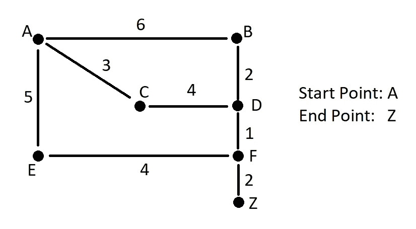

# 用 Python 实现图论及其他的整数编程:02 —最短路径/ BigN

> 原文：<https://medium.com/analytics-vidhya/integer-programming-for-graph-theory-and-others-with-python-02-shortest-path-bign-4c359493b734?source=collection_archive---------26----------------------->

有时候谷歌地图会带我们去这样的地方，对吧？

在本系列的前一篇博文中，我们讨论了什么是整数编程，以及如何用它来解决背包这个组合问题。这一次，我们将使用 IP 来解决最短路径问题，这个著名的问题在每次优步旅行或每次谷歌地图方向请求中都得到了解决。

## 什么是图？

简单来说，图是点(节点)和连接成对节点(边)的线的集合。每条边都可以有一个代表距离的权重，它们可以是有向的，也可以是无向的。有向图的边连接 A 点到 B 点，但这并不意味着 B 点连接 A 点。无向图是不言自明的。

## 最短路径问题

基本上，给定一个图(为了简单起见，没有方向)，一个起点和一个终点，我们需要找出最小化成本的路径。通常成本是距离，但也可以是其他值，如时间或消耗的燃料。在这种情况下，我们将使用燃料所花的钱(相信我，我们稍后会知道为什么)。

下图显示了这个问题的图表。

无向图用于这个问题。

现在，从变量开始。因为我们想要选择哪些边用于我们的路径，所以每个边将有一个二进制值:使用或不使用。因此，我们将为每条边创建一个范围在 0 和 1 之间的整数变量:

我们的目标函数将是所有变量的总和乘以各自的燃料成本。我们当然希望燃料成本最低，所以这是一个最小化问题。

最后但同样重要的是(这是有趣的地方)我们有约束！

最简单的约束是，必须有一条边离开点 A，一条边进入点 Z，这是路径的基本部分。为了表示这一点，这意味着只有一条离开 A 的边可以是活动的，因此 A-B 或 A-C 或 A-E 是活动的。由于都是二元变量，所以三者之和一定是 1。

对于我们图表中的其他点，我们遵循这条规则:“进去的，必须出来！”

这意味着，如果有一条边进入点 C，就一定有一条边离开 C。因此，代表进入 C 的边的变量之和必须等于代表离开 C 的边的变量之和。

恭喜你！我们制定了整个最短路径模型！现在我们只需要运行求解器并检查解决方案。

解决方案是:A — C — D — F — Z，油费 10。很酷吧，嗯？这可以适用于任何图形！

## 额外约束& BigN:危险的世界末日道路！

也许世嘉应该使用整数规划之前，决定有阴影包装热

想象你在一个后世界末日的世界，你需要一把枪来保护你免受那些行尸走肉的僵尸。有些道路很危险，如果你打算使用这些道路，你必须买一把枪。但是枪是要花钱的，应该买枪还是直接走远路？

让我们创建一个 gun 二进制变量，如果你买了它，它的值就是 1。买这支枪要花 5 英镑。

危险的道路将是 C-D，A-E 和 E-F。如果你至少要通过其中的一条，你需要买一把枪。

女士们先生们，我向你们介绍 BigN！

让我们把这三条边加起来。如果你不使用它们中的任何一个，总和的结果将是零。如果你这样做，它将是 1 或更大。如果将结果除以一个巨大的数，结果将大于或等于零，小于 1，但永远不会等于或大于 1。当然，我们可以将它除以 2，因为这是总和的最大值，但是如果我们使用的是一个巨大的图表，并且我们不能仅仅通过查看它来推断，我们可以安全地使用一个巨大的数字。

这里的技巧是，枪变量在优化函数中，所以求解器将试图最小化它，但它只能是零，如果这三个边都没有使用。让我们运行求解器并检查结果！

好消息！今天你不需要面对暴力来拯救你的后世界末日现金(炮弹，子弹，你认为货币会是什么？)，因为最便宜的航线是 A-B-D-F-Z，总费用 11。

## 下一集:最小生成树和旅行推销员

 [## 整数规划的图论和其他与 Python:03-最小生成树和…

### 大家好！我很高兴你看到了我系列的第三集！今天我们将解决图形中的两个一般性问题…

medium.com](/@alexbrou/integer-programming-for-graph-theory-and-others-with-python-03-minimum-spanning-tree-and-42a5bd75b663)