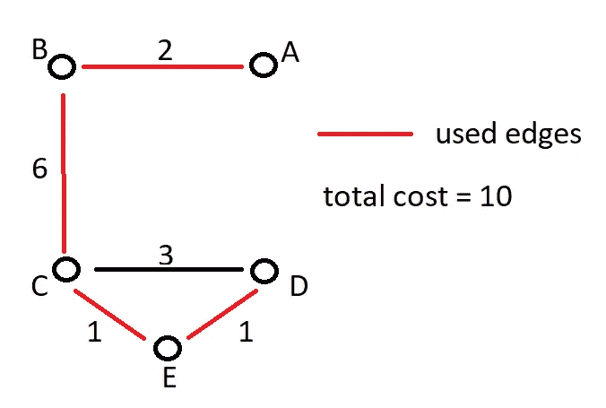

# 用 Python 实现图论及其它的整数规划:03 —最小生成树和旅行推销员

> 原文：<https://medium.com/analytics-vidhya/integer-programming-for-graph-theory-and-others-with-python-03-minimum-spanning-tree-and-42a5bd75b663?source=collection_archive---------29----------------------->


《塞尔达传说》中的大德库树，由洛克沃克绘制

大家好！我很高兴你看到了我系列的第三集！今天我们将解决图论中的两个一般性问题，并看看如何用整数编程来解决它们！

# 最小生成树


用于这个最小生成树问题的图

这里的目标是以尽可能低的成本直接或间接连接所有节点，而不需要**产生循环**。换句话说，最小化所用边的总成本。既然我们已经得出了这个结论，下面是变量声明和目标函数的代码:

看一个有 5 个节点的无向图，我们很容易看出，我们只需要 4 条边就可以把它们全部连接起来，对吗？如果我们有 2 个节点，我们只需要 1 条边来连接它们。如果我们添加另一个节点，我们需要向其中一个连接的节点和新节点添加另一条边。所以，规则是:

```
For a graph with N nodes, you need N-1 edges to build its Minimum Spanning Tree
```

以下是约束的代码:

现在，我们只需要确保每个节点至少有一条边与之相连:

因此，边的数量是固定的，所有节点必须至少有一条边与之相连。这就是给我们最优解所需要的，对吗？

***！！！不对！！！***

上面的模型可能在某些场景下有效，但不是所有的场景。为什么？因为它不能保证**没有周期**。


**如何预防周期？**

好吧，这听起来有点昂贵，但实际上是这样做的:如果有一个圈，这意味着有一个 N 个节点的子图，它有 N 条边。所以我们需要保证，对于任意一个 N 节点的子图，边的和小于或等于 N-1。这将会有很多代码，但只是重复的:

这就是我们，完整的模型编码。如果我们运行它，我们最终得到我们的最小生成树:



最小生成树问题的最终解决方案

## 可扩展性问题

有 13 个子图没有被使用，因为原始图没有那么多的边，但是如果我们处理一个完整的图(所有节点都直接相互连接)，将会有 13 个额外的约束。如果它是一个有 6 条边的完整图形，那么将有 41 个约束…

…如果该图有 7 条边，它将有 98 个约束…

如你所见，它呈指数增长，所以当图又大又密时，它会成为一个很难解决的问题。不管怎样，这是:D 的模型

# 旅行推销员


推销员连环漫画，由丹卡通

这是另一个著名的，也可以说是更著名的，难以解决的问题！它包括找到从一个点到它自己的最短路径，同时访问每个点**仅一次**，就像一个推销员访问每个目的地推销他的产品，最后回到他的房子。


用于旅行推销员问题示例的图形

由于我们在寻找最短路径，这是一个最小化问题，我们要最小化所用边的总和乘以它们各自的权重。

这些限制如下:

**1 —边的数量必须等于节点的数量；**

这个很明显:想想画多边形:如果它有 4 个角，你需要 4 条线，如果它有 5 个角，你需要 5 条线…画多边形就像在一个图上画一个旅行推销员的路径，有相同数量的节点/角。

**2 —任何子图中都不能有圈；**

类似于最小生成树问题的模型，N 个节点的所有子图的边数必须小于 N。

如果我们运行求解器，我们得到的解是 Start-C-B-D-Start，成本为 9。这就是我们如何从所有的行走中拯救我们的推销员的腿！


旅行推销员问题的解决方案


对旅行推销员来说，每天都是出差日

## 下一集:无目标函数的整数规划数组排序

下次见！:D