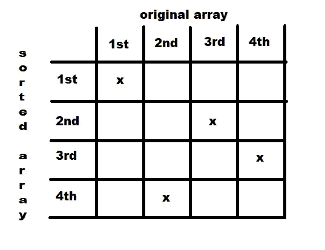

# 用 Python 进行图论和其他方面的整数编程:04 —数组排序和无目标函数

> 原文：<https://medium.com/analytics-vidhya/integer-programming-for-graph-theory-and-others-with-python-04-array-sorting-and-no-objective-b5f4fd30621a?source=collection_archive---------29----------------------->


《哈利·波特与魔法石》上的分院帽

在今天的节目中，我们将探讨数组排序。整数规划(与线性规划混合)可用于寻找问题的解决方案，例如 N 皇后游戏，以及其他组合问题。有些问题的关键在于，尽管我们习惯于利润最大化或成本最小化，但我们并不需要这样做。

## 没有目标函数


让我们看一个有 3 个整数变量的问题。3 个整数的任意组合都适合这些变量。当您添加约束时，不是所有的 3 整数集都有效。此时你有一套解决方案(可能多于 1 个，只有 1 个，甚至没有，使问题无法解决)。当你添加一个目标函数时，你基本上是从你以前拥有的解决方案集合中挑选出最佳解决方案。

但是如果你不需要最好的解决方案呢？没有“最好”和“最差”怎么办？如果你只是想要合身的衣服呢？

有些问题就是这样，包括数组排序。

## 数组排序

这是另一个问题，就像最短路径问题一样，可以通过 IP 或特定算法来解决。在这种情况下，使用 IP 来解决这个问题没有任何优势，因为(从我的脑海中)我想象不出任何轻微的调整来使 IP 变得有用。我们这样做只是为了锻炼我们的模型构造想象力:

为了简单起见，我们将对一个包含 4 个整数的数组进行升序排序。

```
array = [8,2,6,1]
```

我们现在需要的是决定哪个项目对应于排序数组中的哪个位置。为此，我们需要为每个排序后的数组项创建 4 个整数变量(因为我们排序的数组有 4 个项)。(抱歉代码重复，可以用 for-loops 简化)

现在，下一步是保证排序后的数组只有一个位置可以归属于原始数组的一个项，反之亦然。下一张图片展示了思考过程:每行只能有一个 X，每列也是如此:



这部分的代码如下:

为了总结公式，我们需要保证排序数组的第一项小于或等于第二项，第二项小于或等于第三项，第三项小于或等于第四项。为了实现这一点，我们必须将变量与原始数组中它们各自的值相乘，对每组 4 个变量求和，并声明它们小于或等于下一组。您可以在下一段代码中清楚地看到这一点:

恭喜你！下面是解决数组排序问题的 IP 模型。如果我们运行规划求解，我们可以检查以下变量的值是否为 1: 1_4，2_2，3_3，4_1。这种解决方案意味着原始数组的第 4 项将是排序后数组的第 1 个位置，原始数组的第 2 项将是排序后数组的第 2 个位置，依此类推。

如前所述，不需要目标函数，因为只要满足约束条件，任何解决方案都是好的。在这个特定的问题中，您可能有不止一个有效解决方案的唯一情况是，如果您在原始数组中有重复的项，那么选择相同项中的任何一个来承担排序数组中彼此的位置都是有效的。

## 下一集:最大流量问题

再次感谢您！