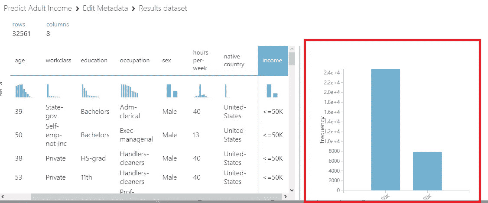
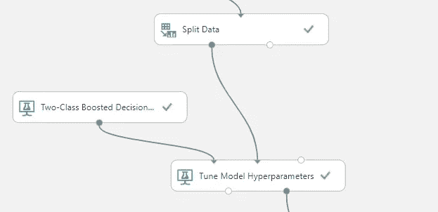

# 将 Azure ML Studio 与 PowerApps 和 Power Automate 集成:第 1 部分

> 原文：<https://medium.com/analytics-vidhya/integrate-azure-ml-studio-with-powerapps-and-power-automate-part-1-c201dbce2bc6?source=collection_archive---------8----------------------->

这是一个由两部分组成的系列，在第一部分中，我将带您了解使用 Azure Machine Learning Studio 创建预测模型的过程。然后在下一部分，我将使用 Power Automate 将机器学习 Web 服务与 PowerApps 集成。基本上，它是使用 Azure ML studio、PowerApps 和 Power Automate 的端到端机器学习模型部署。

## **Azure 机器学习工作室简介**

Microsoft Azure Machine Learning Studio(classic)是一款协作式拖放工具，可用于构建、测试和部署数据预测分析解决方案。azure Machine Learning Studio(classic)将模型发布为 web 服务，可以很容易地被自定义应用程序或 BI 工具(如 Excel)使用。Machine Learning Studio (classic)是数据科学、预测分析、云资源和您的数据交汇的地方。

现在没有任何延迟，让我们开始建模。

在更广泛的层面上，创建任何机器学习模型都有 5 个步骤:

1.  数据采集
2.  数据清理和预处理
3.  训练数据模型
4.  评分数据模型
5.  评估数据模型

## **设置环境**

1.  登录您的微软账户，前往 https://studio.azureml.net。
2.  如果你是新用户，然后注册使用免费的工作空间。
3.  创建一个新的实验，你就可以开始创建你的模型了。

> 我将以一个名为“**成人人口普查收入二元分类数据集**的样本数据集为例，来预测任何给定的成人年收入是高于还是低于 5 万美元。
> 
> 注意:Studio 中的每一个组件都被称为拖放操作的方法。在添加每个方法后，你需要将它与前一个方法连接并运行它。

## 数据采集

1.  从导航菜单中选择保存的数据集。
2.  从样本中拖放“**成人普查收入二元分类数据集**”。

3.右键单击数据集并选择 visualize 以检查数据集中的所有列和行。

**成人人口普查收入数据集负责人**

## 数据清理

1.  首先，我们需要检查丢失的值，如果有的话，用 0 替换它们。

2.添加方法**汇总数据**，用 dataseta 连接，运行后可视化。它将显示数据集的统计摘要。

3.如我们所见，有许多缺失值，因此选择方法**清除缺失数据**并将其可视化。

4.现在拖动数据集中的**选择列，只选择那些我们需要作为训练数据的特征。**

5.有许多分类列是字符串要素类型，它们需要转换为分类类型。选择**编辑元数据**方法，选择所有需要转换的列并运行。

6.现在，如果我们将我们的数据集可视化，并特别针对特征，即收入，就会出现一个主要的阶级失衡问题。

> 阶级不平衡问题基本上意味着我们的产出标签不平衡。这可能导致机器学习算法基于输出的最大数量偏向特定的类，就像在我们的情况下≤50k，这将在评估我们的模型时显示不准确。我们可以通过对多数类进行欠采样(下采样)来解决这个问题。我们将使用 [SMOTE](https://docs.microsoft.com/en-us/azure/machine-learning/studio-module-reference/smote) 模块来增加用于机器学习的数据集中代表性不足的案例的数量。SMOTE 是增加罕见病例数的更好方法，而不是简单地复制现有病例。

7.选择 SMOTE 方法并运行它来对目标数据进行欠采样。

## 训练数据模型

1.  在训练数据之前，有必要将数据分成训练集和测试集。我们使用**分割数据**模块，将其与 SMOTE 连接并运行。我们可以从属性中选择测试大小和随机种子。

**拆分数据方法**

2.现在，我们将使用名为**两类提升决策树的机器学习分类算法来训练我们的数据。**在属性中选择创建教练模式下的参数范围，这将启用所有需要调整的超参数。

3.从导航中选择**调整模型超参数**，连接其一个来自**二级提升决策树**的输入和另一个来自**分裂数据的输入。**

4.现在改变它的属性如下。

**调节模型超参数的属性**

## 评分数据模型

从导航中选择**评分模型**，连接 T **une 模型超参数**的一个输入和**分割数据**的测试集的另一个输入。

## 评估数据模型

现在选择**评估模型**并从**加入评分模型**并运行。

**成人普查收入预测模型**

## 让我们来看看我们的结果

我将在 **ROC 曲线**和**精度的基础上比较两个模型，一个有下采样，一个没有下采样目标。**这些是定义模型效率的分类指标。

> **准确性**是我们的模型预测正确的比例。它是正确预测数与预测总数的比率。在**平衡数据集**的情况下，准确性是完美的衡量标准，但在**类别不平衡数据集**的情况下，正负标签的数量存在显著差异，这本身并不能说明全部情况。
> **ROC 曲线** ( **接收器操作特性曲线**)是显示分类模型在所有分类阈值的性能的图表。

**模型 A:具有下采样的模型(蓝色曲线)**

**模型 B:没有下采样的模型(红色曲线)**

*   在阈值为 0.5 时，模型 A 的精确度高于模型 B。
*   模型 A 的 ROC 曲线比模型 b 更正。

***由此可以得出结论，模型 A，即具有下采样的模型，创建了更准确和高效的模型。***

## 结论

在这篇博客中，我们介绍了如何使用 Azure ML Studio 创建预测模型。在本系列的下一个部分中，我们将创建一个我们模型的 web 服务，并将其与 Power Apps 和 Power Automate 集成。

感谢阅读！！！

## 参考资料和进一步阅读:

*   [https://docs . Microsoft . com/en-us/azure/machine-learning/studio/](https://docs.microsoft.com/en-us/azure/machine-learning/studio/)
*   [https://developers . Google . com/machine-learning/crash-course/classification/accuracy](https://developers.google.com/machine-learning/crash-course/classification/accuracy)
*   [https://developers . Google . com/machine-learning/crash-course/classification/roc-and-AUC](https://developers.google.com/machine-learning/crash-course/classification/roc-and-auc)