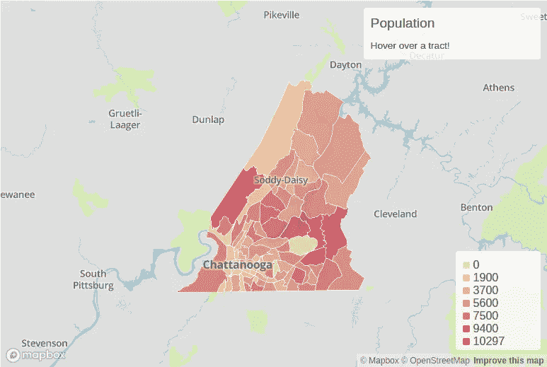

# 将人口普查数据整合到您的网站中

> 原文：<https://medium.com/analytics-vidhya/integrate-census-data-into-your-website-b6fd211f687a?source=collection_archive---------17----------------------->

## 使用命令行、Python、node.js 和 Mapbox 向您的网站添加专题地图。



查塔努加人口的交互式分布图

这是一篇关于如何使用 Mapbox 将人口普查局的数据整合到你的网站上的文章。专题地图对于传达数据的含义非常有用。本文档将探讨如何准备用于 Mapbox 的数据，制作切片集和样式，以及将地图添加到您的网站。

**简介**

有几种方法可以将人口普查数据整合到网页中。使用这些数据的两种最流行的方法是数据检索工具和将地图集成到您的网站中。数据检索工具的工作方式是，它们接受用户输入来构造一个 http 请求，类似于我在“[使用美国人口普查局的 API](/@shep.nathan.d/using-the-u-s-census-bureaus-api-af113337f478) ”中所写的请求。本文将重点介绍如何使用 Census API 将地图集成到您的网站中。在网站中包含专题地图是一次性传达大量数据背后含义的好方法。本文将介绍如何使用 Mapbox 将地图集成到您的网站中。

**准备数据**

当使用 Mapbox 制作专题地图时，您必须从制作 tileset 开始。为此，您必须向它提供一个 json 文件，其中包含您的数据和您要绘制地图的地点的地理信息。我使用了一个 UNIX shell 脚本来创建我的 json 文件。为此，我使用了马克·博斯托克的 D3。我强烈推荐他的关于使用 D3 的四部分系列，从“[命令行制图，第 1 部分](/@mbostock/command-line-cartography-part-1-897aa8f8ca2c)”开始。首先，我使用了我们使用美国人口普查局的 API 在[中构建的 http 请求，只是我只使用了第二个变量。我用 curl 下载了数据。](/@shep.nathan.d/using-the-u-s-census-bureaus-api-af113337f478)

```
curl ['https://api.census.gov/data/2016/acs/acs5?get=B01001_001E&for=tract:*&in=county:065&in=state:47'](https://api.census.gov/data/2016/acs/acs5?get=B00001_001E,B01001_001E&for=tract:*&in=county:065&in=state:47) -o src/2017-acs5.txt
```

当你从人口普查局的 API 中下载数据时，它在整件事和每条线周围都有方括号。为了清理它，我使用了 sed 和 awk 命令。

```
sed -e 's/\[\[//' src/2017-acs5.txt \
  | sed -e 's/\[//' \
  | sed -e 's/],//' \
  | sed -e 's/\]\]//' \
  | sed -e 's/,"47","065","/,"065/' \
  | sed '1d' \
  | awk -F, '{print $2, $1}' OFS=, \
  > src/2017-acs5.csv
```

第 5 行去掉了州 FIPS 代码，合并了县和区域代码。这是非常重要的一步，因为我们将在一点点上执行一个连接，这将是关键。下一行去掉了列标题，因为我们要转换成不使用它们的 ndjson。第 7 行交换了我们的两列，所以第一列包含我们的新 id 列，第二列包含我们的数据。

为了转换成 ndjson，我使用了一个名为 csv-to-ndjson 的 node.js 包。可以使用命令在本地安装它

```
npm install csv-to-ndjson
```

请注意，您不希望全局安装该软件包。然后，我制作了一个小脚本来转换我们的文件。

```
const csvToNdjson = require('csv-to-ndjson');csvToNdjson(
'./src/2017-acs5.csv', { // csv file you want to convert
 delimiter: ',',
 destination: './src/2017-acs5.ndjson', // output file
 header: ['id', 'population'] // column headers
}).then(succes => console.log('Success!')) // prints 'Success!' in the console if successful.
```

在这之后，我又用了几次 sed 将数据从字符串转换成整数。我剩下的大部分代码都是从“[命令行制图，第 1 部分](/@mbostock/command-line-cartography-part-1-897aa8f8ca2c)”中复制过来的，只做了微小的修改。这是我的完整剧本

```
#!/usr/bin/env bashrm -R tmp dest srcmkdir -p src/ tmp/ dest/curl '[https://www2.census.gov/geo/tiger/GENZ2017/shp/cb_2017_47_tract_500k.zip'](https://www2.census.gov/geo/tiger/GENZ2017/shp/cb_2017_47_tract_500k.zip') -o src/cb_2017_47_tract_500k.zip ## download the shapefile from Tiger
unzip -o src/cb_2017_47_tract_500k.zip -d src/ ## extract shapefilecurl '[https://api.census.gov/data/2016/acs/acs5?get=B01001_001E&for=tract:*&in=county:065&in=state:47'](https://api.census.gov/data/2016/acs/acs5?get=B01001_001E&for=tract:*&in=county:065&in=state:47') -o src/2017-acs5.txt ## download data from the Census Bureau
sed -e 's/\[\[//' src/2017-acs5.txt \
  | sed -e 's/\[//' \
  | sed -e 's/],//' \
  | sed -e 's/\]\]//' \
  | sed -e 's/,"47","065","/,"065/' \
  | sed '1d' \
  | awk -F, '{print $2, $1}' OFS=, \
  > src/2017-acs5.csv ## convert to csv by removing unwanted characters, remove state column, concatenate county and tract into one column, and swap the columnsnode map.js ## convert data to ndjson (output is 'src/2017-acs5.ndjson')## convert population to number
sed -e 's/population":"/population":/' -i src/2017-acs5.ndjson
sed -e 's/"}/}/' -i src/2017-acs5.ndjsonshp2json src/cb_2017_47_tract_500k.shp \
 | ndjson-split 'd.features' \
  | ndjson-map 'd.id = d.properties.GEOID.slice(2), d' \
  >tmp/tn-projection-id.ndjson ## extract geography as ndjson from shapefilegrep -Rrih '"COUNTYFP":"065"' \
  tmp/tn-projection-id.ndjson \
  >> tmp/hamilton-projection-id.ndjson ## filter out all counties outside of Hamilton Countyndjson-join --outer 'd.id' \
   tmp/hamilton-projection-id.ndjson \
   src/2017-acs5.ndjson \
   > tmp/hamilton-projection-join.ndjson ## join geography to data## convert to json
ndjson-reduce \
    < tmp/hamilton-projection-join.ndjson \
    > tmp/hamilton-projection-join.jsonecho '{"type":"FeatureCollection","features":' > dest/hamilton.json
cat tmp/hamilton-projection-join.json \
  | sed -e 's/"id":"065......"},{"id":/"properties": {"id":/g' \
  | sed -e 's/\[{"type"/{"type"/g' \
  | sed -e 's/}\],{"type"/}},{"type"/g' \
  | sed -e 's/"population":0}\]\]/"population":0}}\]/g' \
  >> dest/hamilton.json
echo '}' >> dest/hamilton.json
```

现在，数据可以作为 tileset 上传到 Mapbox。

**制作瓷砖和样式**

现在，如果您还没有这样做，您需要在 Mapbox 上创建一个帐户。别担心，每个计费周期的前 50，000 次地图下载是免费的。现在点击网页右上方的图标，然后点击“工作室”。现在点击 Tilesets。单击“新建 tileset”。选择您的 json 文件，然后单击“确认”。现在我们已经准备好打造我们的风格了。

点击“样式”，点击“新样式”，选择“基本”，点击“自定义基本”。我喜欢去掉除了几层以外的所有东西。你包括什么完全取决于你自己。现在点击加号按钮添加一层。点击“选择数据”。选择您刚刚制作的样式表。现在点击“风格”，然后进入“颜色”。选择“跨越数据范围的样式”，并选择您的变量。点击“变化率”，并选择线性。我以前对所有东西都用 step，这样可以更容易理解数据；然而，在撰写本文的过程中，我发现，使用 gap statics 方法，这个数据集的最佳集群大小是 1。所以我决定对这些数据使用线性！对于图例，我使用浏览器的颜色选择器在地图编辑器中抓取图例的每个刻度线和端点的颜色。

**将地图添加到您的网站**

这是棘手的部分。点击右上角的图标，进入“账户”。您可能需要在本页底部记下您的访问令牌。在页面右侧的“工具和资源”下，点击“集成地图框”。现在选择“web”。遵循 Mapbox 在“[制作 choropleth 地图，第 2 部分](https://docs.mapbox.com/help/tutorials/choropleth-studio-gl-pt-2/)”中的步骤。第一部分也有一些很好的关于设计地图的技巧。

我的地图 javascript 如下所示:

```
mapboxgl.accessToken = 'accessToken'; //your access tokenvar map = new mapboxgl.Map({
  container: 'map', //container id
  style: 'styleURL', //your style url
  center: [-85.21,35.225], //default center of map
  minZoom: 8,
  maxZoom: 22,
  zoom: 8.5,
  zoomControl: false
});var nav = new mapboxgl.NavigationControl();/////////////////////////////////////////legend
map.on('load', function() {
 var layers = ['0','1900','3700','5600','7500','9400','10297'];
 var colors = ['#fCE29C', '#f1b987', '#e59071', '#da675c', '#ce3f47', "#c31631", "#BD0026"]; //colors from the legend in Mapbox editormap.getCanvas().style.cursor = 'default';for (i = 0; i < layers.length; i++) {
    var layer = layers[i];
    var color = colors[i];
    var item = document.createElement('div');
    var key = document.createElement('span');
    key.className = 'legend-key';
    key.style.backgroundColor = color;

  var value = document.createElement('span');
  value.innerHTML = layer;
  item.appendChild(key);
  item.appendChild(value);
    legend.appendChild(item);
 }//information window
map.on('mousemove', function(e) {
   var tracts = map.queryRenderedFeatures(e.point, {
     layers: ['layerName'] //this is where the name of your custom layer goes
   });

   if (tracts.length > 0) {
     document.getElementById('pd').innerHTML =
      '<h3><strong> Tract: '
      + tracts[0].properties.id.substring(2,tracts[0].properties.id.length-1)
      + '</strong></h3><p><strong><em>' 
      + tracts[0].properties.variable //change "variable" to the name of your data
      + '</strong> people</em></p>'
      ;
   } else {
     document.getElementById('pd').innerHTML = '<p>Hover over a tract!</p>';
   }
 });
});
```

我添加了 Mapbox 修改后的 css 和 html，这里的[就是最终产品。我坚决不张贴我的 css 和 html，因为它们对我的网站来说太具体了。我差不多只是把 Mapbox 说我需要的东西添加到了我想要地图的页面上，只是根据需要调整了 css。](https://flamboyant-galileo-f88ad5.netlify.app/jekyll/update/2020/04/29/population-density.html)

如果你喜欢这篇文章，请为它鼓掌。如果您有任何问题或建议，请随时发表评论。