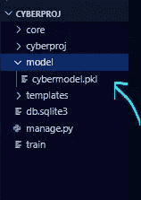
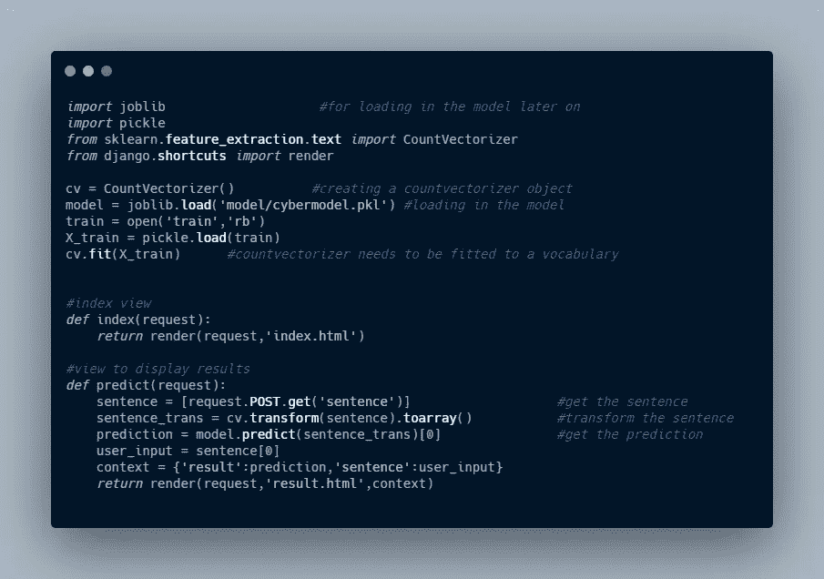
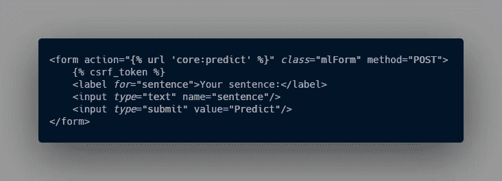
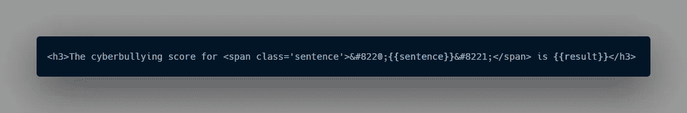
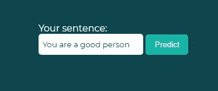
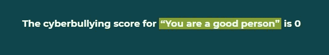
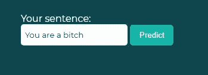

# 用 Django 集成机器学习模型

> 原文：<https://medium.com/analytics-vidhya/integrating-a-machine-learning-model-with-django-79dd47eabef1?source=collection_archive---------10----------------------->


首先，我们想使用 [joblib](https://joblib.readthedocs.io/en/latest/generated/joblib.dump.html) 将我们的模型编译成一个漂亮的小。pkl 文件。我已经训练了一个关于网络欺凌数据的分类器，所以这就是我将在这个项目中使用的。

```
clf = DecisionTreeClassifier()
        ......
import joblib
joblib.dump(clf,'cybermodel.pkl')
```

现在我们有了。pkl 文件，我们可以为 django 项目建立一个虚拟环境。

```
#creates a virtual environment named mlproj
virtualenv --python=python3 mlproj#activates the virtual environment
\path\to\mlproj\Scripts\activate 
```

# **建立你的 Django 项目**

在 CLI 中键入以下命令来设置 django 项目

```
#install django and other packages
> pip install django scikit-learn
> django-admin startproject cyberproj
> cd cyberproj
> python manage.py startapp core    #create an app
```

现在，将您的应用程序添加到 settings.py 文件中的 INSTALLED_APPS，并设置您的模板目录

```
# Application definitionINSTALLED_APPS = [
.....,
'core'                            #your app
]...
#set up your template directory
```

# 包括你的。项目中的 pkl 文件

在这里，我创建了一个模型文件夹并保存了我的。pkl 文件在里面



model/cybermodel.pkl

# 资源定位符

此外，为您的应用程序创建一个`urls.py`文件，然后打开`cyberproj.urls`文件并包含应用程序的 URL。

```
from django.urls import path,includeurlpatterns = [
    path('admin/', admin.site.urls),
    path('',include('core.urls')),     #include your app urls
]
```

# 视图

现在，让我们创建用于预测和显示结果的视图。

*注意:我将加载我的训练数据作为 CountVectorizer 的词汇表。您的项目的要求可能会有所不同。*



mlproj/views.py

让我们将视图添加到核心应用程序的 urls.py 文件中

```
from django.urls import path
from .views import index,predictapp_name = 'core'urlpatterns = [
    path('',index,*name*='index'),
    path('predict/',predict,*name*='predict'),
]
```

所以基本上有两个视图，一个索引视图(用于主页)和一个显示预测结果的视图。在索引视图模板(index.html)中，我包含了一个发送到预测视图的表单。

表单接收文本输入，并将其发送到预测视图。然后，文本输入被转换为稀疏矩阵，该模型预测该输入是否可以被定义为网络欺凌(1 或 0)。然后，预测和文本输入被传递到预测视图的上下文中。



index.html 模板中的表单



在 result.html 模板中显示结果

运行`python manage.py migrate`和`python manage.py makemigrations`进行必要的迁移。

跑`python manage.py runserver`



***管用！***

点击查看代码