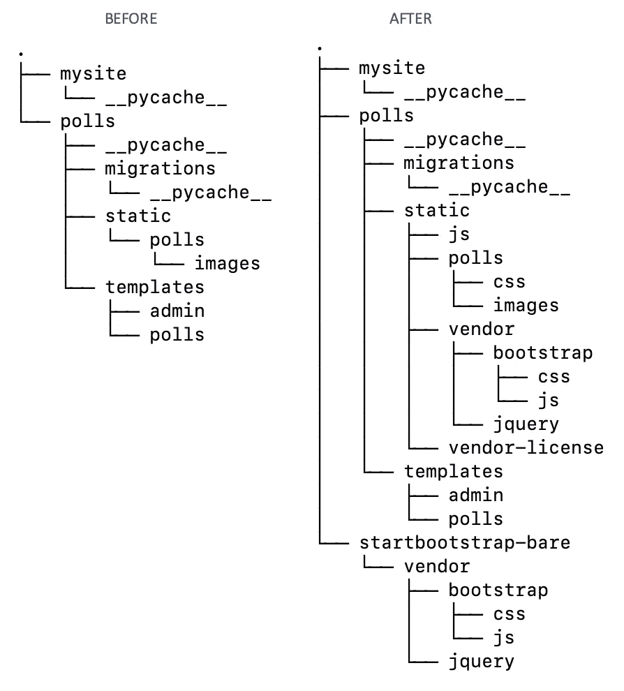
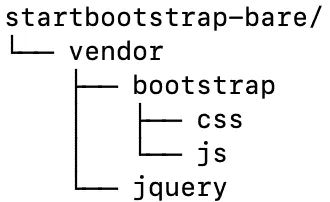
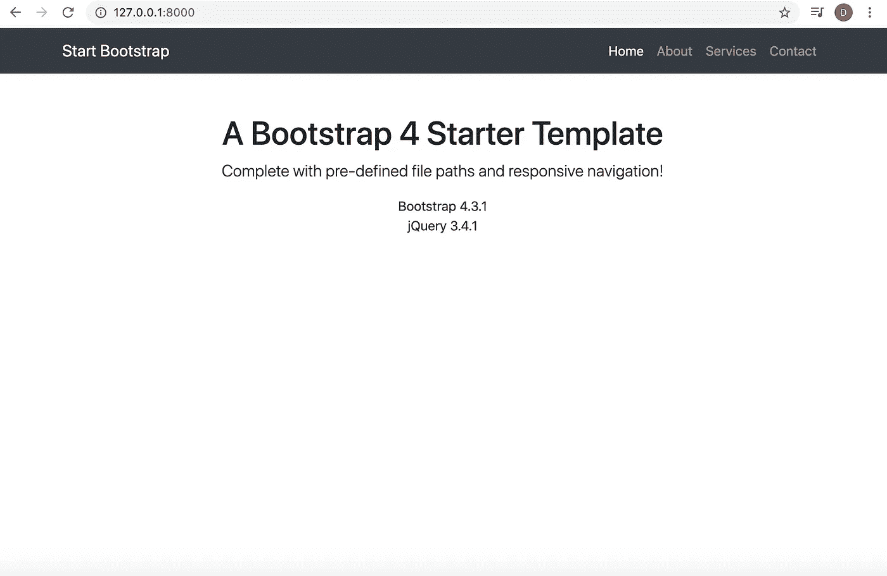
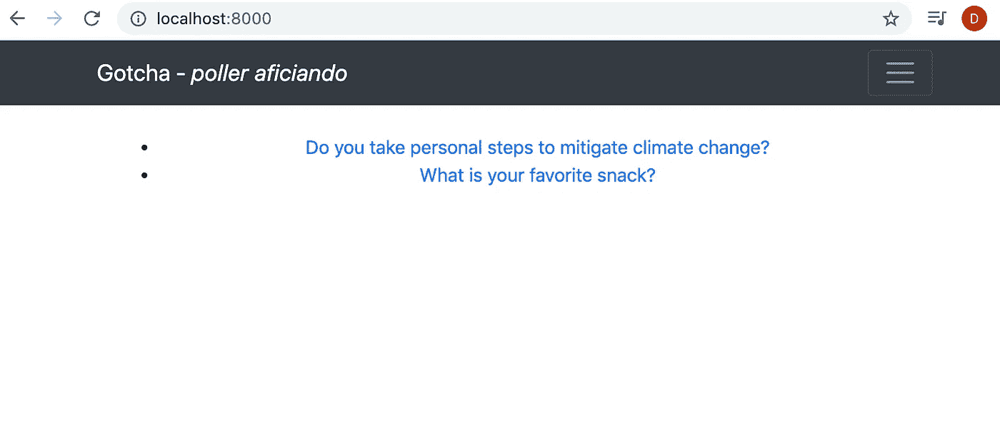

# 将引导程序集成到 Django

> 原文：<https://medium.com/analytics-vidhya/integrating-bootstrap-to-django-2d84344058ff?source=collection_archive---------0----------------------->


照片由[zdenk macha ek](https://unsplash.com/@zmachacek?utm_source=unsplash&utm_medium=referral&utm_content=creditCopyText)在 [Unsplash](https://unsplash.com/t/animals?utm_source=unsplash&utm_medium=referral&utm_content=creditCopyText) 上拍摄

现在您已经准备好 Django web 应用程序，或者安装了 [PostgreSQL 数据库](/@dichharai/install-postgresql-database-to-django-application-62aeb654bd9f)或者部署到 [Heroku](/@dichharai/deploying-django-application-to-heroku-ea4b7ca64d01) 或[自定义域](/@dichharai/changing-herokuapp-com-app-to-custom-domain-ssl-part-iii-95d6c1886773)或者只是一个普通的本地 Django 应用程序，您希望拥有您所看到的引导主题的前端外观。当然，Bootstrap framework 自带响应性的优点，并且为您完成了大量繁重的前端工作。我有点好奇/害怕一个独立的模板是如何被整合到 Django 的项目布局中的。因此，本教程就是为了这个目的，而且…很简单！

这个 [github](https://github.com/dichharai/django_bootstrap) 仓库有完整的教程。这是集成 bootstrap 前后 **only** 目录的项目布局:



集成引导主题 Django 前后的目录布局

正如你所看到的，我们已经在 Django 框架的`static`目录中添加了一堆目录。

对于这篇文章，我使用 s [tartbootstrap-bare](https://startbootstrap.com/templates/bare/) 主题。克隆了主题的 [github 库](https://github.com/BlackrockDigital/startbootstrap-bare)。这是 **only** 目录的主题布局:



引导主题目录布局

如你所见，我将`vendor`及其子目录复制到 Django 的`static`目录中。我在我的 Django 项目的根层克隆了这个主题。所以在将`vendor`目录复制到 Django 的`static`文件夹之前，`href`通过给出一个相对路径来编辑`vendor`目录中的文件。唉，没用。嗯，这是一个非常简单的尝试。😄

在重新阅读 Django 的[管理静态文件文档](https://docs.djangoproject.com/en/3.0/howto/static-files/)后，将`vendor`目录复制到`static`文件夹，并将主题附录的剩余部分如`README`、`License`复制到`static`文件夹下的`vendor-license`目录。负责在 Django 中保存引导文件夹的地方。

现在开始处理模板。将引导程序的`index.html`文件复制到`templates`目录下的`polls`目录。现在这里我需要`href`来引导主题的`css`和`js`文件。根据 Django，加载`static`模板标签和`href`静态文件。这是供应商文件在`index.html`文件中外观的概述。

```
{% load static %
<!DOCTYPE html>
<html lang="en">
<head>
    ...
    *<!-- Bootstrap core CSS -->* <link href="" rel="stylesheet">
</head>
<body>
    ...
    *<!-- Bootstrap core JavaScript -->* <script src=""></script>
    <script src=""></script>
</body>
</html>
```

下面是应用程序本地运行的屏幕截图:



之后，对`index.html`文件的其余部分进行重构，将其扩展到`base.html`文件，并将`polls`问题放在那里。这是主题初始定制后的样子。



我想知道其他前端框架如`React`或`Vue`是如何集成到 Django 的。过程一定非常相似。

无论如何，祝贺你将 Bootstrap 主题集成到你的 Django 应用程序中！希望这有助于你的发展！

一如既往，如果你喜欢它，请不要忘记👏或者🔗或者两者都有！

谢谢你。