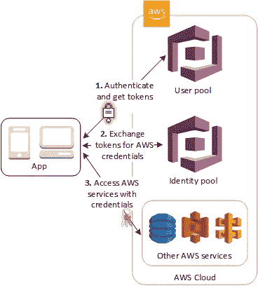

# 将 Cognito 与 Flask 集成

> 原文：<https://medium.com/analytics-vidhya/integrating-cognito-with-flask-e00010866054?source=collection_archive---------0----------------------->


简介非常简单——“我们有一个小 Flask 应用程序，需要一个受保护的区域，我们不想开发自己的应用程序，所以我们认为 Cognito 可以很好地工作”。这是一个聪明的想法，既然 AWS 的研究人员已经为你做了思考，为什么还要去构建自己的认证服务呢？

但事实证明，将 Cognito 集成到 Flask 应用程序中是一件非常容易的事情，一旦你知道如何做，就会感到沮丧，直到所有这些都合在一起。当然，在我开始看这个之前，我几乎不会拼写 JWT，这一事实对我没有帮助，而且我对亚马逊呜呜呜鸟的生命周期的了解比我对 Javascript 之类的前端东西的了解还要多！

**什么是烧瓶？**

Flask 是一个用 Python 构建 web 应用程序的微型框架。和 Django 一样，它也是最流行的 web 框架之一，我个人认为它很酷，因为它很容易上手。几分钟之内，你就可以有一个基本的网站了，而且，对我来说，Flask 最大的好处之一就是在 AWS Lambda 上运行非常容易。你永远不会有太多的无服务器的好处(无服务器很酷，做无服务器的人很酷)。

**亚马逊认知是什么？**

我会引用 AWS 的聪明人的话；

*Amazon Cognito 为你的网络和移动应用提供认证、授权和用户管理。你的用户可以用用户名和密码直接登录，或者通过第三方，如脸书、亚马逊、谷歌或苹果。*



Cognito 甚至提供了一个托管的 ui，可以处理用户创建、用户验证、密码重置和所有其他您期望的功能。这是一个非常好的系统，随着前五万名用户永久被覆盖在免费层之下，这是一种非常经济有效的方式来开始向您的应用程序添加身份验证。

**样本应用**

如果你想在家继续学习，那么你需要设置示例应用程序的所有代码都可以在；

[](https://github.com/CloudySnake/flask-cognito-integration) [## CloudySnake/flask-认知-集成

### 通过在 GitHub 上创建一个帐户，为 CloudySnake/flask-cognito-integration 开发做出贡献。

github.com](https://github.com/CloudySnake/flask-cognito-integration) 

这个 repo 包括 Terraform 代码来支撑基础设施(包括 Cognito)和无服务器框架，以在 Lambda 上部署 web 应用程序。

基本的身份验证流程是这样的。

*   用户在您的网站上选择“登录”或直接进入登录 url。
*   用户被重定向到 Cognito 托管的 ui——您可以为此使用一个自定义域，这样对用户来说就像从未离开过该站点一样。注意，我链接的示例代码只使用了应用程序的原始 API 网关 URL，所以很明显，你正在从网站转移到 AWS 托管工具包。
*   成功登录后，用户将被重定向回您网站上的特定登录点。这是在 Cognito 设置中配置的。
*   重定向 URL 现在包含一个授权码，您的应用程序可以将该授权码转换为 JWT 访问令牌。
*   JWT 存储为一个 HTTPonly cookie(有效期为 30 分钟),当我们试图访问一个受保护的页面时，它被传递给 web 服务器并被验证。
*   如果用户未通过身份验证并试图访问受保护的页面，他们将被定向到登录屏幕。

这个流程使用了两个主要的库；

*   烧瓶-AWS cogni:[https://flask-awscognito.readthedocs.io/en/latest/](https://flask-awscognito.readthedocs.io/en/latest/)
*   烧瓶-JWT-扩展:【https://flask-jwt-extended.readthedocs.io/en/stable/】T2

**处理重定向 URL**

我们的示例应用程序在成功登录后会返回到端点/登录。

```
**@app.route**("/loggedin", methods=["GET"])
**def logged_in**():
    access_token = aws_auth.get_access_token(request.args)
    resp = make_response(redirect(url_for("protected")))
    set_access_cookies(resp, access_token, max_age=**30** * **60**)
    **return** resp
```

aws_auth.get_access_token 是 Flask-AWSCognito 获取授权码并将其交换为访问令牌。然后，我将再次重定向到“受保护的”端点(在我的授权墙后面)，并将访问令牌存储为 httpOnly cookie。cookie 的有效期为 30 分钟，之后用户需要再次登录。

**保护页面**

```
**@app.route**("/secret")
**def protected**():
    verify_jwt_in_request_optional()
    **if** get_jwt_identity():
        **return** render_template("secret.html")
    **else**:
        **return** redirect(aws_auth.get_sign_in_url())
```

JWT 提供了标准的 decorators 来检查访问 cookie，但是我想确保如果用户没有通过认证，他们会被重定向到登录屏幕。对于标准装饰器，它们只返回一些错误 JSON，所以我使用了一些 JWT 函数来创建我需要的流。我确信有一种方法可以让装饰者做到这一点，我只是需要多考虑一下。

在基本水平上，这就是你所需要做的。您可以使用相同的方法轻松添加更多受保护的页面，从而构建一个保护非常好的 web 应用程序。我确信还有可以改进的地方，我已经列出了一些我下一步的想法，但是我也很想在评论中听到你的反馈。

**需要改进的地方**

*   额外的 CSRF 保护——JWT 提供了开箱即用的保护，但我还不能让它与 Cognito 一起工作。
*   用户会在登录状态下发送超过 30 分钟的消息吗？我是否需要一种方法来允许这一点，而不是强制登录？
*   注销按钮来清除访问 cookie。
*   使用更多的内置 JWT 函数来处理我的“未认证重定向”方法。
*   添加测试。是的，我构建了一些东西，但没有添加任何单元测试。请不要太苛刻地评价我。