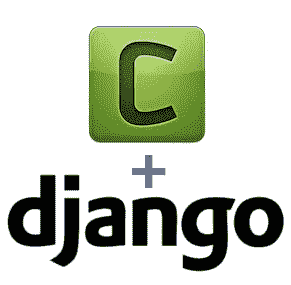
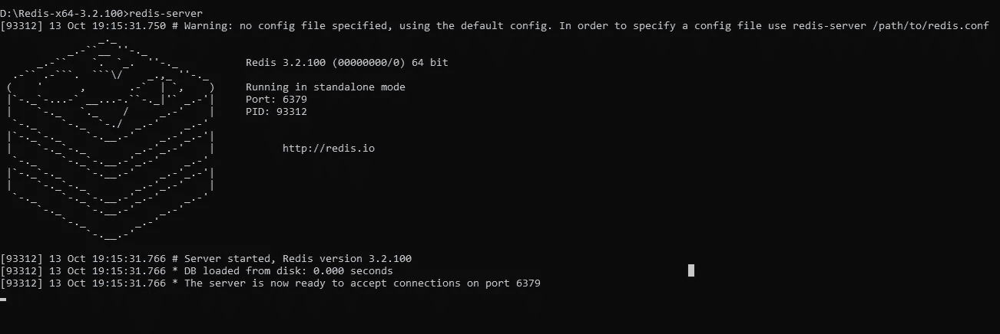
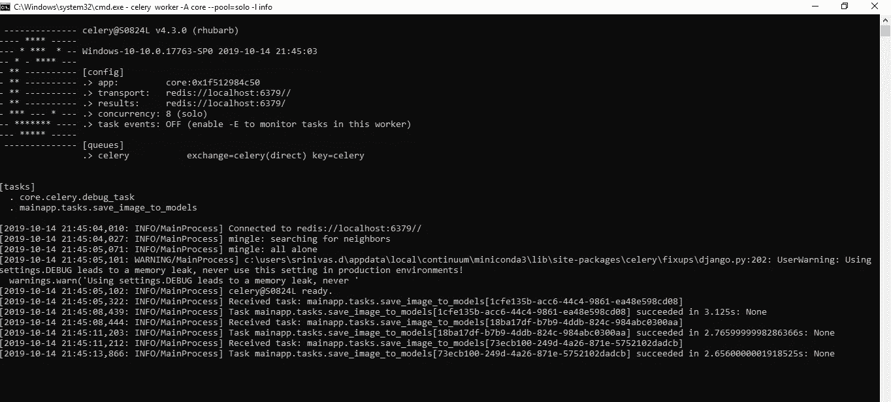

# 整合 Django 信号和芹菜

> 原文：<https://medium.com/analytics-vidhya/integrating-django-signals-and-celery-cb2876ebd494?source=collection_archive---------0----------------------->



姜戈+芹菜(鸣谢:谷歌图片)

这是我在 Medium 上的第一篇文章，希望对你正在进行的项目有所帮助。

这篇文章给出了一个用 celery 进行多处理和异步执行，并通过结合 django 信号触发异步任务的很好的例子。

# **要求:**

1.  姜戈
2.  计算机编程语言
3.  芹菜

# **入门:**

让我们举一个使用芹菜和 Django 信号的基本例子。假设如果我想触发一个任务，比较保存在具有两个图像字段的模型中的两个图像，那么我们可以使用 django 信号和 celery 的组合来完成这个任务。所以，让我们把这个任务分成两部分:

1.  把芹菜放在姜戈项目上。
2.  定义触发所需任务的 django 信号。

# **设置芹菜:**

Celery 网站将其描述为“一个简单、灵活、可靠的分布式系统，用于处理大量消息，同时为运营提供维护这样一个系统所需的工具”。

为了使定义更简单，根据我们对本文的理解，celery 是一个漂亮的 python 包，用于**异步处理**。异步处理有助于我们减少用户等待时间并提高响应速度。

这是芹菜的基本介绍，足以让我们继续学习。如需了解关于芹菜的更多信息，请点击此[链接](http://docs.celeryproject.org/en/latest/getting-started/introduction.html)。

好了，现在让我们进入实现部分吧！！！

使用以下命令创建一个 django 项目并安装 celery 包:

```
pip install celery == 4.3.0 
pip install django-celery   #For celery integration for django
```

Celery 使用 [**代理**](http://docs.celeryproject.org/en/latest/getting-started/brokers/index.html) 在客户机和工人之间传输消息，因为 celery 通过消息进行通信。最常用的经纪人有:

1.  [](http://docs.celeryproject.org/en/latest/getting-started/brokers/rabbitmq.html)
2.  *[**Redis**](http://docs.celeryproject.org/en/latest/getting-started/brokers/redis.html)*

*在这篇文章中，我同意 Redis broker 的观点。使用以下命令安装 Redis:*

```
*pip install redis == 3.3.8*
```

*并且在这里下载 windows [的 redis zip 文件(Redis 3.2.0.zip)并解压。使用以下命令运行 redis 服务器:](https://dingyuliang.me/redis-3-2-install-redis-windows/)*

```
*cd <directory path of redis folder>
redis-server*
```

**

*运行 redis 服务器*

***注意:**仅安装高于 3.2.0 的版本。*

*好了，现在我们完成了芹菜的摆放。让我们继续配置 django 项目中的芹菜。*

## ***配置芹菜至 Django 项目:***

*创建一个 django 项目，并打开在应用程序中创建的 __init.py__ 文件。对我来说，它是**【核心】**(应用名称)*

```
*signals_celery example
|core
  |---> __init__.py
  |---> settings.py
  |---> urls.py
  |---> wsgi.py*
```

*在 **core/__init.py__** 中，复制这段代码:*

```
***from** __future__ **import** absolute_import

# This will make sure the app is always imported when
# Django starts so that shared_task will use this app.
**from** .celery **import** app **as** celery_app

__all__ = ('celery_app',)*
```

*在您的应用程序文件夹中创建一个名为 **core/celery.py** 的文件(在我的例子中是 **core** 文件夹),并添加以下几行:*

```
***from** __future__ **import** absolute_import
**import** os
**from** celery **import** Celery
**from** django.conf **import** settings

# set the default Django settings module for the 'celery' program.

os.environ.setdefault('DJANGO_SETTINGS_MODULE', 'core.settings')
app = Celery('core', broker='redis://localhost')

# Using a string here means the worker will not have to
# pickle the object when using Windows.

app.config_from_object('django.conf:settings', namespace='CELERY')
app.autodiscover_tasks(**lambda**: settings.INSTALLED_APPS)

@app.task(bind=True)
**def debug_task**(self):
    **print**('Request: {0!r}'.format(self.request))*
```

*而在 **core/settings.py** 中，*

```
*# CELERY related settings
BROKER_URL = 'redis://localhost:6379'
CELERY_RESULT_BACKEND = 'redis://localhost:6379'
CELERY_ACCEPT_CONTENT = ['application/json']
CELERY_TASK_SERIALIZER = 'json'
CELERY_RESULT_SERIALIZER = 'json'
CELERY_TIMEZONE = 'Asia/Kolkata'*
```

*就是这样！！！配置完成。不，我们可以用芹菜来运行 django 项目中的任务。*

# ***使用 Django 信号:***

*在我们进入 Djnago signals 之前，让我们在 django 项目中创建另一个应用程序(在我的例子中是**‘main app’**)。*

```
*signals_celery example
|-- core
|   |---> __init__.py
|   |---> settings.py
|   |---> urls.py
|   |---> wsgi.py
|-- mainapp
    |---> migrations
    |---> __init__.py
    |---> models.py
    |---> admin.py
    |---> apps.py
    |---> views.py
    |---> tests.py
    |---> urls.py*
```

*让我们在 **models.py** 中创建一个示例模型:*

```
***class InputImages**(models.Model):
    comparison_set_name = models.CharField(max_length=100)
    input_image = models.ImageField(
        upload_to='/path/InputImages',
        max_length=254,
        blank=**True**,
        null=**True**)
    standard_image = models.ImageField(
        upload_to='/path/StandardImages',
        max_length=254,
        blank=**True**,
        null=**True**)

    **def** __str__(self):
        **return** self.comparison_set_name**class OutputImage**(models.Model):
    input_key = models.ForeignKey(InputImages, on_delete=models.CASCADE)
    output_image = models.ImageField(
        upload_to='/path/OutputImages',
        max_length=254,
        blank=**True**,
        null=**True**)

    **def** __str__(self):
        **return** self.input_key.comparison_set_name*
```

*因此， **InputImages** 模型有两个 imagefields，它们接受两个输入图像，并使用某种 openCV 算法进行比较，然后存储在 **OutputImage** 模型中。*

*那么，信号和芹菜在这里是怎么回事呢？？？*

*现在，只要保存了 InputImages 的模型实例，就会触发一个信号( **post_save 信号**)来调用 celery 任务，该任务运行 openCV 算法来比较两个输入图像并将其保存到 OutputImage 模型。*

*好了，现在让我们继续信号部分…*

*Django 包括一个“信号调度器”,当框架中的其他地方发生动作时，它可以帮助解耦的应用程序得到通知。*

*一些常见的内置信号包括: **pre_save，post_save，pre_delete，post_delete，pre_init，post_int** 等。*

*要阅读更多关于 Django 信号的信息，请点击[这里](https://docs.djangoproject.com/en/2.2/topics/signals/)。*

*在这篇文章中，我们使用 **post_save 信号**来完成我们的工作。*

*要在 django 项目中使用信号，我们可以通过两种方式来实现。现在，我在我们的应用程序配置文件中注册信号。*

*现在让我们设置信号部分…*

*让我们将这段代码添加到 **mainapp/apps.py** 中:*

```
***from** django.apps **import** AppConfig

**class MainappConfig**(AppConfig):
    name = 'mainapp'  **## write your app name here**

    **def ready**(self):
        **import** mainapp.signals*
```

*以及到 **mainapp/__init__。py** ，*

```
***## write according to your app name here** default_app_config = 'mainapp.apps.MainappConfig'*
```

***注**:main app/_ _ init _ _**。如果您已经在`INSTALLED_APPS`设置中引用 AppConfig，则不需要 py** 位。*

*稍后，在我们创建的应用程序中创建一个名为**‘signals . py’**的文件(在我的例子中，它是 **mainapp** )并复制以下代码:*

```
***from** django.db.models.signals **import** post_save
**from** django.dispatch **import** receiver
**from mainapp**.models **import** *
**from** mainapp.tasks **import** save_image_to_models

@receiver(post_save, sender=InputImages)
**def save_image_to_model**(sender, **kwargs):
    save_image_to_models.delay()*
```

*另外，创建一个文件**‘main app/tasks . py’**，通过触发信号可以用 celery 执行该文件。*

```
***from** celery **import** shared_task
**import** glob
**import** os
**import** io
**from mainpp**.models **import** *

@shared_task
**def save_image_to_models**():

    results = InputImages.objects.all()
    **for** result **in** results:
        inp_image = result.input_image
        std_image = result.standard_image

        """
        Call your image_compare function here by passing the two images of the InputImages model

        Something like this: output_image = image_compare(std_image, inp_image)

        """
        output = OutputImage.objects.create(output_image="""returned output_image by image_compare function""",input_key=result)*
```

*好吧！！！让我解释一下在 **save_image_to_models** 函数中发生了什么。*

***image_compare** 函数获取输入图像(image_a & image_b)，应用一些图像比较算法并返回比较后的差异图像，该差异图像最终可以保存到我们 **OutputImage 的** **output_image** 字段中。*

***save_image_to_models** 函数是我们项目中的主要任务。它上面的装饰器' **@shared_task** '会将函数注册为芹菜任务，并将其添加到队列中，如下所示:*

```
*save_image_to_models.delay()*
```

*因此，django 信号的设置已经完成，我们的芹菜任务也已定义。现在让我们运行项目。*

# ***跑吧！！！***

*现在一切都准备好起飞了。在终端中使用以下命令启动 django 项目:*

```
*# migrations commands
python manage.py makemigrations
python manage.py migrate# runserver command
python manage.py runserver*
```

*打开另一个终端并运行 redis 服务器:*

```
*cd <directory path of redis folder>
redis-server*
```

*最后，使用以下命令在另一个终端中运行 celery:*

```
*celery worker -A <your default app name (core in my case)> --pool=solo -l info*
```

**

*芹菜成功运转*

*干杯！！！该项目正在成功运行。我们现在需要做的只是在 InputImages 模型中上传两张图像，并**保存**它们以**触发****post _ save 信号**到**调用芹菜任务。**任务将被添加到队列中，并且**保存 _ 图像 _ 到 _ 模型**功能将被执行。*

*最后，输出图像存储在**输出图像**模型中。*

# ***工艺流程:***

*所以，我们现在到了本文的最后一部分。先来了解一下这个项目的工艺流程。*

*当图像与输入图像模型中的图像字段一起上传并保存时，save 方法被调用，并最终触发 **post_save** 信号。“@receiver”装饰器接收来自发送方的信号，即 **InputImages** 模型，并执行该行*

```
*save_image_to_models.delay()*
```

*它调用芹菜任务' **save_image_to_models** '函数并添加到队列中，异步执行开始。*

*我希望这篇文章能帮助你在 django 项目中使用 django 信号触发芹菜异步任务。正如我提到的，这是我的第一篇关于 Medium 的文章，我欢迎对我的文章提出任何建议和修改，并非常乐意知道任何改进和建议，以提高我在 Medium 上写更多文章的技能。*

*期待在这次学习之旅中写更多的帖子，传播知识。特别感谢我的导师[vibash Chandra](https://medium.com/u/49832c901195?source=post_page-----cb2876ebd494--------------------------------)建议我写文章，分享知识。*

*感谢阅读…玩得开心，传播知识！！！*

***奖金！！！**你可以从[这个](https://github.com/srinivas175/celery_signal_example) github repo 中克隆完整的代码。*

# ***参考文献:***

1.  *[https://docs.djangoproject.com/en/2.2/topics/signals/](https://docs.djangoproject.com/en/2.2/topics/signals/)*
2.  *[https://simpleisbetterthancomplex . com/tutorial/2016/07/28/how-to-create-django-signals . html](https://simpleisbetterthancomplex.com/tutorial/2016/07/28/how-to-create-django-signals.html)*
3.  *[http://docs . celery project . org/en/master/django/first-steps-with-django . html](http://docs.celeryproject.org/en/master/django/first-steps-with-django.html)*
4.  *[http://docs . celery project . org/en/latest/getting-started/index . html](http://docs.celeryproject.org/en/latest/getting-started/index.html)*