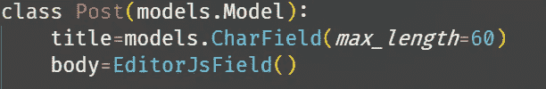
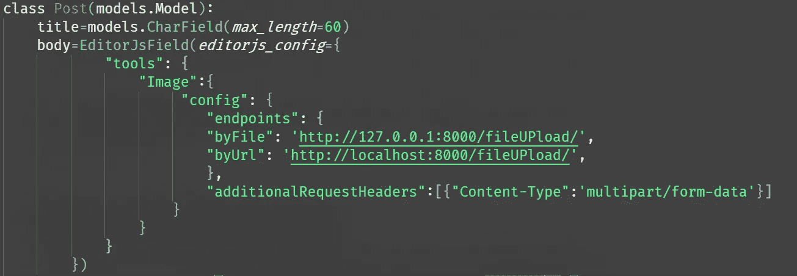
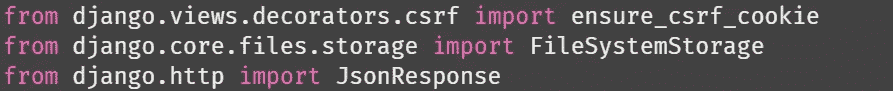
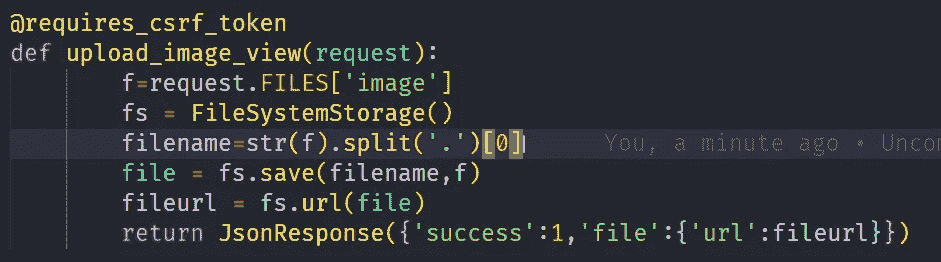
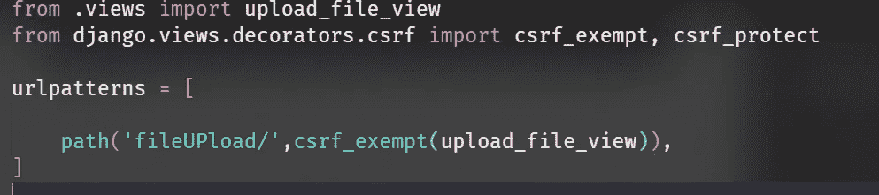
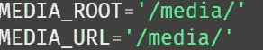
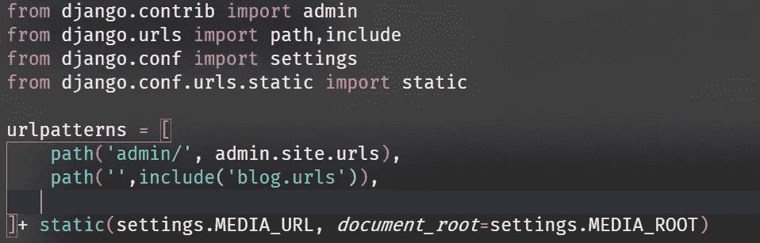
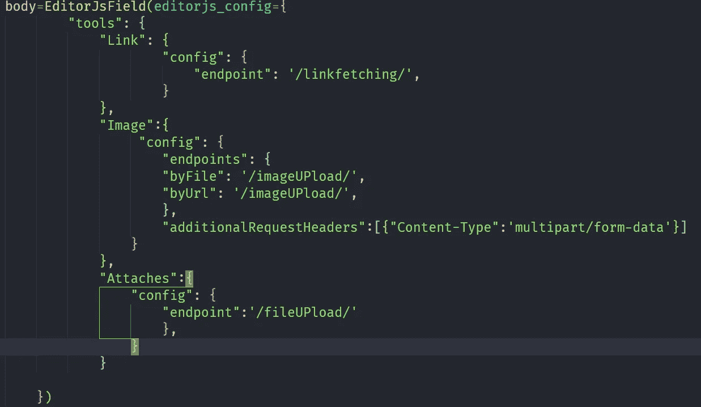
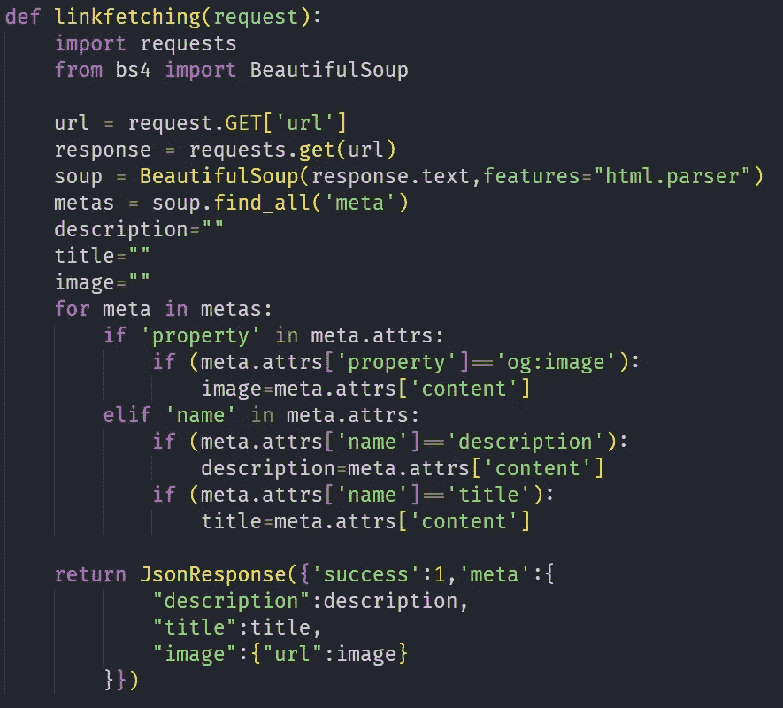

# 集成 EditorJS 和 Django

> 原文：<https://medium.com/analytics-vidhya/integrating-editorjs-with-django-7a30127d0771?source=collection_archive---------3----------------------->

编者可能会给你博客中的作者或多或少与媒体中的作者相同的感觉。想把 Django 和 editorJS 整合到一个博客或类似的东西上吗？这篇文章可能对你有帮助。


DJango 与 EditorJS

> **假设:**
> 
> 你已经有一个 Ajango 项目和一个应用程序，你将使用[编辑器](https://editorjs.io/)

# 步骤 1:安装 django editorjs

```
pip install django-editorjs
```

现在将*[***django _ editor js***](https://pypi.org/project/django-editorjs/)添加到 settings.py 中的 INSTALLED_APPS 中(*注意这里的下划线)**

# *步骤 2:创建模型*

*现在，在我们创建模型之前，让我通知你，要上传图片，你需要设置你自己的文件上传解决方案(**我也已经提到过了！**)*

*因此，在这里我将创建一个 Post 模型，首先导入 EditorJsField*

*`*from django_editorjs import EditorJsField*`*

*然后我将为 Post 创建字段，body 字段将有 EditorJsField。*

**

*发布模型*

*但是如果你需要在帖子里放图片，那么:*

**

*启用编辑器图像的发布模型*

*因此，在这个模型中，我们有 editorjs_config，它将对图像进行自定义设置。*

## *注意:*

***1。**在图像配置的端点中，我有两个用于 byFile 和 byUrl 字段的 Url。我们将从头开始创建这些网址。*

***2。**我也有 additionalRequestHeaders 字段，它有一个对象数组，虽然只有一个对象。该对象具有:*

**内容类型:“多部分/形式数据”**

***此标题是上传图像所必需的。***

## *现在进行迁移和迁移。*

> *上传到 editorJS 的图像将被推送到服务器，如果服务器返回成功，然后我们可以在编辑器空间的图像。*

# *步骤 3:处理图像上传*

*首先在 views.py 中导入它*

**

*导入 views.py*

*然后写这个函数*

**

*图像上传*

***上述代码的解释:***

*   *@requires_csrf_token 帮助我们避免任何可能发生的 csrf 错误，因为我们没有使用任何形式来上传图像，所以我们无法设置任何 csrf 令牌/cookie，因此这是一个替代方案，*的工作方式类似于* `***csrf_protect***` *，但从不拒绝传入的请求。**
*   *每当 editorJs 上传图片时，他们会发送一个包含图片对象的请求。这个图像有图像文件*
*   *要获得文件名，我们需要将对象转换为字符串，然后将其拆分，第一部分是名称，第二部分是扩展名*
*   *然后我们保存文件并获得文件的 url*
*   ***然后我们返回 Json 响应用这个** [***格式***](https://github.com/editor-js/image#server-format) **(强制)***

*在 urls.py 中为 post 编写这样的代码:csrf_exempt 需要用于*

**

*urls.py*

## *另外:*

**

*settings.py*

****请务必在您的设置中添加 MEDIA_ROOT & MEDIA_URL，并在 urls.py 中添加:****

**

# *就是这样！我们做到了！*

*完整代码:[https://github.com/abhik-b/django-editorjs-tutorial](https://github.com/abhik-b/django-editorjs-tutorial)*

***更详细的解释请看这个:***

*视频教程*

*最后，这是链接抓取，上传文件和图像的模型*

**

*文件上传的类似视图*

**

*文件上传视图*

*要获取链接，请在虚拟环境中安装`pip install bs4`,然后编写这个视图，从任何链接中提取元数据并显示打开的图表。*

**

*链接获取视图*

*如果你已经看过如何用 html 和 js 呈现 body 字段数据的视频，那么这是完整的 js 代码*

```
*<p id="post-body"></p><script>window.addEventListener("DOMContentLoaded", () => {const postBody = document.getElementById("post-body");console.log("{{post.body|escapejs}}");let body = JSON.parse("{{post.body|escapejs}}");let blocks = body.blocks;for (let index = 0; index < blocks.length; index++) {switch (blocks[index].type) {case "Header":let head = document.createElement(`h${blocks[index].data.level}`);head.textContent = blocks[index].data.text;postBody.appendChild(head);break;case "Image":let div = document.createElement("div");let image = document.createElement("img");let caption = document.createElement("h5");image.src = `${blocks[index].data.file.url}`;caption.textContent = blocks[index].data.caption;div.appendChild(image);div.appendChild(caption);postBody.appendChild(div);break;case "List":let list;if (blocks[index].data.style == "unordered") {list = document.createElement("ul");} else {list = document.createElement("ol");}for (const item in blocks[index].data.items) {let li = document.createElement("li");li.textContent = blocks[index].data.items[item];list.appendChild(li);}postBody.appendChild(list);break;case "Raw":let blockquote = document.createElement("blockquote");let code = document.createElement("code");let pre = document.createElement("pre");pre.textContent = blocks[index].data.html;pre.style.background = "#131313";pre.style.color = "#dddddd";pre.style.padding = "15px";code.appendChild(pre);postBody.appendChild(code);break;case "Attaches":let parent = document.createElement("div");let a = document.createElement("a");let name = document.createElement("h3");let size = document.createElement("h3");a.href = `${blocks[index].data.file.url}`;a.textContent = `Downlod ${blocks[index].data.file.extension}`;name.textContent = blocks[index].data.file.name;size.textContent = blocks[index].data.file.size;parent.innerHTML = `<a href="${blocks[index].data.file.url}" download>Download</a>`;parent.appendChild(a);parent.appendChild(name);parent.appendChild(size);postBody.appendChild(parent);break;case "paragraph":const p = document.createElement("p");p.innerHTML = blocks[index].data.text;postBody.appendChild(p);case "Link":let parent2 = document.createElement("div");let a2 = document.createElement("a");if (blocks[index].data.meta.description) {let desc = document.createElement("p");desc.textContent = blocks[index].data.meta.description;parent2.appendChild(desc);}if (blocks[index].data.meta.title) {let title = document.createElement("h3");title.textContent = blocks[index].data.meta.title;parent2.appendChild(title);}if (blocks[index].data.meta.image.url !== "") {let img = document.createElement("img");img.src = blocks[index].data.meta.image.url;parent2.appendChild(img);}a2.href = blocks[index].data.link;parent2.appendChild(a2);postBody.appendChild(parent2);default:break;}}});</script>*
```

*但是，如果您计划将它用于生产，那么请找到一种更好的方法来处理图像上传，因为我们正在**免除图像的 csrf 令牌**，尽管我们仍然使用[**requires _ csrf _ token**](https://docs.djangoproject.com/en/3.1/ref/csrf/#django.views.decorators.csrf.requires_csrf_token)**作为保护措施…***

> ***如果我找到更好的解决方案，我会更新这篇文章！***

# ***希望这有所帮助🎉***