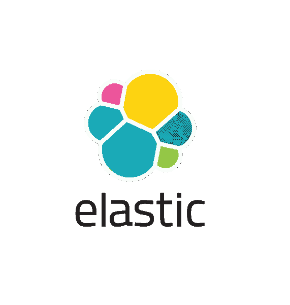
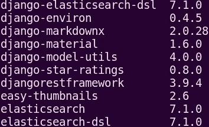

# 将 Elasticsearch 7 集成到 Django 项目中

> 原文：<https://medium.com/analytics-vidhya/integrating-elasticsearch-7-to-django-project-c3812de78246?source=collection_archive---------2----------------------->



为了一个项目，我不得不使用 django-haystack 将 Elasticsearch 2.x 迁移到最新的 Elasticsearch 7.5.0。我是这样做的。如果你想在 django 项目中使用 Elasticsearch，你也可以跟随。我将使用 Django 2.1.5。

Haystack 是一个很棒的开源包，它为 Django 提供了模块化搜索。不幸的是，它不支持最近版本的 Elasticsearch。所以为了迁移到最新版本的 Elasticsearch，我们需要删除 django-haystack 包。这可以通过使用:

```
pip unistall django-haystack
```

我们需要的软件包是 Elasticsearch-DSL 和 Django Elasticsearch DSL:

1) **Elasticsearch-DSL** :这是一个围绕官方低级客户端(elasticsearch-py)的高级库。

2)**Django-elastic search-DSL**:这允许 elasticsearch- dsl-py 与 Django 轻松集成。

# 在机器/服务器上安装和运行 Elasticsearch server:

对于基于 debian 的机器，如 Ubuntu、Debian 等:

```
wget [https://artifacts.elastic.co/downloads/elasticsearch/elasticsearch-7.5.0-amd64.deb](https://artifacts.elastic.co/downloads/elasticsearch/elasticsearch-7.5.0-amd64.deb)wget [https://artifacts.elastic.co/downloads/elasticsearch/elasticsearch-7.5.0-amd64.deb.sha512](https://artifacts.elastic.co/downloads/elasticsearch/elasticsearch-7.5.0-amd64.deb.sha512)shasum -a 512 -c elasticsearch-7.5.0-amd64.deb.sha512sudo dpkg -i elasticsearch-7.5.0-amd64.deb
```

要在系统启动时自动启动 Elasticsearch，请运行以下命令:

```
sudo /bin/systemctl daemon-reload
sudo /bin/systemctl enable elasticsearch.service
```

在 systemd 上启动 elasticsearch 服务

```
sudo systemctl start elasticsearch.service
```

停止 systemd 上的 elasticsearch 服务

```
sudo systemctl stop elasticsearch.service
```

获取 systemd 上弹性搜索服务的状态

```
systemctl status elasticsearch.service
```

此外，要检查 Elasticsearch 服务是否正常工作，您可以在浏览器中查看 localhost:9200/有关其他操作系统的安装指南，请参考[https://www . elastic . co/guide/en/elastic search/reference/current/install-elastic search . html](https://www.elastic.co/guide/en/elasticsearch/reference/current/install-elasticsearch.html)。

# 在 Django 安装 Django-Elasticsearch-DSL:

首先为 Django 安装**Django-elastic search-DSL。**

```
pip install django-elasticsearch-dsl
```

**请记住，对于 Elasticsearch 7.0 和更高版本，请使用该库的主要版本 7 (7.x.y)。正在做 *pip 列表*显示。**

****

**第一行和最后两行，检查 django-elasticsearch-dsl 版本(7.x.y)**

**将此代码片段添加到 django 设置中:**

```
ELASTICSEARCH_DSL={
    'default': {
        'hosts': 'localhost:9200'
    },
}
```

**这告诉 Django 我们的 Elasticsearch 服务在哪里。**

# **创建 documents.py:**

**我必须为 django 项目的“apps”应用程序实现搜索应用程序和标签模型。所以下面的代码片段会与之相关。但是你可以为你的项目遵循同样的程序。**

**要在 Elasticsearch 中使用 App 和标签模型，我们需要子类化 *django_elasticsearch_dsl。文档*并在其中创建类索引来定义索引，然后使用*registry . register _ document*decorator 将其注册为类。该文档子类在“apps”目录下的 documents.py 中定义。**

**在您的应用程序目录中创建 documents.py 并包含此导入:**

```
from django_elasticsearch_dsl import Document, fields
from django_elasticsearch_dsl.registries import registry
from .models import App, Tag
```

**对于应用模型，我们将使用应用模型的名称，标题，描述和摘要字段搜索应用。将此添加到 documents.py。**

```
[@registry](http://twitter.com/registry).register_document
class AppDocument(Document):
    class Index:
        name = 'apps'
        settings = {'number_of_shards': 1,
                    'number_of_replicas': 0}

    description = fields.TextField(attr = 'get_description')
    class Django:
        model = App
        fields = [
            'name',
            'title',
            'website',
            'abstract',
        ]
```

**name = 'apps '指的是索引的名称，而 fields 指的是我们将使用其进行搜索并出现在您的模型中的字段。也就是 model = App，它指的是我们正在为其构建索引的模型。碎片和副本可以根据您的需要进行设置。**

**这里的描述是应用程序模型中的一个 markdownx ()字段，当包含在字段部分时会出错，因此要包含搜索的描述字段，我必须在应用程序模型类中编写一个函数(get_description)来从应用程序模型返回描述字段。但这只是针对 mardownx()字段的。**

```
def get_description(self):
        return self.description
```

**对于标签模型，我们将使用名称和身份来搜索标签，这可以使用相同的过程来完成。**

```
[@registry](http://twitter.com/registry).register_document
class TagDocument(Document):
    class Index:
        name = 'tags'
        settings = {'number_of_shards': 1,
                    'number_of_replicas': 0}class Django:
        model = Tag
        fields = [
            'name',
            'identity',

        ]
```

**创建 documents.py 后，我们构建索引。**

****使用以下命令创建弹性搜索索引和映射:****

```
python manage.py search_index --rebuild
```

**一旦完成，现有对象将被映射，当新对象(此处为应用程序/标签)添加到数据库时，它们将自动映射到弹性搜索索引。**

# **显示搜索结果**

**现在我们需要显示搜索结果。为您的项目创建搜索应用程序。在这个项目中，它已经被创建。我们需要修改搜索应用程序中的 views.py 来处理搜索请求，并为我们的模板呈现它。**

**首先从搜索 app 的 views.py 中的 documents.py 导入 AppDocument 和 TagDocument:**

```
from apps.documents import AppDocument, TagDocument
```

**搜索 app 的 views.py 内部搜索(请求)方法:**

```
query = request.GET.get('q', '')sqs_app = AppDocument.search().query("multi_match", query = query\
     , fields = ["name", "title", "abstract", "description"])
sqs_tag = TagDocument.search().query("match", name = query)app = sqs_app.to_queryset()
tag = sqs_tag.to_queryset()
```

**这里的查询是用于搜索的实际查询。对于应用程序，我们做多匹配查询，因为有 4 个字段要搜索，对于标签，我们只使用名称字段查询。sqs_app 和 sqs_tag 是获得的搜索查询结果集。现有 html 模板需要 django 查询集。因此，为了将这个查询集作为 django 查询集返回，我使用了 to_queryset()方法。然后将查询集返回到您的模板。**

**感谢您的阅读:)**