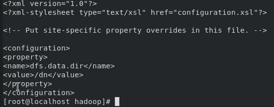

# 将逻辑卷管理器(LVM)与 Hadoop 集成|使用 Python 自动化 LVM

> 原文：<https://medium.com/analytics-vidhya/integrating-logical-volume-manager-lvm-with-hadoop-automating-lvm-with-python-3118f206777e?source=collection_archive---------22----------------------->

***Hadoop*** 是一个开源软件框架，用于在商用硬件集群上存储数据和运行应用。它为任何类型的数据提供大容量存储、巨大的处理能力以及处理几乎无限的并发任务或工作的能力。

Hadoop 的数据处理能力来自其自己的文件系统，称为***【HDFS】***(Hadoop 分布式文件系统)，允许您在整个集群中存储各种格式的数据。在 HDFS 中，Namenode 是主节点，Datanodes 是从节点。Namenode 包含关于存储在数据节点中的数据的元数据，例如哪个数据块存储在哪个数据节点中，数据块的副本保存在哪里等。实际数据存储在数据节点中。

我们实际上复制了数据节点中的数据块，默认的复制因子是 3。由于我们使用的是商用硬件，并且我们知道这些硬件的故障率非常高，因此如果其中一个数据节点出现故障，HDFS 仍将拥有这些丢失数据块的副本。您还可以根据需要配置复制因子。

HDFS 提供了一种分布式方式来存储大数据。您的数据跨 DataNodes 存储在块中，您可以指定块的大小。基本上，如果您有 512MB 的数据，并且您这样配置了 HDFS，它将创建 128 MB 的数据块。因此，HDFS 会将数据分成 4 个数据块，如 512/128=4，并跨不同的数据节点存储它，它还会在不同的数据节点上复制数据块。

因此，正如您可能在真实世界的用例场景中猜测的那样，集群必须有多个(有时数百万个)这样的硬件，以便公司可以将大数据转储到其中。但问题是，如果这些数据节点中的一个(或者说总数的百分之一)完全填满了它的存储，那会怎么样呢？很明显，DataNodes 包含一些重要数据，因此也必须始终保持活动(运行),直到我们的操作完成，因为几乎在任何时候都可能需要存储在其中的数据，反复关闭和打开它是浪费时间，永久关闭它完全是浪费资源。但是，让它保持活动状态将会消耗大量的能量，因此需要大量的资金，而且，如果我们所能做的只是从节点中读取数据，那么大多数时间节点都不会被使用。同样，在我们的世界里，没有人会喜欢一个消耗大量能源或金钱或两者兼而有之的系统，因为它实际上千年才运行一次。那么，我们应该如何处理这样的情况呢？它甚至是可管理的吗？如果是的话，它好吗？

我们问题的答案在于我们 DataNode 存储的巧妙使用。有人可能会问，DataNode 存储的这种巧妙用法是什么？嗯嗯嗯……我给你介绍 ***逻辑卷管理器*** (LVM)。

在 Linux 中，LVM 是一个设备映射框架，为 Linux 内核提供逻辑卷管理。它是一个在 Linux 内核中实现的工具，让您可以使用逻辑卷(LV)，即位于物理硬盘驱动器和文件系统之间的卷，它将使这些 LV 变得有生命力。

逻辑卷是位于物理卷上的信息组。层次结构用于管理磁盘存储。每个单独的磁盘驱动器称为物理卷(PV ),都有一个名称，例如/dev/hdisk0。每个正在使用的 PV 都属于一个卷组(VG ),顾名思义，这是一组卷。

简而言之，LVM 可以通过赋予我们的存储极其灵活的能力来帮助我们解决问题。虽然我们也可以在静态体积中获得灵活性。[点击这里了解更多](https://prithvirajsingh1604.medium.com/increasing-and-decreasing-the-size-of-static-partition-linux-the-right-way-b2b001149103)。但是正如你可能看到的那样，这很难做到，一个错误的决定将会毁掉我们宝贵的数据。然而，LVM 很好，因为它提供了一种更干净的做事方式。此外，它允许我们动态地更改卷的大小，也就是说，它帮助我们在分区在线(仍处于挂载状态)时更改其大小。将这样一个工具与 Hadoop 集成将从根本上解决我们面临的问题。

因此，让我们尝试整合这两种工具…

任务描述:将 LVM 与 Hadoop 集成，并为 DataNode 存储提供弹性。

当作为根用户*登录*时，下面完成的所有步骤都是通过 *RHEL-8* 完成的

让我们开始吧…

首先，我们需要一个 Hadoop 集群，要配置一个集群，我们需要在同一网络上的至少两个不同系统上安装 JDK(版本 8 或更高版本)和 Hadoop(最好是版本 1)(两个系统可以相互 ping 通)。接下来，在其中一个系统上，转到`/etc/hadoop`并配置两个文件

1.  hdfs-site.xml:您可以简单地进行如下所示的更改

2.core-site.xml:再次进行如下所示的更改

接下来使用命令`mkdir /arth`创建一个新文件夹，name node 将在其中存储集群的元数据

接下来，您必须运行两个命令:

`hadoop namenode -format`和`hadoop-daemon.sh start namenode`这将配置您的名称节点。接下来，在另一个系统上，您必须再次对相同的文件进行更改，如下所示

1.  hdfs-site.xml

2.核心网站. xml

接下来使用命令`mkdir /dn`在/ directory 中创建一个名为`dn`的文件夹，这是所有数据将要存储的文件夹

完成后，运行命令`hadoop-daemon.sh start datanode`,将会显示如下结果

但是数据节点更少

接下来，在两个系统中的任何一个上使用命令`hadoop dfsadmin -report`检查集群是否准备就绪。如果您可以看到一个连接的名称节点，那么您已经准备好在 LVM 上工作，否则再次重复这些步骤。[或者尝试我们的工具来简化这一步](https://github.com/Prithviraj-Singh/menu.py) [(点击此处)](https://github.com/Prithviraj-Singh/menu.py)。[另请参见本文，了解关于我们工具的更多信息(点击此处)](https://oswalyashraj07.medium.com/automation-of-technologies-a-step-towards-working-smartly-7dd0edbb21d2)。

一旦我们的群集启动并运行，我们将必须使 DataNode 能够使用 LVM…

为此，请在您的系统中插入一个配置为 DataNode 的新存储设备。接下来看看我们的系统使用命令`fdisk -l`给它取了什么名字

在我的案例中，新设备显示为`/dev/sdb`，尺寸为 10GiB。接下来，让我们为这个新设备创建一个物理卷，为此使用命令`pvcreate /dev/<name of the volume>`在我的例子中，命令是

要查看系统中的所有 PV，请使用以下命令

接下来，我们将制作一个 VG，并将这个新的 PV 添加到其中。为此，使用命令`vgcreate <name of the VG> /dev/<name of the volume>`,因此在我的例子中，该命令类似于

您可以使用命令`vgdisplay`显示 VGs 的属性，或者使用命令`vgdisplay <name of the vg>`查看相应 VG 的属性，因此在我的例子中，我将使用命令

接下来让我们从我们的 VG 创建一个 LV，使用命令`lvcreate --size <size> --name <name for the lv> <name of the VG>`在我的例子中，我使用如下命令

现在 LV 可以使用了，它可以像普通的静态分区一样使用。使用命令`lvdisplay`找到新创建的 LV 的名称。因此它必须被手动格式化和安装。在我的例子中，我使用了命令

至此，我们已经使 DataNode 具备了 LVM 功能。现在，让我们看看可以通过尝试操作具有 LVM 功能的 DataNode 的卷来做些什么。目前我的 Hadoop 报告显示

三个 Datanode，一个大小约为 5gb，另一个可视 Datanode 大小约为 4gb。我将更改名为`49.36.35.26`的 DataNode 的大小，而我的队友将处理另一个名为`47.31.9.98`的 DataNode

现在让我们尝试增加 DataNodes 的大小

为此，我们只需运行两个命令:

1.  `lvextend --size +(size in GiB)G /dev/<name of the VG>/<name of the LV>`在我的情况下，命令将是

2.`resize2fs /dev/<name of the VG>/<name of the LV>`所以我将命令写成

就这样，我的 DataNode 的容量增加了 4gb。让我们看看在 Hadoop 报告中可以看到什么

是的，正如你所看到的，大小已经从大约 5gb 增加到大约 9gb。同时保持卷处于活动状态(仍处于装载状态)。

# 使用 Python 脚本实现自动化…

从本文中，您可能已经看到了我们能够实现 python 脚本的能力，为什么我们不将 Python 和 LVM 的知识结合起来，制作一个工具，能够自动完成这一令人兴奋的任务:制作 PV，然后给 VG，最后创建 LV，同时承担记住所有命令的负担…

任务描述:使用 Python 脚本自动化 LVM 分区。

 [## Prithviraj-Singh/menu.py

### 此时您不能执行该操作。您已使用另一个标签页或窗口登录。您已在另一个选项卡中注销，或者…

github.com](https://github.com/Prithviraj-Singh/menu.py/blob/update/menu.py) 

这里是我们工具的代码链接，其中最新添加的选项是关于 LVM 的。让我们看看它是如何工作的…

你可能会看到第五个选项，所以只要在提示时按下 5，你就会进入一个页面，在那里你会看到一个专门针对 LVM 的菜单

就像这样……正如你所看到的，在 LVM 工作有各种必不可少的选择。让我们试着做一些…

如您所见，按下选项 4 并进入该工具将询问您是否想要查看任何特定的 LV，如果不想，该工具将为您打印所有 LV 及其详细信息。其中一个你可能在这里看到的是`/dev/myvg/mylv1`，它的大小是 1GiB。让我们试着看看它的 VG 命名为`myvg`

在这里您可以看到关于 VG `/dev/myvg`的所有细节，我们可以看到空闲的大小是< 7GiB，让我们尝试给`/dev/myvg/mylv1`添加一些空间，然后看看 VG 会发生什么

在这里，我给 LV 增加了 1gb 的空间，让我们看看我们是否成功地做到了这一点

是的，如您所见，大小已从 1gb 增加到 2gb

如您所见，甚至 VG 上的空闲大小也减少到了<6GiB

***因此，任务成功完成！！！✔*** 🎉

感谢您的阅读。回头见！！！😊👋