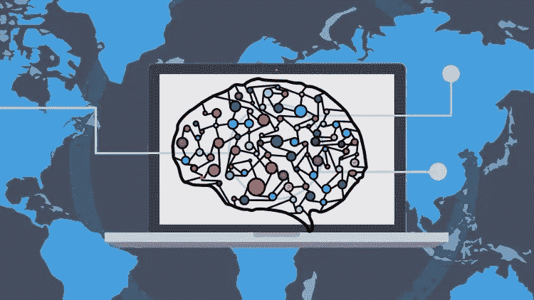
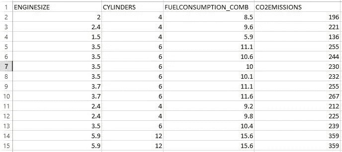
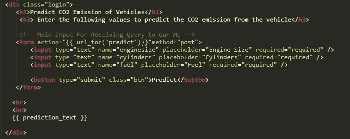
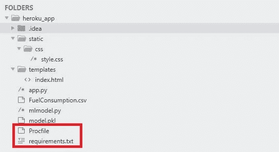
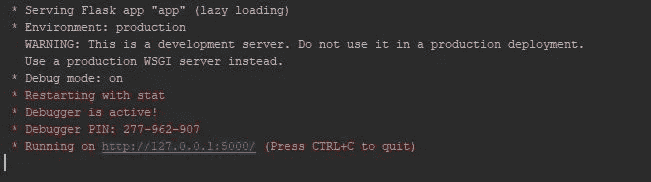
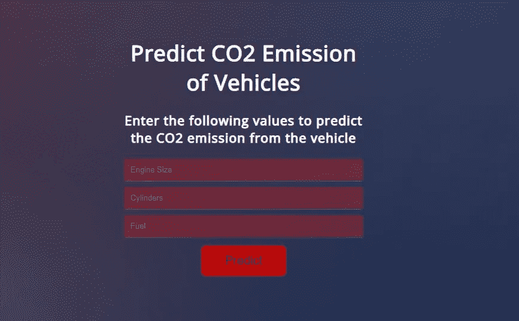
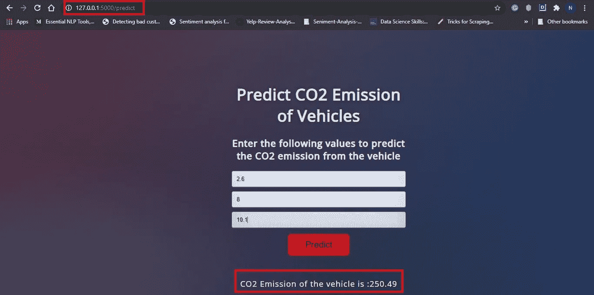
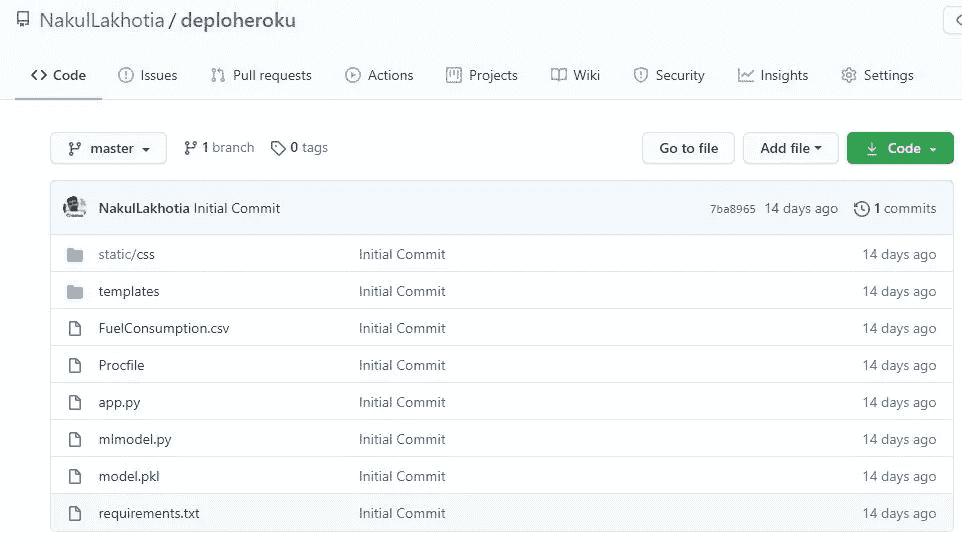

# 用 Flask 将机器学习集成到 Web 应用程序中

> 原文：<https://medium.com/analytics-vidhya/integrating-machine-learning-into-web-applications-with-flask-c345118cf08e?source=collection_archive---------4----------------------->

## 学习在 Web 应用程序中嵌入您的 ML 模型



资料来源:Udemy

我们都遇到过各种使用机器学习的 web 应用程序。例如，网飞和 YouTube 使用 ML 来个性化您的体验，根据您的观看历史向您推荐新内容。这有助于他们做出更好的决策，了解用户的浏览行为。

甚至你也可以创建这样一个应用程序，你输入数据，它使用你的 ML 模型为你预测输出。如果您可以将您创建的机器学习模型集成到应用程序中，您可以更好地利用这些模型。这不仅突出了你的 ML 知识，也突出了你的应用开发技能。

在本文中，我将向您展示如何在您的 Web 应用程序(在 Flask 中创建)中嵌入一个 ML 模型。首先，我们将建立一个简单的线性回归模型来预测汽车的二氧化碳排放量。然后，我们将开发一个 web 应用程序，接受输入来预测排放量。

1.  创建您的机器学习模型
2.  使用 Flask 开发您的网络应用程序，并将您的模型集成到应用程序中
3.  在 Heroku 云平台部署您的网络应用

> **注意**:这只是一个简单的例子。您可以创建自己的机器学习模型，如回归、分类、聚类等。并将它们部署到您的网络应用程序中。应用程序的设计完全取决于您的 Web 开发技能。

## 1.创建您的机器学习模型

我们使用线性回归来预测汽车的二氧化碳排放量。数据集有许多列，但我们只使用其中的几列作为我们的特征。最后一列表示类别标签。我们的数据集有 1067 行和 4 列。



资料组

我们使用 sklearn 内置的 **LinearRegression()** 类来构建我们的回归模型。以下代码帮助我们**使用 Pickle 模块**保存我们的模型。我们的 ML 模型保存为“model.pkl”。稍后，当我们的 web 应用程序提供新的输入数据时，我们将使用该文件来预测输出。

> [**Pickle**](https://www.tutorialspoint.com/python-pickling)**:**Python Pickle 模块用于序列化和反序列化 Python 对象结构。转换任何类型的 python 对象(列表、字典等)的过程。)转换成字节流(0 和 1)称为酸洗或串行化或扁平化或编组。我们可以通过一个叫做 unpickling 的过程将字节流(通过 pickling 生成)转换回 python 对象。

使用 Pickle 保存我们的模型

## 2.使用 Flask 开发您的 web 应用程序，并集成您的模型

现在我们有了模型，我们将开始在 Flask 中开发我们的 web 应用程序。那些刚开始使用烧瓶的人可以在这里阅读。

Flask 学习资源:[科里·斯查费的 Flask 教程，](https://www.youtube.com/watch?v=MwZwr5Tvyxo&list=PL-osiE80TeTs4UjLw5MM6OjgkjFeUxCYH) [学习 Python 的 Flask—完整教程](https://www.youtube.com/watch?v=Z1RJmh_OqeA)

**2.1。安装烧瓶**:你可以使用 pip 安装烧瓶’命令。我使用 PyCharm IDE 开发 flask 应用程序。 ***要在 PyCharm*** 中轻松安装库，请遵循以下[步骤](https://www.jetbrains.com/help/pycharm/installing-uninstalling-and-upgrading-packages.html)。

**2.2。导入必要的库，初始化 flask 应用程序并加载我们的 ML 模型**:我们将初始化我们的应用程序，然后将“model.pkl”文件加载到应用程序中。

```
#import libraries
import numpy as np
from flask import Flask, render_template,request
import pickle#Initialize the flask App
app = Flask(__name__)
model = pickle.load(open('model.pkl', 'rb'))
```

**2.3。为 web-app 的默认页面定义 app 路由**:路由是指某个 app 的 URL 模式(如 myapp.com/home 或 myapp.com/about)。`@app.route("/")`是 Flask 提供的一个 Python 装饰器，用于轻松地将我们应用程序中的 URL 分配给函数。

```
#default page of our web-app
@app.route('/')
def home():
    return render_template('index.html')
```

装饰器告诉我们的`@app`，每当用户在给定的`.route()`访问我们的应用程序域( *localhost:5000 用于本地服务器)*，执行`home()`函数。Flask 使用 Jinja 模板库来渲染模板。在我们的应用程序中，我们将使用模板来呈现将在浏览器中显示的 HTML。

**2.4。重定向 API 以预测 CO2 排放**:我们创建一个新的应用程序路径('/predict ')，它从我们的“index.html”表单中读取输入，并在单击“预测”按钮时，使用 render_template 输出结果。

```
#To use the predict button in our web-app
@app.route('/predict',methods=['POST'])
def predict():
    #For rendering results on HTML GUI
    int_features = [float(x) for x in request.form.values()]
    final_features = [np.array(int_features)]
    prediction = model.predict(final_features)
    output = round(prediction[0], 2) 
    return render_template('index.html', prediction_text='CO2    Emission of the vehicle is :{}'.format(output))
```

让我们看看我们的**index.html**文件:



index.html

**2.5。启动 Flask 服务器**:

```
if __name__ == "__main__":
    app.run(debug=True)
```

app.run()被调用，web 应用程序被本地托管在*【localhost:5000】上。*

“debug=True”确保我们不需要在每次进行更改时都运行我们的应用程序，我们只需在服务器仍在运行时刷新我们的网页来查看更改。

## 项目结构:



项目结构

该项目保存在名为“heroku_app”的文件夹中。我们首先运行“mlmodel.py”文件来获取 ML 模型，然后运行“app.py”。在运行这个文件时，我们的应用程序被托管在端口 5000 的本地服务器上。

> 运行“app.py”后，您只需在 web 浏览器上键入“localhost:5000”即可打开您的 web 应用程序

*   FuelConsumption.csv —这是我们使用的数据集
*   ml model . py——这是我们的机器学习代码
*   model.pkl —这是我们运行 mlmodel.py 文件后获得的文件。它位于同一个目录中
*   app.py —这是我们在上面创建的 Flask 应用程序
*   模板—该文件夹包含我们的“index.html”文件。渲染模板时，这在 Flask 中是强制的。所有 HTML 文件都放在这个文件夹下。
*   静态—此文件夹包含“css”文件夹。Flask 应用程序中的静态文件夹用于保存 CSS 和 JavaScript 文件。

在将应用程序在线托管到云平台之前，首先在本地服务器上运行应用程序并检查应用程序的功能始终是一个好主意。让我们看看运行“app.py”时会发生什么:



Flask 应用程序的本地服务器

点击提供的网址，我们得到我们的网站:



网络应用

现在，让我们输入所需的值，然后单击“预测”按钮，看看会发生什么。



预测产量

观察网址(127.0.0.1:5000/predict)，这是 app 路线的使用。单击“预测”按钮，我们将被带到预测页面，在这里，预测函数将使用我们应用程序的输出呈现“index.html”页面。

## **3。在 Heroku** 上部署您的 Web 应用程序

既然我们的应用已经在本地服务器上测试成功，那么是时候在 Heroku- cloud 平台上部署我们的应用了。将 flask web 应用程序部署到 Heroku 有两个先决条件。

在项目结构中，您可能已经注意到了两个名为“Procfile”和“requirements.txt”的新文件。在 Heroku 上部署您的应用程序需要这两个文件。

在创建 Procfile 之前，我们需要安装 [Gunicorn](https://pypi.org/project/gunicorn/) 。您可以使用命令‘pip install guni corn’或使用上面的[链接](#ba6b)在 PyCharm 中安装库

**3.1。创建 proc file**:proc file[指定了 Heroku 应用程序在启动时执行的命令。在工作目录中打开一个名为 Procfile(没有任何扩展名)的新文件，并粘贴以下内容。](https://devcenter.heroku.com/articles/procfile)

```
web: gunicorn app:app
```

**3.2。创建 requirements . txt**:requirements . txt 文件将包含 flask 应用程序的所有依赖项。打开一个新文件，命名为“requirements.txt”。提及以下所有要求:

```
Flask==1.1.1
gunicorn==20.0.4
pandas==0.25.2
scikit-learn==0.23.2
numpy==1.17.3
pickle4==0.0.1
sklearn==0.0
```

或者，您也可以在终端的工作目录中使用以下命令来创建该文件:

```
pip freeze > requirements.txt
```

**3.3。上传 GitHub 存储库上的所有文件**:

要了解如何创建新的存储库，[单击此处](https://docs.github.com/en/enterprise/2.15/user/articles/create-a-repo)。如果你想知道如何上传文件到你的仓库，你可以从这里的[那里得到帮助。所有文件上传后，您的存储库看起来应该有点像这样。](https://docs.github.com/en/enterprise/2.13/user/articles/adding-a-file-to-a-repository)



包含 Procfile、需求和应用程序文件的 GitHub 存储库

> **注意:你的存储库中的所有这些文件应该在工作目录级别，而不是在另一个文件夹中**

从现在开始，要在 heroku 上部署您的应用程序，请遵循我下面文章中的**步骤 2–3**:

[](/@nakullakhotia/deploying-a-static-web-application-to-heroku-3f21e07e58a) [## 将静态 Web 应用程序部署到 Heroku

### 将您的 HTML、CSS 和 JavaScript 应用程序部署到 Heroku

medium.com](/@nakullakhotia/deploying-a-static-web-application-to-heroku-3f21e07e58a) 

**就这样！！**您的应用已经托管在 Heroku 云平台上。您可以与您的朋友和家人分享应用程序链接，向他们展示您所创建的内容。任何能够访问互联网和您的应用程序的人都可以使用您的应用程序。好激动:)

链接到我的 [**GitHub 库**](https://github.com/NakulLakhotia/deploheroku)

链接到我在 Heroku 上的网络应用— [**二氧化碳排放预测器**](https://ml-with-flask.herokuapp.com/)

***注*** *:本文中已经提到了你开始工作所需的所有资源及其链接。希望你好好利用:)*

我希望这篇文章能帮助你使用 Heroku 在线托管你的 ML Web 应用程序。如果你喜欢读这篇文章，不要忘记点击下面的“拍手”图标。谢谢你的时间。