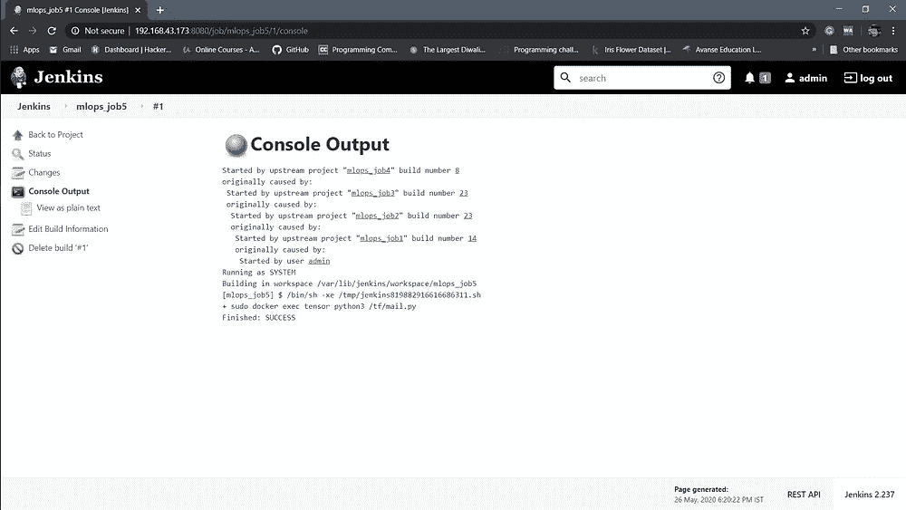

# 将机器学习与 DevOps 和 Docker 集成

> 原文：<https://medium.com/analytics-vidhya/integrating-machine-learning-with-devops-and-docker-2812125083d0?source=collection_archive---------22----------------------->


为什么大部分机器学习项目都没有实现？因为超参数的改变是一个非常庞大和繁琐的任务。什么是超参数？

超参数可以被分类为模型超参数，当[将机器适配到训练集](https://en.wikipedia.org/wiki/Model_fitting)时不能被推断，因为它们涉及[模型选择](https://en.wikipedia.org/wiki/Model_selection)任务，或者算法超参数，其原则上对模型的性能没有影响，但是影响学习过程的速度和质量。


超参数

所以。这篇文章是关于通过改变一些超参数来自动化我们的机器学习。

## *完成本项目的先决条件


1.  码头工人
2.  詹金斯
3.  为了顺利工作，尝试使用基于 Linux 的操作系统
4.  饭桶
5.  Github。

## *我们必须做的事情

1.使用 Dockerfile 创建安装了 Python3 和 Keras 或 NumPy 的容器映像

2.当我们启动这个图像时，它应该会自动开始训练容器中的模型。

3.使用 Jenkins 中的构建管道插件创建 job1、job2、job3、job4 和 job5 的作业链

4.Job1:在部分开发者将回购推送给 Github 的情况下，自动拉取 Github 回购。

5.Job2:通过查看代码或程序文件，Jenkins 应该自动启动相应的机器学习软件安装解释器安装映像容器来部署代码并开始训练(例如，如果代码使用 CNN，则 Jenkins 应该启动已经安装了 CNN 处理所需的所有软件的容器)。

6.工作 3:训练你的模型并预测准确性或度量。

7.Job4:如果度量准确度低于 80%，那么调整机器学习模型架构。

8.Job5:重新训练模型或通知正在创建最佳模型

9.为 monitor 创建一个额外的 job job6:如果是运行应用程序的容器。由于任何原因失败，则该作业应该从最后一个训练模型离开的地方自动再次启动容器。

## *应遵循的步骤:-

1.  创建一个目录，我们把 redhat8 系统中的所有文件和文件夹都放在这个目录中。

```
# mkdir /mlops_pro# cd mlops_pro
```

2.现在，我们创建一个 docker 文件来创建运行 CNN 模型的图像。


Dockerfile 文件

保存它，然后使用命令构建映像

```
#  docker build -t tensorflow:latest .
```

## *现在创造就业机会:-

1.  Job1:-当一些开发者将回购推送给 Github 时，自动拉取 Github 回购。


工单 1

2.Job2:-通过查看代码或程序文件，Jenkins 应该自动启动相应的机器学习软件安装解释器安装映像容器，以部署代码并开始训练(例如，如果代码使用 CNN，则 Jenkins 应该启动已经安装了 CNN 处理所需的所有软件的容器)。

该作业将在作业 1 成功启动后运行。现在使用上面的图片，如果代码属于 CNN，将启动一个容器。


工单 2

3.工作 3:训练你的模型并预测准确性或度量。

该作业将在作业 2 成功完成后运行。对于培训模型，我创建了一个 task.py 文件。GitHub repo 中给出了这个文件，文章末尾给出了链接。


工单 3

所以，你可以看到准确率几乎是 84%,这个准确率被保存在一个名为 accuracy.txt 的文件中，这个文件可以进一步用于构建我们的模型。

4.Job4:如果度量准确度低于 85%，那么调整机器学习模型架构。

正如你可以清楚地看到，我的准确性几乎是 84%，所以我需要 twerk 我的模型，以实现这一更好的准确性。

该作业将在作业 3 成功完成后运行。

我已经创建了一个 twerk.py 文件，用于根据前一个任务(即任务 3)中获得的精度调整我们的模型。


工单 4

在上面上传的最后一张图片中，你可以清楚地看到，通过调整我们的模型，即通过改变一些超参数，精确度现在提高到了 91%。

5.Job5:重新训练模型或通知正在创建最佳模型。

这项工作将发送邮件给开发人员，如果我们成功地达到了最高的准确性。



作业 5

```
# Python code to illustrate Sending mail from# your Gmail account**import** smtplib# creates SMTP sessions **=** smtplib.SMTP('smtp.gmail.com', 587)# start TLS for securitys.starttls()# Authentications.login("sender_email_id", "sender_email_id_password")# message to be sentmessage **=** "Message_you_need_to_send"# sending the mails.sendmail("sender_email_id", "receiver_email_id", message)# terminating the sessions.quit()
```

这是 mail.py 文件。


邮件图像

得到了模型获得最高精度的邮件。

6.为 monitor 创建一个额外的 job job6:如果是运行应用程序的容器。由于任何原因失败，则该作业应该从最后一个训练模型离开的地方自动再次启动容器。


工作 6

最后，使用构建管道创建的所有作业的图形视图。


图形视图

访问该项目的代码和文件的 Github 链接:-

[](https://github.com/Akashdeep-47/MLOps-Task-3.git) [## 阿卡什迪普-47/MLOps-Task-3

### 詹金斯和多克的 Twerking 深度学习。为阿卡什迪普-47/MLOps-Task-3 的开发做出贡献

github.com](https://github.com/Akashdeep-47/MLOps-Task-3.git) 

# 谢谢大家！！