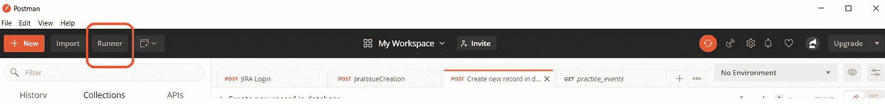
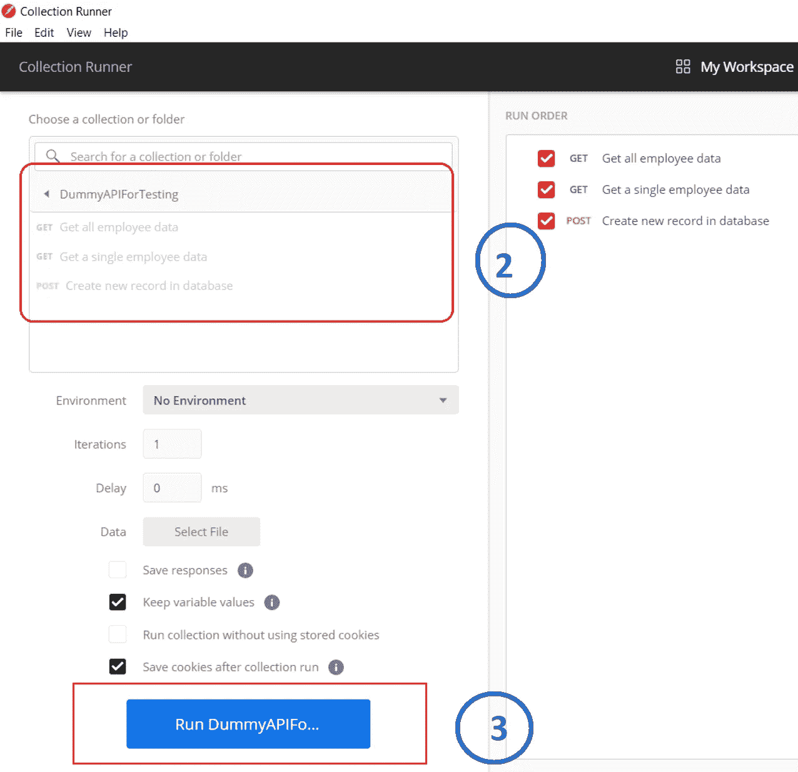
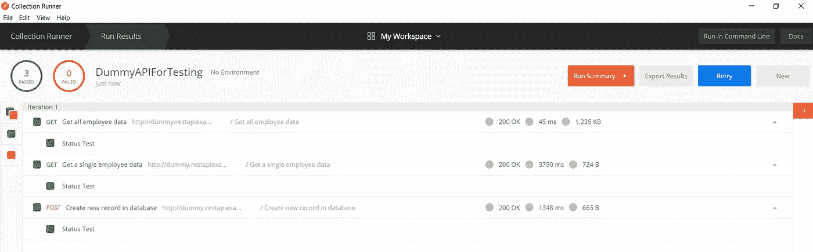
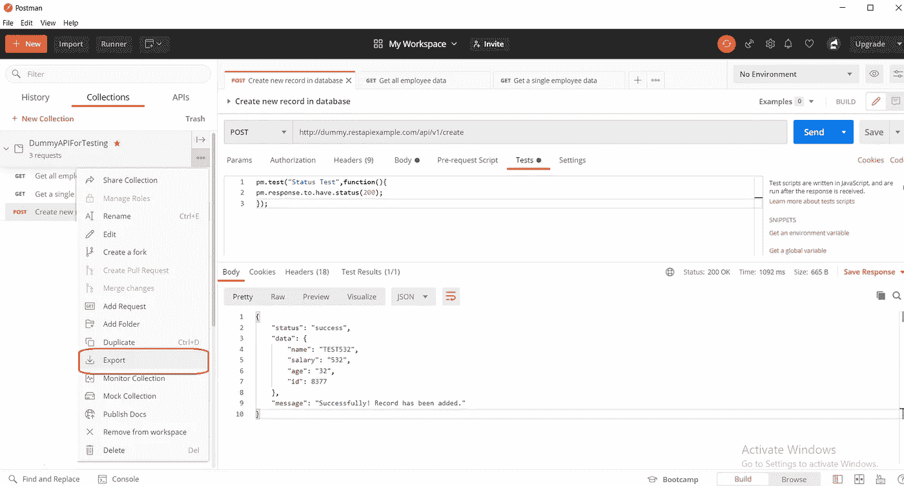
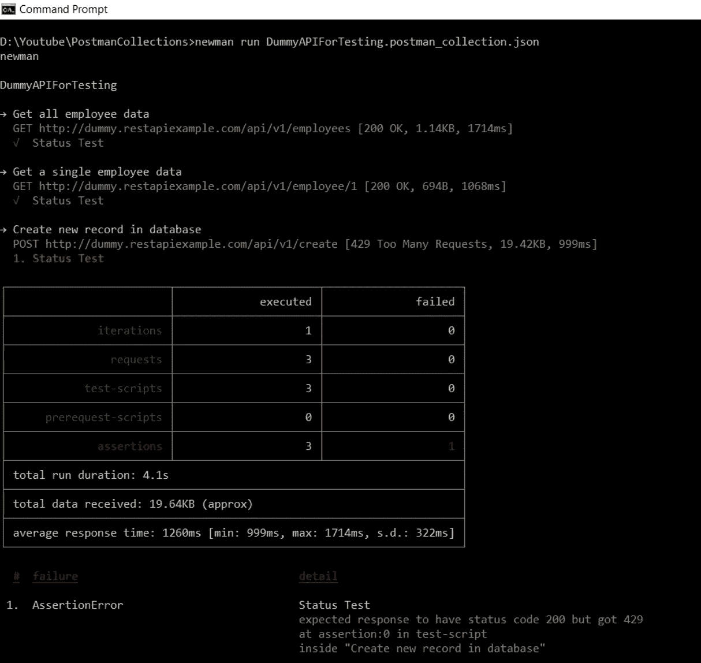
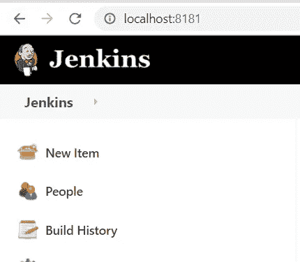
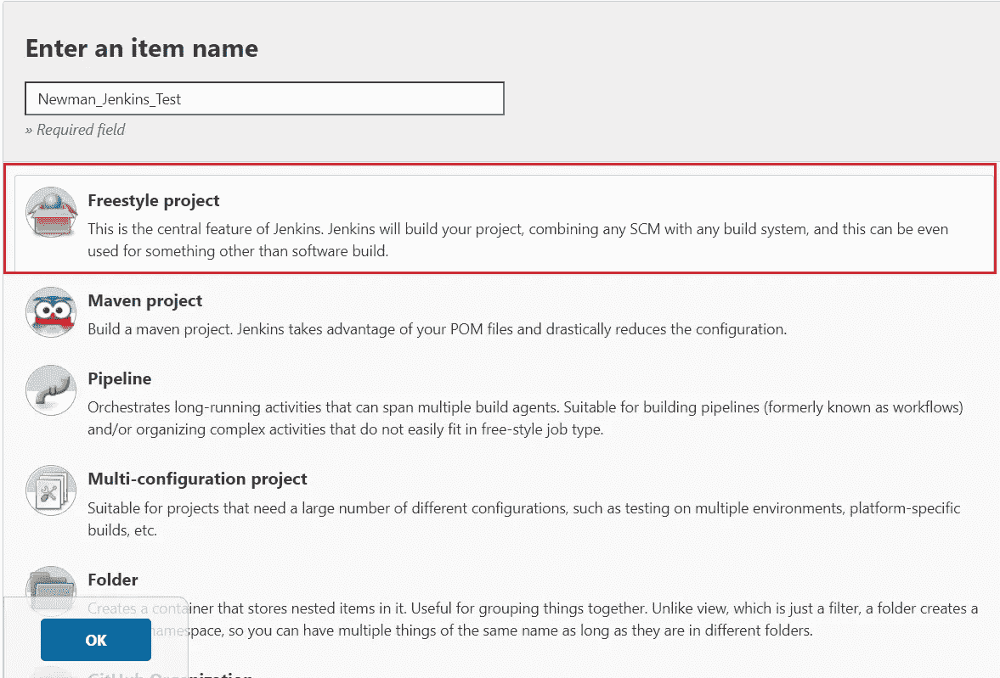
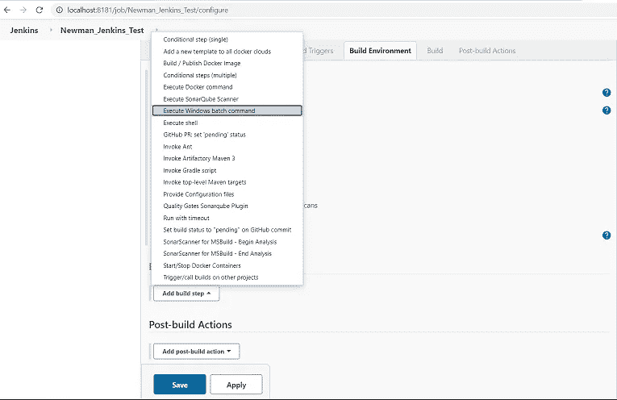
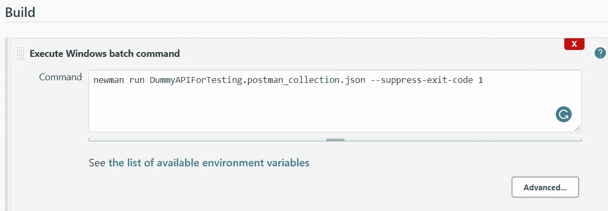
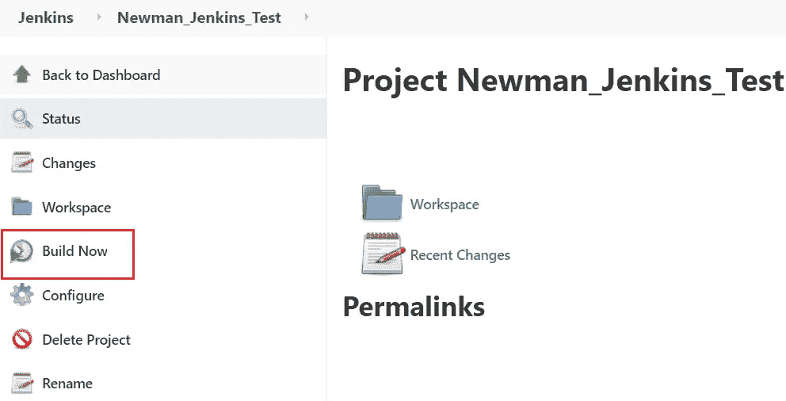

# 整合邮递员和詹金斯

> 原文：<https://medium.com/analytics-vidhya/integrating-postman-with-jenkins-2e0e20167185?source=collection_archive---------5----------------------->


Newman 是 Postman 的命令行收集程序。它允许您直接从命令行毫不费力地运行和测试 Postman 集合。它的构建考虑了可扩展性，因此您可以轻松地将其与您的持续集成服务器 **Jenkins、**集成，并构建系统。

1.  纽曼装置
2.  在**邮差**跑集合
3.  使用**纽曼**经营收藏
4.  **詹金斯**工作设置
5.  运行詹金斯的**作业**

# **纽曼安装**

安装节点 JS 和 npm。纽曼是用 NodeJS 写的，官方副本可以通过 npm 获得。

```
> npm install -g newman
```

全局安装 Newman，将 Newman 设置为 Windows 中的命令行工具。

检查此 [Newman 在 Windows](https://prathapreddy-mudium.medium.com/newman-installation-on-windows-10-727bcf484fe3) 上的安装，了解详细步骤。

# **在邮递员**中运行收集

1.  打开**邮递员**并点击跑步者



2.转到 collection runner 并选择要运行的集合。



3.点击运行按钮



# **使用 Newman 运行收藏**

1.  从邮递员导出收藏



2.转到导出集合的位置，并运行如下所示的命令。这里的***dummyapifortesting . postman _ collection . JSON***文件就是导出的集合。

```
> newman run DummyAPIForTesting.postman_collection.json
```



# **詹金斯工作设置**

1.  去找詹金斯



2.通过点击左侧边栏的“新项目”链接创建一个新作业>从选项>命名您的项目中选择一个“自由式项目”,然后点击**确定**



3.在项目中添加一个生成步骤。构建步骤执行一个 Shell 命令。



下面是要添加到构建部分的命令，

```
newman run DummyAPIForTesting.postman_collection.json --suppress-exit-code 1
```



4.点击**保存**按钮，完成项目创建。

5.点击**立即构建**运行作业

