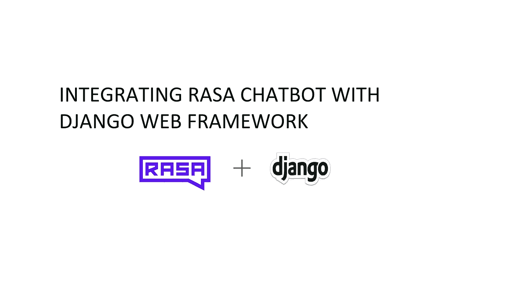
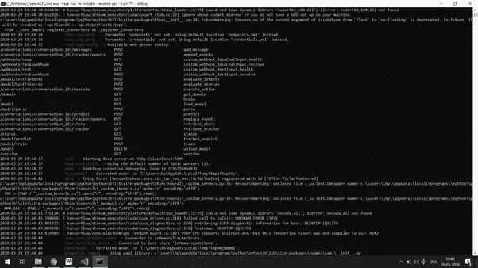
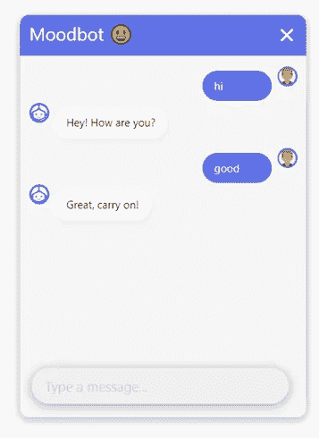
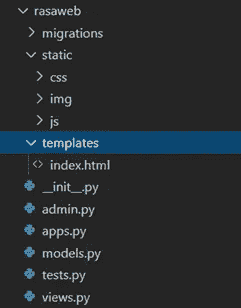

# 将 RASA 聊天机器人与 Django Web 框架集成

> 原文：<https://medium.com/analytics-vidhya/integrating-rasa-chatbot-with-django-web-framework-f6cb71c58467?source=collection_archive---------5----------------------->



有很多关于如何使用 Rasa 框架开发聊天机器人的教程。大多数都是在你通过命令行与聊天机器人交流的时候结束的。由于我们现在不是在 20 世纪 60 年代，为了提供一个能引起良好共鸣并对用户友好的聊天机器人，我们需要一个前端，而不是为非技术人员提供的枯燥乏味的命令行用户界面。

在本文中，我将试图让你很容易理解如何构建一个 Rasa 聊天机器人，并轻松地将其与 django web 框架集成。为了便于理解，这篇文章分为三个部分。

*   开发一个简单的 Rasa 聊天机器人
*   为聊天机器人构建一个简单的用户界面
*   整合你的 Rasa 聊天机器人和 Django

那些想直接运行项目的人可以克隆我的 github repo [链接](https://github.com/dlmade/blog.git)

除了对 RASA 知之甚少之外，这篇文章假设你已经在你的电脑上安装了 Rasa，如果你还没有，看看这里的说明。

说够了，让我们把手弄脏吧。

**第 1 部分:开发一个简单的 Rasa 聊天机器人**

要启动 rasa 聊天机器人，请在您的终端或 CLI 中运行以下命令。

```
rasa init
```

这个命令从一些示例数据开始创建一个简单的聊天机器人。更多细节你可以看看他们的[文档](https://rasa.com/docs/getting-started/)。

要在您的网站中将此聊天机器人作为 API 进行访问，请在您的终端或 CLI 中运行以下命令。

```
rasa run -m models — enable-api — cors “*” –-debug
```

不同的参数是:
-m:包含您的 Rasa 模型的文件夹的路径，
-enable-API:启用 API
-CORS:允许跨站点请求
-debug:如果聊天机器人不能正常工作，帮助您解决错误

更多详情请点击此[链接](https://rasa.com/docs/rasa/1.6.2/user-guide/running-the-server/)

如果您使用的是 Windows 操作系统，当您运行上面的命令没有错误时，您的命令行应该如下所示。要访问 Rasa 聊天机器人，请在我们的浏览器中键入 URL[http://localhost:5005](http://localhost:5005/)



rasa run -m 型号-启用-API-CORS " * "-调试

**第 2 部分:为聊天机器人构建一个简单的 UI**

对于用户界面部分，我们将使用这个[回购](https://github.com/JiteshGaikwad/Rasa_CustomUI-v_2.0)

使用以下命令克隆此存储库

```
git clone [https://github.com/JiteshGaikwad/Rasa_CustomUI-v_2.0.git](https://github.com/JiteshGaikwad/Rasa_CustomUI-v_2.0.git)
```

导航到 static/js/script.js 文件。在第 40 行，您可以看到 rasa url[http://localhost:5005/web hooks/rest/web hook](http://localhost:5005/webhooks/rest/webhook)，这与我们在 rasa part 中看到的 URL 相同。

打开这个回购的 index.html 打开那个文件，你就可以在你的浏览器中与聊天机器人进行互动。键入 hi 以问候聊天机器人…



聊天机器人 ui

**第 3 部分:将你的 Rasa 聊天机器人与 Django 集成**

既然我们已经有了 Rasa 聊天机器人和它的用户界面，我们现在可以将它与 django web 框架集成

通过运行下面的命令启动 django 项目:

```
django-admin startproject rasadjango .
```

此命令将创建一个包含以下文件的“rasadjango”文件夹

*   **manage.py** :一个命令行实用程序，允许您以各种方式与这个 Django 项目进行交互。
*   rasadjango **/__init__。py** :一个空文件，告诉 Python 这个目录应该被认为是一个 Python 包。
*   rasadjango **/settings.py** :这个 django 项目的设置/配置。
*   rasadjango **/urls.py** :这个 django 项目的 URL 声明；你的 Django 网站的“目录”。
*   rasadjango**/ASGI . py**:ASGI 兼容的 web 服务器为您的项目服务的入口点。
*   rasadjango **/wsgi.py** :兼容 wsgi 的 web 服务器为您的项目服务的入口点。

现在让我们用下面的命令创建一个应用程序 rasaweb

```
django-admin startapp rasaweb
```

每当我们创建任何应用程序时，我们都必须将其名称添加到 settings.py 中。

```
INSTALLED_APPS = [‘django.contrib.admin’,‘django.contrib.auth’,‘django.contrib.contenttypes’,‘django.contrib.sessions’,‘django.contrib.messages’,‘django.contrib.staticfiles’,**‘rasaweb’**]
```

要添加将连接到 rasaweb 应用程序的路径，请导航到 rasadjango 文件夹的 urls.py，并按如下方式进行编辑

```
from django.contrib import adminfrom django.urls import path**from django.conf.urls import include, url**urlpatterns = [path('admin/', admin.site.urls),**url('^$', include('rasaweb.urls')),**]
```

在 rasaweb 应用程序中创建一个 urls.py 文件，以便在视图文件的帮助下将 url 路由到 index.html。

```
**from django.conf.urls import url****from . import views****urlpatterns = [****url(‘’, views.index, name=’index’)****]**
```

在 rasaweb/views.py 文件中添加以下行来完成路由。按照 rasaweb/urls.py 中指出的定义您的索引函数

```
from django.shortcuts import render# Create your views here.**def index(request):****return render(request,'index.html')**
```

现在转到您在第 2 部分中克隆 repo 的目录，并将静态文件夹复制到 rasaweb 文件夹中。

创建一个模板文件夹 rasaweb 文件夹，并从本文第 2 部分的模板文件夹中复制 index.html 文件。

你的 rasaweb 文件夹应该有这样的结构。



文件夹结构

现在，为了加载静态文件，我们在 index.html 文件的顶部添加了下面一行

```

```

然后，如图所示，替换下列行

原创

```
<link rel= “stylesheet” type= “text/css” href= “static/css/style.css”><link rel= “stylesheet” type= “text/css” href= “static/css/materialize.min.css”>
```

被取代的

```
<link rel= “stylesheet” type= “text/css” href= “”><link rel= “stylesheet” type= “text/css” href= “”>
```

原创

```
<div class=”profile_div” id=”profile_div”></div>
```

被取代的

```
<div class="profile_div" id="profile_div"></div>
```

原创

```
<script type=”text/javascript” src=”static/js/materialize.min.js”></script><script type=”text/javascript” src=”static/js/script.js”></script>
```

被取代的

```
<script type="text/javascript" src=""></script><script type="text/javascript" src=""></script>
```

最后，将以下行添加到 settings.py 文件中

```
STATIC_ROOT = os.path.join(BASE_DIR, 'static')
```

如果你已经完美地完成了所有的事情，从你创建项目的基本目录中运行下面的命令

```
python manage.py collectstatic
```

这将把所有静态文件放到主目录中。

最后，

```
python manage.py runserver
```

这个命令将运行 django 服务器，该服务器为您提供 URL[http://127 . 0 . 0 . 1:8000/](http://127.0.0.1:8000/)来与聊天机器人进行交互。将此 url 粘贴到浏览器中，并与聊天机器人进行交互。

为了回顾我们所学的内容，我们学习了如何启动一个简单的 Rasa 聊天机器人。我们还学习了如何开始一个 django 项目，以及如何整合两者。本文为您提供了一个平台，将来当您构建一个复杂的 Rasa 聊天机器人并需要用 django 部署它时，这个平台会对您有所帮助。

我希望这篇文章能对你的旅程有所帮助。不断学习。

如果你喜欢这篇文章，点击给我买杯咖啡！感谢阅读。😊

[](https://www.payumoney.com/paybypayumoney/#/147695053B73CAB82672E715A52F9AA5)

你的每一个小小的贡献都会鼓励我创造更多这样的内容。