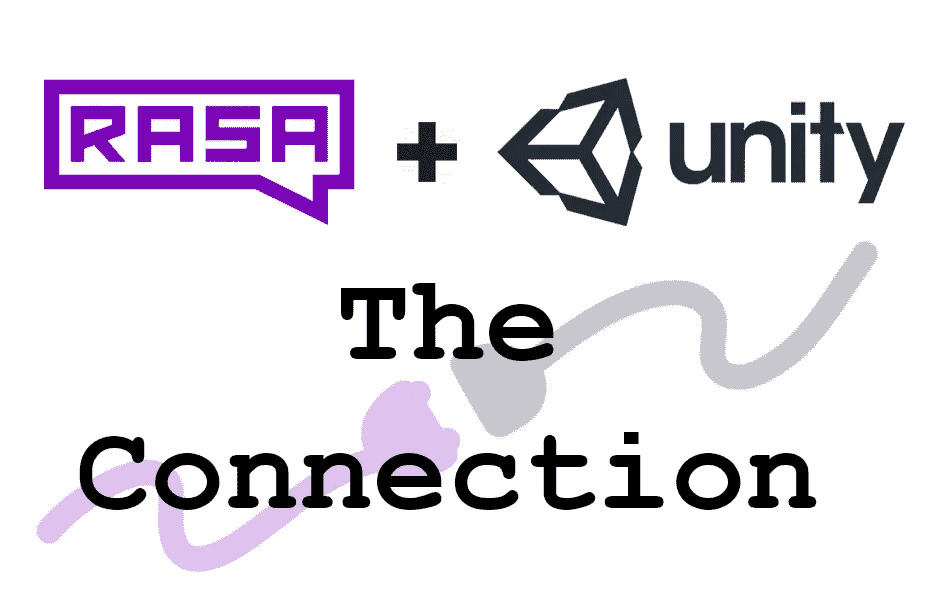
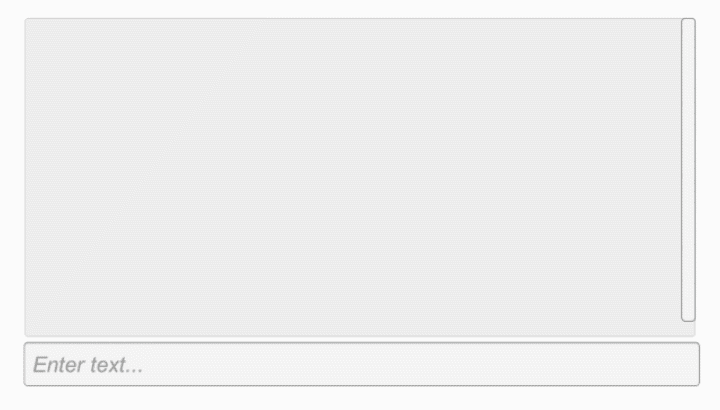
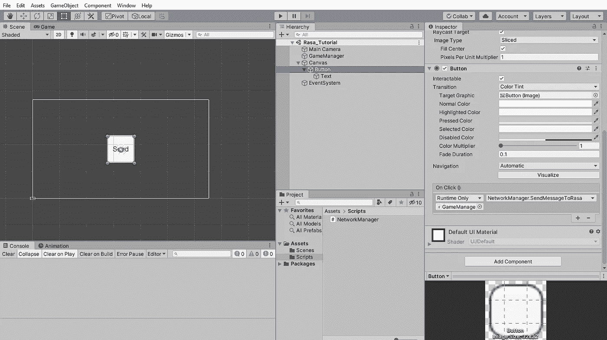
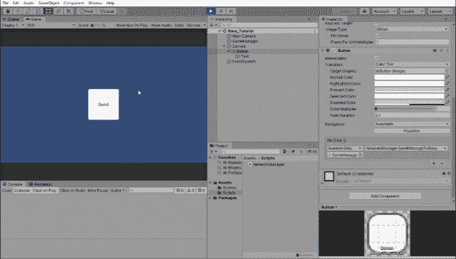
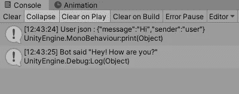

# 将 Rasa 开源聊天机器人集成到 Unity[第 1 部分]:连接

> 原文：<https://medium.com/analytics-vidhya/integrating-rasa-open-source-chatbot-into-unity-part-1-the-connection-9ba582c804cd?source=collection_archive---------5----------------------->

你好！在这个系列中，我们将使用 Rasa 开源框架创建一个聊天机器人，并将其与 Unity 集成，完全支持呈现 Rasa 提供的所有不同类型的响应。相同的源代码可以在[这里](https://github.com/retrogeek46/Rasa-Unity)找到。

我们将从寻找 Rasa 和 Unity 相互连接的方法开始，然后在下一部分继续为玩家创建一个与聊天机器人交互的 UI。

## 介绍

Unity 是一个非常受欢迎的游戏引擎，用于制作 2D、3D、VR/AR/XR 游戏和许多其他应用程序。用它制作的流行游戏的例子有 Ori 和盲目的森林，空心骑士和 Cuphead。你可以在这里阅读更多关于[Unity](https://unity.com/)。

Rasa 是一个开源的对话式人工智能框架，可用于轻松创建聊天机器人，能够与用户互动，并在处理意外输入的同时提供/检索信息。你可以在这里阅读更多关于 [Rasa 的信息。](https://rasa.com/)

# 装置

创建一个文件夹来保存所有相关的代码，并将其命名为 Rasa-Unity。在这个文件夹中，我们将有两个子文件夹，一个包含 Rasa 项目，另一个包含 Unity。让我们从安装所有依赖项开始。

## **Rasa**

使用 rasa 文件夹中的[该网页](https://rasa.com/docs/rasa/user-guide/installation/)中的说明安装 Rasa 和 moodbot。通过运行 Rasa 服务器并在任何浏览器中打开 [http://localhost:5005](http://localhost:5005) 来测试您的安装。你应该得到一个回复“你好，Rasa 1.7.0 ”,最后一部分是 Rasa 安装的版本。

## 一致

使用 [Unity Hub](https://unity3d.com/get-unity/download) 和 Unity 的最新版本(撰写本文时为 Unity 2019.3.0f5)创建一个新的 2D 项目，并在 Unity 文件夹中将其命名为 Rasa。

Rasa 和 Unity 的安装到此结束，现在我们可以开始将它们相互集成。

## 将 Unity 连接到 Rasa 服务器

Unity 可以使用自定义连接器和 POST 请求与 Rasa 通信。Rasa 实现了默认的 rest 连接器，可以在 [**访问 http://localhost:5005/web hooks/rest/web hook**。](http://localhost:5005/webhooks/rest/webhook.)在本教程中，我们将使用这个默认钩子。如果您想创建自己的自定义连接器，请参考[本页](https://rasa.com/docs/rasa/user-guide/connectors/custom-connectors/)，了解如何在 Rasa 中创建自定义连接器。

在我们刚刚创建的 Unity 项目中，在 Assets 下创建两个文件夹 Scripts 和 Scenes。这将有助于保持我们的项目整洁有序。在 Scripts 文件夹中，创建一个名为 **NetworkManager.cs** 的新 C#脚本。这个脚本将包含在我们的 Unity 项目的所有网络相关的代码。

目前我们将有两个方法， **SendMessageToRasa()** 和 **PostRequest()** 。**当用户按下发送按钮时，将调用 SendMessageToRasa()** ，而 **PostRequest()** 将向 Rasa 服务器创建异步 post 请求并检索响应。

我们还创建了一个类 **PostMessageJson** ，它有助于创建 Json 对象，因为 Unity 有一个非常基本的本地 Json 支持。

网络管理器

现在我们将编辑场景来使用这个脚本。

1.创建一个名为 **GameManager** 的空游戏对象，重置其变换，并将 **NetworkManager** 脚本拖到上面。
2。创建一个 **UI 按钮**并重置其转换。添加到检查器窗口中的 **OnClick** ()列表，并拖动上面创建的 **GameManager** 对象。从**网络管理器**下的下拉菜单中选择 **SendMessageToRasa** ()方法。将按钮文本子对象的文本更改为“发送”。

现在，我们准备从 Unity 向 Rasa 发出第一个请求。播放场景，点击发送按钮。您应该会在控制台中收到来自 Rasa 的响应。

来自 Rasa 的响应应该可以在控制台中看到

## 解析聊天机器人响应

服务器返回包含消息和其他相关信息的 json 字符串。为了解析这些信息，我们需要创建类似于发送消息的类。

这些类将是 RootReceiveMessageJson，它提取机器人可能给出的多个响应，而 ReceiveMessageJson 类将提取单个消息。我们还将为这两个类添加**【可序列化】**属性，以便它们采用 Unity 易于存储和重构的格式。要使用**【可序列化】**属性，记得在顶部添加`using System;`。

然后我们将创建一个名为**receive response()**的新方法来解析接收到的响应。这个函数将使用反射来遍历机器人可以响应的所有可能的消息类型。为了使用反射，我们将包括系统。用`using System.Reflection;`反射

带有响应解析器的 NetworkManager.cs

现在，当我们点击发送按钮时，我们将收到从 json 字符串中提取的文本消息。

已经提取了响应中的文本

## 结论

我们用 Rasa 创建了一个聊天机器人，并用 Unity 与它对话。

在下一部分中，我们将研究如何创建一个简单的 UI，用户可以通过它向机器人键入消息并查看响应。