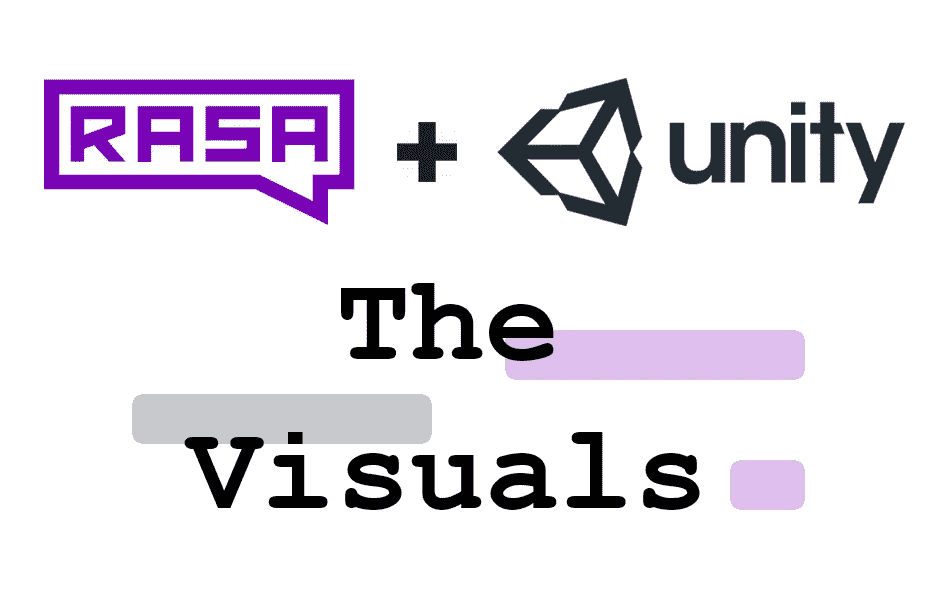
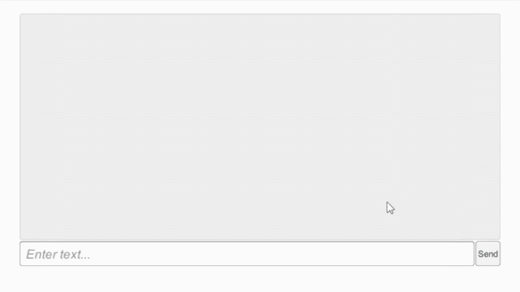

# 将 Rasa 开源聊天机器人集成到 Unity 中[第 2 部分]:视觉效果

> 原文：<https://medium.com/analytics-vidhya/integrating-rasa-open-source-chatbot-into-unity-part-2-the-visuals-f67a915a4b2d?source=collection_archive---------6----------------------->

大家好！在[上一篇文章](/@divyangpradeep/integrating-rasa-open-source-chatbot-into-unity-part-1-the-connection-9ba582c804cd)中，我们在 Unity 中创建了一个聊天机器人，并发送/接收来自它的响应。在定制连接器和 POST 请求的帮助下，我们在两者之间创建了一个链接，并在控制台中打印了结果。

但是在控制台中查看响应一点也不好玩！我们甚至不能打出我们的信息，也没有必要每次都发“嗨”，不是吗？为了解决这个问题，我们将在这部分教程中创建一个简单的 UI。这个项目的源代码可以在[这里](https://github.com/retrogeek46/Rasa-Unity)找到。

## 介绍

我们将创建一个窗口，输入领域，滚动窗口，发送按钮，并在红蓝聊天气泡渲染的消息。我们最终的设置看起来会像这样-

## 资产和预制构件

我们将需要聊天气泡和预置的图像，将在渲染消息时实例化。你可以在这里了解更多关于预置[的信息](https://www.youtube.com/watch?v=H1OkG3a1w-o)。

这个 [**psd 文件**](https://github.com/retrogeek46/Rasa-Unity/blob/master/Unity/Rasa/Assets/Art/Chat%20Bubbles.psd) 有聊天消息气泡的艺术。我们将导入它作为精灵和[**9-拼接**](https://docs.unity3d.com/Manual/9SliceSprites.html) 它来创建我们的聊天泡泡预设。

一旦我们的精灵在编辑器中被分割，我们将命名为**用户泡泡**和**机器人泡泡**。

导入为精灵，9 切片，然后重命名

为了创建预设，我们将首先创建一个 UI **图像对象**(右键单击并选择 UI 下)，然后附加一个空的游戏对象。这个空的游戏对象将被命名为**消息**，并将包含任何要在气泡内渲染的组件(文本、图像等)。父**图像对象**将使用我们刚刚创建的 **User_Bubble** 和 **Bot_Bubble** 来设置其精灵。

创建聊天气泡预设

## 有魔力的剧本

为了在我们的 UI 对象中实现逻辑，我们将创建一个名为 **BotUI** 的新 C#脚本。它将有从用户/机器人话语创建预设的方法，设置/更新它们的位置，并根据响应的类型向空的**消息**对象添加组件。

博推. cs

## 创建游戏对象

需要的游戏对象是**游戏管理器**(已经在上一部分中创建好了)**输入框**、**发送按钮**(也是上一部分中出现的)和一个**滚动视图**。

我们将首先创建这些实例，然后根据需要调整它们的大小。在滚动视图中，我们将**禁用水平滚动**并**删除相关的子对象**。您还可以**增加滚动灵敏度**以使滚动更加灵敏

添加游戏对象

## 图像支持

Rasa 还可以发送**图片链接作为回复**。为了渲染这些图像，我们需要将一个**精灵渲染器组件**添加到我们聊天气泡的**消息**子组件中，并用一个从图像链接创建的 **Texture2D 对象**填充它。

为此，我们将首先创建一个 POST 请求并检索图像数据。一旦完成，我们将创建一个**渲染纹理**，因为只有它们可以使用从 POST 请求接收的字节数据来填充。使用**渲染纹理**我们将创建我们想要的**纹理 2D** ，调整它的大小，然后应用到聊天气泡。

因为聊天气泡已经被渲染了，我们需要刷新我们的气泡位置，以便在图像被加载后考虑它们的新尺寸。因此，在呈现图像后，我们将调用**RefreshChatBubblePosition()**方法。

纹理方法将在一个名为 **Utils.cs** 的新脚本中编写。我们还将把 Json 助手类从**网络管理器**脚本移到这个新脚本中。

我们新的**网络管理器**和**实用程序**脚本如下-

网络管理器

Utils.cs

## 关联脚本和对象

要使用我们刚刚创建的脚本，我们需要将它添加到我们的场景中，并连接必要的游戏对象。将 **BotUI** 脚本附加到 **GameManager** 对象，并将各自的游戏对象拖到脚本变量上。

连线游戏对象和脚本

现在我们只需运行场景并与机器人对话。我将相机颜色改为白色以给出不同的外观，你可以通过改变主相机下**相机组件**的**背景**颜色值来试验不同的东西。

支持图像的用户界面

## 结论

我们在 Rasa-Unity 项目中添加了一个用户界面，并增加了图像渲染支持。我们解决方案的一些缺点是

*   消息之间没有动画/延迟
*   按回车键不能发送信息，必须按发送键

在下一部分中，我们将研究呈现更多的响应类型，并在 mood bot 的基础上构建，以便它可以使用自定义元数据响应触发 Unity 函数，并平滑 UI。