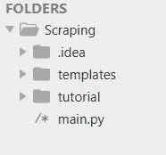

# 将刮刀与烧瓶整合

> 原文：<https://medium.com/analytics-vidhya/integrating-scrapy-with-flask-8611debc4579?source=collection_archive---------1----------------------->


Pexels.com

> Flask 是 Python 的一个 API，它允许我们构建 web 应用程序。Flask 的框架比 Django 的框架更明确，也更容易学习，因为它实现一个简单的 web 应用程序的基础代码更少。

在本文中，我们将看到如何将 scrapy 集成到 FLASK 中来抓取任何网站，并构建一个 web 表单，这样只需单击一个按钮，整个 Scrapy 代码就会启动并运行，并将抓取的数据返回给我们。

这篇文章是我上一篇文章的续篇，在那篇文章中，我解释了如何使用产品 URL 抓取亚马逊评论，但如果你有自己的 scrapy 项目，并想学习如何将其与 flask 合并，那么你也很适合，因为基本结构几乎是相同的。

最后给出了该项目的工作演示。

> 步伐

1.  *制定项目结构。*
2.  *创建一个 HTML 表单。*
3.  *修改了之前* [*条*](/analytics-vidhya/web-scraping-a-to-z-using-scrapy-6ece8b303793) *中的刺儿头代码。*
4.  *用刮刀连接烧瓶。*

> 流程图


# 我们开始吧

> 建立项目结构

*   让我们首先创建一个名为“Scraping”的项目文件夹，并在该文件夹中添加我们在[上一篇文章](/analytics-vidhya/web-scraping-a-to-z-using-scrapy-6ece8b303793)中创建的教程文件夹(Scrapy 项目文件夹)。
*   现在在这个抓取文件夹中创建一个名为“main.py”的 python 文件，它将是我们的主 FLASK 文件。
*   现在，在同一个抓取文件夹中创建一个名为“templates”的文件夹，其中包含一个名为“index.html”的 HTML 文件
*   完成这些步骤后，项目结构应该是这样的，



> 创建 HTML 表单

*   因此，在编写主要的 FLASK 代码之前，让我们先创建一个 HTML 表单，稍后我们将把它连接到 FLASK。
*   进入 index.html 文件，为我们的基本 HTML 表单添加以下代码。在后面的步骤中，我们将把这个表单连接到我们的主 Flask 代码。

> 更新 Scrapy 代码

*   现在，我们将更新我在之前的[文章](/analytics-vidhya/web-scraping-a-to-z-using-scrapy-6ece8b303793)中解释的 Scrapy 代码，以获取输入的 URL 并在其上进行抓取。
*   对于有自己不同的 scrapy 项目的读者，你也应该参考这段代码，看看如何将 URL 作为输入，因为稍后我们会将 URL 从 flask 传入其中。
*   转到“amazon_scarping.py”文件(包含主碎片代码的文件)和类 ReviewspiderSpider(主碎片类)中，并在 parse 函数前添加以下代码。

> 书写烧瓶代码

*   现在进入 main.py 文件并导入以下库

*   注意:如果您还没有安装这些库，那么您应该首先使用 pip 从您的终端安装这些库。
*   要安装所需的库，进入您的终端并运行，

```
pip install crochet
pip install flask
pip install scrapy
```

*   现在，我们将定义基本的 Flask 结构，从表单中获取链接，并将其存储在 myBaseUrl 变量中。
*   获得链接后，我们将把它传递给下一步中提到的抓取函数，并将抓取的数据存储到 output_data 列表中，并返回 jsonified 输出。

*   现在我们将定义两个函数，其中的代码将迭代，直到整个抓取过程完成。
*   首先，scrape_with_crochet 函数将连接到 dispatcher，这将有助于维护该循环。
*   现在，代码将转到内置的 scrapy crawl_runner 函数，对于 scrapy 文件中的每个 yield 响应，控件将转到 crawl_result 函数，并将该项追加到 output_data 列表中。

就这样，我们结束了！

> 运行项目

*   从您的终端，进入刮擦文件夹目录并运行，

```
python main.py
```

*   现在转到运行项目的本地主机地址，例如 [http://127.0.0.1:5000/](http://127.0.0.1:5000/)
*   在表单中输入任何亚马逊产品的 URL，然后点击分析评论按钮，之后，您将在您的页面上看到抓取的数据。
*   您的整个抓取的数据文件存储在教程文件夹中。

> 完整代码

> 最终作品

这是最终项目的运作方式，


# 结论

*   因此，我们将整个 Scrapy 代码与 Flask 集成在一起，这样只需点击一个按钮，整个产品评论数据就会被抓取并存储在一个 JSON 文件中。
*   现在在这个项目中发生的是，每当你抓取一个链接时，它的数据被存储在一个列表中并显示出来，但当你用相同的链接重新运行代码时，它将再次执行整个抓取过程，这是非常低效的。
*   这就是为什么在[的下一篇文章](/analytics-vidhya/connecting-scrapy-to-mysql-database-in-flask-256adc70b321)中，我解释了如何创建一个**数据库**并将我们抓取的数据存储在其中，当用户输入一个 URL 时，我们的代码将首先检查它是否已经被抓取，如果是，它将从数据库中获取数据，而不是再次抓取。
*   欢迎在评论区提出你对这篇文章的疑问。
*   在 [LinkedIn](https://www.linkedin.com/in/rohan-goel-b0a6ab160/) 上和我联系。