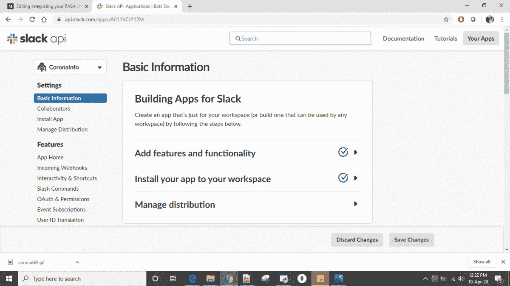

# 整合你的 RASA 聊天机器人和 Slack

> 原文：<https://medium.com/analytics-vidhya/integrating-your-rasa-chat-bot-with-slack-c18bffc6018b?source=collection_archive---------3----------------------->

嗯，我最近使用 RASA 框架构建了我的第一个对话聊天机器人，并开始探索将我的聊天机器人与一些标准的可用交互工具集成的方法。

我发现 slack 是可用的最佳选项之一，但我很难将 RASA 与 Slack 整合，因为我在网上找到的大多数帮助文章都不是最新的。因此，我想到写这篇文章来写下做上述工作所需的步骤，以便它可以帮助像我一样受困于这项任务的其他开发人员。

首先，集成中涉及到许多简单的步骤，我需要你耐心地阅读这篇文章。我会尽量保持文章的简洁，不遗漏任何关键步骤，我保证如果你遵循这些步骤，你会有一个适合自己的 slack bot。

> 在继续之前，看看 RASA bot 与 Slack 集成后的样子可能是个好主意。我制作了一个简单的机器人，用于了解我的国家(印度)任何特定地区的冠状病毒数字。

机器人在空闲时与用户交互

# 这篇文章是写给谁的？

任何已经*开发了 RASA 聊天机器人的人都在寻找将其与 Slack 整合的方法。*

# *先决条件:*

> 1.在你的本地机器上一个完全工作的 RASA 聊天机器人。(在尝试集成之前，请确保您已经在本地系统上全面测试了 bot。)
> 
> 2.Ngrok 软件，用于在本地 RASA bot 和 Slack 之间创建隧道，以便通过安全链接交换消息。你可以从[这里](https://ngrok.com/download)下载 ngrok 软件。继续在您的系统上安装它。
> 
> 3.互联网连接正常。

仅此而已。有了这三件重要的事情，你就可以直接开始下一步了。

# 步骤:

1.  *创建松弛应用*

在创建 slack *app* 之前，您需要使用您的电子邮件 id [在这里](https://slack.com/create#email)创建一个 slack *workplace* 。创建工作区后，您可以在该工作区内从[这里](https://api.slack.com/apps)快速创建一个新应用。

一旦您创建了应用程序，您将被引导至*基本信息*部分，您应该向下滚动以到达*显示信息*。在这里，您可以选择为您的机器人填充名称、描述、照片和背景颜色。请注意，所有这些属性都是可选的，但我建议您添加这些属性，以使您的机器人看起来直观。

填写完上述属性后，*保存更改*选项应被激活。您应该单击它来确认更改。

显示信息

2.*您的机器人的授权和许可*

填写完*基本信息*部分后，您应该为您的机器人添加权限，这样它就可以与任何想要与您的机器人互动的人一起读写文本消息。

要添加权限，导航到页面左侧菜单上的 *OAuth &权限*选项卡，并向下滚动到*范围*部分。

将 **chat:write、im:read、im:write、im:history** 和 **mpim:history** 从下拉列表添加到 *Bot 令牌范围。*添加后应该类似下图。

Bot 令牌范围

现在，向上滚动并点击*安装应用*选项，以这些权限在 slack 上安装应用。将出现一个弹出窗口，通知您的机器人正在请求您的工作空间的权限。继续并点击允许。

在安装了具有权限的应用程序后，您将获得*密钥*来连接您的 slack bot 和 RASA bot。该密钥以 **xoxb-** 开头，被称为 **Bot 用户 OAuth 访问令牌**，在 *OAuth &权限*部分下可见。该令牌看起来像下面这样。(出于显而易见的原因，我故意隐藏了我的令牌。)

Bot 用户 OAuth 访问令牌

3.*设置凭证. yml 页面*

下一步是复制上述 bot 令牌并粘贴到 RASA 项目的 credentials.yml 页面中。注意，在 *credentials.yml* 中已经有一个关于 slack 的注释部分。只需取消对该部分的注释，并添加令牌作为参数 *slack_token* 的值。保持*松弛通道*参数为空。

作为参考，在此阶段，您的 credentials.yml 文件应该如下所示:

credentials.yml

4.*运行动作、ngrok 和 shell 的脚本。*

这是倒数第二步，您需要运行以下脚本:

a.运行操作服务器

在运行动作脚本之前，确保取消注释项目的 *endpoints.yml* 页面中的 action_endpoint 标签。

endpoint.yml

现在，使用 anaconda 提示符，使用以下命令在本地机器上启动 RASA 操作服务器。(确保您在 RASA 项目目录中)。

正在启动操作服务器

b.运行 RASA shell

另一个关键步骤是从 anaconda 提示符启动 RASA shell。我已经包含了许多用于调试的可选参数，您可以删除其中的一些参数。不用说，在 anaconda 提示符下执行下面的命令时，您需要位于您的 RASA 项目目录中。

RASA shell 启动脚本

c.在本地主机的 5002 端口上启动 ngrok

下一个作业是通过打开命令提示符并键入命令 **ngrok http 5002，在端口 5002 上启动 ngrok。**

成功执行后，您应该会看到类似下面的内容:

ngrok 开始

上图中突出显示的文本(URL)是公共服务器，slack 将使用它与运行在 5002 上的 localhost 进行对话。复制 URL 并追加 **webhooks/slack/webhook** 得到如下内容:

https://e8def6a6.ngrok.io/webhooks/slack/webhook

请注意，以上网址因人而异，您应该使用自己的 ngrok 网址进行整合。

我知道有很多工作要做，但请耐心等待，因为我们几乎已经完成了。

5.*松弛状态下的最终配置*

祝贺你完成了整合的最后一步！最后一圈，我们结束了。

在此步骤中，您需要首先从左侧菜单选项转到*事件订阅*部分，然后切换页面上的*启用事件*开关以确保其打开。

启用事件，显示您需要粘贴上面复制的 ngrok URL 的*请求 URL* 部分。如果您严格遵循了上述所有步骤，您将获得针对您的请求 URL 部分的“**验证**备注”奖励。

事件订阅

在同一个页面中，进入*订阅 bot 事件*，添加以下 2 个事件: **message.im** 和 **message.mpim** 。

添加这些事件将提示您保存更改并重新安装应用程序。继续重新安装应用程序，就是这样！

你的机器人现在可以使用了！！

要开始和你的机器人聊天，去[https://slack.com/intl/en-in/](https://slack.com/intl/en-in/)然后点击启动 Slack 去你的工作区。从左侧菜单中选择您的机器人并开始聊天！:)

slack 中的聊天机器人

我希望你能够按照上面的步骤将你的 RASA 机器人与 slack 集成。如果你需要任何澄清，请在评论中提出你的问题，我会很乐意回复你的！

干杯！