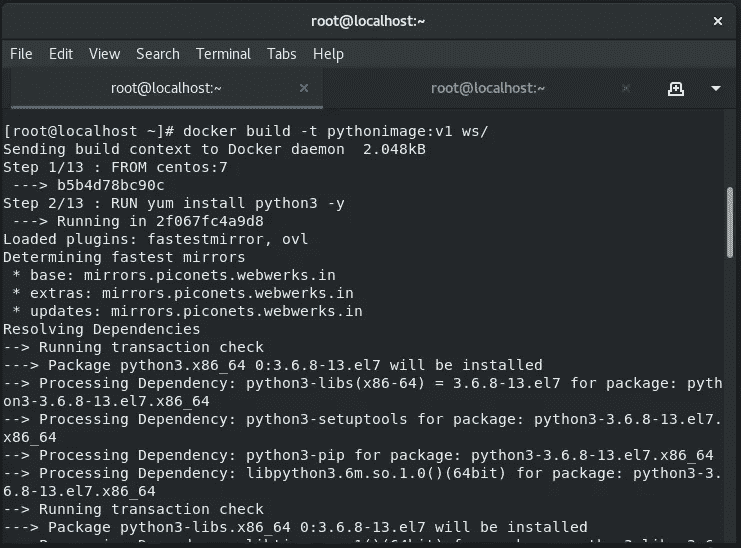

# 机器学习与 Jenkins 的集成🤝

> 原文：<https://medium.com/analytics-vidhya/integration-of-machine-learning-with-jenkins-fb38f808b94c?source=collection_archive---------16----------------------->


# **Mlops 任务- 3 ☆*:**

1.使用 Dockerfile 创建安装了 Python3 和 Keras 或 numpy 的容器映像

2.当我们启动这个图像时，它应该会自动开始训练容器中的模型。

3.使用 Jenkins 中的构建管道插件创建 job1、job2、job3、job4 和 job5 的作业链

4.Job1:部分开发者向 Github 推送回购时自动拉取 Github 回购。

5.Job2:通过查看代码或程序文件，Jenkins 应该自动启动相应的机器学习软件安装解释器安装映像容器，以部署代码并开始训练(例如，如果代码使用 cnn，则 Jenkins 应该启动已经安装了 CNN 处理所需的所有软件的容器)。

6.工作 3:训练你的模型并预测准确性或度量。

7.Job4:如果度量准确度低于 80%，那么调整机器学习模型架构。

8.Job5:重新训练模型或通知正在创建最佳模型

9.为 monitor : If 容器创建一个额外的 job job6，其中应用程序正在运行。由于任何原因失败，则该作业应该从最后一个训练模型离开的地方自动再次启动容器

## **在我们进入实用部分之前，让我们先看看基本概念:**

需要的软件有:

*   Git & Github
*   詹金斯
*   码头工人
*   ngrok(可选)
*   python3 环境


机器学习是一种人工智能(AI ),它允许计算机应用程序(web/软件)在预测结果时变得更加准确，而无需显式执行，即自动执行。它使用提取数据的算法来建立预测模型，选择在哪里寻找洞察力。

## 卷积神经网络；

卷积神经网络由一个输入层和一个输出层以及多个隐藏层组成。CNN 的隐藏层通常由一系列卷积层组成，这些卷积层用乘法或其他点积进行卷积。


## **KERAS (python 模块):**

它是运行在 Tensorflow 之上的用 **Python** 编写的开源神经网络**库**。

📌**创建 keras 模型:**

*   **架构定义:**层数、层中节点数、要使用的激活函数。
*   **编译:**定义损失函数&关于优化如何工作的一些细节。
*   **拟合:**使用您的数据进行模型权重的反向传播和优化循环。
*   **预测:**对准备好的模型进行预测。

📌**为什么使用 keras :**

*   允许简单快速的原型制作(通过用户友好性、模块化和可扩展性)。
*   支持卷积网络和递归网络以及两者的组合。
*   在 CPU 和 GPU 上无缝运行。

# 实用部分✨:

## 💡ngrok 的使用:

使服务器成为公共的，这样 github 就可以根据自动化的需要来访问它。

## 建立隧道的命令:

*   。/ngrok http 8080


在 cmd : **上运行这个命令。/ngrok http 8080** 打开此屏幕

# Jupyter 笔记本:

在进入直通车模型之前，我们将手动检查我们的 ml 代码是否工作正常。所以我在 Jupyter 笔记本上测试我的代码。

在这里，我正在使用 CNN 研究猫狗数据集:


模型预测准确率为 86.07 %，这是一个相当好的数字。


# Github:

创建一个带有初始化的 Github repo(或者您也可以选择 git bash 用于离线模式),并创建 CNN 培训模型的代码文件。


# 码头工人:

首先创建一个包含你的模型的数据集(即 cnn_dataset)和 Dockerfile 的目录，docker file 包含 python 环境和所有必要的模块。我的模型中使用的主要模块是 Keras、Tensorflow 和 pillow。


**Dockerfile**

构建 python 环境映像:

```
docker build -t <image name>:<version>  <path>
```



建成 successfully✌

> **特别点:** Tensorflow 是一个非常大的模块，所以它会花很多时间来导入，即使时间可以延长到 3 小时，也取决于你的网速，所以要有耐心(●'◡'●)。

检查 docker 映像(确认您的映像构建成功与否) :

有时图像构建不成功，会出现悬空图像(即<none>图像)。因此，要删除它，只需运行以下命令→</none>

```
docker rmi -f $(docker images --filter "dangling=true" -q           --no-trunc)
```


# 詹金斯:

让我们继续到 Jenkins 部分，首先安装所有需要的插件，它们是:

*   开源代码库
*   构建管道/交付管道(管道视图)
*   电子邮件分机
*   电子邮件扩展模板
*   职位直邮

***Job1:** 拉 Github 回购。并下载 ml 模型训练代码。


***Job2 :** 现在启动包含 python 环境的容器来部署代码，并开始训练模型，通过查看代码来检查准确性。在这里，我使用 CNN 代码来训练模型。


***Job3 :** 首先我们进入容器并运行命令来分析代码、训练模型并预测准确性。


***Job4 :** 只有准确率≥80%，该作业才会以达到的准确率将邮件发送给开发者。否则，调整 job3 并再次开始训练模型。并且这个过程将继续下去，直到不能达到期望的精度。


## 🤔**成功完成邮件部分需要做哪些事情❓**

> **所有细节都在我之前的博客里所以可以参考→**[https://medium . com/@ raniagrawal 2001/setup-of-Jenkins-docker-container-f 09 e 0 b 77 ed 9？source = friends _ link&sk = 8d 099723 bb 16 FD 099 a 00 f 7 f 921 fa 277d](/@raniagrawal2001/setup-of-jenkins-docker-container-f09e0b77ed9?source=friends_link&sk=8d099723bb16fd099a00f7f921fa277d)

在这里，我提到了成功发送电子邮件所需的细节和主要插件。

除此之外，对于此任务，在后期生成操作中还需要一些高级设置。这些问题如下👉


***Job5 :** 该作业的主要职责是每小时监控一次活动，如果流程出现问题，它将移除之前的容器，调整 job2 并重新启动容器。


# ***管线视图***

管道终于成功建成:


*构建管道视图*

## 联系方式:

> Github:[https://github.com/rani-gupta/ML_Jenkins.git](https://github.com/rani-gupta/thirdtask.git)
> 
> **领英:**[https://www.linkedin.com/in/rani-gupta-07a828180](https://www.linkedin.com/in/rani-gupta-07a828180)
> 
> **邮件:**raniagrawal2001@gmail.com