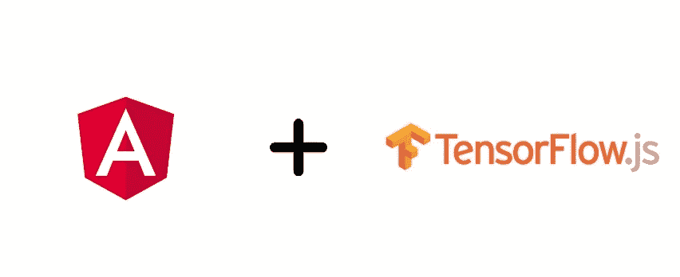
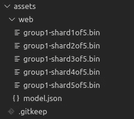
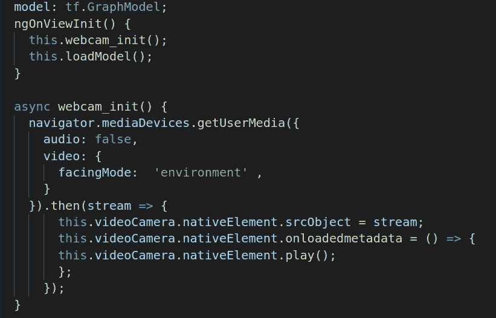
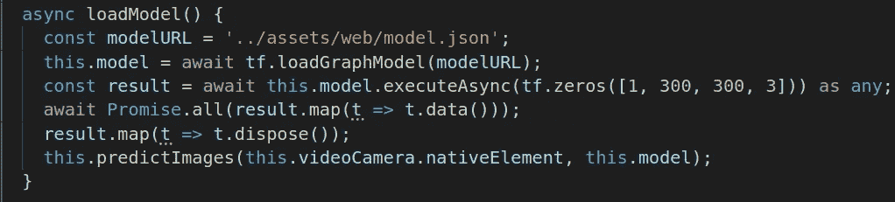
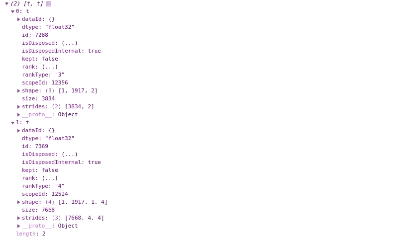

# 张量流 JS 模型与角度应用的集成

> 原文：<https://medium.com/analytics-vidhya/integration-of-tensorflow-js-model-with-angular-application-9d42c6c540a6?source=collection_archive---------2----------------------->

这篇文章是关于各种 ML 模型与 angular 的集成，以创建一些有趣的机器学习 web 应用程序。因此，在 TensorFlow Js 的帮助下，我们可以完全在浏览器的客户端运行机器学习程序，以非常低的延迟进行更快的预测。



所以让我们开始吧。第一步是将现有的 saved_model 或 freeze model 转换为 model.json。对于转换，我们将使用 tensorflowjs_converter

**第一步** : **型号转换**。

通过使用以下命令首先安装 TensorFlow Js 来转换您的现有模型

```
$ pip install tensorflowjs
```

TensorFlow Js 最好的一点是它独立于模型的类型。它与保存的模型以及用于转换的冻结模型都兼容。

对于**保存的模型**:运行以下命令。

```
$ tensorflowjs_converter \
    --input_format=tf_saved_model \
    --output_node_names='MobilenetV1/Predictions/Reshape_1' \
    --saved_model_tags=serve \
    /mobilenet/saved_model \
    /mobilenet/web_model
```

**注意:**其中 **/mobilenet/saved_model** 是 saved_model.pb 文件及其权重所在的**输入路径**目录，而 **/mobilenet/web_model** 是存储转换后的 model.json 及其碎片文件的**输出路径**。

对于**冻结模型**:运行以下命令

```
$ tensorflowjs_converter \
    --input_format=tf_frozen_model \
    --output_node_names='MobilenetV1/Predictions/Reshape_1' \
    /mobilenet/frozen_model.pb \
    /mobilenet/web_model
```

注意:其中**/mobilenet/frozen _ model . Pb**为**输入路径**，而 **/mobilenet/web_model** 为**输出路径**，model.json 将在转换后存储在其中。

**注意:如果在模型转换过程中遇到 NonMaxSupressionV5 错误，则尝试通过将 tensorflow 版本降级到 1.14.0 来重新训练模型，然后再次遵循相同的模型转换过程。**

```
For successful model conversion the following are the requirements:
1\. tensorflow  v_1.14.0
2\. tensorflowjs v_1.3.2
```

**让我们用角度来整合模型**

我们假设使用 angular-cli 创建了所需的组件。

**第二步**:在客户端安装 TensorFlow Js。

```
$ npm install @tensorflow/tfjs -- save
```

**步骤 3:** 将 model.json 文件及其生成的碎片文件放在 assets 文件夹中。



**步骤 4:** 为了预测，我们在组件的 HTML 中添加一个画布和一个视频元素。

```
<video #videoCamera hidden id="video"></video>
<canvas #canvas id="canvas"></canvas>
```

根据要求确定它们的宽度和高度。

添加 **ViewChild** decorator 以获取元素的引用，并添加摄像机配置。

```
[@ViewChild](http://twitter.com/ViewChild)('videoCamera', {static: true}) videoCamera: ElementRef;
[@ViewChild](http://twitter.com/ViewChild)('canvas', {static: true}) canvas: ElementRef;
```

以下代码块用于初始化**摄像机**及其配置。



**第五步:**现在该加载模型预热了。



这里我们使用了 tf.loadGraphModel()而不是 tf.loadFrozenModel()，因为 TFJS 在其最新更新中不赞成使用 tf.loadFrozenModel()函数。最新的 TFJS 版本支持两个加载模型的函数

1.  tf.loadGraphModel()
2.  tf.loadLayersModel()

```
***The fun fact***
TensorFlow Js has just renamed the function names.
tf.loadFrozenModel() ---------> tf.loadGraphModel()
tf.loadModel() ----------> tf.loadLayersModel()
```

**第六步:**将连续的视频流传递给模型进行预测。

首先，我们需要对图像进行预处理，将画布图像转换为 **float32** 格式。然后将预处理后的图像传递到模型中进行预测。该模型将张量作为输出返回，我们需要将它转换为数组格式。下面是预测连续图像帧的代码块。

```
async predictFrames(video,model) { const image = tf.tidy(() => {
           let img = this.canvas.nativElement;
           img = tf.browser.fromPixels(img);
           img = tf.cast(img, 'float32');
           return img.expandDims(0);
     } const result = await this.model.executeAsync(image) as any;
     const prediciton = Array.from(result.dataSync()); if(predicion.length > 0) {
         this.renderPrediction(prediction);
     } else {
         const canvas = this.canvas.nativeElement;
         const ctx = canvas.getContext('2d');
         canvas.width = 350;
         canvas.height = 450;
         ctx.clearRect(0, 0, ctx.canvas.width, ctx.canvas.height);
         ctx.drawImage(video, 0, 0, 350, 450);
     } requestAnimationFrame(() => {
         this.predictImages(video, model);
     });
}
```

**预测图像函数**被递归调用**进行**连续预测。****

**第七步:为**预测绘制**边界框**。****

```
renderPredictions(predictions: any) {
     const canvas = this.canvas.nativeElement;
     const ctx = canvas.getContext("2d");
     ctx.clearRect(0, 0, ctx.canvas.width, ctx.canvas.height);                  ctx.textBaseline = "top";
     ctx.drawImage(this.videoCamera.nativeElement, 0, 0, 350, 450); 

     predictions.forEach(prediction => {
        const x = prediction.bbox[0];
        const y = prediction.bbox[1];
        const width = prediction.bbox[2];
        const height = prediction.bbox[3]; // Boundary box
        ctx.strokeStyle = "#EB3434";
        ctx.fillStyle = "#EB3434";
        ctx.lineWidth = 3;
        ctx.beginPath();
        ctx.rect(x, y, width, height);
        ctx.stroke(); // label
        const textWidth = ctx.measureText(prediction.class).width;
        const textHeight = parseInt(font, 10); // base 10
        ctx.fillRect(x, y, textWidth + 4, textHeight + 4); }); // rendering the classname at the end to draw over the rect
     predictions.forEach(prediction => {
        const x = prediction.bbox[0];
        const y = prediction.bbox[1];
        if (prediction.class) {
           ctx.fillStyle = "#FFFFFF";
        } 
        ctx.fillText(prediction.class, x, y);
     });
}
```

**因此，我们成功地将 model.json 与 angular 集成在一起。在浏览器中加载模型的主要好处是减少延迟和传输时间。**

****注:不同的模型以张量的形式返回不同的输出。****

**这是解释**

**控制台的下图是模型输出的示例**

****

**这两个张量表示了很多东西，但是现在让我们集中在形状上。我们可以在两个数组中找到不同之处。**第一张量**包含形状为**【1，1917，2】**的**盒子分类分数**，第二张量**包含形状为**【1，1917，1，4】的**盒子位置**。******

```
*where 1917 = the number of box detectors;
         2 = the number of classes;
         4 = the number of co-ordinates for the box.*
```

以下是完整代码块的链接:[*https://github.com/kushhingol/tfjs-integration*](https://github.com/kushhingol/tfjs-integration)

**总结**

1.  在这篇文章中，我们最初讨论了现有的转换。使用 tensorflowjs 将 pb 模型转换为 model.json。
2.  第二部分包括使用 tensorflowjs 将 model.json 与 angular 集成。
3.  讨论了张量形式的模型输出及其各种表示和形状。
4.  **主要原因**:将模型加载到浏览器本身的主要原因和好处是消除延时和数据传输延迟。现在有了 TensorFlow Js，在 tfjs converter 的帮助下，完全可以将您现有的模型转换为 javascript 版本。当涉及到实时预测时，许多应用程序更喜欢这种技术来实现更快预测和准确的结果。