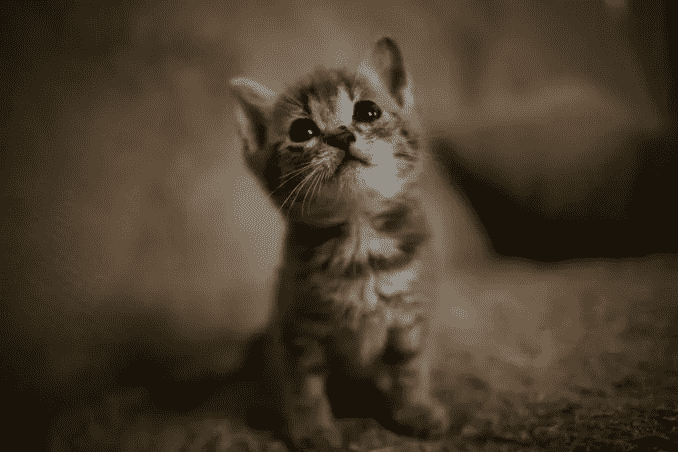
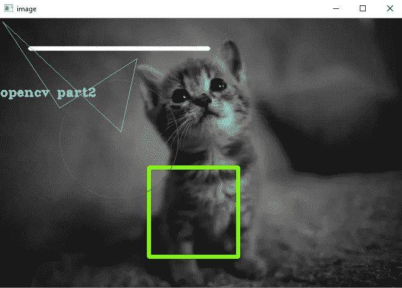
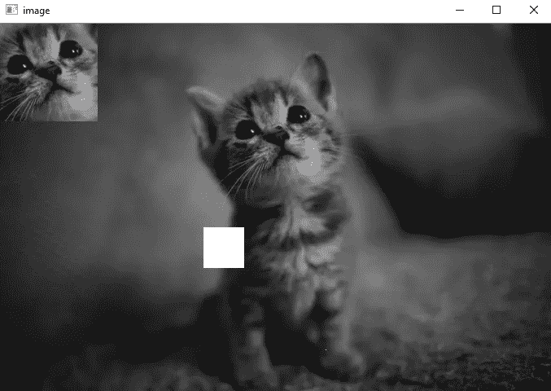

# 与网络摄像头、视频文件和一些打开简历的绘图互动—第二部分

> 原文：<https://medium.com/analytics-vidhya/interacting-with-webcam-and-video-file-and-some-drawing-with-open-cv-part-ii-a38b68196a19?source=collection_archive---------13----------------------->


公开简历(第二部分)

你可以在这里阅读第一部分

在第 1 部分中，我们学习了 **imread()** 方法、 **imshow()** 方法，以及在窗口中显示图像并通过按任意键来破坏它，所以在这一部分中，我将不解释这些行。让我们开始— —

首先，我们将看到如何绘制一些形状或如何从打开简历的图像上写文本。如你所知，我们首先导入库来做相关的事情，所以我不会在每一部分都告诉你，但是当导入新库时，我会向你解释。

这是代码—



cat.png(我的形象)

```
image=cv2.imread(**'cat.png'**,cv2.IMREAD_COLOR)

cv2.line(image,(50,50),(350,50),(255,255,255),5,cv2.LINE_AA)

cv2.rectangle(image,(250,250),(400,400),(0,250,125),5)

cv2.circle(image,(200,203),100,(0,0,255),1)

points=np.array([[4,5],[100,150],[230,67],[203,190]],np.int32)
cv2.polylines(image,[points],**True**,(255,255,0),1)

font=cv2.FONT_HERSHEY_COMPLEX_SMALL
cv2.putText(image,**'opencv part2'**,(0,130),font,1,(200,234,123),2,cv2.LINE_8)

cv2.imshow(**'image'**,image)

cv2.waitKey(0)
cv2.destroyAllWindows()
```

我会一行一行地解释上面的代码-

> 第 1 行—使用 cv2 读取图像。第一个参数是图像文件，第二个参数是图像的颜色，我们用 **cv2 拍摄彩色图像。IMREAD_COLOR。**
> 
> 第 2 行——在第 2 行中，我们用方法 **cv2.line()** 在图像上制作直线。在该方法中，我们给出类似于图像的参数，线的原点、线的终点、颜色(BGR 格式)、线的粗细和线的类型(通过 **cv2)。LINE_AA** )。你可以选择更多的线型(当你在 pycharm 中输入第一个字母 L 时，它会在下拉列表中显示类似的内容，然后你可以从中选择)。
> 
> 第 3 行——在第 3 行中，我们用方法 **cv2.rectangle()** 在图像上制作矩形。在这个方法中，我们给出类似图像的参数，矩形的左上角点，矩形的右下角点，颜色(BGR 格式)，矩形的厚度，你也可以给出矩形的线型(通过 **cv2。LINE_AA** )。
> 
> 第 4 行——在第 4 行中，我们用方法 **cv2.circle()** 在图像上画圆。在这种方法中，我们同样给出参数图像、圆心、圆的半径、颜色(BGR 格式)、圆的厚度，你也可以给出圆的线型(通过 **cv2。LINE_AA** )。
> 
> 第 5 行和第 6 行——在第 5 行和第 6 行，我们用方法**cv2 . polysis()**在图像上制作多边形。首先我们将制作 **numpy 数组**中的点(多边形的点)，然后在**cv2 . polysis()**方法中我们同样给出参数 image，points(点的数组)，多边形是否闭合(真与假)，颜色(以 BGR 格式)，多边形的粗细以及你也可以给出圆的线型(通过 **cv2)。LINE_AA** )。
> 
> 第 7 & 8 行——在第 7 & 8 行中，我们用方法 **cv2.putText()** 将文本放在图像上。首先我们将使字体的**变量**存储字体的值(这里**我们用** **cv2 给出 cv2 字体)。FONT_HERSHEY_COMPLEX_SMALL** ，然后在 **cv2.putText()** 方法中我们同样给出参数 image，Text(ex — opencv part2)，text 的起点，FONT，fontscale，color(BGR 格式)，text thickness，你也可以给出文本的线型(通过 **cv2)。LINE_AA** )。
> 
> 之后，我们展示图像并摧毁它(我在第一部分解释过)。

结果是——



绘图后的图像

现在我们将看到一些更有趣的事情。

当我说我们可以剪切图像的一部分，并将其设置在图像的另一部分时，有多少人会感到惊讶？是的，这可以通过打开 cv 来实现，通过打开 cv，你可以改变图像中任何像素的颜色。

> print(image[400，400])#输出:某种 BGR 格式的颜色((###，##，##))
> 
> image[400，400]=(255，255，0)
> 
> print(image[400，400]) #output: (255，255，0)

image[400，400]表示您正在选择图像的(400，400)点，当您打印它时，它将为您提供该点的颜色(以 BGR 格式)，当您通过“image[400，400]=(255，255，0)”更改颜色图像时，它将为您提供(255，255，0)的颜色。

你也可以改变图像中大片区域的颜色—

```
#image[x1:x2,y1:y2]
image[250:300,250:300]=[255,255,255]
```

这里 250:300 是 x 轴上从 250 到 300 的 x 范围，250:300 是 y 轴上从 250 到 300 的范围，因此这些点覆盖的区域变为白色([255，255，255])。

让我们把图像的一部分放到另一部分—

```
cat_face=image[80:200,280:400]
image[0:120,0:120]=cat_face
```

我们将图像部分存储在 cat_face 变量中，cat_face 的大小为[200–80，400–280]，这就是为什么您只能将此图像放入该大小的空间中。也就是说，我们将猫脸放在图像[0:120，0:120]中(这些数字可以是任何数字，但差异应该与猫脸大小相同，例如图像[300:420，100:220])。

你自己去理解吧，这太容易理解了。

结果图像是—



猫的最终形象

# **现在是时候介绍一些关于网络摄像头和视频文件的知识了**

图像和视频没有太大的区别，我们可以说视频是图像帧的集合。所以我们将尝试通过 opencv 来理解这一点。

```
image_capture=cv2.VideoCapture(0)
**while True**:
    ret,frame=image_capture.read()
    cv2.imshow(**'frames'**,frame)
    **if** cv2.waitKey(1) & 0xFF == ord(**'m'**):
        **break** image_capture.release()
cv2.destroyAllWindows()
```

在第一行中，我们通过 cv2 创建了 image_capture 对象。VedioCapture(0)，我给参数 0，因为我还没有使用摄像机(假设你正在制作视频，在那个时候你运行代码，所以你给参数 1)。之后，我们运行 while 循环进行无限循环，在 while 循环中，我们连续读取图像帧( **image_capture.read()** )有两个变量 ret 和 frame，ret 是布尔值，如果您的相机给出当前时间的图像，那么它是真的，但当出现问题时，那么值是假的。帧是您相机的当前图像。之后，我们在名为 frames 的窗口中连续显示帧( **cv2.imshow('frames '，frame)** )。这个 while 条件将使循环无限循环，所以我们将不得不在某处停止它，因为我们将使用 if 条件，这样当我们按下 m 按钮时，它就可以中断 while 循环。它会给你一个每时每刻的图像，你会认为那是视频。所以在中断 while 循环之后，我们必须释放视频捕获进程(image_capture.release())。

**你还可以改变视频的背景主题**，比如你可以把它变成灰色。

```
#you have to put this code in while loop
gray=cv2.cvtColor(frame,cv2.COLOR_BGR2GRAY)
cv2.imshow(**'gray'**,gray)
```

在上面的代码中，我们转换每一帧的颜色(通过 **cvtColor()** 方法)并在另一个名为 gray 的窗口中显示。

所以运行后，我们可以看到两个窗口，第一个是自然视频，第二个是灰色视频

**你也可以通过写一些代码来保存这些视频— -**

```
image_capture=cv2.VideoCapture(0)
folder=cv2.VideoWriter_fourcc(***'XVID'**)
out=cv2.VideoWriter(**'output.mp4'**,folder,20.0,(640,480))
**while True**:
    ret,frame=image_capture.read()
    out.write(frame)
    cv2.imshow(**'frame'**,frame)
    **if** cv2.waitKey(1) & 0xFF == ord(**'p'**):
        **break** image_capture.release()
out.release()
cv2.destroyAllWindows()
```

在上面的代码中，你知道的最多，所以我只解释几行。在第二行，我通过 **VideoWriter_fourcc(*'XVID ')对我的视频进行编码(编码是 XVID)。**在第三行我们给出了关于视频文件 **(cv2)的信息。VideoWriter('output.mp4 '，folder，20.0，(640，480))** )第一个参数是视频文件的名称，第二个是编解码器，第三个与视频的速度有关(当您增加值时，视频速度也会增加)。之后，在 while 循环中，我们必须制作每一帧的视频，并将其保存在该文件中( **out.write(frame)** )。

如果你看到你当前的工作目录中会有一个以你名字命名的视频。

这部分到此为止。

在第三部分，我们将阅读更多关于公开简历的内容。

谢了。