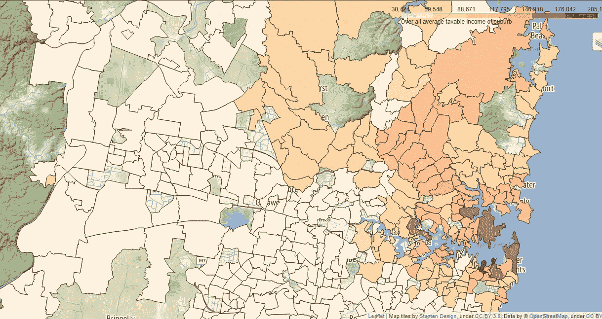
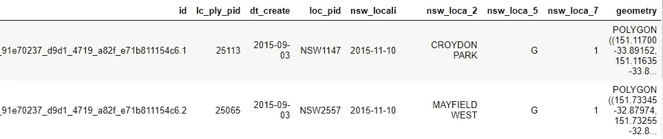
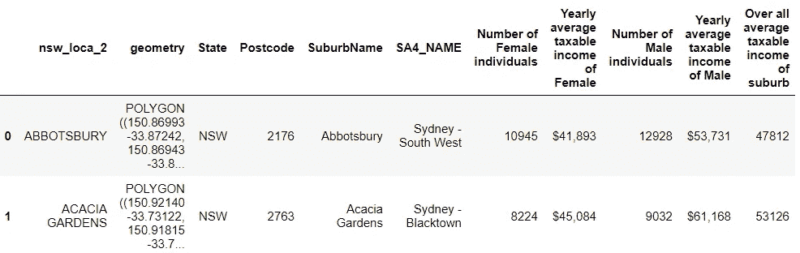
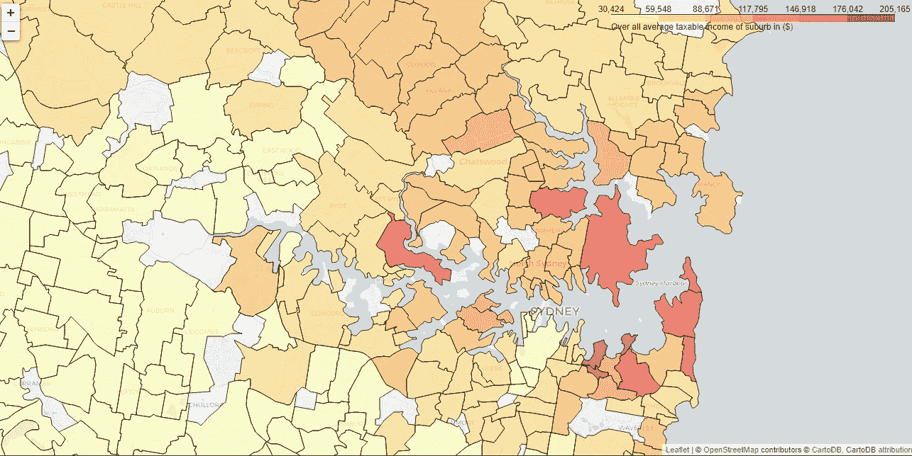
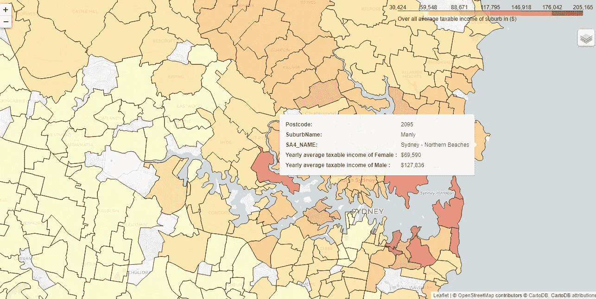

# 使用 leav 的 Python 交互式 Choropleth 地图

> 原文：<https://medium.com/analytics-vidhya/interactive-choropleth-map-in-python-using-folium-4e1479d9e568?source=collection_archive---------7----------------------->



最近，我在做一个地理数据分析项目，在这个项目中，我需要创建一个覆盖了度量标准的交互式等值线图。所以，我想到和你分享我的学习。

那么什么是 Choropleth 地图呢？先来了解一下。choropleth 是一种[专题地图](https://en.wikipedia.org/wiki/Thematic_map),其中区域按照统计变量的比例进行着色或图案化，该统计变量代表每个区域内地理特征的汇总，如人口密度、平均收入。

在花了大量时间观看在线教程以获得用于 choropleth 地图的最简单的包，并在各种库之间周旋之后，我最终登陆了 lyum。我花了一些时间四处游玩，探索不同的选择；我终于得到了我想要的。“叶子”非常适合我的任务。

要创建 choropleth 地图，您只需要一个描述地理特征的 [geoJson](https://geojson.org/) 文件和一个保存要绘制的细节的文件。

理论知识够了！现在是时候用实际的东西弄脏我们的手了。

1.  **导入库**

我用一个 Jupyter 笔记本来完成我所有的编码部分。让我们从导入所有必需的库开始。在这里，我将与[熊猫](https://pandas.pydata.org/)、[地质熊猫](https://geopandas.org/)和[树叶](https://python-visualization.github.io/folium/)一起工作。

```
*# importing all necessary libraries*
**import** **folium**
**import** **geopandas** **as** **gpd**
**import** **pandas** **as** **pd**
```

这是一个简单的概述-

[](http://python-visualization.github.io/folium/)****:**它允许我们在交互式单张地图上可视化数据并使用 Python 处理过的数据。**

****2。导入数据相关性****

**一旦安装了所有的库，现在是时候将我们的数据依赖关系加载到笔记本中了。由于我在悉尼工作，我将制作一张悉尼地图，显示郊区男性和女性的平均年收入。我在新南威尔士州数据仓库找到了这个数据集，我必须说他们在公开和访问数据方面做了惊人的工作。我从这个[位置](https://data.gov.au/dataset/ds-dga-91e70237-d9d1-4719-a82f-e71b811154c6/details)下载了 geoJson 文件，这将有助于创建地图。**

**让我们加载两个数据集(。csv 和。geoJson 文件)。**

```
#*Loading data dependencies using geopandas*
syd_geo = gpd.read_file("suburb-10-nsw.geojson")
syd_geo.head(1)
```

****

**这是我的地理数据框的样子。虽然我只对从这个数据集中获取郊区名称(nsw_loca_2)和几何图形感兴趣。这是我的代码:**

```
# Extracting suburb name and geometrysyd_geo=syd_geo[['nsw_loca_2','geometry']]
```

**现在让我们加载我们的 CSV 文件，它包含了郊区男性和女性的收入信息。我们将使用这些信息来创建 choropleth 地图，显示每个郊区男性和女性的平均年收入。**

```
# Loading data dependencies using pandassyd_income = pd.read_csv("Sydney_income_by_postcode.csv")
```

****3。合并并创建一个 geoPandas 数据框****

**太好了！由于我已经在收入文件中对所有必要的计算进行了排序，并且我们在笔记本中有两个数据框，现在是时候将我们的地理数据与收入数据集合并了。让我们来看看。**

```
# Make a geopandas data framesydgeo_gdf=syd_geo.merge(syd_income,on="nsw_loca_2")
sydgeo_gdf.head(2)
```

****

**这就是我最终的地理数据框的样子。现在我们一切就绪，让我们继续创建我们的地图。**

****4。映射****

**当我们创建一个叶子地图，重要的是告诉地图应该集中在哪里，即地图的质心坐标。因此，我们可以通过取平均值来分配坐标，而不是基于假设分配硬编码值，如下所示:**

```
# Assigning centroids to mapx_map=sydgeo_gdf.centroid.x.mean()
y_map=sydgeo_gdf.centroid.y.mean()print(x_map,y_map)151.05959339241434 -33.81584647807083
```

**一旦我们有了质心，我们现在可以创建地图对象。在这里，我将使用 [CartoDB](https://python-visualization.github.io/folium/modules.html) 地图瓦片。这完全取决于你想如何创造，你也可以选择一个以上的瓷砖。**

```
# Creating a map objectsyd_inc_map = folium.Map(location=[y_map, x_map], zoom_start=6,tiles=**None**)folium.TileLayer('CartoDB positron',name="Light Map",control=**False**).add_to(syd_inc_map)
```

**所以舞台已经搭好了。现在，我们将通过传递以下[参数](https://python-visualization.github.io/folium/modules.html)将 geoJson 叠加应用于地图:**

****geo_data:** geopandas 使用地理几何的数据框架**

****数据:** Pandas 数据框，包含需要在 choropleth 地图上显示的值**

****列:**包含要映射的键和值的列**

****key_on:** 这是 geoJson 文件中用于绑定数据的变量。它必须以“特征”开头**

****fill_color:** 可以传递十六进制颜色，或者任何调色板:' BuGn '，' BuPu '，' GnBu '，' OrRd '，' PuBu '，' PuBuGn '，' PuRd '，' RdPu '，' YlGn '，' YlGnBu '，' YlOrBr '和' YlOrRd '。**

****fill_opacity:** 区域填充-不透明度，范围 0–1。**

****threshold_scale:** 可以通过给定不同的阈值标度。**

**回到我们的笔记本-**

```
# Creating choropleth mapsyd_inc_map.choropleth(geo_data=sydgeo_gdf,
             name='Choropleth',         
             data=sydgeo_gdf,
             columns=['nsw_loca_2','Over all average taxable income of suburb'], 
             key_on='feature.properties.nsw_loca_2', 
             fill_color='YlOrRd',
             fill_opacity=0.6, 
             line_opacity=0.8,
             legend_name='Over all average taxable income of suburb', 
             smooth_factor=0,     
             highlight=**True**
                 )
```

**让我们预览一下我们的地图。**

****

**漂亮？我们已经成功地创建了一个带有适当图例的 choropleth 地图，显示了一系列收入。但是等等，还是少了点什么！这张地图完全是静态的。在地图上添加一些信息性的标注怎么样？**

**但问题是我们不能直接给多边形添加标签，因为 follo pleth 不允许我们这样做。**

**但是不要难过！Folium 为我们提供了使用 folio . features . geo JSON 叠加地理要素的自由。**

**我们将使用以下参数向我们的 choropleth 地图添加标签-**

**1)工具提示**

**2)系统功能**

**我们将使用[follow . features . geo JSON](https://python-visualization.github.io/folium/modules.html)Tooltip 方法，该方法允许访问我们希望在地图上显示为标签的属性。这就是我们如何获得邮政编码、郊区名称和平均年薪的方法。**

```
# Adding labels to map
style_function = lambda x: {'fillColor': '#ffffff', 
                            'color':'#000000', 
                            'fillOpacity': 0.1, 
                            'weight': 0.1}SuburbName = folium.features.GeoJson(
    sydgeo_gdf,
    style_function=style_function, 
    control=**False**,
    tooltip=folium.features.GeoJsonTooltip(
        fields=['Postcode'
                ,'SuburbName'
                ,'SA4_NAME'
                ,'  Yearly average taxable income of Female   '
                ,'  Yearly average taxable income of Male   '
               ],
        aliases=['Postcode: '
                ,'SuburbName: '
                ,'SA4_NAME: '
                ,'  Yearly average taxable income of Female   : '
                ,'  Yearly average taxable income of Male   : ' 
                 ],
        style=("background-color: white; color: #333333; font-family: arial; font-size: 12px; padding: 10px;") 
    )
)
syd_inc_map.add_child(SuburbName)
syd_inc_map.keep_in_front(SuburbName)
folium.LayerControl().add_to(syd_inc_map)
```

****

**标记的 Choropleth 图**

**加油..！！我们成功了..！！**

**最后但同样重要的是，我们需要保存地图。下面的代码将图片保存为。超文本标记语言**

```
# Saving mapsyd_inc_map.save("syd_inc_map.html")
```

**原来如此。这是我们用 python 制作的很酷的交互式 choropleth 地图。代码请随意下载我的 Git 资源库中的 [Jupyter 笔记本](https://github.com/ArchaDoriya/Interactive-Choropleth-Map-in-Python-and-Folium)。**

**你也可以在 https://python-visualization.github.io/folium/modules.html[上了解更多关于叶子的知识](https://python-visualization.github.io/folium/modules.html)**

**数据源:**

**收入数据集:[澳大利亚统计局](https://www.abs.gov.au/AUSSTATS/abs@.nsf/DetailsPage/6524.0.55.0022011-12%20to%202016-17?OpenDocument)**

**Geojson 文件:[https://data . gov . au/dataset/ds-DGA-91e 70237-d9d 1-4719-a82f-e71b 811154 C6/details](https://data.gov.au/dataset/ds-dga-91e70237-d9d1-4719-a82f-e71b811154c6/details)**

**下次再见，带着另一个有趣的话题，继续学习吧！**