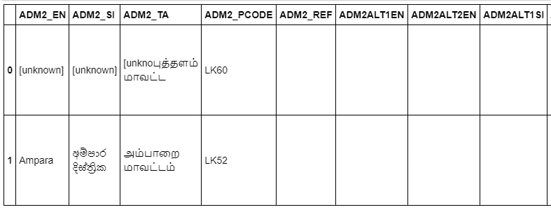
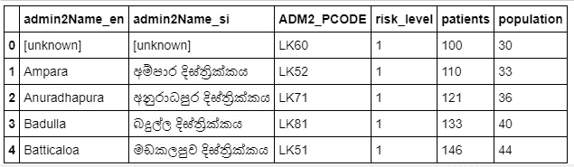
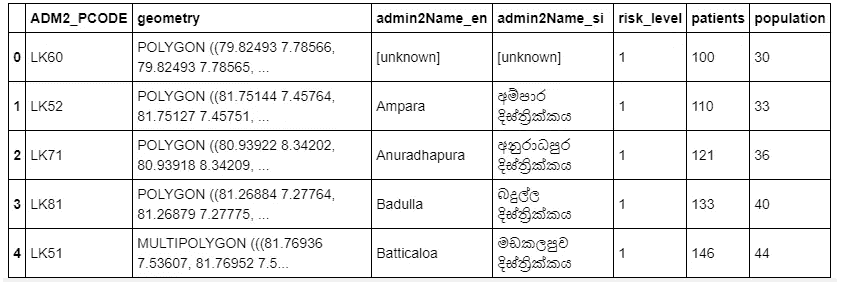
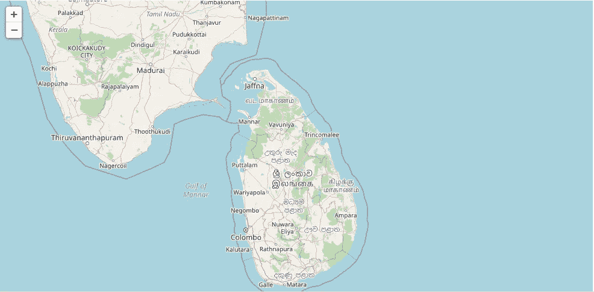
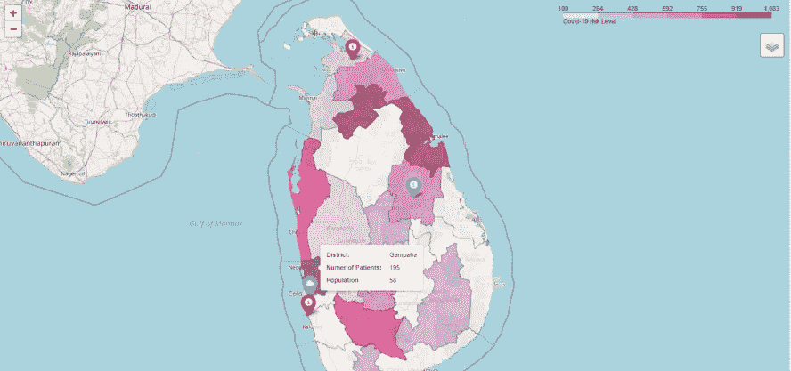

# 斯里兰卡使用 python-folio 的交互式 choropleth 地图

> 原文：<https://medium.com/analytics-vidhya/interactive-choropleth-map-using-python-folium-for-sri-lanka-4f38f86da41d?source=collection_archive---------20----------------------->

## 斯里兰卡地理制图模板


克里斯·劳顿在 [Unsplash](https://unsplash.com?utm_source=medium&utm_medium=referral) 上的照片

想知道这些美丽的地理地图是如何创建的吗？

当你找不到用自己的数据来绘制你的国家或地区地图的方法时，这是令人沮丧的。这就是我们将在本分步指南中讨论的内容。

> 根据维基百科，choropleth 地图是"*" Choropleth 地图提供了一种简单的方法来可视化一个地理区域内的测量值如何变化或显示一个区域内的可变性水平。*

当你试图绘制斯里兰卡的地图时，你想到的第一个问题是**我们有数据吗？** *答案是“是的……”，但是很难找到和清理那些数据。*

您可以从下面获取行政边界数据

 [## 斯里兰卡测量部

### 编辑描述

www.survey.gov.lk](https://www.survey.gov.lk/) 

斯里兰卡有四个行政级别的界线(省、区、分区 sec、Grama niladari)。本文将带您浏览地区级地图(以下 git hub repo [此处](https://github.com/MalakaGu/Sri-lanka-maps)提供了所有四个级别的数据和代码)

# 给我数据和代码

完整的代码和数据集可以在我的 [github](https://github.com/MalakaGu/Sri-lanka-maps) 中找到

# 佐料

1.  Geo-json 文件

2.数据文件(在地图上绘制的附加数据)

3.叶子或 Gmaps

# 秘诀

## Jupyter 笔记本

*在这里，我们将把虚拟数据集映射到地区边界的顶部，并将虚拟数据添加到工具提示*。

```
**import** **pandas** **as** **pd**
**import** **geopandas** **as** **gpd**
**import** **folium**
```

将 Geo-json 文件加载到笔记本

```
#reading the geo-json file we created 
disg = gpd.read_file('District_geo.json')*#removing other data except "ADM2_PCODE" and "geometry"*disg=disg[['ADM2_PCODE','geometry']]
disg.head()
```



```
*# loading aditional data that we want to load to final map other than  properties of Geojson file*dis_a=pd.read_csv('dristrict_aditional_data.csv')
dis_a.rename(columns={'admin2Pcode':'ADM2_PCODE'}, inplace=**True**)
dis_a.head()
```



```
*#merging both geo data and adttioanl data into one data fame for generate map,joining  key is '"ADM2_PCODE""*

district=disg.merge(dis_a,on="ADM2_PCODE")
district.head()
```



1.  启动地图

```
m = folium.Map(location=[7.8731, 80.7718], zoom_start=8)
m
```



2.添加 choropleth 层。

```
choropleth=folium.Choropleth(
    geo_data=district,
    name='choropleth',
    data= district,
    columns=['ADM2_PCODE', 'risk_level'],
    key_on='properties.ADM2_PCODE',
    fill_color='RdPu',
    fill_opacity=0.7,
    line_opacity=0.2,

    legend_name='Covid-19 risk Level',

).add_to(m) 
```

3.添加三个随机位置作为定位销。

```
folium.Marker(
    location=[6.7106,79.9074],
    popup='Point two',
    icon=folium.Icon(color='red', icon='info-sign')
).add_to(m)

folium.Marker(
    location=[7.9403,81.01886823],
    popup='Point three',
    icon=folium.Icon(color='blue', icon='bar-chart')
).add_to(m)

folium.Marker(
    location=[9.3803, 80.3770],
    popup='Point four',
    icon=folium.Icon(color='red', icon='university')
).add_to(m) 
```

4.为与工具提示的交互添加地理边界层。

```
INT = folium.features.GeoJson(
    district,
    style_function=style_function, 
    control=**False**,
    highlight_function=highlight_function, 
    tooltip=folium.features.GeoJsonTooltip(
        fields=['admin2Name_en','patients','population'],
        aliases=['District: ','Numer of Patients:','Population'],
        style=("background-color: white; color: #333333; font-family: arial; font-size: 12px; padding: 10px;") 
    )
)
m.add_child(INT)
m.keep_in_front(INT)
folium.LayerControl().add_to(m)m
```

瞧啊。！！！！！！



斯里兰卡地区地图

有用的链接

[](https://python-visualization.github.io/folium/) [## 0.11.0 文件

### 基于 Python 生态系统的数据优势和库的映射优势。操纵…

python-visualization.github.io](https://python-visualization.github.io/folium/) [](https://data.humdata.org/dataset/sri-lanka-administrative-levels-0-4-boundaries) [## 斯里兰卡行政级别 0-4 级边界

### 斯里兰卡行政级别为 0(国家)、1(省)、2(区)、3(地区秘书处)和 4(乡镇政府)

data.humdata.org](https://data.humdata.org/dataset/sri-lanka-administrative-levels-0-4-boundaries)