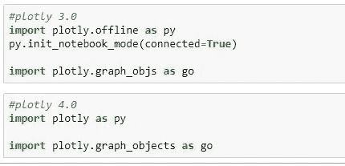
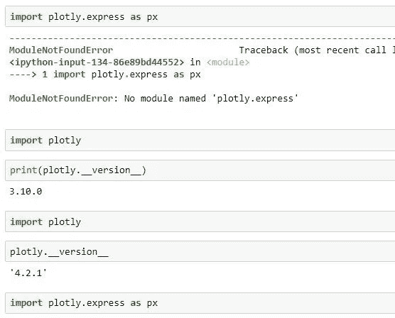
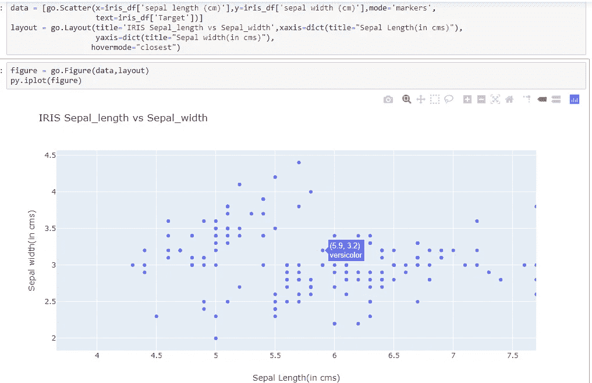
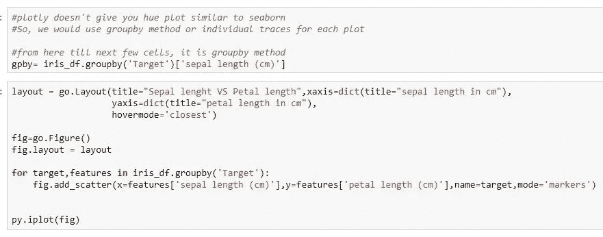
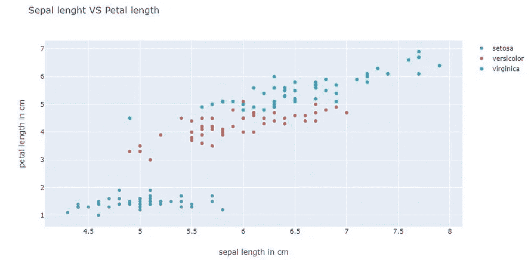
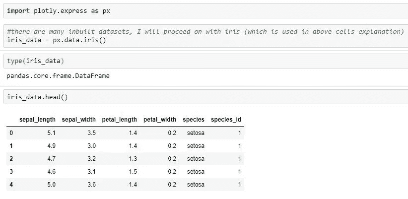
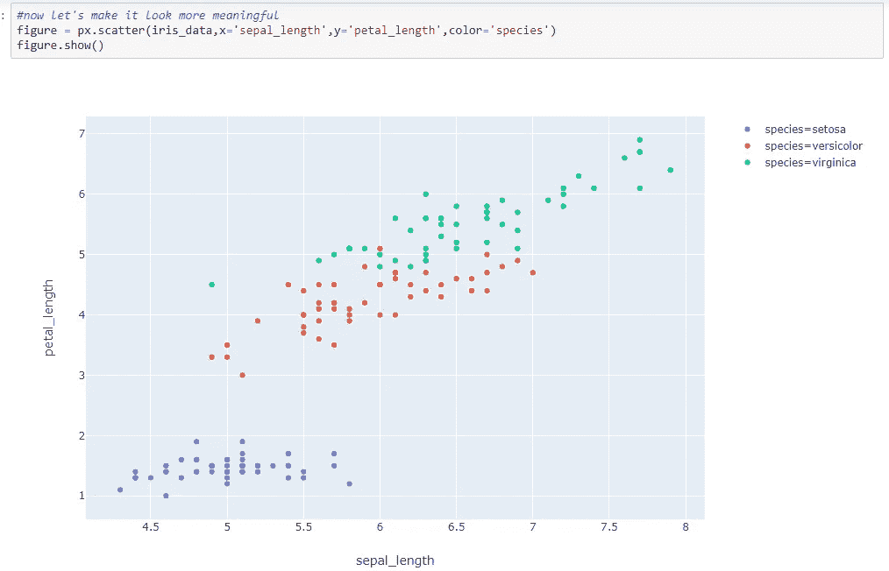
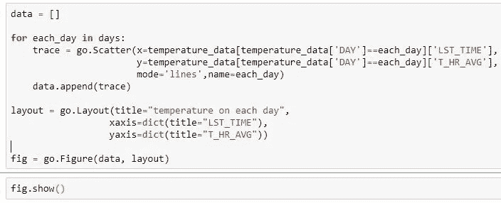
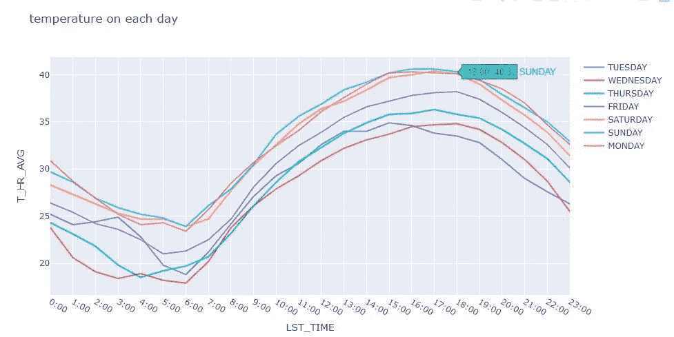
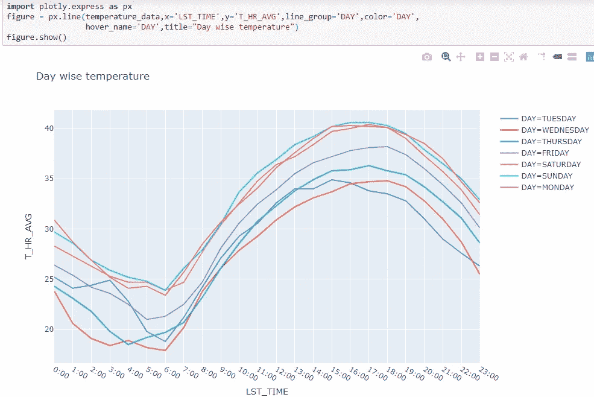

# 在 Plotly-express 的帮助下，交互式数据可视化变得更加容易。

> 原文：<https://medium.com/analytics-vidhya/interactive-data-visualization-became-much-easier-with-help-of-plotly-express-64c56e781b53?source=collection_archive---------6----------------------->

在 Plotly-express 的帮助下，Plotly 变得更容易使用

使用 plotly 和 plotly express 进行交互式绘图

Plotly 是 Python 中一个非常棒的数据可视化库，支持交互式绘图。

> **Plotly** *将* **Plotly-express** *描述为* ***“简洁、一致、用于快速数据探索和图形生成的高级 API”***。

简单来说，我们可以假设它是 plotly 的一个 IDE。在这篇博客中，我将讨论

1.  **什么是 Plotly，在哪里有用？**
2.  **Plotly 和 Plotly-express 的区别(在绘图方面)。**

# **什么是 Plotly，在哪里有用？**

## 什么是 Plotly？

Plotly 既是一家公司，也是一个开源库。这是一家专注于商业智能数据可视化的公司，如报告、创建仪表板和托管 BI 解决方案。

尽管它是一家公司，但他们已经发布了同名的开源库(专注于交互式可视化)。Plotly 有 Javascript、React、R 和 Python 的库。其中，它的 Python 库变得更受欢迎。

## 哪里有用？

通过使用 [matplotlib](/analytics-vidhya/data-visualization-heart-of-project-presentation-part-1-matplotlib-16e4d45fa70d) 或 seaborn，我们只能创建静态图像文件(jpeg 或 png 或任何静态图像格式),即一旦创建就不会改变。但是假设我们有一个在 seaborn 的帮助下创建的制造钢铁金属的时间序列图。我们需要在某个特定的时间间隔找到确切的过程，我们需要放大并仔细查看它，plotly 可以在这种情况下提供帮助。

python 中的 Plotly 本身可以创建交互式绘图(如。html 文件)。用户可以与这些图进行交互(通过放大、选择图中的特定区域进行详细分析以及在图上悬停等)..).

**但是，**这些图无法连接到变化的数据源(使用 plotly 无法实时更新图)**。Dash** (这是一个 Python 框架，用于构建来自 plotly 的 web 应用**)**有助于处理实时数据源**。******

****一旦生成交互式 plotly 图，图中表示的数据将“锁定”到图的导出状态。我们需要重新运行**。复制脚本**并重新生成**。html 文件**查看任何更新。****

# ******Plotly 和 Plotly-express 的区别(在绘图方面)。******

## ****Plotly****

*******请注意*** : Plotly 最近更新了。Plotly 以及来自 plotly 的任何源代码经常更新(因为与 python 中的其他库相比，它们是新的库)。****

> ****直到 **Plotly 3** ，我们有两种模式进行 plotly **(在线和离线)**。****

******剧情在线******

****在线绘图时，绘图和数据将保存到您的 plotly 的云帐户中。在线出图有两种方法。 **plotly.plot() —** 用于返回唯一的 URL，并可选打开 URL **。plotly.iplot() —** 在 jupyter-notebook 中工作时使用，显示笔记本**中的绘图。**这两种方法都为 plot 创建一个唯一的 URL，并将其保存在您的 Plotly 帐户中，在线使用 Plotly 需要互联网连接。****

******密谋下线******

****Plotly offline 允许离线创建绘图并将其保存在本地(不需要任何互联网连接)。离线绘图有两种方法。 **plotly.offline.plot() —** 用于创建一个独立的 HTML，保存在本地并在您的网络浏览器中打开。**plot ly . offline . iplot()—**在 jupyter-notebook 中离线工作时使用，显示笔记本中的情节。当我们打算使用 **plotly.offline.iplot()，**时，我们需要在每个会话开始时运行一个额外的步骤，**，即 plotly . offline . init _ notebook _ mode()**。****

> ****来自 **Plotly 4，(这是 Plotly 的更新和最新版本)******

********

****图 1 : plotly3_vs_4****

****因为**完全离线**，所以**不在线**，所以**不在线**。****

****无论谁喜欢在 jupyter-notebook 中使用 plotly.offline，都可以避免在他们的代码中使用连接语句(包括在离线模式下将 plotly 连接到他们的笔记本)，现在他们可以直接导入 plotly，而不是导入 plotly.offline。****

******plotly.graph_objs** —这有几个函数，在生成图形对象时很有用。grpah_objs —这是一个类，它包含几个结构，这些结构在 python 中制作的可视化中是一致的，与类型无关。****

****从 *plotly 3* 到 *plotly 4，* **plotly.graph_objs** 包被别名为 **plotly.graph_objects "** ，因为后者更容易口头交流”——根据官方文档。****

## ******情节性表达******

********

****图 2:导入 plotly express(小心版本)****

****Plotly Express 是使用 **plotly_express** 包单独安装的，但它现在是 **plotly 的一部分。** Plotly 应更新为 *plotly 4* 后再使用*或*会遇到如图 2 所示的错误。****

## ******比较散点图与 plotly 和 plotly express******

****散点图允许对一组数据的两个变量进行比较。根据散点图的趋势，我们可以解释[相关性](/@mvschamanth/exploratory-data-analysis-habermans-survival-data-set-f402fb9cf910)。****

## ****用 Plotly:****

********

****图 3:萼片长度和萼片宽度之间的绘图****

****Plotly 遵循图 3 所示的特定语法。最初，要创建一个变量来分配一个图形(**注**:图形类型应以列表的形式给出，如图 3 第一行所示)。在这种情况下，我们将它命名为“数据”(大多数遵循的符号)，变量名可以由您选择。该“数据”变量包含一个绘图类型调用。 ***去吧。散点图*** 是众多图形对象中的一种，每种绘图类型都有自己的图形对象。这些对象通常接受很少的参数。*例如，*散点图对象需要两个强制参数(指定 x 轴和 y 轴)。 ***围棋。布局*** (这也是图形对象之一)，用于定义绘图的布局。然后从图形对象创建图形对象，以使用数据和布局变量来绘图。****

****我所使用的数据集是模式识别文献中非常著名的数据库。该数据集包含 3 个类(Setosa，Versicolour，Virginica ),每个类 50 个实例，其中每个类涉及一种鸢尾植物。在图 3 中，我们绘制了所有的类，以找出(萼片长度和萼片宽度)之间的关系。但是，由于所有的数据点都用相同的颜色表示，我们无法从图中得出任何结论，因为 plotly 没有在图中给出**色调**(这是 seaborn 中的一个参数)。因此，另一种方法是使用分组方法绘制数据，或者为每个类变量创建单独的跟踪。****

## ****按数据分组，以绘制每个类别中的变化****

****************

****图 4:分组代码及其各自的图表****

****绘制图 4 右侧图形的代码可以在它的左侧找到。简要理解代码中发生了什么——根据目标变量对数据进行分组(iris 数据集中存在 3 种不同类型的花)。用必要的参数定义代码的布局，然后将布局分配给图形对象。**主要部分—** 我们对目标变量进行迭代，以匹配每个图中的相似特征，并针对每个目标变量创建三个不同的散点图。最后，在**图**对象的帮助下，在一个单独的图上绘制所有不同的散点对象。****

## ****用 Plotly Express:****

********

****图 5:导入虹膜数据****

****Plotly express 内置了数据集。我们可以通过导入 plotly express 来使用它们。图 5 描述了数据集的导入。但是，plotly 没有这样的选择。我们需要使用 scikit-learn 或其他包含数据集的公共库。****

********

****图 6:使用 Plotly-express 的散点图****

****使用 Plotly express 在两行代码内绘制了图 4 右侧的相同图形。如果您对 seaborn 有所了解，我们会将目标特征分配给*，一个类似的参数是*(以便根据数据中提供的特征进行着色)。甚至在 plotly express 中根据数据集中的要素名称自动标注轴。Plotly express 最好的部分是代码本身是自解释的，它的文档非常详细并且容易理解。******

## ******比较线图与 plotly 和 plotly express******

******折线图显示由线段连接的一系列数据点(标记)。它类似于散点图，只是测量点通常按其 x 轴值排序，并用直线段连接。它们通常用于可视化一段时间内的数据趋势(称为时间序列)。下面只是一个例子(不考虑也不解释具体数据)。******

## ******用 Plotly:******

************

******图 7:绘制图 8 的代码******

******用于绘制该图的数据集已创建，它是一个玩具数据集。任务是绘制一个折线图，在一个图表中绘制七天的温度数据。******

************

******图 8:代码图 7 的输出******

******为了绘制这个图(图 8)，我们为每一天创建了单独的轨迹，用循环来表示一天的情况(如图 7 所示)。******

## ******用 Plotly Express:******

************

******图 9:使用 plotly express 的线形图******

******当比较图 7 和图 8 与图 9 时，可以看出 plotly 仅用一行代码表达了创建的绘图，并使交互式绘图更容易。******

# ******结论******

******与 Seaborn 或 Matplotlib 相比，Plotly 有一个复杂的语法，但 Ploltly Express 通过其简单的功能使交互式绘图变得毫不费力，通过消除复杂的 plotly 语法，它还大大减少了使用 plotly 绘图所需的行数。引入 seaborn 后，统计绘图变得更加简单(seaborn 构建在 matplotlib 之上)。同样，plotly express 使 plotly 易于使用。我相信 Plotly Express 是为了使交互式绘图更加容易和方便而构建的。******

*******感谢您阅读到目前为止。我致力于改进我的风格和表达方式。所以，如果你有什么建议或者有什么想分享的，欢迎随时评论或者通过 LinkedIn* [*这里*](https://www.linkedin.com/in/chamanth-mvs-9a59a4131/) *联系我。*******