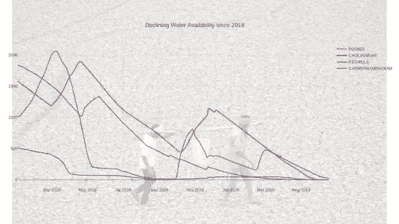
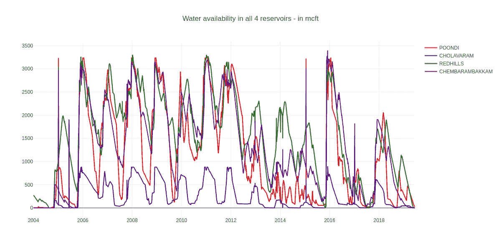
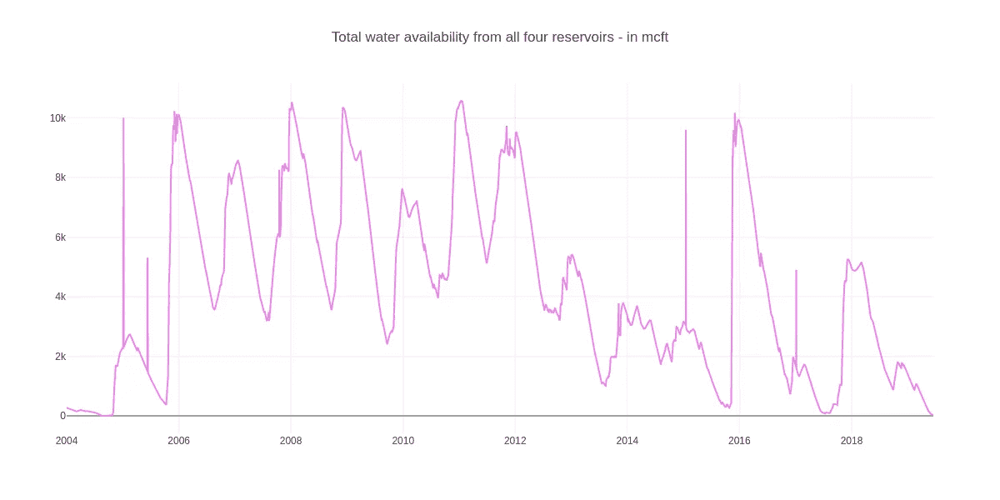
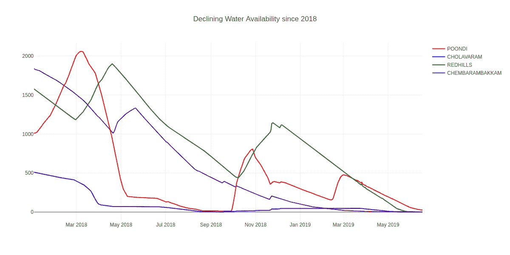
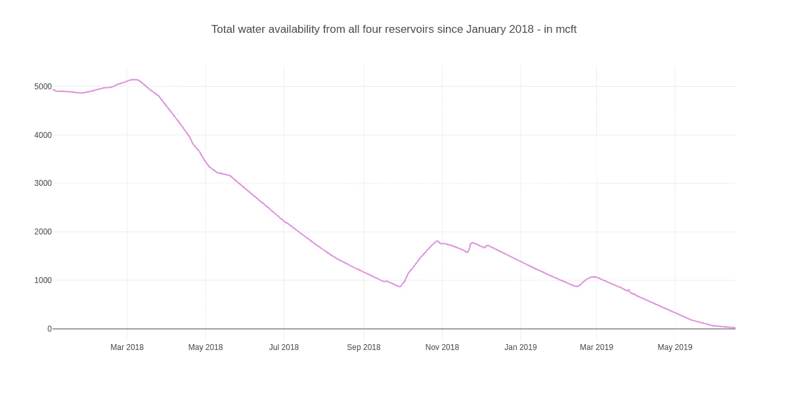
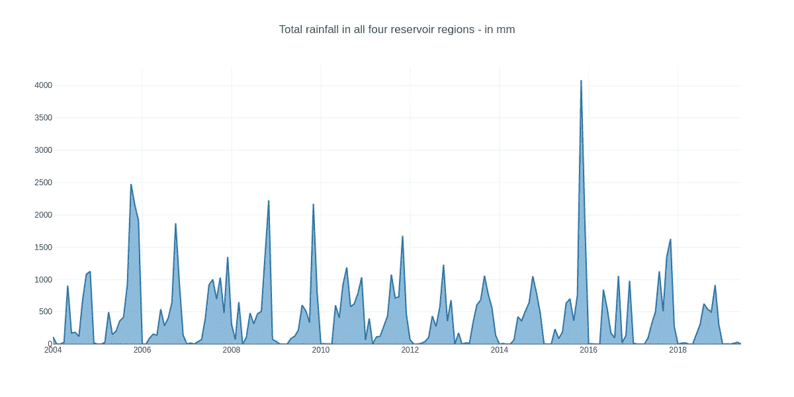

# 用 Plotly 实现钦奈水危机的交互式数据可视化

> 原文：<https://medium.com/analytics-vidhya/interactive-data-visualization-of-chennai-water-crisis-using-plotly-15e5000ad7df?source=collection_archive---------4----------------------->



> 一口完全干涸的井，一座没有水的城市。印度南部城市钦奈在四个主要水库完全干涸后陷入危机。~莱昂纳多·迪卡普里奥

为了练习数据可视化，我在 Kaggle 上浏览了一些数据集，无意中发现了一个包含钦奈水库和降雨量数据的数据集。在查找了一些内核并从中学习之后，我决定自己对这些数据进行研究。在这篇博客中，我将向您展示我是如何在 python 中使用 Plotly 得出这个令人担忧的结论的。

## 为什么是 Plotly？

Plotly 是基于可视化库 D3.js、HTML 和 CSS 的最好的数据可视化工具之一。它是使用 Python 和 Django 框架创建的。我们可以选择在线创建交互式数据可视化，或者使用 plotly 提供的库以您选择的语言创建这些可视化。我喜欢 plotly，因为它有无数的选项、简约的设计和非常好的文档。

我们现在就开始吧！在导入所有需要的库和数据集之后，我们将创建一个函数来从我们的油藏数据返回 trace。跟踪只是我们给数据集合起的名字，以及我们想要绘制的数据的规格。轨迹本身也是一个对象，这些将根据我们希望数据在绘图表面上如何显示来命名。这里我使用散点图，因此 trace 将相应地返回。

```
def scatter_plot(reservoir,color,res):
    trace = go.Scatter(
        x=reservoir.index[::-1],
        y=reservoir.values[::-1],
        name=res,
        marker=dict(
            color=color,
        ),
    )return trace
```

在这里，水库表示一个数据框，由水库中的日期(索引)和水可用性(值)组成，颜色表示我们希望我们的跟踪对象是什么颜色，res 表示水库的名称。

下面是一个使用上述函数进行追踪的示例:

```
reservoir = df["POONDI"]
reservoir.index = df["Date"]
trace1 = scatter_plot(reservoir, 'red','POONDI')
```

同样，我们将创建剩余 3 个水库的痕迹。之后，我们将为所有的水库制作支线剧情并追加。这里我使用了一个单独的图来添加 4 个水库，但是你也可以选择为 4 个不同的水库制作 4 个不同的图。

```
fig = plotly.tools.make_subplots(rows=1, cols=1)
fig.append_trace(trace1, 1, 1)
fig.append_trace(trace2, 1, 1)
fig.append_trace(trace3, 1, 1)
fig.append_trace(trace4, 1, 1)
fig['layout'].update(height=600, width=1200, title='Water availability in all 4 reservoirs - in mcft')
py.iplot(fig, filename='reservoir_plots')
```

这是我们绘制后得到的结果:



4 个不同储层的散点图

现在，让我们将所有储层结合起来，并使用相同的散点图函数为所有 4 个储层绘制一条单一轨迹。使用该跟踪，我们得到:



4 个不同储层的散点图

我们可以看到，自 2018 年以来，水库水位下降幅度更大。我们来分析一下 2018 年后的数据。为此，我们将简单地对数据集进行切片，得到从 2018 年 1 月到现在的值。

```
mask = (df['Date'] > '2018-1-1')
df=df.loc[mask]
```

现在，重复上述步骤后，我们将得到如下散点图:



4 个不同储层的散点图



4 个不同储层的散点图

是的，钦奈的水库已经枯竭，“只有雨水能把钦奈从这种情况中拯救出来。”利奥又说道。

所以我们来分析一下钦奈的降雨量数据。为此，我将使用基于相同散点图的面积图。

```
def area_plot(reservoir):
    trace = go.Scatter(
        x=reservoir.index[::-1],
        y=reservoir.values[::-1],
        fill='tonexty'  
    )
    data=[trace]
    return trace
```

现在，绘制图形:



我们可以看到主要的降雨季节是从 7 月到 11 月。此外，我们可以看到，与往年相比，2018 年以来的降雨量较低。当有关当局采取必要的措施时，让我们祈祷下雨吧。是的，节约用水！

你可以在我的回购中找到代码:[https://github.com/retroflake/Chennai_Water_Crisis](https://github.com/retroflake/Chennai_Water_Crisis)