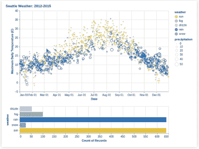

# 互动数据即使用牛郎星

> 原文：<https://medium.com/analytics-vidhya/interactive-data-viz-using-altair-873139771fe2?source=collection_archive---------2----------------------->

在从事 Data Viz 项目时，每个人都希望在他们的笔记本和仪表板上呈现交互式绘图。尽管建立有效的互动情节似乎是一项艰巨的任务。最近，我偶然发现了一个开源数据可视化库的瑰宝，叫做 [Altair](https://altair-viz.github.io/getting_started/overview.html) 。

# **关于:**

Altair 是一个用于声明性统计可视化的开源 python 库，基于 Vega 和 Vega-Lite。Altair 提供了一种有效而简洁的可视化语法，允许我们快速构建各种各样的统计可视化。

因此，我们可以有更多的时间通过构建优雅而有效的图表来探索我们的数据，而不仅仅是与代码作斗争。

# **安装:**

Altair 可以与示例数据集一起安装在 [vega_datasets](https://github.com/altair-viz/vega_datasets) 中，使用:

```
$ pip install altair 
or 
$ pip install altair vega_datasets
```

对于 Conda 软件包管理器，等效于:

```
$ conda install -c conda-forge altair vega_datasets
```

# 让我们为下面的**案例研究构建一个交互式图表:**

本文涵盖了一个小案例研究，并提供了构建交互式图表的一步一步的过程。如果想要最后的代码直接跳到底部或者勾选这个 [*回购*](https://github.com/samarth0174/Interactive-Data-Viz-using-Altair/blob/main/interactivedataviz_altair.py) 。

我们将采用[西雅图天气数据集](https://vega.github.io/vega-datasets/data/seattle-weather.csv)，其中包含 2012-2015 年西雅图的每日天气观测。


交互式串联散点图和条形图

这张图表提供了一年来西雅图天气的互动探索。它包括一个单轴画笔选择&点击选择，轻松查看特定日期范围内天气类型的分布。

## ***1。导入数据集:***

由于我们安装了带有示例数据集的 Altair，我们可以导入数据集，或者使用 Pandas 从 [CSV](https://vega.github.io/vega-datasets/data/seattle-weather.csv) 导入数据。

```
**import altair as alt 
from vega_datasets import data** settle_data = data.seattle_weather()
settle_data.head()**or** **import altair as alt
import pandas as pd**
settle_data = pd.read_csv("/content/seattle-weather.csv")
settle_data.head()
```


Altair 内部使用的数据以 Pandas DataFrame 格式存储，但它支持多种输入格式。这是最好的部分，我们可以在 Altair 中操作我们的数据，就像你处理熊猫数据帧一样。

## **2*2。定义标尺:***

```
settle_data.weather.unique()
>> array(['drizzle', 'rain', 'sun', 'snow', 'fog'], dtype=object)
```

我们将根据天气类型的分布绘制数据。当我们查看“天气”栏时，我们发现了 5 个类别，它们是根据等级定义的。

```
**# Defining the color scale for the plot (distribution based on Weather types)**scale = alt.Scale(domain=['sun', 'fog', 'drizzle', 'rain', 'snow'],range=['#e7ba52', '#a7a7a7', '#aec7e8', '#1f77b4', '#9467bd'])color = alt.Color('weather:N', scale=scale) 
# N : used to specify nominal data
```

## ***3。顶部散点图:温度与日期***

*   x 轴:日期，y 轴:温度
*   我们有兴趣知道温度和日期(时间)之间的关系。我们通过使用`make_point()` fn 将数据显示为点来指定我们想要绘制的绘图类型。
*   我们将*数据*传递给 *alt。Chart()* 函数。

```
points = alt.Chart(**settle_data**).mark_point().encode(
  alt.X('**monthdate(date):T**', title='Date'),
  alt.Y('**temp_max:Q**',
         title='Maximum Daily Temperature (C)',
         scale=alt.Scale(domain=[-5, 40])
       )# T- Specify Time data
# Q- Specify quantitative data
# O- Specify ordinal data
```


散点图

我们可以通过添加一个额外的属性，即降水测量值(查看数据集)，作为大小属性，使我们的图更具信息性。

```
points = alt.Chart().mark_point().encode(
  alt.X('monthdate(date):T', title='Date'),
  alt.Y('temp_max:Q',title='Maximum Daily Temperature (C)',
         scale=alt.Scale(domain=[-5, 40]),
  **size=alt.Size('precipitation:Q',scale=alt.Scale(range=[5,  200])**
)
)
```


添加了降水属性

**确保每次添加一个属性时，它都应该包含在 encode()函数中，并用逗号分隔。**

> 在 altair 中，可视属性到数据列的映射被称为**编码。**因此我们需要为每个图表定义编码，以便定义属性。

## **4。添加互动功能:**

我们将使用`selection()`功能，该功能可用于创建交互式图像。

我们将在顶部面板添加一个处于活动状态的画笔，该画笔可用于使用`[**selection_interval()**](https://altair-viz.github.io/user_guide/generated/api/altair.selection_interval.html#altair.selection_interval)`功能进行时间间隔选择，以选择时间间隔(编码:x 轴，即日期/时间

```
brush = alt.selection_interval(encodings=['x'])
```

接下来，我们将把画笔添加到图表中。我们还将使用 condition() fn 根据区间选择为绘图提供条件颜色编码(针对不同的天气类型)。

```
points = alt.Chart(settle_data).mark_point().encode(
    alt.X('monthdate(date):T', title='Date'),
    alt.Y('temp_max:Q',
        title='Maximum Daily Temperature (C)',
        scale=alt.Scale(domain=[-5, 40])
    ),
    **color=alt.condition(brush, color, alt.value('lightgray'))**,
    size=alt.Size('precipitation:Q', scale=alt.Scale(range=[5, 200]))).**add_selection(
    brush
    )** points
```


从 x 轴(日期)选择一个间隔

## **5。底部柱状图:天气类型**

*   x 轴:天气，y 轴:记录数
*   我们使用`make_bar()` fn 将数据显示为柱状图。

```
bars = alt.Chart(**settle_data**).mark_bar().encode(
    x='**count()**',
    y='**weather:N**')
```


条形图(天气与记录)

接下来，我们添加一个交互式功能，即一个基于天气类型的多点选择工具，以颜色显示。

```
click = alt.selection_multi(encodings=['color'])
```

我们将它绑定到图表，并添加一个条件()fn。

```
bars = alt.Chart(settle_data).mark_bar().encode(
    x='count()',
    y='weather:N',
    **color=alt.condition(click, color, alt.value('lightgray'))**,
).**add_selection(
    click
)**
```


## 6。构建复合图表:垂直连接两个图表:

接下来是我们案例研究的最后一部分，我们将垂直连接两个图，正如您在开始时看到的那样。

我们将使用 **vconcat(plot1，plot2，data，)**函数来堆叠这些图，并且还对我们之前的代码进行了**一些调整，以便两个图连接起来，表现为一个单独的交互式图表。也可以参考其他类型的 [*复合图表*](https://altair-viz.github.io/user_guide/compound_charts.html) *。***

```
alt.vconcat(
    points,
    bars,
    data=settle_data,
    title="Seattle Weather: 2012-2015"
)
```

## **7。最终代码:**

进行了一些重要的调整:

*   当我们使用复合图时，数据集(此处为:seattle_data)作为输入传递给 *vconcat* ()，而不是传递给单独的绘图函数，即 *alt。*(图表())。
*   此外，properties()用于为每个图表提供相等的宽度和高度。



滤镜变换(笔刷)


过滤变换(单击)

*   *我还为每个剧情定义添加了* `*transform_filter()*` *。*
*   *过滤转换根据提供的过滤表达式、选择或其他过滤谓词从数据流中删除对象。*
*   ***这里，根据散点图中的画笔选择过滤条形图。***
*   ****散点图是根据条形图*** 中的点击选择进行过滤的*
*   *因此，每个图都与其他图相连，提供了一个无缝的系综图。*

# ***完整代码:***

```
*import pandas as pdsettle_data = pd.read_csv("/content/seattle-weather.csv")settle_data.head()settle_data.weather.unique()scale = alt.Scale(domain=['sun', 'fog', 'drizzle', 'rain', 'snow'],
                  range=['#e7ba52', '#a7a7a7', '#aec7e8', '#1f77b4', '#9467bd'])
color = alt.Color('weather:N', scale=scale)**# We create two selections
# - a brush that is active on the top panel
# - a multi-click that is active on the bottom panel**
brush = alt.selection_interval(encodings=['x'])
click = alt.selection_multi(encodings=['color'])**# 1\. Top panel is scatter plot of temperature vs time**points = alt.Chart().mark_point().encode(
    alt.X('monthdate(date):T', title='Date'),
    alt.Y('temp_max:Q',
        title='Maximum Daily Temperature (C)',
        scale=alt.Scale(domain=[-5, 40])
    ),
    color=alt.condition(brush, color, alt.value('lightgray')),
    size=alt.Size('precipitation:Q', scale=alt.Scale(range=[5, 200]))
).**properties(
    width=550,
    height=300**
).add_selection(
    brush
).**transform_filter(
    click
)**########################## **# 2\. Bottom panel is a bar chart of weather type** bars = alt.Chart().mark_bar().encode(
    x='count()',
    y='weather:N',
    color=alt.condition(click, color, alt.value('lightgray')),
)**.transform_filter(
    brush**
).**properties(
    width=550,**
).add_selection(
    click
)##########################**#3\. Build Compound Plot
alt.vconcat(
**    points,
    bars,
    **data=settle_data**,
    title="Seattle Weather: 2012-2015"
)*
```

**

***最终结果***

# *结论:*

*我们已经成功地建立了自己的互动数据，即使用 Altair。这是一个让你开始使用 Altair 工作流程的快速指南。Altair 是一个很大的库，也支持许多其他的情节，你应该看一下 [*官方文档*](https://altair-viz.github.io/getting_started/overview.html) &也可以查看一下 [*范例库*](https://altair-viz.github.io/gallery/index.html) ，在那里你可以找到类似于刚刚提到的那个的不同案例研究。*

*我希望这篇文章已经为您节省了一些浏览完整文档的时间。我仍在学习，我肯定会喜欢一些关于我的写作和过程的反馈。*

*你可以在 [*LinkedIn*](https://www.linkedin.com/in/samarth0174/) 上联系我，在[Medium](/@samarth0174)&[*GitHub*](https://github.com/samarth0174)上关注我*

****我以前的文章-****

*[](/datadriveninvestor/deploy-your-deep-learning-models-on-iot-devices-using-tensorflow-lite-99d3ccdfc853) [## 使用 TensorFlow lite 在物联网设备上部署深度学习模型

### 在 Raspberry pie 上转换和部署模型的完整工作流程。

medium.com](/datadriveninvestor/deploy-your-deep-learning-models-on-iot-devices-using-tensorflow-lite-99d3ccdfc853)*