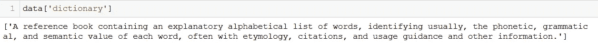
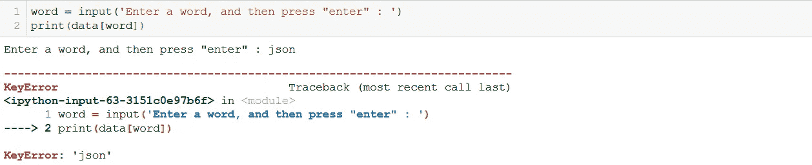

# 用 Python 构建交互式桌面词典应用

> 原文：<https://medium.com/analytics-vidhya/interactive-dictionary-with-python-6e34d35c053c?source=collection_archive---------9----------------------->


照片由[桑迪·米勒](https://unsplash.com/@sandym10?utm_source=medium&utm_medium=referral)在 [Unsplash](https://unsplash.com?utm_source=medium&utm_medium=referral) 拍摄

*被困在付费墙后面？点击* [*此处*](/@siddhant.sadangi/6e34d35c053c?source=friends_link&sk=fbbcb574dbf8bf1855bf1f721a96eb9c) *阅读全文与我的朋友链接。*

这是我的第一个 Python 项目，是我作为 Ardit Sulce 在 Udemy 上的[Python 大型课程](https://www.udemy.com/course/the-python-mega-course/)的一部分构建的(如果你想全面了解 Python 的应用而不是数据科学，这是一门非常有用的课程)。实现与 Ardit 在课程中教授的方法或多或少是一样的(至少是两年前)，只是做了一些细微的改进。

我们将使用本地托管的 JSON (JavaScript Object Notation)文件作为数据源。你可以从[这里](https://drive.google.com/file/d/1UlXee_ZUPMvfea6SQyGcR_bErPnoxJam/view?usp=sharing)下载文件。如果您不熟悉 JSON 文件格式，它基本上是一种将人类可读的文本存储为键值对的格式。可以把它想象成一个以文件形式存储的字典。

现在让我们深入研究代码，并试着让它尽可能的用户友好，一步一步来！

## 加载数据

首先，我们需要将 JSON 文件加载到 Python 中。为此，我们需要 Python 的 Anaconda 发行版附带的 json 库:

`import json`

一旦库被导入，我们可以使用它的`load()`方法来加载文件:

`data = json.load(open(‘data.json’))`

该文件作为字典加载，可通过检查`data`的类型和/或查看其外观来验证:


## 基本搜索

搜索一个单词最基本的方式是将它作为一个关键字，并获取与之相关的值:



搜索“词典”

我们可以通过要求用户输入单词来使它变得更加用户友好:


## 处理案例变化

让我们搜索“印度”:


哎呀，显然‘印度’并不存在。没问题，让我们搜索“json”:



好吧，现在我们做事的方式出了问题。如果您检查文件，会发现“India”和“JSON”都存在，但区别在于大小写:


字典键应该完全匹配才能返回值。我们可以要求用户输入全小写的 enter，但这不是一个非常用户友好的设计。相反，我们必须处理所有可能的情况变化。

为此，我们使用字符串方法 lower()、title()和 upper()，分别将字符串转换为小写、标题大小写和大写。

首先，我们检查输入的单词是否存在于字典中，如果不存在，我们将它转换为不同的大小写，以检查这些变体是否存在。如果它们都不存在，我们用简单的英语让用户知道(不是红色的‘KeyError’s)。为了简洁起见，我们将其封装在一个函数中:

```
def search(word):
    if word in data:
        return(data[word])
    elif word.upper() in data:
        return(data[word.upper()])
    elif word.title() in data:
        return(data[word.title()])
    elif word.lower() in data:
        return(data[word.lower()])
    else:
        return(f"{word} not found")
```

对我们的四种不同情况(小写、标题、大写、不存在)进行测试:


## 处理错别字


我们的应用程序现在处理大小写变化，但不处理拼写错误，因为键需要完全匹配。

一个好的搜索引擎不会在你的搜索词中出现拼写错误时一片空白，它会提示你实际可能的意思。我们将对我们的应用程序做同样的事情。

为此，我们将使用内置的`difflib`库中的函数`get_close_matches()`。让我们看看它是如何工作的。


`get_close_matches()`引四辩:

*   要检查的单词
*   要签入的单词列表
*   要返回的匹配数
*   相似性临界值，低于该临界值的单词将被忽略。

在这种情况下，我们希望在“ape”、“apple”、“peach”和“puppy”中找到与“appel”相似的三个单词，并且它们的相似性得分至少为 0.6。结果按照相似度降序排列，在我们的例子中是“苹果”和“猿”。我们只得到两个结果，而不是三个，因为所有其他单词的相似度都小于 0.6 的临界值。如果没有大于截止长度的单词，则返回一个空列表。

在我们的应用程序中，如果数据中不存在输入的大小写变化，我们应该检查拼写错误，所以我们将在搜索函数的末尾添加这个条件。


我们希望在数据字典的所有关键字中搜索输入单词，并只返回相似性截止值大于 0.8 的最相似的单词。如果存在这样的单词，`len(get_close_matches(word, data.keys(), n=1, cutoff=0.8))`的值将为 1，然后我们从字典中获取与该单词相关的值。


现在我们能够得到“字典”的意思，尽管我们已经搜索了“措辞 **e** ry”。

然而，有些事情不对劲。我们不会让用户知道他的搜索词中可能有拼写错误，并且显示的结果可能实际上不是用户正在搜索的词。下面的例子说明了这一点:


在这里，虽然用户搜索的是“nasa ”,但得到的结果是针对单词“nasal”。就像一个好的搜索引擎一样，我们需要一种机制来让用户知道我们是否认为他的搜索词中有拼写错误，并让用户决定他是否想要接受更正。

## 建议替代单词

如果在我们的字典中找不到这个单词或它的大小写变化，这部分就起作用了。我们显示找到的最相似的单词，询问用户这是否是他们想要搜索的单词，如果是，显示该单词的意思。如果没有，那么我们要求用户输入另一个单词。

我们将为此创建一个函数，它只接受用户输入的单词，并执行上述所有操作。这个函数将在最后一个 else-if 梯形中调用。

```
def suggest(word):
    yn = input(f"Did you mean '{get_close_matches(word, data.keys(), n=1, cutoff=0)[0]}' instead? [y/n]: ")
    if str.lower(yn) == 'y':
        return(search(get_close_matches(word ,data.keys(), n=1, cutoff=0)[0]))
    elif str.lower(yn) == 'n':
        return 'Please check the word'
    else:
        print('Please enter Y or N')
        suggest(word)def search(word):
    if word in data:
        return(data[word])
    elif word.upper() in data:
        return(data[word.upper()])
    elif word.title() in data:
        return(data[word.title()])
    elif word.lower() in data:
        return(data[word.lower()])
    elif len(get_close_matches(word, data.keys(), n=1, cutoff=0)) > 0:
        return(suggest(word))
    else:
        return(f"{word} not found")
```

我们已经移除了相似性截止过滤器，因为我们想要获得最相似的单词，而不考虑相似性分数。

如果用户输入' y '，我们向他们展示建议单词的含义，如果输入' n '，我们要求他们检查单词并终止。最后一种情况是健全检查，以防用户觉得有创意，并输入除“y”或“n”之外的任何内容。在这种情况下，我们要求他们纠正输入并再次调用该函数。

工作原理如下所示:


## 创建脚本并循环运行

一旦原型准备好了，从笔记本转移到脚本总是更好，这样实现起来更快更容易。在我们的例子中，用一个脚本代替一个笔记本使过程更快，因为我们可以一次运行脚本，而不必单独运行每个单元。

我刚刚将笔记本中的代码粘贴到一个脚本中，只做了一些修改:

运行该脚本时，我们得到以下输出:


这样做的一个问题是，每次您想要搜索一个单词时，您都需要再次运行这个脚本。

让这个应用程序循环运行，检查用户想要的单词，直到用户想要停止，怎么样？

为此，我们必须创建另一个函数，该函数将要求用户输入，显示结果，然后询问用户是否想要搜索更多的单词。如果是，重复该过程；如果没有，程序终止。实际上，这需要两个函数，一个获取输入，调用搜索函数，然后调用另一个函数，如果需要更多的搜索，该函数将回调父节点。听起来很复杂？让下面的代码示例更容易理解:

```
*def* prompt():
   *"""Gets the input from the user, displays the result, and checks if more words are to be searched for
   """* word = *input*("Enter a word: ")
   *print*(search(word))
   checkmore()*def* checkmore():
   *"""Keeps the application running until the user wants to quit
   """* more = *input*('Search for more words? [y/n]: ')

   *if str*.lower(more) == 'y':
      prompt()
   *elif str*.lower(more) == 'n':
      *print*('Goodbye!')
   *else*:
      *print*('Please enter Y or N')
      checkmore()
```

我们在`prompt`中输入单词；它搜索单词；然后调用`checkmore`。`checkmore`询问我们是否要搜索更多的单词。如果是，则再次调用`prompt`；如果没有，程序终止。对于任何其他输入，`checkmore`被再次调用。

最后，在我们这样做之前，你注意到结果周围的方括号了吗？这是因为结果是列表的形式，而不是字符串。

`Enter a word: hand
[‘That part of the fore limb below the forearm or wrist in primates (including humans).’, “To give, transmit or pass to, using one’s hand.”, ‘A set of cards or pieces of a player at a given time during a game.’]`

为了使结果更清晰，我们可以将`search()`的输出赋给一个变量，然后如果变量是一个列表，则打印单个项目，而不是打印列表。如果没有(在任何消息的情况下)，我们只打印变量。

所以我们的`prompt()`函数现在变成了:

```
*def* prompt():
   *"""Gets the input from the user, displays the result, and checks if more words are to be searched for
   """* word = *input*("Enter a word: ")
   output = search(word)

   *if type*(output) == *list*:
      *for* item *in* output:
         *print*(item)
   *else*:
      *print*(output)

   checkmore()
```


这个看起来好多了。

## 包扎

我们没有应用程序。由于涉及到相当多的步骤和条件，这里是该过程的高级流程图和完整代码。


## 结束语

很明显，有很多方法可以改进这一点。首先，您可以使用 Tkinter 或 Flask 创建一个简洁的 GUI。您还可以连接到数据库或 API 以用作源，而不是本地托管的文件。如果你想提出更多的改进建议，请告诉我。我也很乐意看到你的实现。欢迎在下面发表评论，或者通过[邮件](mailto: siddhant.sadangi@gmail.com)或 [LinkedIn](http://linkedin.com/in/siddhantsadangi) 联系我。

**感谢阅读！**

Medium 仍然不支持向印度以外的作者支付费用。如果你喜欢我的内容，你可以给我买杯咖啡:)

[](https://www.buymeacoffee.com/siddhantsadangi) [## Siddhant Sadangi 正在 Streamlit 上创建 python 网络应用程序

### 嘿👋我刚刚在这里创建了一个页面。你现在可以给我买杯咖啡了！

www.buymeacoffee.com](https://www.buymeacoffee.com/siddhantsadangi)