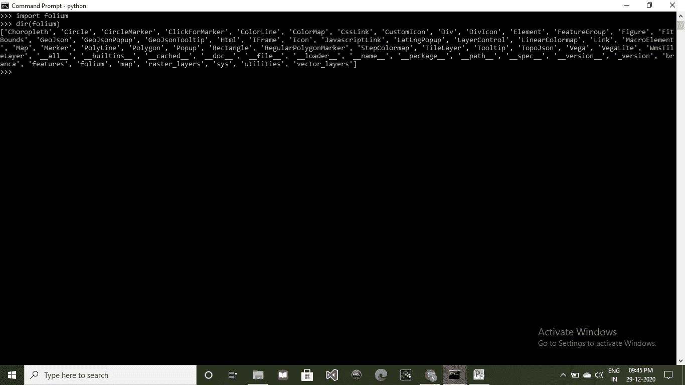
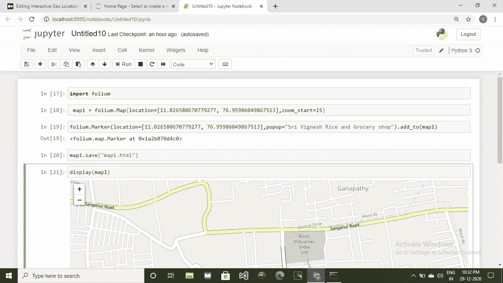
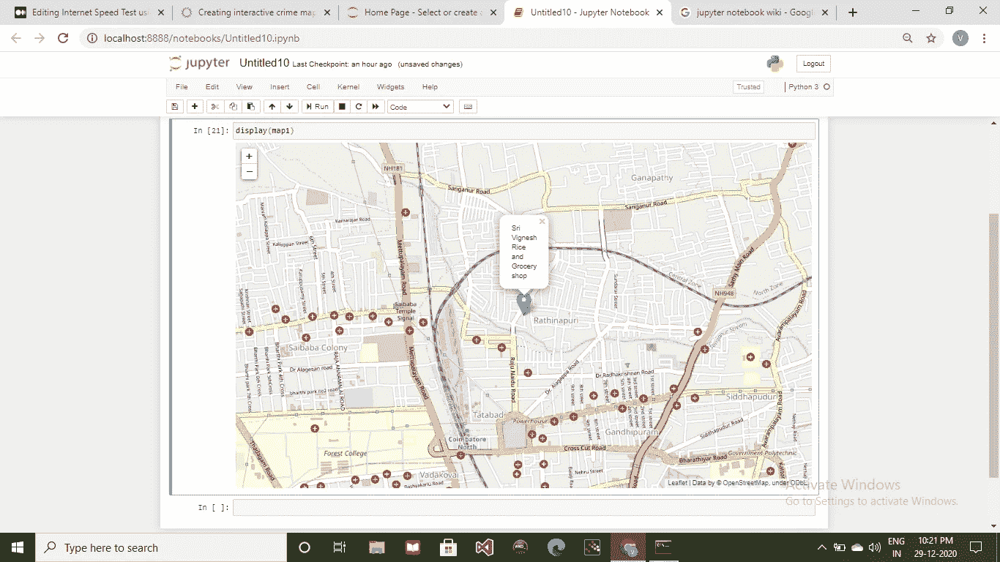

# 使用 Python 的交互式地理位置指针

> 原文：<https://medium.com/analytics-vidhya/interactive-geo-location-pointer-using-python-2f410583f565?source=collection_archive---------24----------------------->

嘿，伙计们，这里我将向你们展示如何使用 python 创建一个交互式地图/地理定位指针。

# **叶子**

folium 模块是 python 中最重要的库之一，用于创建各种类型的地图。

它创建了一个实时地图，可以**查看，通过放大或缩小**进行调整，并可以**根据地理位置值锁定位置**。

默认情况下，会创建一个 **HTML 文件**来生成地图。但是在 jupyter notebook 中执行一个 python 程序的情况下，它会创建一个内联地图，在程序执行后可以立即查看。

# 先决条件

众所周知，任何 python 模块都可以使用 pip 安装，所以使用

> pip 安装叶片

上面一行代码安装了 leav 并添加到您之前的 pip 列表中。

# 叶子及其使用案例

在使用 follow 模块之前，必须进行安装。

安装后，可以借助 import 语句导入该模块。

> 进口烟叶

在你的程序中掌握了它的所有功能之后，接下来，folium 模块的初学者必须了解它的内置方法，这些方法将在相应的情况下被调用。

要了解 follow 模块中内置方法的列表，只需放下一行代码，

> 导演(叶子)

list 模块内的内置方法列表

> **叶子。地图(位置，缩放 _ 开始)**

在上面的代码中，follow 中的 Map()函数取两个参数: **location 和 zoom_start。**

**位置**可以被赋予任意的**经纬度值**以得到一个具体的位置，或者一般可以指定为“**位置=中心**”。

**zoom_start** 可以是指定地图执行后如何缩放的任意数值。

可以根据用户需要放大或缩小。

**例如:**

> map1 =叶子。地图(location=[11.026580670779277，76.9586049867513]，zoom_start=15)

> **叶。标记(位置，弹出)**

在上面的代码中，**leav。Marker()** 用于**根据作为参数指定的位置值来确定任何位置**。

**弹出**用于在锁定位置上显示类似位置名称的**弹出信息。**

**示例**:

> 叶子。marker(location =[11.026580670779277，76.95986049867513]，popup="Sri Vignesh 大米和杂货店")。添加到(映射 1)

# 保存地图

这样生成的地图可以被保存以供将来参考，

> variablename . save(" filename . html ")

这将创建一个 HTML 文件，其中包含之前生成的地图。

如果需要修改，可以进一步修改。

**举例:**

> map1.save("map1.html ")

# 显示内嵌地图

像 Jupyter Notebook 这样的软件内置了 python 编程的可视化表示。

因此，用户在 Jupyter Notebook 中生成的地图可以在创建后立即查看，

> 显示(变量名称)

它将之前生成的地图显示为控制台内的内置地图。

**举例:**

> 显示(地图 1)

# 代码片段

*进口叶*

*map1 =叶子。map(location =[11.026580670779277，76.95986049867513]，zoom_start=15)*

*叶子。marker(location =[11.026580670779277，76.95986049867513]，popup="Sri Vignesh 大米和杂货店")。添加到(映射 1)*

*map1.save("map1.html")*

*显示(地图 1)*

Jupyter 笔记本中的程序执行

# 输出

泰米尔纳德邦哥印拜陀，Sri Vignesh 大米和杂货店的位置

> 如果你不能，那谁能呢？？