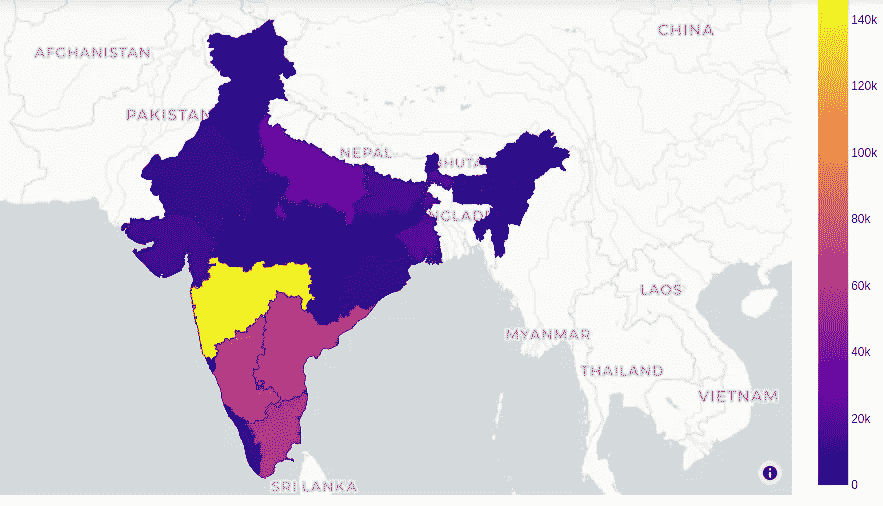
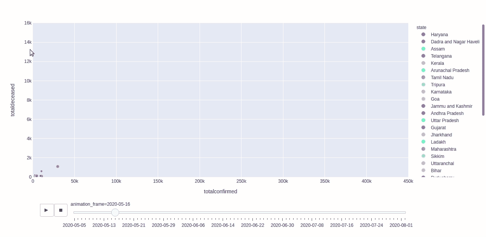

# 使用 Plotly 的交互式可视化

> 原文：<https://medium.com/analytics-vidhya/interactive-visualisation-of-covid-19-data-using-plotly-9d16bdf77330?source=collection_archive---------15----------------------->

如果你想用 python 制作交互式图表，可以使用 Plotly 库。在我上一篇[文章](/analytics-vidhya/how-to-make-interactive-line-chart-in-d3-js-4c5f2e6c0508)中，我写了如何使用 D3 制作交互式图表。Js javacript 库。Plotly 是构建在 D3 之上的开源 python 库。Js libary 允许轻松制作交互式图表。

我用 covid19india.org API 下载了新冠肺炎的数据。我用这些数据绘制了三张图表。

首先，我将从简单的事情开始。这里我用 plotly 做了折线图。我使用以下代码将印度新冠肺炎病例的时间序列数据加载到熊猫数据框中:

在上面的代码中，我使用请求库从 API 获取数据，我使用 JSON 库解析这些数据。此解析 Json 数据包含三个字段，第一个字段'病例时间序列'包含活动，恢复和死亡冠状病毒病例日期数据。

我使用上面的代码将“case_time_series”字段数据提取到 df 数据帧中。Df 数据框架现在包含印度每日冠状病毒病例数。我们可以用一行代码将它绘制成折线图。

我们必须向 px.line 函数提供 x 和 y 变量。我选择了对数 y 轴。

从上图可以看出，印度冠状病毒病例的增长速度正在下降，但仍呈指数增长。

接下来，我为印度的新冠肺炎病例制作了 geojson 图表。我使用以下代码提取了印度新冠肺炎病例的州级数据。

此代码从以前的响应文本中提取冠状病毒的状态数据。回复文本的 Statwise 字段包含每个州冠状病毒病例的当前数量(活动、已恢复、死亡和增量)。

接下来，我从这个[链接](https://github.com/Subhash9325/GeoJson-Data-of-Indian-States)下载了印度的州级 geojson 地图，并将其保存为 Indian_states.txt。可以使用如下几行代码创建印度 Geojson 海图:

首先，我读取印度的 geojson 数据，并将其保存为 statejson 变量。Geojson 图表是在中使用 px.choropleth.mapbox 创建的。

我们必须将 dataframe 作为函数的第一个参数传递，而您必须按以下方式将其余参数传递给函数:

1.  geojson:您必须传递 geojson 变量
2.  颜色:你必须在你的数据框架中传递列的名称，用它来改变图表的颜色。
3.  locations:您必须在 dataframe 中传递列名，该列名包含州名或 Json 中相应的地理特征。
4.  featureidkey:您必须传递包含要素名称的 geojson 字段的名称。在我们的 json 中，状态名包含在 properties 字段内的 NAME_1 字段中，因此称为 properties。NAME_1 被传递。
5.  center:您必须传递图表居中位置的纬度和经度。这里我经过了博帕尔的坐标，因为它几乎在印度的中心
6.  缩放:你必须通过图表的缩放级别。范围从 0(地球)到 21。缩放级别 3 适用于国家级别的图表。

运行此命令会生成一个交互式 geojson 图表，您可以在其中看到悬停状态的数据。这里我粘贴了图表截图。

你可以从下面的链接下载完整的图表

 [## rohitrajiit/数据

### 此时您不能执行该操作。您已使用另一个标签页或窗口登录。您已在另一个选项卡中注销，或者…

github.com](https://github.com/rohitrajiit/data/blob/master/indian%20state%20corona%20cases.html) 

后来，我制作了该州病例数的散点图动画。为此，我需要每个州案例的日期细节，我使用如下代码下载了这些数据:

covid19india 网站的 Timeseries api 包含每个州的日期数据。我将数据提取到一个数据框架中，并使用 pandas 的 fillna 函数处理缺失的数据。我删除了“联合国”和“TT”州，因为它们分别属于“未分配”和“总计”。

然后，我根据日期栏对数据框进行了排序。它是必需的，因为日期列在被传递到动画函数之前被转换为字符串。

然后，我们可以用一行代码创建印度各州明智案例的动画。

该代码为印度各邦创建了冠状病毒病例的交互式动画。图表的 x 轴是每个州的冠状病毒病例数。y 轴是每个州死于冠状病毒的人数。标记的大小由每个州的测试次数决定。每一帧动画都是由特定日期的数据决定的。

下面我贴了一张动画的 gif:

你可以从下面的链接下载完整的图表

 [## rohitrajiit/数据

### 此时您不能执行该操作。您已使用另一个标签页或窗口登录。您已在另一个选项卡中注销，或者…

github.com](https://github.com/rohitrajiit/data/blob/master/scatter%20plot%20animation%20indian%20states.html) 

你可以从上面的图表中看到，马哈拉施特拉邦在病例和死亡人数上是一个很大的异常值，但它的测试仍然与其他大邦如北方邦和泰米尔纳德邦保持在几乎相同的水平。

在本文中，我介绍了 geojson 图表、散点图和折线图。但是 plotly express 库有几种其他类型的图表。你可以在这里读到它们

 [## plotly.express:数据可视化的高级接口- 4.9.0 文档

### plotly.express:数据可视化的高级接口

plotly.com](https://plotly.com/python-api-reference/plotly.express.html) 

Plotly 还通过其 plotly.graph_objects 库提供低级接口。但是对于大多数目的，plotly express 库就足够了。

这些图表可以用 jupyter notebook 创建。它们也可以在 plotly chart studio 服务上创建。但是 chart studio 的免费服务是有规模限制的。

如果你喜欢这篇文章，请为文章鼓掌以示赞赏。