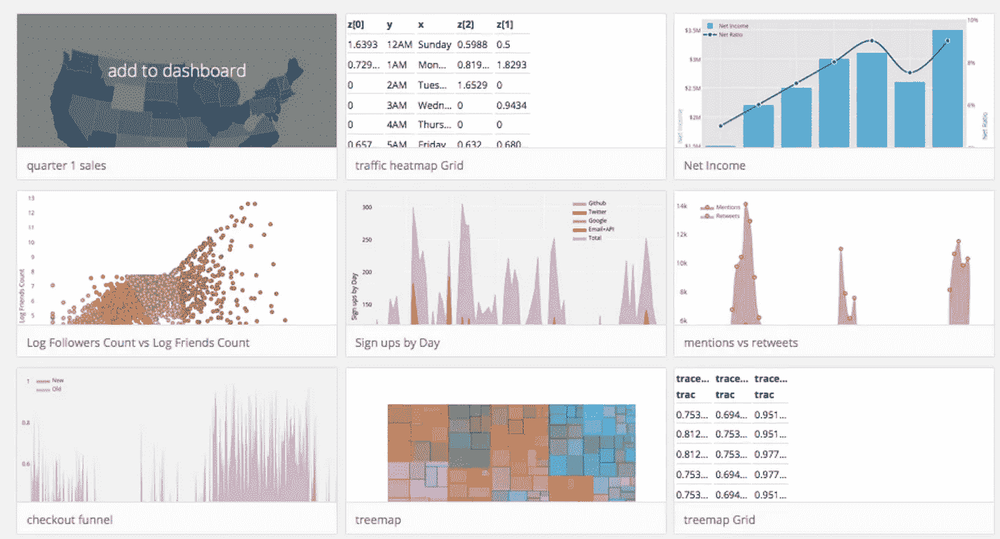
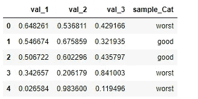
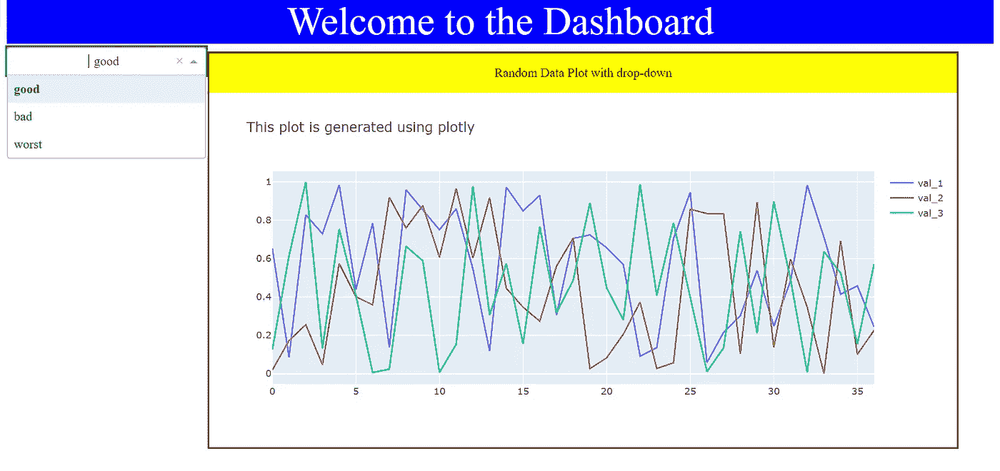

# Plotly 和 Dash 的交互式可视化

> 原文：<https://medium.com/analytics-vidhya/interactive-visualization-with-plotly-and-dash-f3f840b786fa?source=collection_archive---------5----------------------->



在我使用 matplotlib 进行可视化的大约 3 年时间里，大约 2 个月前，在我同事的建议下，我尝试了 plotly 和 dash。这个库给我留下了深刻的印象，我已经在我的 YouTube 频道“当数学遇到编码”上发布了关于这些库的教程。今天我将分享我在这些库上的经验，这可能会激励其他人去尝试 Plotly 和 Dash。

# 查看 Plotly 和 Dash 的完整视频教程

当谈到交互性时，Plotly 比 matplotlib 有明显的优势，原因很简单，它是用 plotly.js 编写的，而 plot ly . js 是用 d3.js 构建的，编辑或修改情节就像编写 CSS 代码一样简单。Plotly with Dash 是一个完整的 python 可视化封装解决方案。在 plotly 和 dash 的帮助下，您可以使用 python 中的单页脚本开发一个完整的可视化应用程序。

Dash 是另一个内置 flask 应用程序的开源库，允许您在提供的网址或 IP 上托管您的地块。

所有的代码和文章都可以在 GitHub 上找到。在对这样的库有了基本的了解之后，它的最佳实践是在底层库的帮助下解决一些问题。在本文中，我将尝试给出 plotly 和 dash 组件的基本介绍，然后尝试制作一个简单的仪表板。

这里的想法是创建一个具有交互式下拉菜单与以下步骤的仪表板

1.  用 numpy 和熊猫创建一个随机数据生成器
2.  创建带有下拉菜单的仪表板布局
3.  在随机数据集中创建一个类别列，内置三个类别“好”、“坏”和“最差”，现在将这些类别放在下拉列表中
4.  用户从下拉列表中选择任何类别后，在数据框中应用该类别的过滤器，并在仪表板中绘制过滤后的数据

# 让我们通过编码来理解这些组件

安装依赖项

```
pip install plotly
pip install dash
```

导入所有必需的库

```
**import** **plotly**  
**import** **dash** 
**import** **plotly.offline** **as** **pyo** 
**import** **plotly.graph_objs** **as** **go** 
**import** **numpy** **as** **np** 
**import** **dash_html_components** **as** **html** 
**import** **dash_core_components** **as** **dcc** 
**from** **dash.dependencies** **import** State, Input, Output 
**import** **pandas** **as** **pd**
```

# 随机数据生成函数

编写一个随机数据帧生成函数，其数据用于创建仪表板

```
**global** cat_g ,sample_type
cat_g = ["good","bad","worst"] 

**def** datagen():
    my_sample_data = np.random.random_sample([100,3])
    sample_Cat = [cat_g[np.random.randint(0,3)] **for** i **in** range(100)]
    Base_Data = pd.DataFrame(my_sample_data,columns=["val_1","val_2","val_3"])
    Base_Data["sample_Cat"] = sample_Cat
    **return**(Base_Data)
```



**函数**生成的数据帧

**我们的目标是开发一个类似这样的仪表板**



dash 托管的最终脚本结果仪表板

**仪表板核心部件**

Dash 核心组件有 d [下拉](https://dash.plot.ly/dash-core-components/dropdown)、[滑块](https://dash.plot.ly/dash-core-components/slider)、[范围滑块](https://dash.plot.ly/dash-core-components/rangeslider)等，你可以把所有这些组件和小脚本放在一起

 [## 概观

### Dash 核心组件库包含一组高级组件，如滑块、图表、下拉列表、表格和…

dash.plot.ly](https://dash.plot.ly/dash-core-components) 

**数值和标签**

您需要创建值和标签字典来使用 dash 核心组件，标签将出现在用户界面上，值将被转发给用户与仪表板交互的函数。这可以如下完成。

```
cat_g = ["good","bad","worst"]## Creating values and labels for drop-down
options_list = []
for i in cat_g:
    options_list.append({'label': i, 'value': i})
```

在这里,“好的”、“坏的”和“最差的”将显示在仪表板上，并传递给图形生成函数。

**图生成器功能**

你需要写一个函数，它将根据给定的过滤数据生成图形，这里是它的示例代码

```
def fig_generator(sample_data):
    sample_data = sample_data.reset_index(drop=True)
    sample_data.head()
    plot_data =[]for i in range(1,4):
        plot_data.append(go.Scatter(x=sample_data.index, y=sample_data['val_'+ str(i)], name = 'val_'+ str(i) ))
    plot_layout = go.Layout(title = " This plot is generated using plotly  ")fig = go.Figure( data = plot_data ,layout = plot_layout)return(fig.data,fig.layout)
```

**破折号 Html 组件**

为了创建一个基于网络的应用程序，你需要 html 组件。Dash 提供了这些 html 组件，如 Div 标签头。关于 Dash Html 组件的更多信息，请查看下面的链接

 [## 概观

### Dash 提供了所有可用的 HTML 标签作为用户友好的 Python 类。本章解释了这是如何工作的，并…

dash.plot.ly](https://dash.plot.ly/dash-html-components) 

**定义仪表板布局**

您需要为 dash 定义一个布局，在这个布局中，您可以为 css 组件提供样式，不要忘记为所有 html 组件提供 id。Id 是这些占位符的引用，要更改占位符中的任何内容，您需要创建一个回调函数，然后给出引用 id。

**仪表板中的回调函数**

对于基于下拉列表中用户输入的任何更改，您需要创建一个回调函数所有输入和输出组件的 id，您需要提供回调函数的参数，这里是我们代码中使用的回调函数。

```
[@app](http://twitter.com/app).callback(Output("plot_area", 'figure'),
              [Input("drop_down_1", "value")])
def updateplot(input_cat):
    df= datagen()
    sample_data = df[df["sample_Cat"] == input_cat ]
    trace,layout = fig_generator(sample_data)
    return {
        'data': trace,
        'layout':layout
    }
if __name__=='__main__':
    app.run_server()
```

**完成脚本**

下面是完整的脚本，可以用来在 python 中生成这样的仪表板。