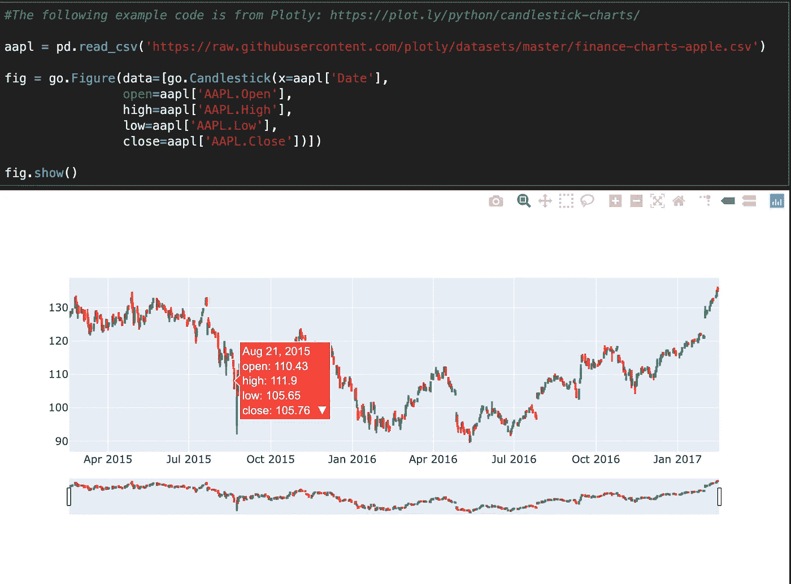

# Plotly 和袖扣的互动可视化

> 原文：<https://medium.com/analytics-vidhya/interactive-visualizations-with-plotly-and-cufflinks-9ffd032bfac?source=collection_archive---------14----------------------->

通过我所有的自学和对数据、分析、可视化和数据科学等广泛主题的探索，我接触到了广泛的工具。如果你不能从我以前的帖子中看出，我喜欢熊猫。不仅仅是动物，还有包裹熊猫的蟒蛇。有趣的是，我遇到了两种工具，叫做 Plotly 和袖扣。袖扣本质上是将 Pandas(来自 Python)连接到 Plotly，从那里你可以直接从数据帧创建图形和图表。这当然没什么特别或独特的。特别的是，这些可以由 Plotly 制作的视觉效果不仅好看(很明显)，而且具有交互性！如果这还不够特别的话，我相信 Matplotlib 没有的所有有用的附加特性都会很特别。现在，让我们从一些代码开始。

还有一件事…如果像我一样，你从来没有使用或安装过袖扣或 Plotly，那么我们必须先做这些步骤，然后才能导入软件包使用！我在 Plotly 网站上遵循的指导相当简单，但我在这里有步骤(如果你使用的是 Mac):

1)对于袖扣，您可以选择 conda 安装或 pip 安装，一切由您决定！

2) `conda install nodejs`(这是 Plotly 工作所必需的)

3) `pip install plotly==4.5.4`或`conda install -c plotly plotly=4.5.4`

4) Jupyter 笔记本:使用`conda`或`pip install “notebook>5.3” “ipywidgets>=7.2”`

5) Jupyter 实验室使用:`pip install jupyterlab==1.2 “ipywidgets>=7.5”`

a.对于 conda 使用: `conda install jupyterlab=1.2`

b.`conda install “ipywidgets=7.5”`

6)我运行了以下所有步骤，以确保以后不会遇到任何意外情况:

a.`export NODE_OPTIONS= — max-old-space-size=4096`

b.`jupyter labextension install @jupyter-widgets/jupyterlab-manager@1.1 –no-build`

c.`jupyter labextension install jupyterlab-plotly@1.5.4 –no-build`

d.`jupyter labextension install plotlywidget@1.5.4 –no-build`

e.这个最后的命令需要一段时间才能完成(请耐心):`jupyter lab build`

7)现在一切都运行完毕——我们终于可以开始导入包了！

下图显示了导入某些功能和特性工作所需的所有必要包的一般过程。首先，我们从导入两个非常标准的 Python 包开始:Pandas 和 Numpy。接下来，我们进口一种新品——袖扣。重申一下，袖扣把熊猫和 Plotly 联系在一起。接下来，我们开始导入所有必要的 Plotly 包，在这种情况下，我让 Plotly 在“离线”模式下工作，这就是为什么有多个包被导入。“graph_objects as go import”用于“快速入门”示例之一。我导入了 datetime，因为其中一个视图将显示跨越多天的数据。最后，我添加了%matplotlib inline，这样就可以在笔记本上显示图像了。

要使用的导入包

接下来的两行代码完成了以下工作:这使得 Jupyter 笔记本中的所有内容都可以工作。Plotly 将 Pandas 和 Python 连接到一个交互式 JavaScript 库，并允许访问可以创建的各种可视化。另一行代码只允许我们在“离线”模式下使用袖扣。

完成一些设置的两行小代码

现在，我们来看第一个非常简单的例子——由 Plotly 提供，使用我们之前导入的 graph_objects 包。

我们第一次看到普洛特利

我接下来的所有例子都将与下面三个不同公司的虚假股票数据相关，我将在这里制作这些数据。然后，我们将查看每一行的前五行数据。

为三家假公司制造一些假股票数据

让我们快速看一下 Matplotlib 可以从这个 df 数据帧中给我们提供什么。由于没有额外的设置，基本的视觉效果并不是马上就非常有用，需要更多的调整来使它正确。

Matplotlib visual —有点小而且拥挤

一个没有附加设置的基本 Plotly 情节从一开始就给了我们以下权利。Plotly visual 的默认大小比 Matplotlib 使用的默认大小大得多。

Plotly 的默认大小更大，并为我们提供了比较三家公司数据的能力

在这里，我们可以很容易地为我们三家公司的股票价格绘制一个漂亮的箱形图。在这种情况下，通过单击可视化右上角的两条平行水平线，您可以将鼠标悬停在线(之前的图形)或框上，以查看可以显示的数据。这里我们可以看到 Stock_A 的统计数据。

三个箱线图展示了股票 A 的一些统计数据

这种视觉被称为传播。在处理股票和其他金融数据时，使用和查看是很常见的。上面的部分看起来与我们首先制作的基本 df.iplot()非常相似，但是下面的部分显示了某一点上 Stock_A 和 Stock_C 之间的价差。中间的浅色框是我选择我想要放大的部分。

这是当我们放大图表中的一个选定区域时，顶部的视觉效果。我们也可以对底部展开视觉效果做同样的事情。这两者都放大了数据的相同部分。

以下三个视觉效果都来自 Plotly 的一个做得很好的完整的例子。这是来自股票代码“aapl”或更广为人知的苹果公司的真实数据。这个视图还使用了“蜡烛图”,这是查看股票数据的另一种常见方法。同样，将鼠标悬停在数据上会显示所选点的各种信息。

在这里，我可以再次“放大”到股票价格的选定区域。然而，这个例子为我们提供了一个很好的‘slider’特性来选择一个日期范围，以便更仔细地检查。你可以看到我选择选取了 2015 年 4 月到 2015 年 7 月左右。

最后但并非最不重要的是，这是在选择一个特定的日期范围来查看时，蜡烛图看起来的样子。你可以看到画面的底部很好地向我们展示了上面主画面中显示的时间范围。

这篇博文到此为止！我希望你学到了一些有趣的东西，感谢你的阅读！直到下一集。