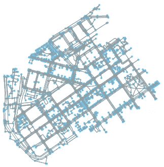
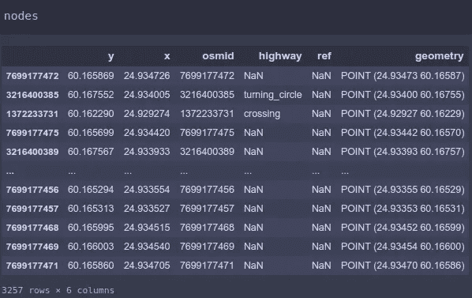
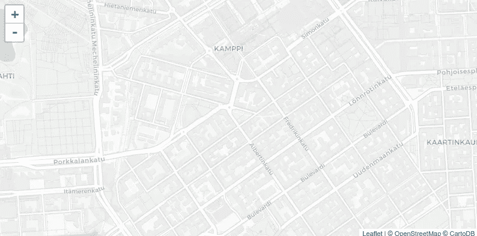

# 具有 OSM 和网络 x 的交互式方向地图

> 原文：<https://medium.com/analytics-vidhya/interative-map-with-osm-directions-and-networkx-582c4f3435bc?source=collection_archive---------4----------------------->

在地图中追踪路线本身就是一个巨大的世界，但在本教程中，我将向您展示处理这一问题的基础和核心概念，使用来自 OSMNX 的开放街道地图数据、Networkx 图表和交互式 Ipyleaflet 地图来查看我们正在构建的内容。

# 它是如何工作的？

我们可以想象一个城市区域，你的街道和角落就像一个图表，包括你所有的房产。例如，拐角是节点，街道段是连接所有这些节点的顶点，用线段的长度加权。这样做的好处是，有了图，我们就能够使用所有的图算法来计算加权最短路径。

在本教程中，我们将使用由 Networkx 库提供的 Dijkstra 加权最短路径算法来获得城市区域中两个节点之间的最短路径，并且我们将使用 Ipyleaflet 来获得这些路径是如何生成的交互视图。

# 钻研代码

首先，我们需要导入 python 库

```
import networkx as nx
import osmnx as ox
from shapely.geometry import LineString, mapping
import geopandas as gpd
from ipyleaflet import *
```

我们使用 Networkx 来处理图表本身，使用 OSMNX 来检索开放的街道地图数据，使用 shapely 来在地图上绘制路线，使用 GeoPandas 来查看数据帧，使用 Ipyleaflet 来查看正在发生的事情。

## 选择一个工作区域

```
place_name = “Kamppi, Helsinki, Finland”
graph = ox.graph_from_place(place_name)
fig, ax = ox.plot_graph(graph)
```



图表来自芬兰赫尔辛基 Kammpi

OSMNX 有一个名为 *graph_from_place，*的功能，因此您可以通过选择社区、城市和国家来检索 OSM 的数据，所有这些数据都以 netoworkx 多向图的形式出现。

```
nodes, edges = ox.graph_to_gdfs(graph)
nodes
```



这是一种使用 Geopandas 地理数据框架查看和获取图表数据的简单方法。

## 创建交互式地图

```
center = (60.16607, 24.93116)m = Map(center=center, basemap=basemaps.CartoDB.Positron, zoom=15)
m
```



随着地图的创建，我们可以创建标记来与它交互，并看到正在绘制的方向，第一个将是我们的起点，第二个是我们的目的地。

```
#style for the destination marker
to_marker_style = AwesomeIcon(
    name='circle',
    icon_color='white',
    marker_color='red',
    spin=False
)from_marker = Marker(location=center)
to_marker = Marker(location=center, icon=to_marker_style)
```

创建标记后，我们必须设置两个函数，一个基于标记位置获取最近的节点，另一个处理标记位置的变化，计算最短路径并将其添加到地图中。

```
def set_nearest_node(marker):
 marker.nearest_node = ox.get_nearest_node(graph, marker.location)
 return
```

这个函数将把 nearest_node 属性注入到标记实例中，这样我们就可以在这两个标记的最近节点之间搜索最短路径。

## 最后处理标记改变位置

Ipyleaflet 有一个 *observe* 函数，当层的状态改变时会被调用，你可以过滤你想要调用回调函数的改变类型。

因此，我们将创建一个 *handle_change_location* 函数来处理标记位置，并绘制由 Dijkstra 算法创建的路线。

```
path_layer_list = []def handle_change_location(event, marker):
    event_owner = event['owner']
    event_owner.nearest_node = ox.get_nearest_node(graph, event_owner.location)
    marker.nearest_node = ox.get_nearest_node(graph, marker.location)

    shortest_path = nx.dijkstra_path(graph, event_owner.nearest_node, marker.nearest_node, 
                                     weight='length')

    if len(path_layer_list) == 1:
        m.remove_layer(path_layer_list[0])
        path_layer_list.pop()

    shortest_path_points = nodes.loc[shortest_path]
    path = gpd.GeoDataFrame([LineString(shortest_path_points.geometry.values)], columns=['geometry'])
    path_layer = GeoData(geo_dataframe=path, style={'color':'black', 'weight':2})
    m.add_layer(path_layer)
    path_layer_list.append(path_layer)
```

*path_layer_list* 是一个存储我们的路径层的列表，通过这个函数我们得到了抛出回调的 marker 实例和另一个需要计算最短路径的实例。

再次计算最近的节点，现在使用新的标记位置。我们使用 networkx *dijkstra_path* 算法来计算这两个节点之间的最短路径。该函数返回表示路线本身的节点列表，我们可以通过在前面创建的 Geopandas 数据帧上过滤这些节点来获得节点几何。

现在只需创建要在我们的地图中绘制的线字符串，创建它的 ipyleaflet 图层，并将该图层添加到地图中。我们还必须提醒删除旧的路径层，如果有一个，并添加新的层到列表中。

创建好函数后，现在我们只需要将它作为回调添加到标记的 observe 方法中。

```
from_marker.observe(lambda event: handle_change_location(event, to_marker), 'location')
to_marker.observe(lambda event: handle_change_location(event, from_marker), 'location')
```

然后将图层添加到地图并调用 set_nearest_node。

```
m.add_layer(from_marker)
m.add_layer(to_marker)
set_nearest_node(from_marker)
set_nearest_node(to_marker)
m
```


现在你可以玩这两个标记，看看它们之间的相互作用，在街道网络中创建新的最短路径。


# 结论

有很多很酷的东西可以用来处理图形和地图，路由只是其中之一！

资源库与代码的链接如下，可以随意复制和修改！

[](https://github.com/tallesfelix/directions-with-osm-networkx) [## talles Felix/带 osm-networkx 的方向

### 通过在 GitHub 上创建一个帐户，为 talles Felix/directions-with-osm-networkx 开发做出贡献。

github.com](https://github.com/tallesfelix/directions-with-osm-networkx)