# PostgreSQL 有趣的 5 个函数和 5 个触发器

> 原文：<https://medium.com/analytics-vidhya/interesting-5-functions-and-5-triggers-with-postgresql-52700d554192?source=collection_archive---------2----------------------->

在这篇文章中，我将带你经历创建触发器和函数的过程。我准备了 5 个不同的有趣触发器的例子，可以让你理解触发器是如何工作的。触发器是一种特殊类型的存储过程，它根据特定表或视图上发生的事件(例如插入、更新、删除等)自动触发。

在我以前用 SQL 教授数据分析的文章中，你会发现我引用了一个 dvdrental 数据库。我将使用数据库中的两个表，客户表和租赁表:

客户(**客户标识**，名字，姓氏，地址标识)

租赁(**租赁标识**，租赁日期，客户标识，库存标识)

我将在 dvdrental 数据库中创建一个预订表。此表将用于为客户预订 DVD。

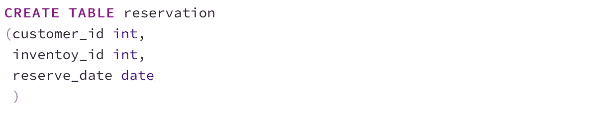

我将修改预订表并添加主键和外键。

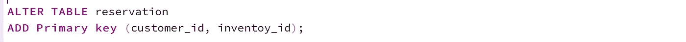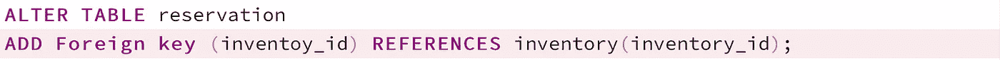

一旦 DVD 可供租赁，租赁记录应该添加到租赁表中，预订记录应该从预订表中删除。

我会在预订表中添加一条预订记录。id = 1 的客户将预订 inventory_id = 12 的 dvd。

如果我从预订表中选择，我将在预订表中找到一个新行。

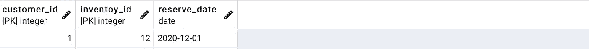

现在，我将带您创建 5 个触发器和 5 个将在这些触发器中执行的函数。

**例 1** :我想创建一个触发器，一旦客户租了 DVD，它将删除客户的预订记录。在这种情况下，我将在**租赁**表(关于租赁)上创建一个触发器，当在**租赁**表中插入一行时(插入后)将触发该触发器。触发器将执行 **delete_reserve()** 函数**。一旦客户租用了预订的 DVD，函数 delete_reserve()** 将负责删除预订记录(执行过程 delete_reserve())。

我将使用以下语法:

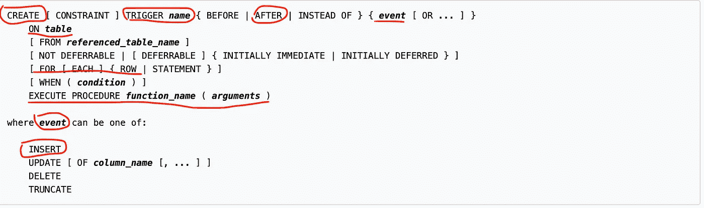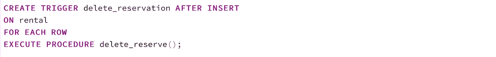

**delete_reserve** ()将在一个触发器内执行(返回触发器)。该功能将删除预订中的 customer_id 和 inventory_id 与插入到**租赁**表中的相同的预订行。新插入的行可以作为 new.customer_id 和 NEW.inventory_id 从(NEW)访问。

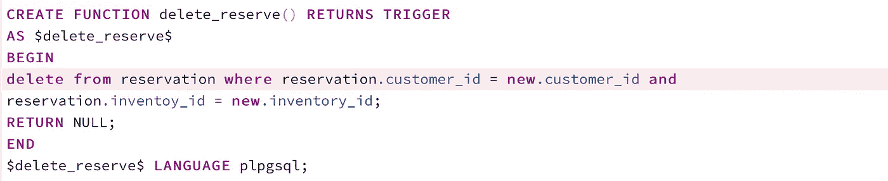

最后的功能有:

返回 NULL，因为我想忽略结果，因为它是在 AFTER 事件上触发的触发器。

我现在将在租赁表中添加一行，customer_id = 1，inventory_id = 12。该操作应该导致触发" **delete_reservation** "触发器，因为它被设置为在租赁表上发生 **insert** 之后触发。

如果触发器工作正常，这一行应该被删除，我们应该发现表是空的。

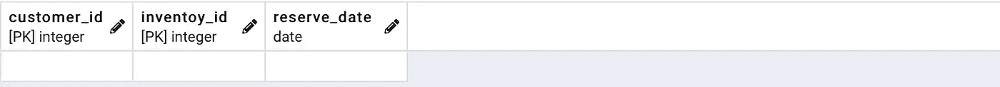

正如您在上面看到的，之前插入的预订行已经不存在了，因为客户已经在租赁 DVD 了。

**示例 2** :我想使用一个触发器来防止客户预订超过 3 张 DVD。为此，我将在**预订表**(预订)上创建一个触发器，该触发器将在**预订表**中插入一行之前被触发。触发器将执行 **count_dvd()** 函数(执行程序 count_dvd()) **。函数 count_dvd()** 将负责检查客户是否已经预订了 3 张 dvd。

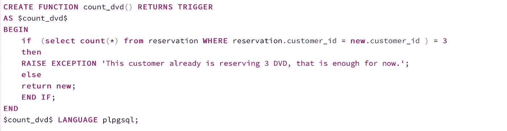

我将为 customer_id =1，**插入四次**预订记录。

我将在预订表中插入第一个行**:**

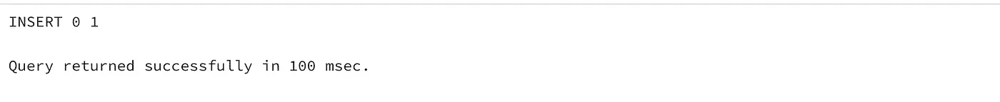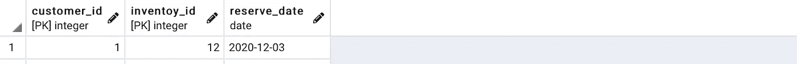

我将在预订表中插入第二行**:**

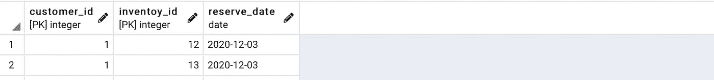

我将在预订表中插入第三行**:**

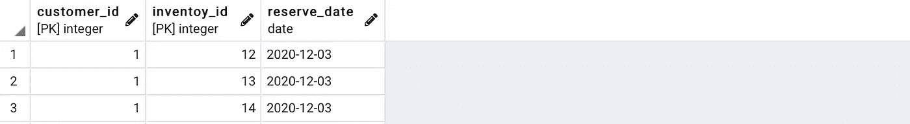

在尝试为 customer_id 1 插入第四个 DVD 预订时，触发器将引发错误“ ***该客户已经预订了 3 个 DVD，这对于现在的*** 来说已经足够了”。

将引发以下错误:

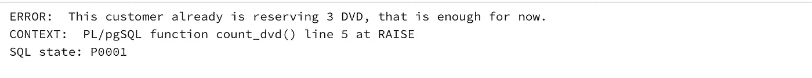

**示例 3** :如果客户在**租赁**表中有尚未归还的租金，我想创建一个触发器**来防止删除**任何客户的信息。为此，我将在**客户表**(客户上)上创建一个 **delete_customer** 触发器，该触发器将在之前被触发**从**客户**表中删除一行(删除之前)。该触发器将执行 **check_rental()** 函数(执行程序 check_rental()) **。check_rental()** 将负责检查客户是否租借了尚未归还的 DVD。**

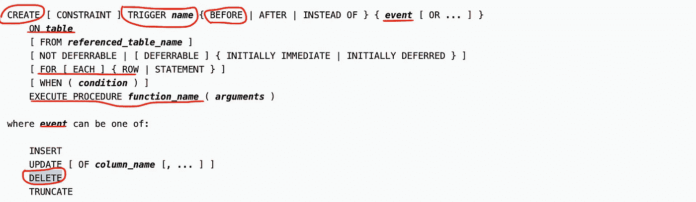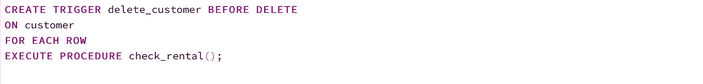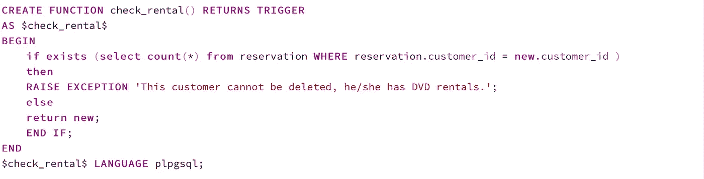

试图从**客户**表中删除客户，将触发 **delete_customer** 触发器。**删除 _ 客户**触发器将执行**检查 _ 租赁**()功能。 **check_rental** ()函数将检查客户是否有 DVD 出租。如果顾客没有租借任何 DVD，他的信息将被删除，否则他的记录不会被删除。

将引发以下错误:

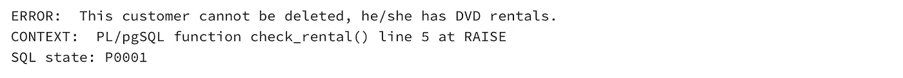

**示例 4** :我想创建一个触发器来阻止**预订**表中的**库存 id** 更新**商店 id** 2 的库存 id。我将在**保留表** (ON reservation) 上创建一个 **check_update** 触发器，该触发器将在更新**(更新前)之前**被触发。如果 inventory_id 被更新，触发器将执行 **check_inventory_update** 函数(当** (OLD.inventoy_id 不同于 NEW.inventoy_id)时**)。**check _ inventory _ update()**将负责不允许用 store_id 的 2 的 inventory_id 更新 inventory _ id。****

**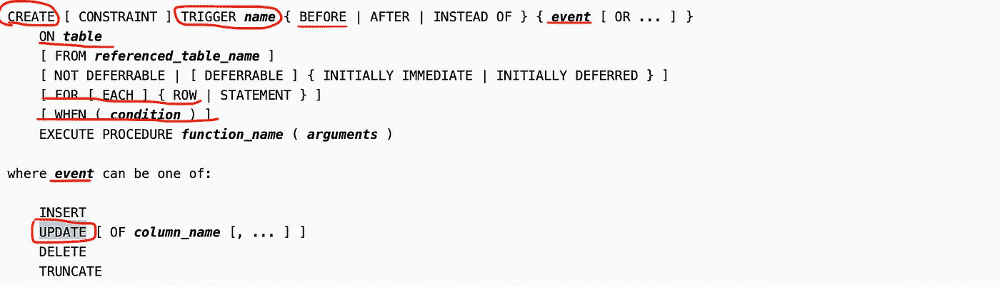****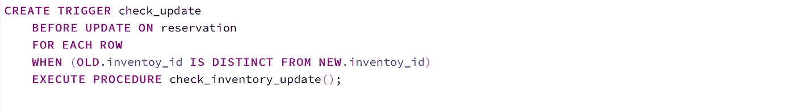****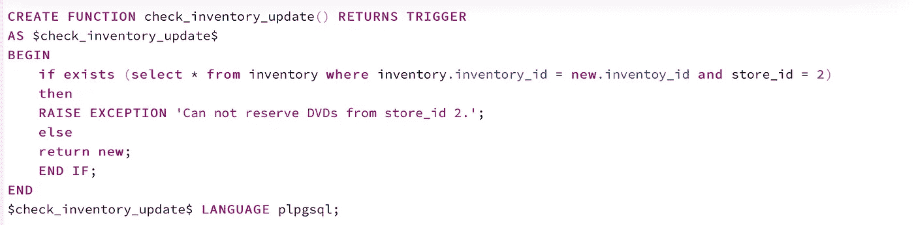**

**以下是用属于 store_id 2 的 inventory_id 更新 inventory_id 的尝试。**

****

**将引发以下错误:**

**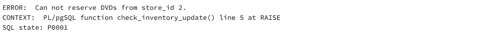**

****例 5:** 我想创建一个触发器，帮助我**跟踪预订表上执行的所有操作**。我想记录**预订**表上是否发生了**插入、删除或更新**的操作。我要做的第一步是创建一个表来记录操作，我将调用表 **reservation_audit** 。我将存储操作的第一个字母(I 表示插入，U 表示更新，D 表示删除)、操作的时间戳和操作的值。**

**下面是**预约 _ 审核**的定义:**

**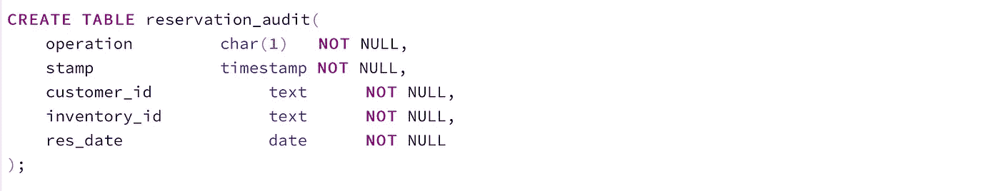**

**我将在**预约表**(预约)上创建一个**预约 _ 审计**触发器，该触发器将在插入、更新或删除(插入或更新或删除后)后被触发**。****

**触发器将调用**process _ reservation _ audit**函数。**process _ reservation _ audit()**将负责在 **reservation_audit** 表中记录所执行的事务，无论是**插入、更新还是删除。****

******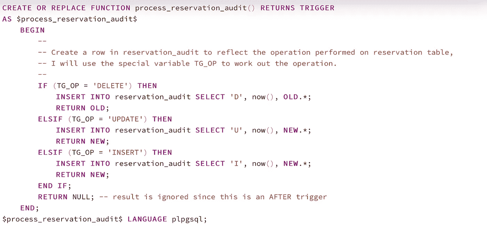**

**我将在**预订**表中插入一条记录:**

****

**我将从 reservation 和 reservation_audit 表中进行选择。我们将在预订表中看到一条新记录。我们还将看到在 reservation_audit 表中添加了一条新记录，表明在 reservation 表中发生了一个 insert (I)操作。**

******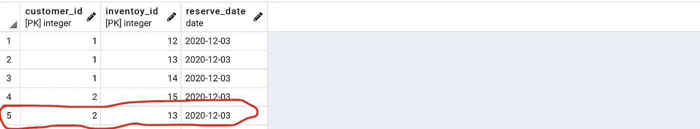****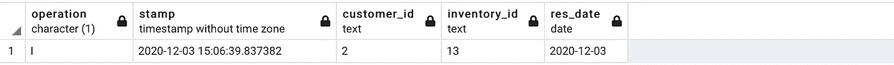**

**我将从**预订**表中删除一条记录。**

****

**从预订表中删除一行。在 reservation_audit 表中添加一条新记录，指示在 reservation 表上发生了删除(D)操作。**

******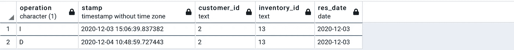**

**我将更新**预订**表中的一条记录。**

**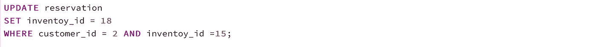******

**预订表中的一行被更新。在 reservation_audit 表中添加一条记录，指示在 reservation 表上发生了更新(U)操作。**

**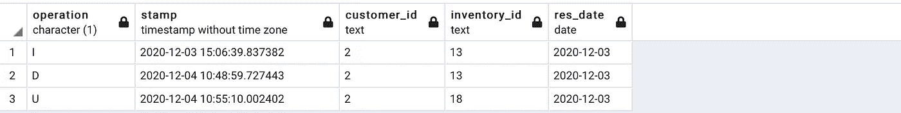**

**我希望你对这篇文章感兴趣，并且我能够以一种好的和清晰的方式展示这个主题。**