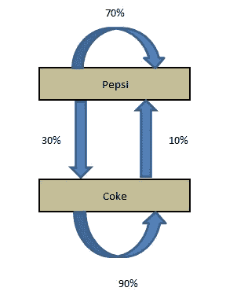
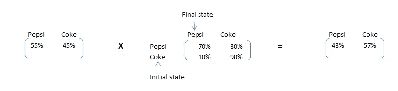
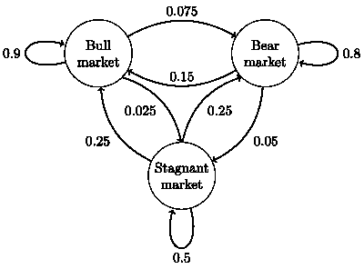
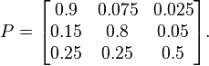
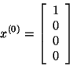
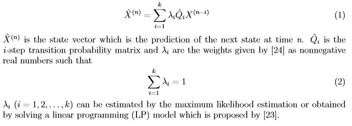
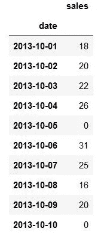
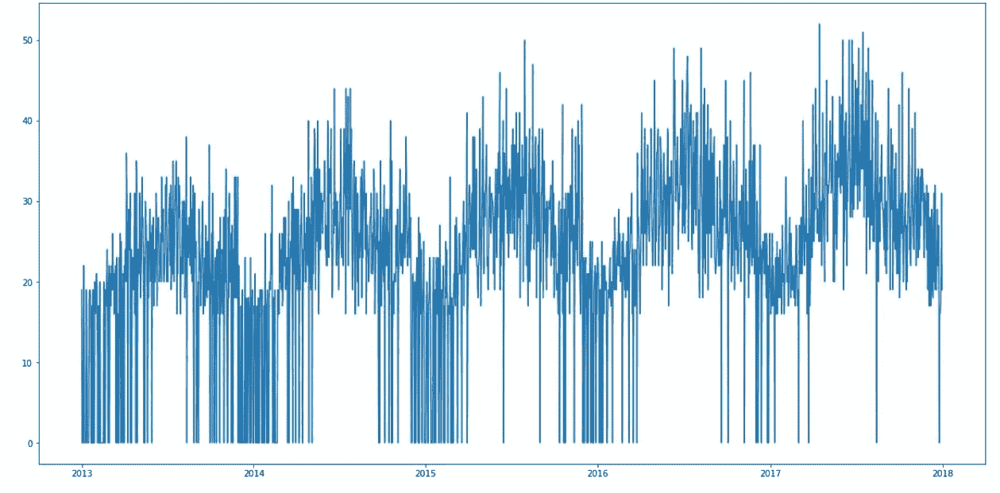
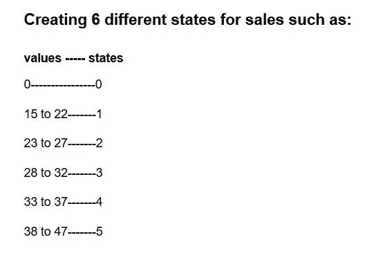
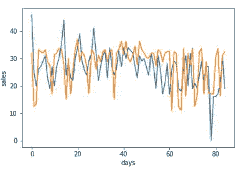

# 基于马尔可夫链的间歇需求预测

> 原文：<https://medium.com/analytics-vidhya/intermittent-demand-forecasting-using-markov-chains-d16fe3e2a0a3?source=collection_archive---------6----------------------->

## 使用马尔可夫链进行预测

## ***了解间歇性需求***

当一个客户打电话要一个几乎没人要的产品项目时，你有吗？如果你的答案是否定的，这可能会让你失去一笔生意，甚至一个客户。同样重要的是，如果*那个*商品只是偶尔被要求，你手头是否有太多单位的产品以避免缺货？如果你的答案是肯定的，那么过多的库存可能会让你损失金钱。

预测间歇性需求、“滞销”的产品项目或零件是服务零件组织和资本货物行业的公司中的经理尤其熟知的问题。

## ***理解马尔可夫链***

假设天气有两种可能的状态:晴天或多云。

你总是可以直接观察到当前的天气状态，而且保证总是前述两种状态中的一种。现在，您决定希望能够预测明天的天气。直觉上，你假设在这个过程中有一个固有的转变，因为当前的天气对第二天的天气会有一些影响。所以你收集了几年的天气数据，并计算出阴天之后出现晴天的概率是 0.5。你还注意到，通过扩展，在阴天之后出现阴天的概率必须是 0.5，因为只有两种可能的状态。现在，您可以根据当时的天气状况，使用这个分布来预测未来几天的天气。

这个例子说明了马尔可夫链的许多关键概念。马尔可夫链是基于一种“无记忆”的原则。换句话说，过程的下一个状态只取决于前一个状态，而不是状态序列。

马尔可夫链本质上由一组满足马尔可夫性质的转移组成，这些转移由某种概率分布决定。

***马尔可夫链的一个例子***

例如，可口可乐和百事可乐是 x 国仅有的两家饮料公司。一家汽水公司想与其中一家合作。他们雇佣了一家市场研究公司来研究一个月后哪个品牌的市场份额会更高。

目前，百事拥有 55%的市场份额，可口可乐拥有 45%的市场份额。以下是市场研究公司得出的结论:

P(P->P):一个月内客户继续使用百事可乐品牌的概率= 0.7

P(P->C):一个月内顾客从百事可乐转向可口可乐的概率= 0.3

P(C->C):一个月内顾客继续使用该品牌可乐的概率= 0.9

P(C->P):一个月内顾客从可口可乐转向百事可乐的概率= 0.1

研究公司所做的四个陈述可以用一个简单的转换图来组织。

该图简单显示了转变和当前的市场份额。现在，如果我们想计算一个月后的市场份额，我们需要进行以下计算:

百事可乐的市场份额(t+1)=百事可乐* P 的当前市场份额(P — >P) +可口可乐* P 的当前市场份额(C — >P)

可口可乐的市场份额(t+1)=可口可乐的当前市场份额* P(C — >C) +百事可乐的当前市场份额* P(P — >C)

这些计算可以通过查看下面的矩阵乘法来简单地完成:

当前状态 X 转换矩阵=最终状态

形式上，马尔可夫链是一种概率自动化。状态转移的概率分布通常表示为马尔可夫链的转移矩阵。

如果马尔可夫链有 N 个可能的状态，那么矩阵将是一个 N×N 矩阵，使得条目(I，J)是从状态 I 转移到状态 J 的概率

此外，转移矩阵必须是一个随机矩阵，它的每一行的元素加起来必须正好是 1。这完全有意义，因为每一行代表它自己的概率分布。

此外，马尔可夫链也有一个初始状态向量，表示为一个 N×1 矩阵(向量)，它描述了在 N 个可能状态的每一个状态开始的概率分布。向量的条目 I 描述了链从状态 I 开始的概率

修正的马尔可夫链模型如下:

上述公式用于预测。公式中提到的λ(s)可以通过线性规划模型来估计。但是大多数模型给出的是离散的λ值，只有其中一个是 1，其他的是 0。

或者，我从描述前 7 天依赖性的 PACF 图中指定λ值。

# **需求预测**

考虑一种产品，提供了其前 5 年的日销售额。数据时断时续，因为有些日子需求很低，有些日子需求很高。

*下面的存储库中提供了这些数据和代码。*

培训数据:2013 年 10 月-2013 年 12 月，2014 年 10 月-2014 年 12 月，2015 年 10 月-2015 年 12 月，2016 年 10 月-2016 年 12 月。
对 2017 年 10 月-2017 年 12 月的销售进行预测。

***时间序列数据的预测***

上述时间序列清楚地描述了数据中的趋势和季节性

由于销售额的范围是从 0 到 50，因此我们必须为销售额制定离散的状态级别(时段),例如:

*现在定义状态转移矩阵(Q):*

1-状态转移概率矩阵表示从一个状态转移到另一个状态而没有任何间隙的概率，即第二天的状态概率。

2 状态转移概率矩阵表示从一个状态转移到另一个状态的概率，间隔 1 天，即后天状态的概率。

诸如此类…

代码的 GitHub 存储库链接:

 [## AmanSahotra/使用马尔可夫链进行间歇性需求预测

### 此时您不能执行该操作。您已使用另一个标签页或窗口登录。您已在另一个选项卡中注销，或者…

github.com](https://github.com/AmanSahotra/Intermittent-Demand-forecasting-using-Markov-Chains) 

# 结果

这种改进的马尔可夫链模型得到的结果比其他模型更好。实际销售额和预测销售额之间的平均绝对误差为 6.19。

下图还显示了误差的变化。

蓝色-实际，橙色-预测

这些结果可能会通过更强大的技术(如递归神经网络)得到显著改善，但相对于所付出的努力，很难击败马尔可夫链。